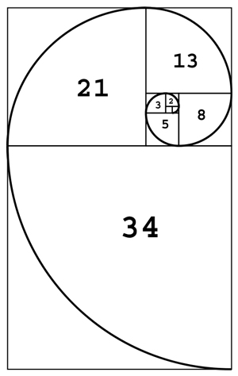

```{r include = FALSE}
if(!knitr:::is_html_output())
{
  options("width"=56)
  knitr::opts_chunk$set(tidy.opts=list(width.cutoff=56, indent = 2), tidy = TRUE)
  knitr::opts_chunk$set(fig.pos = 'H')
}
```

# Data Preparation {#data_preparation}

## Handling Data Types {#data_types}

### What is this about?

One of the first things to do when we start a data project is to assign the correct data type for each variable. Although this seems a straightforward task, some algorithms work with certain data types. Here, we'll try to cover these conversions while explaining with examples the implications in each case.


```{r Fibonnacci-curve, echo=FALSE, out.height="150px", fig.cap="Fibonacci spiral", out.extra=''}

```

_The Fibonacci series. A sequence of numbers present in nature and human bodies._

<br>

**What are we going to review in this chapter?**

* Detecting the correct data type
* How to convert from categorical to numerical
* How to convert from numerical to categorical (discretization methods)
* Theoretical and practical aspects (examples in R)
* How a predictive model looks at numerical variables

<br>


### The universe of data types

There are two main data types, **numerical** and **categorical**. Other names for categorical are **string** and **nominal**.

A subset of categorical is the ordinal or, as it is named in R, an **ordered** factor. At least in R, this type is only relevant when plotting categories in a certain order. An example in R:

```{r}
# Creating an ordinal or ordered factor
var_factor=factor(c("3_high", "2_mid", "1_low"))
var_ordered=factor(var_factor, ordered = T)
var_ordered
```

Don't pay too much attention to this data type as numerical and categorical are the most needed.

<br>

#### Binary variable, numerical, or categorical?

This book suggests using binary variables as numeric when `0` is `FALSE` and `1` is `TRUE.` This makes it easier to profile data. 

<br>

### Data types per algorithm

Some algorithms work as follows:

* `r emo::ji("bar_chart")` Only with categorical data
* `r emo::ji("straight_ruler")` Only with numerical data
* `r emo::ji("bar_chart")``r emo::ji("straight_ruler")`  With both types

Moreover, not every predictive model can handle **missing value**. 

The **Data Science Live Book** tries to cover all of these situations.

<br>

### Converting categorical variables into numerical 

Using the `caret` package in R is a straightforward task that converts every categorical variable into a **flag one**, also known as a _dummy_ variable.

If the original categorical variable has thirty possible values, then it will result in 30 new columns holding the value `0` or `1`, where `1` represents the presence of that category in the row.

If we use the caret package from R, then this conversion only takes two lines of code:

```{r, message=FALSE, warning=FALSE}
library(caret) # contains dummyVars function
library(dplyr) # data munging library
library(funModeling) # df_status function
  
# Checking categorical variables
status=df_status(heart_disease, print_results = F)
filter(status,  type %in% c("factor", "character")) %>% select(variable)

# It converts all categorical variables (factor and character) into numerical variables
# It skips the original variable, so no need to remove it after the conversion, the data is ready to use.
dmy = dummyVars(" ~ .", data = heart_disease)
heart_disease_2 = data.frame(predict(dmy, newdata = heart_disease))

# Checking the new numerical data set:
colnames(heart_disease_2)
```

```{r, message=FALSE, echo=FALSE}
detach("package:caret")
#detach("package:plyr")
```

Original data `heart_disease` has been converted into `heart_disease_2` with no categorical variables, only numerical and dummy. Note that every new variable has a _dot_ followed by the _value_.

If we check the before and after for the 7th patient (row) in variable `chest_pain` which can take the values `1`, `2`, `3` or `4`, then

```{r, message=FALSE}
# before
as.numeric(heart_disease[7, "chest_pain"])

# after
heart_disease_2[7, c("chest_pain.1", "chest_pain.2", "chest_pain.3", "chest_pain.4")]
```

Having kept and transformed only numeric variables while excluding the nominal ones, the data `heart_disease_2` are ready to be used.

More info about `dummyVars`: http://amunategui.github.io/dummyVar-Walkthrough/

<br>


### Is it categorical or numerical? Think about it.

Consider the `chest_pain` variable, which can take values `1`, `2`, `3`, or `4`. Is this variable categorical or numerical?

If the values are ordered, then it can be considered as numerical as it exhibits an **order** i.e., 1 is less than 2, 2 is less than 3, and 3 is less than 4. 

If we create a decision tree model, then we may find rules like: "`If chest_pain > 2.5, then...`". Does it make sense? The algorithm splits the variable by a value that is not present (`2.5`); however, the interpretation by us is "if `chest_pain` is equal or higher than 3, then…”

<br>

#### Thinking as an algorithm

Consider two numerical input variables and a target binary variable. The algorithm will _see_ both input variables as dots in a rectangle, considering that there are infinite values between each number. 

For example, a **Supported Vector Machine** (SVM) will create _several_ vectors in order to separate the target variable class. It will **find regions** based on these vectors. How would it be possible to find these regions based on categorical variables? It isn't possible and that's why SVM only supports numerical variables as with artificial neural networks.


```{r Support-Vector-Machine, echo=FALSE, out.width="200px", fig.cap="Support Vector Machine", out.extra=''}
knitr::include_graphics("data_preparation/svm.png")
```

_Image credit: ZackWeinberg_

The last image shows three lines, representing three different decision boundaries or regions.

For a quick introduction to this SVM concept, please go to this short video: [SVM Demo](https://www.youtube.com/watch?v=1NxnPkZM9bc).

However, if the model is tree-based, like decision trees, random forest, or gradient boosting machine, then they handle both types because their search space can be regions (same as SVM) and categories. Like the rule "`if postal_code is AX441AG and age > 55, then...`".

Going back to the heart disease example, the variable `chest_pain` exhibits order. We should take advantage of this because if we convert this to a categorical variable, then **we are losing information** and this is an important point when handling data types.

<br>

#### Is the solution to treat all as categorical?

No... A numerical variable carries more information than a nominal one because of its order. In categorical variables, the values cannot be compared. Let's say it's not possible to make a rule like `If postal code is higher than "AX2004-P"`.

The values of a nominal variable can be compared if we have another variable to use as a reference (usually an outcome to predict).  

For example, postal code "AX2004-P" is _higher_ than "MA3942-H" because there are more people interested in attending photography lessons.

In addition, **high cardinallity** is an issue in categorical variables, e.g., a `postal code` variable containing hundreds of different values. This book has addressed this in both chapters: handling high categorical variable for [descriptive statistics](#high_cardinality_descriptive_stats) and when we do [predictive modelling](#high_cardinality_predictive_modeling).

Anyway, you can do the _free test_ of converting all variables into categorical ones and see what happens. Compare the results with the numerical variables. Remember to use some good error measure for the test, like Kappa or ROC statistic, and to cross-validate the results.

<br>

#### Be aware when converting categorical into numerical variables

Imagine we have a categorical variable that we need to convert to numerical. As in the previous case, but trying a different **transformation** assign a different number to each category.

We have to be careful when doing such transformations because we are **introducing order** to the variable. 

Consider the following data example having four rows. The first two variables are `visits` and `postal_code` (this works as either two input variables or `visits` as input and `postal_code` as output).

The following code will show the `visits` depending on `postal_code` transformed according to two criteria:

* `transformation_1`: Assign a sequence number based on the given order.
* `transformation_2`: Assign a number based on the number of `visits`.

```{r, data-types-in-machine-learning, warning=FALSE, fig.width=9, fig.height=3, message=FALSE, fig.cap="Data transformations comparison", out.extra=''}
# creating data -toy- sample 
df_pc=data.frame(visits=c(10, 59, 27, 33), postal_code=c("AA1", "BA5", "CG3", "HJ1"), transformation_1=c(1,2,3,4), transformation_2=c(1, 4, 2, 3 ))

# printing table
knitr::kable(df_pc)

library(gridExtra)

# transformation 1
plot_1=ggplot(df_pc, aes(x=transformation_1, y=visits, label=postal_code)) +  geom_point(aes(color=postal_code), size=4)+ geom_smooth(method=loess, group=1, se=FALSE, color="lightblue", linetype="dashed") + theme_minimal()  + theme(legend.position="none") + geom_label(aes(fill = factor(postal_code)), colour = "white", fontface = "bold")
  

# transformation 2
plot_2=ggplot(df_pc, aes(x=transformation_2, y=visits, label=postal_code)) +  geom_point(aes(color=postal_code), size=4)+ geom_smooth(method=lm, group=1, se=FALSE, color="lightblue", linetype="dashed") + theme_minimal()  + theme(legend.position="none") + geom_label(aes(fill = factor(postal_code)), colour = "white", fontface = "bold")
  
# arranging plots side-by-side
grid.arrange(plot_1, plot_2, ncol=2)
```

To be sure, nobody builds a predictive model using only four rows; however, the intention of this example is to show how the relationship changes from non-linear (`transformation_1`) to linear (`transformation_2`). This makes things easier for the predictive model and explains the relationship.

This effect is the same when we handle millions of rows of data and the number of variables scales to hundreds. Learning from small data is a right approach in these cases.


<br>

### Discretizing numerical variables {#discretizing_numerical_variables}

This process converts data into one category by splitting it into bins. For a fancy definition, we can quote _Wikipedia_: _Discretization concerns the process of transferring continuous functions, models, and equations into discrete counterparts._ 

Bins are also known as buckets or segments. Let's continue with the examples.

#### About the data 

The data contain information regarding the percentage of children that are stunted. The ideal value is zero.

> The indicator reflects the share of children younger than 5 years who suffer from stunting. Children with stunted growth are at greater risk for illness and death.

Data source: [ourworldindata.org, hunger and undernourishment](https://ourworldindata.org/hunger-and-undernourishment/#undernourishment-of-children). 

First of all, we have to do a quick **data preparation**. Each row represents a country–year pair, so we have to obtain the most recent indicator per country. 

```{r equal-range-discretization-a, tidy=FALSE}
data_stunting=read.csv(file = "https://goo.gl/hFEUfN", 
                       header = T, 
                       stringsAsFactors = F)

# renaming the metric
data_stunting=
  dplyr::rename(
    data_stunting,
    share_stunted_child=
      WHO....Share.of.stunted.children.under.5.
    )

# doing the grouping mentioned before
d_stunt_grp = group_by(data_stunting, Entity) %>% 
  filter(Year == max(Year)) %>%
  dplyr::summarise(share_stunted_child=
                     max(share_stunted_child)
                   )

```

The most standard binning criteria are:

* Equal range
* Equal frequency
* Custom bins

There are all explained below.

<br>

#### Equal range

The range is commonly found in histograms looking at distribution, but is highly susceptible to outliers. To create, for example, four bins, requires the min and max values divided by 4. 


```{r, equal-range-discretization, fig.width=4, fig.height=3, tidy=FALSE, fig.cap="Equal frequency discretization", out.extra=''}
# funModeling contains equal_freq (discretization)
library(funModeling)

# ggplot2 it provides 'cut_interval' function used to 
# split the variables based on equal range criteria
library(ggplot2) 

# Creating equal range variable, add `dig.lab=9` 
# parameter to deactivate scientific notation as with 
# the `cut` function.
d_stunt_grp$share_stunted_child_eq_range=
  cut_interval(d_stunt_grp$share_stunted_child, n = 4)

# The ‘describe’ function from Hmiscpackage is 
# extremely useful to profile data
describe(d_stunt_grp$share_stunted_child_eq_range)

# Plotting the variable
p2=ggplot(d_stunt_grp, 
          aes(share_stunted_child_eq_range)
          ) +
  geom_bar(fill="#009E73") + 
  theme_bw()
p2
```

The `describe` output tells us that there are four categories in the variable and, between parenthesis/square bracket, the total number of cases per category in both absolute and relative values, respectively. For example, the category `(15.8,30.3]` contains all the cases that have `share_stunted_child` from `15.8` (not inclusive) to `30.3` (inclusive). 
It appears `45` times and represents `29%` of total cases.

<br>

#### Equal frequency {#equal-frequency-binning}

This technique groups the same number of observations using criteria based on percentiles. More information about percentiles at [Annex 1: The magic of percentiles](#appendix-percentiles) chapter.

The `funModeling` package includes the `equal_freq` function to create bins based on these criteria:


```{r equal-frequency-discretization, fig.width=4, fig.height=3, tidy=FALSE, fig.cap="Equal frequency example", out.extra=''}

d_stunt_grp$stunt_child_ef=
  equal_freq(var = d_stunt_grp$share_stunted_child, 
             n_bins = 4
             )

# profiling variable 
describe(d_stunt_grp$stunt_child_ef)

p3=ggplot(d_stunt_grp, aes(stunt_child_ef)) + 
  geom_bar(fill="#CC79A7") + theme_bw()
p3
```


In this case, we select four bins so that each bin will contain an approximate 25% share.

<br>

#### Custom bins

If we already have the points for which we want the segments, we can use the `cut` function.

```{r discretization-custom-bins, fig.width=4, fig.height=3, tidy=FALSE, fig.cap="Manual discretization", out.extra=''}
# parameter dig.lab "disable" scientific notation 
d_stunt_grp$share_stunted_child_custom=
  cut(d_stunt_grp$share_stunted_child, 
      breaks = c(0, 2, 9.4, 29, 100)
      )

describe(d_stunt_grp$share_stunted_child_custom)

p4=ggplot(d_stunt_grp, aes(share_stunted_child_custom)) + 
  geom_bar(fill="#0072B2") + 
  theme_bw()
p4
```

Please note it’s only needed to define the maximum value per bucket.

In general, we don’t know the minimum nor maximum value. In those cases, we can use the values `-Inf` and `Inf`. Otherwise, if we define a value out of the range, `cut` will assign the `NA` value.

It's good practice to assign the minimum and maximum using a function. In this case, the variable is a percentage, so we know beforehand its scale is from 0 to 100; however, `r emo::ji("warning")` _what would happen if we did not know the range?_ 

The function will return `NA` for those values below or above the cut points. One solution is to get variable min and max values:


```{r, tidy=FALSE}
# obtaining the min and max 
min_value=min(d_stunt_grp$share_stunted_child)
max_value=max(d_stunt_grp$share_stunted_child)

# set `include.lowest=T` to include the min value, 
# otherwise it will be assigned as NA.
d_stunt_grp$share_stunted_child_custom_2=
  cut(d_stunt_grp$share_stunted_child, 
      breaks = c(min_value, 2, 9.4, 29, max_value), 
      include.lowest = T)

describe(d_stunt_grp$share_stunted_child_custom_2)
```

<br>

### Discretization with new data

All of these transformations are made given a training dataset based on the variables’ distributions. Such is the case of equal frequency and equal range discretization. _But what would it happen if new data arrive?_

If a new min or max value appears, then it will affect the bin range in the **equal range** method.
If any new value arrives, then it will move the points based on percentiles as we saw in the **equal frequency** method.

As an example, imagine that in the proposed example we add four more cases with values `88`, `2`, `7` and `3`:

```{r}
# Simulating that four new values arrive
updated_data=c(d_stunt_grp$share_stunted_child, 88, 2, 7, 3)

# discretization by equal frequency
updated_data_eq_freq=equal_freq(updated_data,4)

# results in...
describe(updated_data_eq_freq)
```

Now we compare with the bins we created before:

```{r}
describe(d_stunt_grp$stunt_child_ef)
```


**All the bins changed!** `r emo::ji("scream")` Because these are new categories, the predictive model will fail to handle them because they are all new values.

The solution is to save the cut points when we do data preparation. Then, when we run the model on production, we use the custom bin discretization and, thereby, force every new case in the proper category. This way, the predictive model will always _sees_ the same. 

The solution in next section.

<br> 

### Automatic data frame discretization {#data-discretization}

The package `funModeling` (from version > 1.6.6) introduces two functions— `discretize_get_bins` & `discretize_df` —that work together in order to help us in the discretization task.  

```{r, warning=FALSE, message=FALSE}
# First we load the libraries
# install.packages("funModeling")
library(funModeling)
library(dplyr)
```

Let's see an example. First, we check current data types:

```{r}
df_status(heart_disease, print_results = F) %>% select(variable, type, unique, q_na) %>% arrange(type)
```

We've got factor, integer, and numeric variables: a good mix! The transformation has two steps. First, it gets the cuts or threshold values from which each segment begins. The second step is using the threshold to obtain the variables as categoricals.


Two variables will be discretized in the following example: `max_heart_rate` and `oldpeak`. Also, we'll introduce some `NA` values into `oldpeak` to test how the function works with missing data.


```{r}
# creating a copy to keep original data clean
heart_disease_2=heart_disease

# Introducing some missing values in the first 30 rows of the oldpeak variable
heart_disease_2$oldpeak[1:30]=NA
```

Step 1) Getting the bin thresholds for each input variable:

`discretize_get_bins` returns a data frame that needs to be used in the `discretize_df` function, which returns the final processed data frame.


```{r}
d_bins=discretize_get_bins(data=heart_disease_2, input=c("max_heart_rate", "oldpeak"), n_bins=5)

# Checking `d_bins` object:
d_bins

```
Parameters: 

- `data`: the data frame containing the variables to be processed.
- `input`: vector of strings containing the variable names.
- `n_bins`: the number of bins/segments to have in the discretized data.

We can see each threshold point (or upper boundary) for each variable. 

**Note**: Changes from version 1.6.6 to 1.6.7:

* `discretize_get_bins` doesn't create the `-Inf` threshold since that value was always considered to be the minimum. 
* The one value category now it is represented as a range, for example, what it was `"5"`, now it is `"[5, 6)"`.
* Buckets formatting may have changed, if you were using this function in production, you would need to check the new values.

Time to continue with next step!

Step 2) Applying the thresholds for each variable:

```{r, tidy=FALSE}
# Now it can be applied on the same data frame or in 
# a new one (for example, in a predictive model that 
# changes data over time)
heart_disease_discretized = 
  discretize_df(data=heart_disease_2, 
                data_bins=d_bins, 
                stringsAsFactors=T)
```

Parameters:

- `data`: data frame containing the numerical variables to be discretized.
- `data_bins`: data frame returned by `discretize_get_bins`. If it is changed by the user, then each upper boundary must be separated by a pipe character (`|`) as shown in the example.
- `stringsAsFactors`: `TRUE` by default, final variables will be factor (instead of a character) and useful when plotting.

#### Final results and their plots

Before and after:

```{r, echo=FALSE, eval=FALSE}
df_compare=data.frame(max_heart_rate_before=heart_disease_2$max_heart_rate[29:34], max_heart_rate_after=heart_disease_discretized$max_heart_rate[29:34], oldpeak_before=heart_disease_2$oldpeak[29:34], oldpeak_after=heart_disease_discretized$oldpeak[29:34])

df_compare
```

Final distribution: 

```{r, binning-variable, tidy=FALSE, fig.cap="Automatic discretization results", out.extra=''}
describe(heart_disease_discretized %>% 
           select(max_heart_rate,oldpeak))

p5=ggplot(heart_disease_discretized, 
          aes(max_heart_rate)) + 
  geom_bar(fill="#0072B2") + 
  theme_bw() + 
  theme(axis.text.x = 
          element_text(angle = 45, vjust = 1, hjust=1)
        )

p6=ggplot(heart_disease_discretized, 
          aes(oldpeak)) + 
  geom_bar(fill="#CC79A7") +
  theme_bw() + 
  theme(axis.text.x = 
          element_text(angle = 45, vjust = 1, hjust=1)
        )

gridExtra::grid.arrange(p5, p6, ncol=2)
```


Sometimes, it is not possible to get the same number of cases per bucket when computing **equal frequency** as is shown in the `oldpeak` variable.

#### NA handling

Regarding the `NA` values, the new `oldpeak` variable has six categories: five categories defined in `n_bins=5` plus the `NA.` value. Note the point at the end indicating the presence of missing values. 


#### More info

- `discretize_df` will never return an `NA` value without transforming it to the string `NA.`.
- `n_bins` sets the number of bins for all the variables.
- If `input` is missing, then it will run for all numeric/integer variables whose number of unique values is greater than the number of bins (`n_bins`). 
- Only the variables defined in `input` will be processed while remaining variables will **not be modified at all**. 
- `discretize_get_bins` returns just a data frame that can be changed by hand as needed, either in a text file or in the R session. 


#### Discretization with new data 

In our data, the minimum value for `max_heart_rate` is 71. The data preparation must be robust with new data; e.g., if a new patient arrives whose `max_heart_rate` is 68, then the current process will assign her/him to the lowest category. 

In other functions from other packages, this preparation may return an `NA` because it is out of the segment.

As we pointed out before, if new data comes over time, it's likely to get new min/max value/s. This can break our process. To solve this, `discretize_df` will always have as min/max the values `-Inf`/`Inf`; thus, any new value falling below/above the minimum/maximum will be added to the lowest or highest segment as applicable. 

The data frame returned by `discretize_get_bins` must be saved in order to apply it to new data. If the discretization is not intended to run with new data, then there is no sense in having two functions: it can be only one. In addition, there would be no need to save the results of `discretize_get_bins`.

Having this two-step approach, we can handle both cases. 


#### Conclusions about two-step discretization

The usage of `discretize_get_bins` + `discretize_df` provides quick data preparation, with a clean data frame that is ready to use. Clearly showing where each segment begin and end, indispensable when making statistical reports.

The decision of _not fail_ when dealing with a new min/max in new data is **just a decision**. In some contexts, failure would be the desired behavior.

**The human intervention**: The easiest way to discretize a data frame is to select the same number of bins to apply to every variable—just like the example we saw—however, if tuning is needed, then some variables may need a **different number of bins**. For example, a variable with less dispersion can work well with a low number of bins. 

Common values for the number of segments could be 3, 5, 10, or 20 (but no more). It is up to the data scientist to make this decision. 

<br>

#### Bonus track: The trade-off art `r emo::ji("balance_scale")`

- A high number of bins => More noise captured.
- A low number of bins => Oversimplification, less variance.

Do these terms sound similar to any other ones in machine learning? 
  
  The answer: **Yes!**. Just to mention one example: the trade-off between adding or subtracting variables from a predictive model. 

- More variables: Overfitting alert (too detailed predictive model).
- Fewer variables: Underfitting danger (not enough information to capture general patterns). 

_Just like oriental philosophy has pointed out for thousands of years, there is an art in finding the right balance between one value and its opposite._

<br>

### Final thoughts

As we can see, **there is no free lunch** in discretization or data preparation. How do you think that an _automatic or intelligent system_ will handle all of these situations without human intervention or analysis? 

To be sure, we can delegate some tasks to automatic processes; however, **humans are indispensable in data preparation stage**, giving the correct input data to process.

The assignment of variables as categorical or numerical, the two most used data types varies according to the nature of the data and the selected algorithms as some only support one data type.

The conversion **introduces some bias** to the analysis. A similar case exists when we deal with missing values: [Handling and Imputation of Missing Data](#missing_data).

When we work with categorical variables, we can change their distribution by re-arranging the categories according to a target variable in order to **better expose their relationship**. Converting a non-linear variable relationship, into one linear. 

<br> 

### Bonus track `r emo::ji("boom")`

Let's go back to the discretization variable section and plot all the transformations we've seen so far:

```{r discretization-methods, fig.width=9, fig.height=4, fig.cap="Same data, different visualizations", out.extra=''}
grid.arrange(p2, p3, p4, ncol = 3)
```

The input data is always the same. However, all of these methods **exhibit different perspectives of the same _thing_**.

Some perspectives are more suitable than others for certain situations, such as the use of **equal frequency** for **predictive modeling**.

Although this case is only considering one variable, the reasoning is the same if we have several variables at once, i.e., an `N-dimensional` space.

When we build predictive models, we describe the same bunch of points in different ways as when people give an opinion regarding some object.


<br>

---

```{r, echo=FALSE}
knitr::include_graphics("introduction/spacer_bar.png")
```

---

<br>


## High Cardinality Variable in Descriptive Stats {#high_cardinality_descriptive_stats}
  
### What is this about?
  
A **high cardinality** variable is one in which it can take _many_ different values. For example country. 

This chapter will cover cardinality reduction based on Pareto rule, using the `freq` function which gives a quick view about where the most of values are concentrated and variable distribution.

<br> 

### High Cardinality in Descriptive Statistics

The following example contains a survey of 910 cases, with 3 columns: `person`, `country` and `has_flu`, which indicates having such illness in the last month.

```{r , message=F}
library(funModeling) 
```

`data_country` data comes inside `funModeling` package (please update to release 1.6).

Quick `data_country` profiling (first 10 rows)

```{r data-preparation-nominal-variable, fig.height=9, fig.width=5, dpi=300, fig.cap="Country frequency analysis", out.extra=''}
# plotting first 10 rows
head(data_country, 10)

# exploring data, displaying only first 10 rows
head(freq(data_country, "country"), 10)
```

```{r data-preparation-nominal-variable-2, fig.height=1.5, fig.width=5, fig.cap="Has flue frequency analysis", out.extra=''}
# exploring data
freq(data_country, "has_flu")
```

<br>

The last table shows there are **70 different countries**, and ~9% of people who had flu -`has_flu="yes"`.

But many of them have almost no participation in the data. This is the _long tail_, so one technique to reduce cardinality is to keep those categories that are present in a high percentage of data share, for example 70, 80 or 90%, the Pareto principle.

```{r data-preparation-profiling-nominal-variable}
# 'freq' function, from 'funModeling' package, retrieves the cumulative_percentage that will help to do the cut. 
country_freq=freq(data_country, 'country', plot = F)

# Since 'country_freq' is an ordered table by frequency, let's inspect the first 10 rows with the most share.
country_freq[1:10,]
```

<br>

So 10 countries represent more the 70% of cases. We can assign the category `other` to the remaining cases and plot:

```{r data-preparation-profiling-nominal-variable_2, fig.height=2.3, fig.width=4.2, fig.cap="country_2 frequency analysis", out.extra=''}
data_country$country_2=ifelse(data_country$country %in% country_freq[1:10,'country'], data_country$country, 'other')
freq(data_country, 'country_2')
```

<br> 

### Final comments

Low representative categories are sometimes errors in data, such as having: `Egypt`, `Eggypt.`, and may give some evidence in bad habbits collecting data and/or possible errors when collecting from the source.

There is no general rule to shrink data, it depends on each case.

<br>

**Next recommended chapter:** High Cardinality Variable in Predictive Modeling.

<br>

---

```{r, echo=FALSE} 
knitr::include_graphics("introduction/spacer_bar.png") 
```

---

<br>

## High Cardinality Variable in Predictive Modeling {#high_cardinality_predictive_modeling}

### What is this about?

As we've seen in the other chapter, _Reducing categories in descriptive stats_, we keep the categories with the major representativeness, but how about having another variable to predict with it? That is, to predict `has_flu` based on `country`.

Using the last method may destroy the information of the variable, thus it **loses predictive power**. In this chapter we'll go further in the method described above, using an automatic grouping function -`auto_grouping`- surfing through the variable's structure, giving some ideas about how to optimize a categorical variable, but more importantly: encouraging the reader to perform her-his own optimizations.

Other literature named this re-grouping as cardinality reduction or **encoding**.

<br>

**What are we going to review in this chapter?**

* Concept of representativeness of data (sample size).
* Sample size having a target or outcome variable.
* From R: Present a method to help reduce cardinality and profiling categoric variable.
* A practical before-and-after example reducing cardinality and insights extraction.
* How different models such as random forest or a gradient boosting machine deals with categorical variables.

<br>

### But is it necessary to re-group the variable?

It depends on the case, but the quickest answer is yes. In this chapter we will see one case in which this data preparation increases overall accuracy (measuring by the Area Under Roc Curve).

There is a tradeoff between the **representation of the data** (how many rows each category has), and how is each category related to the outcome variable. E.g.: some countries are more prone to cases of flu than others

```{r , message=FALSE, warning=FALSE}
# Loading funModeling >=1.6 which contains functions to deal with this. 
library(funModeling)
library(dplyr)
```

Profiling `data_country`, which comes inside `funModeling` package (please update to release 1.6.5).

Quick `data_country` profiling (first 10 rows)

```{r high-cardinality-variable,  fig.height=11, fig.width=6, dpi=200, fig.cap="First 10 countries", out.extra=''}

# plotting first 10 rows
head(data_country, 10)

# exploring data, displaying only first 10 rows
head(freq(data_country, "country"), 10)
```

```{r data-preparation-high-cardinality-variable, fig.height=2, fig.width=5.3, fig.cap="Has flu distribution", out.extra=''}
# exploring data
freq(data_country, "has_flu")
```


<br>

### The case `r emo::ji("mag")` {#analyze-binary-outcome-vs-categorical-variable}

The predictive model will try to map certain values with certain outcomes, in our case the target variable is binary.

We'll computed a complete profiling of `country` regarding the target variable `has_flu` based on `categ_analysis`. 

Each row represent an unique category of `input` variables. Withing each row you can find attributes that define each category in terms of representativeness and likelihood. 


```{r, results='hide'}
# `categ_analysis` is available in "funModeling" >= v1.6, please install it before using it.
country_profiling=categ_analysis(data=data_country, input="country", target = "has_flu")

# Printing first 15 rows (countries) out of 70.
head(country_profiling, 15)
```


```{r data-preparation-in-predictivemodeling, echo=FALSE ,out.width="75%", fig.cap="Analyzing target vs. input", out.extra=''}
knitr::include_graphics("data_preparation/country_profiling.png")
```


<br>

* Note 1: _The first column automatically adjusts its name based on `input` variable_
* Note 2: _`has_flu` variable has values `yes` and `no`, `categ_analysis` assigns internally the number **1** to the less representative class, `yes` in this case, in order to calculate the mean, sum and percentage._

These are the metrics returned by `categ_analysis`:

* `country`: name of each category in `input` variable.
* `mean_target`: `sum_target/q_rows`, average number of `has_flu="yes"` for that category. This is the likelihood.
* `sum_target`: quantity of `has_flu="yes"` values are in each category.
* `perc_target`: the same as `sum_target` but in percentage,  `sum_target of each category / total sum_target`. This column sums `1.00`.
* `q_rows`: quantity of rows that, regardless of the `has_flu` variable, fell in that category. It's the distribution of `input`. This column sums the total rows analyzed.
* `perc_rows`: related to `q_rows` it represents the share or percentage of each category. This column sums `1.00`

<br>

#### What conclusions can we draw from this?

Reading example based on 1st row, `France`:

* 41 people have flu (`sum_target=41`). These 41 people represent almost 50% of the total people having flu (`perc_target=0.494`).
* Likelihood of having flu in France is 14.2% (`mean_target=0.142`)
* Total rows from France=288 -out of 910-. This is the `q_rows` variable; `perc_rows` is the same number but in percentage.

Without considering the filter by country, we've got:

* Column `sum_target` sums the total people with flu present in data.
* Column `perc_target` sums `1.00` -or 100%
* Column `q_rows` sums total rows present in `data_country` data frame.
* Column `perc_rows` sums `1.00` -or 100%.

<br>

---

### Analysis for Predictive Modeling `r emo::ji("crystal_ball")`

When developing predictive models, we may be interested in those values which increases the likelihood of a certain event. In our case:

**What are the countries that  maximize the likelihood of finding people with flu?**

Easy, take `country_profiling` in a descending order by `mean_target`:

```{r}
# Ordering country_profiling by mean_target and then take the first 6 countries
arrange(country_profiling, -mean_target) %>%  head(.)
```

<br>

Great! We've got `Malasyia` as the country with the highest likelihood to have flu! 100% of people there have flu (`mean_has_flu=1.000`).

But our common sense advises us that _perhaps_ something is wrong...

How many rows does Malasya have? Answer: 1. -column: `q_rows=1`
How many positive cases does Malasya have? Answer: 1 -column: `sum_target=1`

Since the sample cannot be increased see if this proportion stays high, it will contribute to **overfit** and create a bias on the predictive model.

How about `Mexico`? 2 out of 3 have flu... it still seems low. However `Uruguay` has 17.3% likelihood -11 out of 63 cases- and these 63 cases represents almost 7% of total population (`perc_row=0.069`), this ratio seems more credible.

Next there are some ideas to treat this:

---

#### Case 1: Reducing by re-categorizing less representative values {#reduce_cardinality_by_re_categorizing_less_representative_values}

Keep all cases with at least certain percentage of representation in data. Let's say to rename the countries that have less than 1% of presence in data to `others`.

```{r}
country_profiling=categ_analysis(data=data_country, input="country", target = "has_flu")

countries_high_rep=filter(country_profiling, perc_rows>0.01) %>% .$country

# If not in countries_high_rep then assign `other` category
data_country$country_new=ifelse(data_country$country %in% countries_high_rep, data_country$country, "other")

```

Checking again the likelihood:


```{r}
country_profiling_new=categ_analysis(data=data_country, input="country_new", target = "has_flu")
country_profiling_new
```


We've reduced the quantity of countries drastically -**74% less**- only by shrinking the less representative at 1%. Obtaining 18 out of 70 countries.

Likelihood of target variable has been stabilised a little more in `other` category. Now when the predictive model _sees_ `Malasya`  it will **not assign 100% of likelihood, but 4.1%** (`mean_has_flu=0.041`).

**Advice about this last method:**

Watch out about applying this technique blindly. Sometimes in a **highly unbalanced** target prediction -e.g. **anomaly detection**- the abnormal behavior is present in less than 1% of cases.

```{r anomaly-data-analysis, fig.cap="Inspecting anomaly data", out.extra=''}
# replicating the data
d_abnormal=data_country

# simulating abnormal behavior with some countries
d_abnormal$abnormal=ifelse(d_abnormal$country %in% c("Brazil", "Chile"), 'yes', 'no')

# categorical analysis
ab_analysis=categ_analysis(d_abnormal, input = "country", target = "abnormal")

# displaying only first 6 elements
head(ab_analysis)

# inspecting distribution, just a few belongs to 'no' category
freq(d_abnormal, "abnormal", plot = F)
```

_How many abnormal values are there?_

Only 15, and they represent 1.65% of total values.

Checking the table returned by `categ_analysis`, we can see that this _abnormal behavior_ occurs **only**  in categories with a really low participation: `Brazil` which is present in only 1.4% of cases, and `Chile` with 0.2%.

Creating a category `other` based on the distribution is not a good idea here.

**Conclusion:**

Despite the fact this is a prepared example, there are some data preparations techniques that can be really useful in terms of accuracy, but they need some supervision. This supervision can be helped by algorithms.

<br>

#### Case 2: Reducing by automatic grouping

This procedure uses the `kmeans` clustering technique and the table returned by `categ_analysis` in order to create groups -clusters- which contain categories which exhibit similar behavior in terms of:

* `perc_rows`
* `perc_target`

The combination of both will lead to find groups considering likelihood and representativeness.


**Hands on R:**

We define the `n_groups` parameter, it's the number of desired groups. The number is relative to the data and the number of total categories. But a general number would be between 3 and 10.

Function `auto_grouping` comes in `funModeling` >=1.6. Please note that the `target` parameter only supports for now binary variables.

_Note: the `seed` parameter is optional, but assigning a number will retrieve always the same results._

```{r}
# Reducing the cardinality
country_groups=auto_grouping(data = data_country, input = "country", target="has_flu", n_groups=9, seed = 999)
country_groups$df_equivalence
```

`auto_grouping` returns a list containing 3 objects:

* `df_equivalence`: data frame which contains a table to map old to new values.
* `fit_cluster`: k-means model used to reduce the cardinality (values are scaled).
* `recateg_results`: data frame containing the profiling of each group regarding target variable, first column adjusts its name to the input variable in this case we've got: `country_rec`. Each group correspond to one or many cainput's categoriesariable (as seen in `df_equivalence`).

Let's explore how the new groups behave, this is what the predictive model will _see_:

```{r}
country_groups$recateg_results
```

Last table is ordered by `mean_target`, so we can quickly see groups maximizing and minimizing the likelihood.


* `group_2` is the most common, it is present in 31.6% of cases and `mean_target` (likelihood) is 14.2%.
* `group_8` has the highest likelihood (17.6%). Followed by `group_6` with chance of 15.6% of having a positive case (`has_flu="yes"`).
* `group_4`, `group_5` and `group_9` looks the same. They can be one group since likelihood is 0 in all the cases.
* `group_7` and `group_3` have 1 and 2 countries with positive cases. We could consider these numbers as the same, grouping them into one group, which in the end will represent the countries with the lowest likelihood.

All the groups seems to have a good representation. This can be checked in `perc_rows` variable. All cases are above of 7% share. 


```{r, message=F}
data_country_2=data_country %>% inner_join(country_groups$df_equivalence, by="country")
```

Now we do the additional transformations replacing:

* `group_4` and `group_5` will be `group_5`.
* `group_7` will be `group_3`.

```{r, hide=TRUE, tidy=FALSE}
data_country_2$country_rec=
  ifelse(data_country_2$country_rec == "group_4", 
         "group_5", 
         data_country_2$country_rec
         )

data_country_2$country_rec=
  ifelse(data_country_2$country_rec == "group_9", 
         "group_5", 
         data_country_2$country_rec
         )

data_country_2$country_rec=
  ifelse(data_country_2$country_rec == "group_3", 
         "group_7", 
         data_country_2$country_rec)

```

Checking the final grouping (`country_rec` variable):

```{r}
categ_analysis(data=data_country_2, input="country_rec", target = "has_flu")
```

Each group seems to have a good sample size regarding the `sum_target` distribution. Our transformation left `group_5` with a representation of 21% of total cases, still with 0 positive cases (`sum_target`=0). And `group_7` with 3 positive cases, which represents 3.36% of positive cases.

<br>

 
### Handling new categories when the predictive model is on production

Let's imagine a new country appears, `new_country_hello_world`, predictive models will fail since they were trained with fixed values. One technique is to assign a group which has `mean_target=0`.

It's similar to the case in last example. But the difference lies in `group_5`, this category would fit better in a mid-likelihood group than a complete new value.

After some time we should re-build the model with all new values, otherwise we would be penalizing `new_country_hello_world` if it has a good likelihood.

In so many words:

_A new category appears? Send to the least meaningful group. After a while, re-analyze its impact. Does it have a mid or high likelihood? Change it to the most suitable group._

<br>

---

### Do predictive models handle high cardinality? Part 1

Yes, and no. Some models deal with this high cardinality issue better than others. In some scenarios, this data preparation may not be necessary. This book tries to expose this issue, which sometimes, may lead to a better model. 

Now, we're going throught this by building two predictive models: Gradient Boosting Machine -quite robust across many different data inputs.

The first model doesn't have treated data, and the second one has been treated by the function in `funModeling` package.

We're measuring the precision based on ROC area, ranged from 0.5 to 1, the higher the number the better the model is. We are going to use cross-validation to be _sure_ about the value. The importance of cross-validate results is treated in [Knowing the error](#knowing_the_error) chapter.

```{r, message=F, warning=F}
# Building the first model, without reducing cardinality.
library(caret)
fitControl <- trainControl(method = "cv",
                           number = 4,
                           classProbs = TRUE,
                           summaryFunction = twoClassSummary)


fit_gbm_1 <- train(has_flu ~ country,
                   data = data_country_2,
                   method = "gbm",
                   trControl = fitControl,
                   verbose = FALSE,
                   metric = "ROC")


# Getting best ROC value
roc=round(max(fit_gbm_1$results$ROC),2)
```

Area under ROC curve is (`roc`): `r roc`.

Now we do the same model with the same parameters, but with the data preparation we did before.

<br>
  
```{r, message=F, warning=F}
# Building the second model, based on the country_rec variable
fit_gbm_2 <- train(has_flu ~ country_rec,
                   data = data_country_2,
                   method = "gbm",
                   trControl = fitControl,
                   verbose = FALSE,
                   metric = "ROC")

# Getting new best ROC value
new_roc=round(max(fit_gbm_2$results$ROC),2)
```

```{r, message=FALSE, echo=FALSE}
detach("package:caret")
#detach("package:plyr")
```

New ROC curve is (`new_roc`): `r new_roc`.

Then we calculate the percentage of improvement over first roc value:

**Improvement: ~ `r round(100*(new_roc-roc)/roc,2)`%**. `r emo::ji("white_check_mark")`

Not too bad, right?

**A short comment about last test:**

We've used one of the most robust models, **gradient boosting machine**, and we've increased the performance. If we try other model, for example [logistic regression](https://en.wikipedia.org/wiki/Logistic_regression), which is more sensible to dirty data, we'll get a higher difference between reducing and not reducing cardinality. This can be checked deleting `verbose=FALSE` parameter and changing `method=glm` (`glm` implies logistic regression).

In _further reading_ there is a benchmark of different treatments for categorical variables and how each one increases or decreases the accuracy.

<br>

### Don't predictive models handle high cardinality? Part 2 {#high_cardinality_in_predictive_models_part_2}

Let's review how some models deal with this:

**Decision Trees**: Tend to select variables with high cardinality at the top, thus giving more importance above others, based on the information gain. In practise, it is evidence of overfitting. This model is good to see the difference between reducing or not a high cardinality variable.

**Random Forest** -at least in R implementation- handles only categorical variables with at least 52 different categories. It's highly probable that this limitation is to avoid overfitting. This point in conjunction to the nature of the algorithm -creates lots of trees- reduces the effect of a single decision tree when choosing a high cardinality variable.

**Gradient Boosting Machine** and **Logistic Regression** converts internally categorical variables into flag or dummy variables. In the example we saw about countries, it implies the -internal- creation of 70 flag variables (this is how `caret` handles formula, if we want to keep the original variable without the dummies, we have to not use a formula). 
Checking the model we created before:

```{r}
# Checking the first model...
fit_gbm_1$finalModel
```

That is: 69 input variables are representing the countries, but the flag columns were reported as not being relevant to make the prediction. 


This opens a new chapter which is going to be covered in this book `r emo::ji("wink")`: **Feature engineering**. Also, it's related to [Selecting best variables](#general_aspects_selecting_best_variables). It is a highly recommended practise to first select those variables which carry the most information, and then create the predictive model.

**Conclusion: reducing the cardinality will reduce the quantity of variables in these models.**

<br>

---

### Numerical or multi-nominal target variable `r emo::ji("straight_ruler")`

The book covered only the target as a binary variable, it is planned in the future to cover numerical and multi-value target.

However, if you read up to here, you may want explore on your own having the same idea in mind. In numerical variables, for example forecasting `page visits` on a web site, there will be certain categories of the input variable that which will be more related with a high value on visits, while there are others that are more correlated with low values.

The same goes for multi-nominal output variable, there will be some categories more related to certain values. For example predicting the epidemic degree: `high`, `mid` or `low` based on the city. There will be some cities that correlated more correlated with a high epidemic level than others.

<br>

### What we've got as an "extra-`r emo::ji("gift")`" from the grouping?

Knowing how categories fell into groups give us information that -in some cases- is good to report. Each category between the group will share similar behavior -in terms of representativeness and prediction power-.

If `Argentine` and `Chile` are in `group_1`, then they are the same, and this is how the model will _see_ it.

<br>

### Representativeness or sample size

This concept is on the analysis of any categorical variable, but it's a very common topic in data science and statistics: **[sample size](https://en.wikipedia.org/wiki/Sample_size_determination)**. How much data is it needed to see the pattern _well developed?_.

In a categorical variable: How many cases of category "`X`" do we need to trust in the correlation between "`X`" value and a target value? This is what we've analyzed.

In general terms: the more difficult the event to predict, the more cases we need...

Further in this book we'll cover this topic from other points of view linking back to this page.

<br>

### Final thoughts

* We saw two cases to reduce cardinality, the first one doesn't care about the target variable, which can be dangerous in a predictive model, while the second one does. It creates a new variable based on the affinity -and representativity- of each input category to the target variable.

* Key concept: **representativeness** of each category regarding itself, and regarding to the event being predicted. One good point to explore is to analyze it based on statistical tests.

* What was mentioned in the beginning in respects to **destroying the information in the input variable**, implies that the resultant grouping have the same rates across groups (in a binary variable input).

* _Should we always reduce the cardinality?_ It depends, two tests on a simple data are not enough to extrapolate all cases. Hopefully it will be a good kick-off for the reader to start doing her-his own optimizations when they consider relevant for the project. 


<br> 

### Further reading

* Following link contains many different accuracy results based on different treatments for categorical variable: [Beyond One-Hot: an exploration of categorical variables](http://www.kdnuggets.com/2015/12/beyond-one-hot-exploration-categorical-variables.html).


<br>

---

```{r, echo=FALSE} 
knitr::include_graphics("introduction/spacer_bar.png") 
```

---

<br>

## Treatment of outliers {#treatment_outliers}

### What is this about?

The concept of extreme values, much like other topics in machine learning, is not a concept exclusive to this area. What it is an outlier today may not be tomorrow. The boundaries between normal and abnormal behavior are fuzzy; on the other hand, to stand in the extremes is easy.

<br>

```{r outliers-intuition, echo=FALSE ,out.width="100%", fig.cap="", out.extra=''}
knitr::include_graphics("data_preparation/outlier_intuition.png")
```

_Image created by: [Guillermo Mesyngier](https://dribbble.com/gmesyngier)_

<br>

**What are we going to review in this chapter?**

* What is an outlier? Philosophical and practical approaches
* Outliers by dimensionality and data type (numerical or categorical)
* How to detect outliers in R (bottom/top X%, Tukey and Hampel)
* Outliers preparation for profiling in R
* Outliers preparation for predictive modeling in R


<br>

---

### The intuition behind outliers

For example, consider the following distribution:
  
```{r dealing-with-outliers, fig.cap="Sample distribution with long tail", out.extra=''}
# Loading ggplot2 to visualize the distribution
library(ggplot2)

# Creating a sample dataset
set.seed(31415)
df_1=data.frame(var=round(10000*rbeta(1000,0.15,2.5)))

# Plotting
ggplot(df_1, aes(var, fill=var)) + geom_histogram(bins=20) + theme_light()
```

The variable is skewed to the left, showing some outlier points on the right. We want to _deal with them_
(`r emo::ji("sunglasses")`). So, the question arises: _Where to set the thresholds of extreme?_ Based on intuition, it can be at the highest 1%, or we can analyze the mean change after removing the top 1%.

Both cases could be right. In fact, taking another number as the threshold (i.e., 2% or 0.1%), may be right too. Let's visualize them:

```{r dealing-with-outliers-4, fig.cap="Different thresholds for outliers", out.extra=''}
# Calculating the percentiles for the top 3% and top 1%
percentile_var=quantile(df_1$var, c(0.98, 0.99, 0.999), na.rm = T)
df_p=data.frame(value=percentile_var, percentile=c("a_98th", "b_99th", "c_99.9th"))

# Plotting the same distribution plus the percentiles
ggplot(df_1, aes(var)) + geom_histogram(bins=20) + geom_vline(data=df_p, aes(xintercept=value,  colour = percentile), show.legend = TRUE, linetype="dashed") + theme_light()
```

To understand more about percentiles, please go to the [Annex 1: The magic of percentiles](#appendix-percentiles) chapter.

For now, we'll keep with the top 1% (99th percentile), as the threshold to flag all the points after it as outliers.
  
```{r dealing-with-outliers-2, fig.height=3, fig.width=4, echo=FALSE, fig.cap="Flagging top 1% as outlier", out.extra=''}

# Plotting the same distribution plus the the outlier area
ggplot(df_1, aes(var)) + geom_histogram(bins=20) +
  geom_rect(aes(xmin = df_p$value[2], xmax = Inf, ymin = -Inf, ymax = Inf), fill = "pink", alpha = 0.01)+
  geom_vline(data=df_p, 
             aes(xintercept=value[2], 
                 colour = percentile[2]),
             show.legend = F, linetype="dashed") + theme_light() 
```


One interesting conceptual element arises here: when we define **abnormal** (or an anomaly), the **normal concept emerges as its opposite**.

This “normal” behavior is shown as the green area:


```{r dealing-with-outliers-3, fig.height=3, fig.width=4, echo=FALSE, tidy=TRUE, fig.cap="Same threshold, different perspective", out.extra=''}
# Plotting the same distribution plus the non-outlier area
ggplot(df_1, aes(var)) + geom_histogram(bins=20) +
  geom_rect(aes(xmin = -Inf, xmax = df_p$value[2], ymin = -Inf, ymax = Inf), fill = "lightgreen", alpha = 0.01)+
  geom_vline(data=df_p, 
             aes(xintercept=value[2], 
                 colour = percentile[2]),
             show.legend = F, linetype="dashed") + theme_light() 
```


The hard thing to do is to determine where the normal and abnormal separate. There are several approaches to deal with this. We are going to review a few of them.

<br>

---

### Where is the boundary between hot and cold weather? 

Let's make this section more philosophical. Some good mathematicians were also philosophers such as the case of [Pythagoras](https://en.wikipedia.org/wiki/Pythagoras) and [Isaac Newton](https://en.wikipedia.org/wiki/Isaac_Newton).

Where can we put the threshold to indicate where the hot weather begins or, conversely, where does the cold weather end?


```{r Finding-the-cutpoint, echo=FALSE, out.width="30%", fig.cap="Where is the cutpoint?", out.extra=''}
knitr::include_graphics("data_preparation/where_is_the_cutpoint.png")
```


Near the Equator, probably a temperature around 10°C (50°F) is an extremely low value; however, in Antarctica, it's a beach day! 
`r emo::ji("snowman")` `r emo::ji("beach_umbrella")`

`r emo::ji("japanese_goblin")`: _"Oh! But that is taking an extreme example with two different locations!"_

No problem! Like a fractal, let's zoom into any city, the boundary when one starts (and the other ends) will not have one unique value to state the following: _"Ok, the hot weather starts at 25.5°C (78°F)."_ 

It's relative.

However, it's quite easy to stand in the extremes, where the uncertainty decreases to almost zero, for example, when we consider a temperature of 60°C (140°F).

`r emo::ji("thinking")`: _"Ok. But how are these concepts related to machine learning?"_

We're exposing here the relativity that exists when considering a label (hot/cold) as a numeric variable (temperature). This can be considered for any other numeric, such as income and the labels “normal” and “abnormal.”

To understand **extreme values** is one of the first tasks in **exploratory data analysis**. Then we can see what the normal values are. This is covered in the [Profiling](#profiling) chapter.

There are several methods to flag values as outliers. Just as we might analyze the temperature, this flag is _relative_ and all the methods can be right. The quickest method may be to treat the top and bottom X% as outliers. 

More robust methods consider the distribution variables by using quantiles (Tukey's method) or the spread of the values through standard deviation (Hampel's method).

The definition of these boundaries is one of the most common tasks in machine learning. _Why? When?_ Let's point out two examples:

* Example 1: When we develop a predictive model which returns a probabilty for calling or not certain client, we need to set the score threshold to assign the final label: "yes call!"/"no call". More info about it in [Scoring data](#scoring_data) chapter.

* Example 2: Another example is when we need to discretize a numerical variable because we need it as categorical. The boundaries in each bin/segment will affect the overall result. More info about it in the [Discretizing numerical variables](#discretizing_numerical_variables) section.

`r emo::ji("pushpin")` Going back to the original issue (_where does the cold weather end?_), not all the questions need to have an answer: some of them just help us simply to think.

<br>

---

### The impact of outliers

#### Model building

Some models, such as random forest and gradient-boosting machines, tend to deal better with outliers; however, “noise” may affect the results anyway. The impact of outliers in these models is lower than others, such as linear regressions, logistic regressions, kmeans, and decision trees.

One aspect that contributes to the decrease in impact is that both models create _many_ sub-models. If any of the models takes one outlier as information, then other sub-models probably won't; thus, the error is canceled. The balance yields in the plurality of voices.


#### Communicating results `r emo::ji("earth_africa")` `r emo::ji("mega")`

If we need to report the variables used in the model, we'll end up removing outliers not to see a histogram with only one bar and/or show a biased mean. 

It's better to show a nonbiased number than justifying that the model _will handle_ extreme values.

#### Types of outliers by data type


* **Numerical** `r emo::ji("straight_ruler")`: Like the one we saw before:

```{r numerical-outliers-1, echo=FALSE, fig.cap="Numerical variable with outliers", out.extra=''}

## Plotting the same distribution plus outlier area
ggplot(df_1, aes(var)) + geom_histogram(bins=20) +
  geom_rect(aes(xmin = df_p$value[2], xmax = Inf, ymin = -Inf, ymax = Inf), fill = "pink", alpha = 0.01)+
  geom_vline(data=df_p, 
             aes(xintercept=value[2], 
                 colour = percentile[2]),
             show.legend = F, linetype="dashed") + theme_light() 
```


* **Categorical** `r emo::ji("bar_chart")`: Having a variable in which the dispersion of categories is quite high (high cardinality): for example, postal code. More about dealing with outliers in categorical variables in the [High Cardinality Variable in Descriptive Stats](#high_cardinality_descriptive_stats) chapter.

```{r categorical-outliers-1, echo=FALSE, message=FALSE, warning=FALSE, fig.cap="Categorical variable with outliers", out.extra=''}
library(funModeling)
library(dplyr)
data_country_sample=filter(data_country, country %in% c("France", "China", "Uruguay", "Peru", "Vietnam"))

freq(data_country_sample$country)
```

`Peru` and `Vietnam` are the outlier countries in this example as their share in the data is less than 1%.

<br>

---

#### Types of outliers by dimensionality

So far, we have observed one-dimensional univariate outliers. We also can consider two or more variables at a time.

For instance, we have the following dataset, `df_hello_world`, with two variables: `v1` and `v2`. Doing the same analysis as before:

```{r outlier-analysis-2-in-r, echo=FALSE}
# Creating the dataset
v1=c(rep("Argentina",50), rep("Uruguay",50), rep("Uruguay",30), "Argentina", "Argentina", "Argentina", "Argentina")
v2=c(rep("cat_A",50), rep("cat_B",50), rep("cat_A",30), "cat_B", "cat_A", "cat_A", "cat_A")
df_hello_world=data.frame(v1, v2)
```

```{r outlier-analysis-in-r, echo=FALSE, fig.cap="Outliers by dimensionality", out.extra=''}
freq(df_hello_world)
```

No outlier so far, right?

Now we build a contingency table that tells us the distribution of both variables against each other:

```{r outlier-analysis, echo=FALSE}
# First, it is needed to create the table object and then calculate the percentage per cell
tbl_hello_world=table(df_hello_world)

# Print the results in percentage per cell
round(100*prop.table(tbl_hello_world), 2)
```

Oh `r emo::ji("scream")`! The combination of `Argentina` and `cat_B` is _really low_ (0.75%) in comparison with the other values (less than 1%), whereas the other intersections are above 22%.

<br>

#### Some thoughts...

The last examples show  the _potential_ of extreme values or outliers and are presented as considerations we must make with a new dataset.

We mention **1%** as a possible threshold to flag a value as an outlier. This value could be 0.5% or 3%, depending on the case.

In addition, the presence of this kind of outlier may not pose a problem.

<br>

---

### How to deal with outliers in R {#how_to_deal_with_outliers_in_r}

The `prep_outliers` function present in the funModeling package can help us in this task. It can handle from one to 'N' variables at a time (by specifying the `input` parameter).

The core is as follows:

* It supports three different methods (`method` parameter) to consider a value as an outlier: bottom_top, Tukey, and Hampel.
* It works in two modes (`type` parameter) by setting an `NA` value or by _stopping the variable_ at a particular value. 
Besides the explanation below, `prep_outliers` is a well-documented type: `help("prep_outliers")`.

<br>

### Step 1: How to detect outliers `r emo::ji("mag_right")`

The following methods are implemented in the `prep_outliers` function. They retrieve different results so the user can select the one that best fits her or his needs.

##### Bottom and top values method

This considers outliers based on the bottom and top X% values, based on the percentile. The values are commonly 0.5%, 1%, 1.5%, 3%, among others.

Setting the parameter `top_percent` in `0.01` will treat all values in the top 1%.

The same logic applies for the lowest values: setting the parameter `bottom_percent` to `0.01` will flag as outliers the lowest 1% of all values.

The internal function used is `quantile`; if we want to flag bottom and top 1%, we type:

```{r}
quantile(heart_disease$age, probs = c(0.01, 0.99), na.rm = T)
```
All values for those aged less than 35 or more than 71 years will be considered outliers.

For more information about percentiles, check the chapter: [The magic of percentiles](#appendix-percentiles).

<br>

##### Tukey's method {#detecting-outliers-using-tukey-method}

This method flags outliers considering the quartiles values, Q1, Q2, and Q3, where Q1 is equivalent to the percentile 25th, Q2 equals to percentile 50th (also known as the median), and Q3 is the percentile 75th.

The IQR (Inter-quartile range) comes from Q3 − Q1.

The formula:
* The bottom threshold is: Q1 − 3*IQR. All below are considered as outliers.
* The top threshold is: Q1 + 3*IQR. All above are considered as outliers.

The value 3 is to consider the "extreme" boundary detection. This method comes from the box plot, where the multiplier is 1.5 (not 3). This causes a lot more values to be flagged as shown in the next image.


```{r boxplot-in-r, echo=FALSE, out.width="80%", fig.cap="How to interpret a boxplot", out.extra=''}
knitr::include_graphics("data_preparation/boxplot.png")
```


The internal function used in `prep_outliers` to calculate the Tukey's boundary can be accessed:

```{r}
tukey_outlier(heart_disease$age)
```

It returns a two-value vector; thus, we have the bottom and the top thresholds: all below nine and all above 100 will be considered as outliers.

A subtle visual and step-by-step example can be found in [tukey_outliers]. 

<br>

##### Hampel's method {#detecting-outliers-using-hampel-method}

The formula:
* The bottom threshold is: `median_value − 3*mad_value`. All below are considered as outliers.
* The top threshold is: `median_value + 3*mad_value`. All above are considered as outliers.


The internal function used in `prep_outliers` to calculate the Hampel's boundary can be accessed:

```{r}
hampel_outlier(heart_disease$age)
```

It returns a two-value vector; thus, we have the bottom and the top thresholds. All below 29.31 and all above 82.68 will be considered as outliers.

It has one parameter named `k_mad_value`, and its default value is `3`.
The value `k_mad_value` can be changed, but not in the `prep_outliers` function by now. 

The higher the `k_mad_value`, the higher the threshold boundaries will be.

```{r}
hampel_outlier(heart_disease$age, k_mad_value = 6) 
```
  
<br>

---
  
### Step 2: What to do with the outliers? `r emo::ji("hammer_and_wrench")`

We've already detected which points are the outliers. Therefore, the question now is: _What to do with them?_ `r emo::ji("thinking")`

There are two scenarios:

* Scenario 1: Prepare outliers for data profiling
* Scenario 2: Prepare outliers for predictive modeling

There is a third scenario in which we don't do anything with the spotted outliers. We just let them be.

We propose the function `prep_outliers` from the `funModeling` package to give a hand on this task.

Regardless the function itself, the important point here is the underlying concept and the possibility of developing an improved method.

The `prep_outliers` function covers these two scenarios through the parameter `type`:

* `type = "set_na"`, for scenario 1
* `type = "stop"`, for scenario 2

#### Scenario 1: Prepare outliers for data profiling

**The initial analysis:**

In this case, all outliers are converted into `NA`, thus applying most of the characteristic functions (max, min, mean, etc.) will return a **less-biased indicator** value. Remember to set the `na.rm=TRUE` parameter in those functions. Otherwise, the result will be `NA`.


For example, let's consider the following variable (the one we saw at the beginning with some outliers):

```{r}
# To understand all of these metrics, please go to the Profiling Data chapter
profiling_num(df_1$var)
```


Here we can see several indicators that give us some clues. The `std_dev` is really high compared with the `mean`, and it is reflected on the `variation_coef`. In addition, the kurtosis is high (16) and the `p_99` is almost twice the `p_95` value (5767 vs. 3382).


_This last task of looking at some numbers and visualize the variable distribution is like imaging a picture by what another person tells us: we convert the voice (which is a signal) into an image in our brain._ `r emo::ji("speaking_head")` `r emo::ji("roll_eyes")` ... => `r emo::ji("mountain_snow")` 

<br>

##### Using `prep_outliers` for data profiling

We need to set `type="set_na"`. This implies that every point flagged as an outlier will be converted into `NA`.

We will use the three methods: Tukey, Hampel, and the bottom/top X%.

**Using Tukey's method**:

```{r}
df_1$var_tukey=prep_outliers(df_1$var, type = "set_na", method = "tukey")
```

Now, we check how many `NA` values are there before (the original variable) and after the transformation based on Tukey.

```{r}
# before
df_status(df_1$var, print_results = F) %>% select(variable, q_na, p_na)

# after
df_status(df_1$var_tukey, print_results = F) %>% select(variable, q_na, p_na)
```

Before the transformation, there were 0 `NA` values, whereas afterwards 120 values (around 12%) are spotted as outliers according to the Tukey's test and replaced by `NA`.

We can compare the before and after:

```{r}
profiling_num(df_1, print_results = F) %>% select(variable, mean, std_dev, variation_coef, kurtosis, range_98)
```

The mean decreased by almost the third part while all the other metrics decreased as well.

**Hampel's method**:

Let's see what happens with Hampel's method (`method="hampel"`):

```{r}
df_1$var_hampel=prep_outliers(df_1$var, type = "set_na", method="hampel")
```

Checking...

```{r}
df_status(df_1, print_results = F) %>% select(variable, q_na, p_na)
```

This last method is much more severe in spotting outliers, identifying 36% of values as outliers. This is probably because the variable is _quite_ skewed to the left.

More info can be found at [finding_outliers]. 

<br>

**Bottom and top X% method**

Finally, we can try the easiest method: to remove the top 2%. 

```{r}
df_1$var_top2=prep_outliers(df_1$var, type = "set_na", method="bottom_top", top_percent = 0.02)
```

Please note that the 2% value was arbitrarily chosen. Other values, like 3% or 0.5%, can be tried as well.

Time to compare all the methods!

<br> 

##### Putting it all together

We'll pick a few indicators to make the quantitative comparison.

```{r}
df_status(df_1, print_results = F) %>% select(variable, q_na, p_na)
prof_num=profiling_num(df_1, print_results = F) %>% select(variable, mean, std_dev, variation_coef, kurtosis, range_98)
prof_num
```


**Plotting**

```{r, comparing-outliers-methods, warning=FALSE, message=FALSE}
# First we need to convert the dataset into wide format
df_1_m=reshape2::melt(df_1) 
plotar(df_1_m,  target= "variable", input = "value", plot_type = "boxplot")
```

<br>


When selecting the bottom/top X%, we will always have some values matching that condition, whereas with other methods this may not be the case.


##### Conclusions for dealing with outliers in data profiling  

The idea is to modify the outliers as least as possible (for example, if we were interested only in describing the general behavior).

To accomplish this task, for example when creating an ad hoc report, we can use the mean. We could choose the top 2% method because it only affects 2% of all values and causes the mean to be lowered drastically: from 548 to 432, or **21% less**.

> "To modify or not to modify the dataset, that is the question". William Shakespeare being a Data Scientist.

The Hampel method modified the mean too much, from 548 to 17! That is based on the _standard_ value considered with this method, which is 3-MAD (kind of robust standard deviation).

Please note that this demonstration doesn't mean that neither Hampel nor Tukey are a bad choice. In fact, they are more robust because the threshold can be higher than the current value; indeed, no value is treated as an outlier.

On the other extreme, we can consider, for example, the `age` variable from `heart_disease` data. Let's analyze its outliers:

```{r}
# Getting outliers threshold
tukey_outlier(heart_disease$age)

# Getting min and max values
min(heart_disease$age)
max(heart_disease$age)
```

* The bottom threshold is 9, and the minimum value is 29. 
* The top threshold is 100, and the minimum value is 77.

Ergo: the `age` variable has not outliers.

If we were to have used the bottom/top method, then the input percentages would have been detected as outliers.

All the examples so far have been taking one variable at a time; however, `prep_outliers` can handle several at the same time using the parameter `input` as we will see in next section. All that we have seen up to here will be equivalent, except for what we do once we detect the outlier, i.e., the imputation method. 

<br>
  
#### Scenario 2: Prepare outliers for predictive modeling

The previous case results in spotted outliers being converted to `NA` values. This is a huge problem if we are building a machine learning model as many of them don't work with `NA` values. More about dealing with missing data at [Analysis, Handling, and Imputation of Missing Data](#missing_data).

To deal with outliers in order to use a predictive model, we can adjust the parameter `type='stop'` so all values flagged as outliers will be converted to the threshold value.

**Some things to keep in mind:**
  
Try to think of variable treatment (and creation) as if you're explaining to the model. By stopping variables at a certain value, 1% for example, we are telling to the model: _Hey model, please consider all extreme values as if they are in the 99% percentile as this value is already high enough. Thanks._

Some predictive models are more **noise tolerant** than others. We can help them by treating some of the outlier values. In practice, to pre-process data by treating outliers tends to produce more accurate results in the presence of unseen data.

<br>

#### Imputing outliers for predictive modeling

First, we create a dataset with some outliers. Now the example has two variables.

```{r outliers-treatment1,  fig.height=3, fig.width=4}
# Creating data frame with outliers

# deactivating scientific notation
options(scipen=999) 
# setting the seed to have a reproducible example
set.seed(10) 
# creating the variables
df_2=data.frame(var1=rchisq(1000,df = 1), var2=rnorm(1000)) 
# forcing outliers
df_2=rbind(df_2, 135, rep(400, 30), 245, 300, 303, 200) 
```

Dealing with outliers in both variables (`var1` and `var2`) using Tukey's method:

```{r outliers-treatment-3,  fig.height=3, fig.width=4}
df_2_tukey=prep_outliers(data = df_2, input = c("var1", "var2"), type='stop', method = "tukey")
```

Checking some metrics before and after the imputation:

```{r outliers-treatment-4,  fig.height=3, fig.width=4}
profiling_num(df_2, print_results = F) %>% select(variable, mean, std_dev, variation_coef)
profiling_num(df_2_tukey, print_results = F) %>% select(variable, mean, std_dev, variation_coef)
```

Tukey worked perfectly this time, exposing a more accurate mean in both variables: 1 for `var1` and 0 for `var2`.

Note that this time there is no one `NA` value. What the function did this time was **"to stop the variable"** at the threshold values. Now, the minimum and maximum values will be the same as the ones reported by Tukey's method.   

Checking the threshold for `var1`:

```{r}
tukey_outlier(df_2$var1)
```

Now checking the min/max before the transformation:

```{r}
# before:
min(df_2$var1)
max(df_2$var1)
```

and after the transformation...

```{r}
# after
min(df_2_tukey$var1)
max(df_2_tukey$var1)
```

The min remains the same (0.0000031), but the maximum was set to the Tukey's value of ~5.3. 

The top five highest values before the pre-partition were: 
```{r}
# before
tail(df_2$var1[order(df_2$var1)], 5)
```

but after...
```{r}
# after:
tail(df_2_tukey$var1[order(df_2_tukey$var1)], 5)
```

And checking there is no one `NA`:

```{r}
df_status(df_2_tukey, print_results = F) %>% select(variable, q_na, p_na)
```

Pretty clear, right?

<br>

Now let's replicate the example we did in the last section with only one variable in order to compare all three methods.

```{r outliers-treatment3,  fig.height=3, fig.width=4}
df_2$tukey_var2=prep_outliers(data=df_2$var2, type='stop', method = "tukey")
df_2$hampel_var2=prep_outliers(data=df_2$var2, type='stop', method = "hampel")
df_2$bot_top_var2=prep_outliers(data=df_2$var2, type='stop', method = "bottom_top", bottom_percent=0.01, top_percent = 0.01)
```

<br>

##### Putting it all together

```{r}
# excluding var1
df_2_b=select(df_2, -var1)

# profiling
profiling_num(df_2_b, print_results = F) %>% select(variable, mean, std_dev, variation_coef, kurtosis, range_98)
```

All three methods show very similar results with these data.

**Plotting**


```{r, outliers-method-comparison, warning=FALSE, message=FALSE, fig.cap="Comparing outliers methods", out.extra=''}
# First we need to convert the dataset into wide format
df_2_m=reshape2::melt(df_2_b) %>% filter(value<100) 
plotar(df_2_m,  target= "variable", input = "value", plot_type = "boxplot")
```

_Important_: The two points above the value 100 ( only for `var1`) were excluded, otherwise it was impossible to appreciate the difference between the methods.

<br>

---

### Final thoughts

We've covered the outliers issue from both philosophical and technical perspectives, thereby inviting the reader to improve her/his critical thinking skills when defining the boundaries (thresholds). It is easy to stand in the extremes, but a tough task to find the balance. 

In technical terms, we covered three methods to spot outliers whose bases are different: 

* **Top/Bottom X%**: This will always detect points as outliers as there is always a bottom and top X%.
* **Tukey**: Based on the classical boxplot, which uses the quartiles.
* **Hampel**: Quite restrictive if default parameter is not changed. It's based on the median and MAD values (similar to standard deviation, but less sensitive to outliers).

After we've got the outliers, the next step is to decide what to do with them. It would be the case that the treatment is not necessary at all. In really small datasets, they can be seen at first glance.

The rule of: _**"Only modify what is necessary"**_, (which can also apply to the _human being_–_nature_ relationship), tells us not to treat or exclude all the extreme outliers blindly. **With every action we took, we introduced some bias**. That's why it's so important to know the implications of every method. Whether it is a good decision or not is dependent on the nature of the data under analysis.

In **predictive modeling**, those who have any type of internal resampling technique, or create _several tiny models_ to get a final prediction, are more stable to extreme values. More on resampling and error in the [Knowing the error](#knowing_the_error) chapter.

In some cases when the predictive model is **running on production**, it's recommended to report or to consider the preparation of any new extreme value, i.e., a value that was not present during the model building. More on this topic, but with a categorical variable, can be found at [High Cardinality Variable in Predictive Modeling](#high_cardinality_predictive_modeling), section: _Handling new categories when the predictive model is on production_.

**One nice test** for the reader to do is to pick up a dataset, treat the outliers, and then compare some performance metrics like Kappa, ROC, Accuracy, etc.; **did the data preparation improve any of them?** Or, in reporting, to see how much the mean changes. Even if we plot some variable, does the plot now tell us anything?. In this way, the reader will create new knowledge based on her/his experience `r emo::ji("wink")`.

<br>

---

```{r, echo=FALSE} 
knitr::include_graphics("introduction/spacer_bar.png") 
```

---

<br>

## Missing Data: Analysis, Handling, and Imputation of {#missing_data}

### What is this about?

The analysis of missing values is the estimation of emptiness itself. Missing values present an obstacle to creating predictive models, cluster analyses, reports, etc.

In this chapter, we discuss the concept and treatment of empty values. We will perform analyses using different approaches and interpret the different results. 

Hopefully, after studying the whole chapter, the reader will understand key concepts of dealing with missing values and pursue better approaches than the ones proposed here.

<br>

**What are we going to review in this chapter?**

* What is the concept of an empty value?
* When to exclude rows or columns.
* Analysis and profiling of missing values.
* Transforming and imputing numeric and categorical variables.
* Imputing values: from easy to more complex approaches.

These will be exemplified using a practical approach in R. The code intends to be generic enough to apply to your projects `r emo::ji("slightly_smiling_face")`.

<br>


---


### When the empty value represents information

Empty values are also known as “NULL” in databases, `NA` in R, or just the “empty” string in spreadsheet programs. It can also be represented by some number like: `0`, `-1` or `−999`. 

For example, imagine a travel agency that joins two tables, one of persons and another of countries. The result shows the number of travels per person: 

```{r, echo=FALSE}
df_travel=data.frame(person=c("Fotero", "Herno", "Mamarul"), South_Africa=c(1, NA, 34), Brazil=c(5,NA,40), Costa_Rica=c(5,NA,NA), stringsAsFactors = F)
df_travel
```

In this result, `Mamarul` traveled to `South Africa` `34` times.

_What does the `NA` (or NULL) value represent?_

In this case, NA should be replaced by 0, indicating zero travels in that person–country intersection. After the conversion, the table is ready to be used.

**Example: Replace all NA values by 0**

```{r}
# Making a copy
df_travel_2=df_travel
  
# Replacing all NA values with 0
df_travel_2[is.na(df_travel_2)]=0
df_travel_2
```

The last example transforms **all** `NA` values into `0`. However, in other scenarios, this transformation may not apply to all columns.

**Example: Replace NA values by 0 only in certain columns**

It is probably the most common scenario to replace NA by some value—zero in this case—only to some columns. We define a vector containing all the variables to replace and then we call on the `mutate_at` function from the `dplyr` package.

```{r, message=FALSE}
library(dplyr) # vers 0.7.1

# Replacing NA values with 0 only in selected columns
vars_to_replace=c("Brazil", "Costa_Rica")

df_travel_3=df_travel %>% mutate_at(.vars=vars_to_replace, .funs = funs(ifelse(is.na(.), 0, .)))

df_travel_3
```
  
Keep at hand the last function as it is very common to face the situation of applying a specified function to a subset of variables and returning the transformed and the non-transformed variables in the same dataset.

Let's go to a more complex example.

<br>


### When the empty value is an empty value

Other times, to have an empty value is correct, it’s expressing the absence of something. We need to treat them to use the table. Many predictive models don't handle input tables with missing values.

In some cases, a variable is measured _after_ a period of time, so we have data from this point on and NA before. 

Sometimes there are random cases, like a machine that fails to collect the data or a user who forgot to complete some field in a form, among others.

One important question arises: _What to do?!_ `r emo::ji("scream")`

The following recommendations are just that, recommendations. You can try different approaches to discover the best strategy for the data you are analyzing. **There is no “one-size-fits-all”**.

<br>

---

### Excluding the entire row

If at least one column has an `NA` value, then exclude the row.

A fast and easy method, right? It's recommended when the number of rows is _low_. But how low is low? That's up to you. Ten cases in 1,000 of rows _may not_ have a huge impact unless those 10 cases are related to the prediction of an anomaly; in this instance, it represents information. We pointed out this issue in [Case 1: reducing by re-categorizing less representative values](#reduce_cardinality_by_re_categorizing_less_representative_values).

<br>

**Example in R:**

Let's inspect the `heart_disease` dataset with the `df_status` function, where one of its primary objectives is to help us with these kinds of decisions. 

```{r, message=FALSE, warning=FALSE}
library(dplyr) 
library(funModeling) 
df_status(heart_disease, print_results = F) %>% select(variable, q_na, p_na) %>% arrange(-q_na)
```

`q_na` indicates the quantity of `NA` values and `p_na` is the percentage. Full info about `df_status` can be found in [Profiling](#profiling) chapter</a>.

Two variables have 4 and 2 rows with `NA` values, so we exclude these rows:

```{r}
# na.omit returns the same data frame having excluded all rows containing at least one NA value
heart_disease_clean=na.omit(heart_disease)
nrow(heart_disease) # number of rows before exclusion
nrow(heart_disease_clean) # number of rows after exclusion
```

After the exclusion, six rows out of 303 were eliminated. This approach seems suitable for this dataset.

However, there are other scenarios in which almost all cases are empty values, thus exclusion will delete the entire dataset!

<br>

---

### Excluding the column

Similar to the last case, we exclude the column. If we apply the same reasoning and if the deletion is about a _few_ columns and the remaining ones provide a reliable final result, then it may be acceptable. 

**Example in R:**

These exclusions are easily handled with the `df_status` function. The following code will keep all variable names for which the percentage of `NA` values are higher than 0.

```{r}
# Getting variable names with NA values
vars_to_exclude=df_status(heart_disease, print_results = F) %>% filter(p_na > 0) %>% .$variable

# Checking variables to exclude
vars_to_exclude

# Excluding variables from original dataset
heart_disease_clean_2=select(heart_disease, -one_of(vars_to_exclude))
```

<br>

---

### Treating empty values in categorical variables

We cover different perspectives to convert as well as treat empty values in nominal variables.

Data for the following example are derived from `web_navigation_data` which contains standard information regarding how users come to a particular web page. It contains the `source_page` (the page the visitor comes from), `landing_page` (first page visited), and `country`.

```{r, tidy=FALSE}
# When reading example data, pay attention to 
# the na.strings parameter
web_navigation_data=
  read.delim(file="https://goo.gl/dz7zNx", 
             sep="\t", 
             header = T, 
             stringsAsFactors=F, 
             na.strings="")
```


#### Profiling the data

```{r}
stat_nav_data=df_status(web_navigation_data)
```

The three variables have empty (`NA`) values. Almost half of the values in `source_page` are missing while the other two variables have 5% and 3% `NA`s.

#### Case A: Convert the empty value into a string

In categorical or nominal variables, the quickest treatment is to convert the empty value into the string `unknown`. Therefore, the machine learning model will handle the "empty" values as another category. Think about it like a rule: "If variable_X = unknown, then the outcome = yes".

Next, we propose two methods intended to cover typical scenarios.

**Example in R:**

```{r, tidy=FALSE}
# Method 1: Converting just one variable and create
# a new variable

# making a copy
web_navigation_data_1=web_navigation_data 

# Creating a new variable
web_navigation_data_1$source_page_2=
  ifelse(is.na(web_navigation_data$source_page), 
         "unknown_source", 
         web_navigation_data$source_page
         )

# Method 2: It's a typical situation only to apply a 
# function to specific variables and then return the 
# original data frame

# First, we define the conversion function
convert_categ<-function(x)
{
  # If NA, then put “unknown,” otherwise return the 
  # same value
  ifelse(is.na(x), "unknown", x)                                                                 
}                                 

# Imagine we want to convert all variables with less
# than 6% NA values:
vars_to_process=filter(stat_nav_data, p_na<6) 

# Create the new data frame with the transformed 
# variables
web_navigation_data_2=web_navigation_data %>%
  mutate_at(.vars=vars(vars_to_process$variable),
            .funs=funs(convert_categ)
            )
```

Checking the results:

```{r}
df_status(web_navigation_data_2)
```

Note: To apply a function to certain columns is a very common task in any data project. More info about how to use it `mutate_at` from `dplyr`: [how do I select certain columns and give new names to mutated columns?](https://stackoverflow.com/questions/27027347/mutate-each-summarise-each-in-dplyr-how-do-i-select-certain-columns-and-give)

<br>

#### Case B: Assign the most frequent category

The intuition behind this method is _to add more of the same as to not affect the variable_. However,  sometimes it does. It will not have the same impact if the most common value appears 90% of the time than if it does 10%; that is, it depends on the distribution.

This technique is more suitable in a predictive model that is run on production and a new value for categorical variables. If the predictive model is robust, like **random forest** is, then it will throw the message: `New factor levels not present in the training data` where `factor level` is equal to `new category value`. 

This book covered this point in [High Cardinality Variable in Predictive Modeling](#high_cardinality_predictive_modeling).

As you can see, the situation is not the same if we are building a predictive model to go live or doing an ad hoc report.


<br>

#### Case C: Exclude some columns and transform others

The easy case is if the column contains, let's say, 50% `NA` cases, making it highly likely not to be reliable. 

In the case we saw before, `source_page` has more than half of the values empty. We could exclude this variable and transform —as we did— the remaining two.

The example is prepared to be generic:

```{r}
# Setting the threshold
threshold_to_exclude=50 # 50 Represents 50%
vars_to_exclude=filter(stat_nav_data, p_na>=threshold_to_exclude) 
vars_to_keep=filter(stat_nav_data, p_na<threshold_to_exclude) 

# Finally...
vars_to_exclude$variable
vars_to_keep$variable

# Next line will exclude variables above the threshold and transform the remaining ones
web_navigation_data_3=select(web_navigation_data, -one_of(vars_to_exclude$variable)) %>%
  mutate_at(.vars=vars_to_keep$variable, .funs=funs(convert_categ))

# Checking there are no NA values and the variable above the NA threshold has disappeared
df_status(web_navigation_data_3)

```

<br>  

#### Summing-up 

What if the data contain 40% `NA` values? It depends on the objective of the analysis and the nature of the data. 

The important point here is to “save” the variable so we can use it. Finding many variables with missing values is common. It may be that those _incomplete variables_ carry useful predictive information when they have a value, therefore, we need to treat them and then build a predictive model. 

However, we need to minimize the bias we are introducing because the missing value is a value that "is not there".

* When doing a report, the suggestion is to replace `NA` by the string `empty`,
* When doing a predictive model that is running live, assign the most repetitive category. 

<br>

---

### Is there any pattern in missing values?

First, load the example movie data and do a quick profile.

```{r}
# Lock5Data contains many data frames to practice
# install.packages("Lock5Data")
library(Lock5Data)

# loading data
data("HollywoodMovies2011")

# profiling
df_status(HollywoodMovies2011)
```

Let's take a look at the values present in the `p_na` column. There is a pattern in the missing values: four variables have 1.47% NA values and another four have around 11.7%. In this case, we are not able to check the data source; however, it is a good idea to check if those cases have a common issue.

<br> 

---

### Treating missing values in numerical variables

We approached this point at the beginning of the chapter by converting all `NA` values to 0.

One solution is to replace the empty by the mean, median, or other criteria. However,  we have to be aware of the change in the distribution that this creates.

If we see that the variable seems to be correlated when it's not empty (same as categorical), the an alternative method is to create bins, also known as "buckets" or "segments", thereby converting it to categorical.


#### Method 1: Converting into categorical

The function `equal_freq` splits the variable into the desired bins. It takes a numeric variable (`TheatersOpenWeek`) and returns a categorical one (`TheatersOpenWeek_cat`), based on equal frequency criteria.

```{r na-missing-values-analysis, fig.height=3, fig.width=6, echo=FALSE, fig.cap="Missing values in categorical data", out.extra=''}
HollywoodMovies2011$TheatersOpenWeek_cat=equal_freq(HollywoodMovies2011$TheatersOpenWeek, n_bins=5)

freq(HollywoodMovies2011, "TheatersOpenWeek_cat")
```

As we can see, `TheatersOpenWeek_cat` contains five buckets of 24 cases each, where each represents 20% of total cases. But, the `NA` values are still there.

Finally, we have to convert the NA into the string `empty`.

```{r, fig.height=3, fig.width=6, echo=FALSE, results=FALSE}
HollywoodMovies2011$TheatersOpenWeek_cat_fill=as.character(HollywoodMovies2011$TheatersOpenWeek_cat)
HollywoodMovies2011$TheatersOpenWeek_cat_fill=
  ifelse(is.na(HollywoodMovies2011$TheatersOpenWeek_cat_fill),
         "empty", 
         HollywoodMovies2011$TheatersOpenWeek_cat_fill
         )

freq(HollywoodMovies2011$TheatersOpenWeek_cat_fill)
```

And that's it: the variable is ready to be used. 

**Custom cuts**:

If we want to use custom bucket sizes instead of the ones provided by equal frequency, then we can use `cut` function. In this case it takes the numerical variable `TheatersOpenWeek` and returns `TheatersOpenWeek_cat_cust`.

```{r, tidy=FALSE, fig.cap="Custom binning", out.extra=''}
# disabling scientific notation in current R session
options(scipen=999) 

# Creating custom buckets, with limits in 1,000, 
# 2,300, and a max of 4,100. Values above 4,100 
# will be assigned to NA.

HollywoodMovies2011$TheatersOpenWeek_cat_cust=
  cut(HollywoodMovies2011$TheatersOpenWeek, 
      breaks = c(0, 1000, 2300, 4100), 
      include.lowest = T,
      dig.lab = 10)

freq(HollywoodMovies2011, "TheatersOpenWeek_cat_cust", plot = F)
```


It should be noted that **equal frequency binning** tends to be more robust than the equal distance that splits the variable, which is based on taking the min and max, and the distance between each segment, regardless how many cases fall into each bucket. 

The equal frequency puts the outliers values in the first or last bin as appropriate. Normal values can range from 3 to 20 buckets. A higher number of buckets tend to be noisier. For more info, check the [cross_plot](#profiling_target_cross_plot) chapter function.

<br>

#### Method 2: Filling the NA with some value

As with categorical variables, we can replace values by a number such as the mean or the median. 

In this case, we'll replace `NA` by the average and plot the before and after results side-by-side.

```{r, fig.height=3, fig.width=6, warning=FALSE, message=FALSE, tidy=FALSE, fig.cap="Filling NA with the mean value", out.extra=''}
# Filling all NA values with the mean of the variable
HollywoodMovies2011$TheatersOpenWeek_mean=
  ifelse(is.na(HollywoodMovies2011$TheatersOpenWeek), 
         mean(HollywoodMovies2011$TheatersOpenWeek, 
              na.rm = T), 
         HollywoodMovies2011$TheatersOpenWeek
         )

# Plotting original variable
p1=ggplot(HollywoodMovies2011, aes(x=TheatersOpenWeek)) +
  geom_histogram(colour="black", fill="white") + 
  ylim(0, 30)
 
# Plotting transformed variable
p2=ggplot(HollywoodMovies2011, aes(x=TheatersOpenWeek_mean)) + 
  geom_histogram(colour="black", fill="white") + 
  ylim(0, 30)

# Putting the plots side-by-side 
library(gridExtra)
grid.arrange(p1, p2, ncol=2)
  
```

We can see a peak at `2828`, which is a product of the transformation. This introduces a bias around this point. If we are predicting some event, then it would be safer not to have some special event around this value. 

For example, if we are predicting a binary event and the least representative event is correlated with having a mean of `3000` in `TheatersOpenWeek`, then the odds of having a higher **False Positive rate** may be higher. Again, the link to the [High Cardinality Variable in Predictive Modeling](#high_cardinality_predictive_modeling) chapter.

As an extra comment regarding the last visualization, it was important to set the y-axis maximum to 30 to make the plots comparable.

As you can see, there is an inter-relationship between all concepts `r emo::ji("wink")`.

<br>
  
#### Picking up the right value to fill 

The last example replaced the `NA` with the mean, but how about other values? It depends on the distribution of the variable.

The variable we used (`TheatersOpenWeek`) seems normally distributed, which is the reason we used the mean. However, if the variable is more skewed, then another metric probably would be more suitable; for example, the median is less sensitive to outliers. 

<br>

---

### Advanced imputation methods

Now we are going to do a quick review of more sophisticated imputation methods in which we create a predictive model, with all that it implies.

<br>

#### Method 1: Using random forest (missForest)

The [missForest](https://cran.r-project.org/web/packages/missForest/missForest.pdf) package its functionality its based on running several random forests in order to complete each missing value in an iterative process, handling both categorical and numerical variables at the same time.

Regardless of missing value imputation, the random forest model has one of the best performances of many different kinds of data.
In next example, we will complete the `HollywoodMovies2011` data we were working with before. These data contain `NA` values in both numerical and categorical variables.


```{r, message=FALSE, tidy=FALSE}
# install.packages("missForest")
library(missForest)

# Copying the data
df_holly=Lock5Data::HollywoodMovies2011

# Creating again the TheatersOpenWeek_cat_cust
df_holly$TheatersOpenWeek_cat_cust=
  cut(HollywoodMovies2011$TheatersOpenWeek, 
      breaks = c(0, 1000, 2300, 4100), 
      include.lowest = T,
      dig.lab = 10)

# We will introduce 15% more NA values in 
# TheatersOpenWeek_3 to produce a better example. 
# The function prodNA in missForest will help us.

# seting the seed to get always the same number of 
# NA values
set.seed(31415) 

df_holly$TheatersOpenWeek_cat_cust=
  prodNA(select(df_holly, TheatersOpenWeek_cat_cust), 0.15)[,1]

# Excluding the unuseful variables 
df_holly=select(df_holly, -Movie)

# Now the magic! Imputing the data frame
# xmis parameter=the data with missing values
imputation_res=missForest(xmis = df_holly)

# Final imputed data frame
df_imputed=imputation_res$ximp
```

Note: `missForest` fails will fail if it has any character variable.


Now it's time to compare the distributions of some of the imputed variables, we will use the original variable before discretization: `TheatersOpenWeek`. Hopefully, they will look similar on a visual analysis. 


```{r how-to-impute-missing-values, warning=FALSE, message=FALSE, fig.height=4, fig.width=5, fig.cap="Comparing imputation methods (numeric variable)", out.extra=''}
# Creating another imputation based on na.rougfix from the random forest package
df_rough=na.roughfix(df_holly)

# Compare distributions before and after imputation
df_holly$imputation="original"
df_rough$imputation="na.roughfix"
df_imputed$imputation="missForest"

# Putting the two data frames in only one, but split by is_imputed variable
df_all=rbind(df_holly, df_imputed, df_rough)

# Converting to factor for using in a plot
df_all$imputation=factor(df_all$imputation, levels=unique(df_all$imputation))

# Plotting
ggplot(df_all, aes(TheatersOpenWeek, colour=imputation)) + geom_density() + theme_minimal() + scale_colour_brewer(palette="Set2")
```


* The orange curve shows the distribution after the imputation based on the `missForest` package.
* The blue shows the imputation method we discussed at the beginning, which replaces all `NA` by the median using the `na.roughfix` function in the `randomForest` package.
* The green one shows the distribution without any imputation (of course, NA values are not displayed). 

**Analysis:**

Replacement of `NA` by the median tends to concentrate, as expected, all the values around 3000. On the other side, the imputation given by the missForest package provides a **more natural distribution** because it doesn't concentrate around a single value. That's why the peak around 3000 is lower than the original one.

The orange and green look pretty similar!

If we want to take an analytical point of view, then we can run a statistical test to compare, for example, the means or the variance.
 
Next we'll visualize `TheatersOpenWeek` discretized custom variable (`TheatersOpenWeek_cat_cust`).

<br>

```{r missing-value-imputation, fig.height=4, fig.width=7, tidy=FALSE, fig.cap="Comparing imputation methods", out.extra=''}
# An ugly hack to plot NA as a category
levels(df_all$TheatersOpenWeek_cat_cust)=
  c(levels(df_all$TheatersOpenWeek_cat_cust), "NA")

flag_na=is.na(df_all$TheatersOpenWeek_cat_cust)

df_all$TheatersOpenWeek_cat_cust[flag_na]="NA"

# Now the plot!
ggplot(df_all, aes(x = TheatersOpenWeek_cat_cust, 
                   fill = TheatersOpenWeek_cat_cust)
       ) +
  geom_bar(na.rm=T) + 
  facet_wrap(~imputation) + 
  geom_text(stat='count',
            aes(label=..count..),
            vjust=-1) + 
  ylim(0, 125) + 
  scale_fill_brewer(palette="Set2") + 
  theme_minimal() + 
  theme(axis.text.x=
          element_text(angle = 45, hjust = 0.7)
        )


```

<br>


**Analysis:**

The original variable contains 35 `NA` values that were replaced using the mode or most frequent value in `na.roughfix`: `(2300, 4100]`. On the other hand we got an slighlty different result using `missForest`, the  completeness was based on other variables.

`missForest` added 15 rows in the category `[0, 1000]`, 3 in `[1000, 2300]`, and 17 in the `[2300, 4100]` category.


<br>

#### Method 2: Using the MICE approach

**Advice:** For the very first approach to missing value imputation, this method is really complex `r emo::ji("fearful")`. 

MICE stands for "Multivariate Imputation by Chained Equations" also known as "Fully Conditional Specification". This book covers it due to its popularity.

MICE entails a complete framework to analyze and deal with missing values. It considers the interactions among **all variables** at the same time (multivariate and not just one) and bases its functionality on an **iterative** process that uses different predictive models to fill each variable. 

Internally, it fills variable A, based on B and C. Then, it fills B based on A and C (A is previously predicted) and the iteration continues. The name "chained equations" comes from the fact that we can specify the algorithm per variable to impute the cases.

This creates M replications of the original data with no missing values. _But why create M replications?_ 

In each replication, the decision of what value to insert in the _empty slot_ is based on the distribution. 

Many MICE demonstrations focus on validating the imputation and using the predictive models that support the package, which number only a few. This is great if we don't want to use other predictive models (random forest, gradient boosting machine, etc.), or a cross-validation technique (e.g., `caret`). 

The MICE technique puts the final result by setting a `pool()` function that averages the parameters (or betas) of the M predictive models providing facilities for measuring the variance due to missing values. 

Yes, one model per each generated data frame. Sounds like [bagging](https://en.wikipedia.org/wiki/Bootstrap_aggregating), isn't it? But we don't have this possibility with the mentioned models. 

MICE has many functions to help us process and validate the filling results. But, to keep it very simple, we'll cover just a little part of it. The following example will focus on extracting a **data frame with no missing values ready to be used** with other programs or predictive models. 

**Example in R:**

This will impute data for the `nhanes` data frame coming in [mice package](https://cran.r-project.org/web/packages/mice/mice.pdf). Let's check it:

```{r, message=FALSE}
# install.packages("mice")
library(mice)
df_status(nhanes)
```

Three variables have missing values. Let's fill them:

```{r}
# Default imputation creates five complete datasets
imp_data=mice(nhanes, m = 5, printFlag = FALSE)

# Get a final dataset containing the five imputed data frames, total rows=nrow(nhanes)*5
data_all=complete(imp_data, "long")

# data_all contains the same columns as nhanes plus two more: .id and .imp
# .id=row number from 1 to 25
# .imp=imputation data frame .id 1 to 5 (m parameter)
```

In the original data, `nhanes` has 25 rows and data_all contains 125 rows, which is the result of creating 5 (`m=5`) complete data frames of 25 rows each. 

Time to check the results:

```{r, fig.height=3, fig.width=6, fig.cap="Analyzing missing values results using MICE", out.extra=''}
densityplot(imp_data)
```

Each red line shows the distribution of each imputed data frame and the blue one contains the original distribution. The idea behind this is that if they look similar, then the imputation followed the original distribution. 

For example, chl contains one imputed data frame; thus, only one red line containing two peaks around two values much higher than the original ones.  

The drawbacks are it is a slow process that may require some tuning to work. For example: `mice_hollywood=mice(HollywoodMovies2011, m=5)` will fail after some time processing it and it is a small data frame.


More info regarding `MICE` package:

* Original MICE paper: [Multivariate Imputation by Chained Equations in R](https://www.jstatsoft.org/article/view/v045i03)
* [Handling missing data with MICE package; a simple approach](https://datascienceplus.com/handling-missing-data-with-mice-package-a-simple-approach)

<br>

---

### Conclusions

After covering everything, we could ask: what is the best strategy? Well, it depends on how much we need to intervene in order to handle missing values.

A quick review of the strategies follows: 

A) Excluding the rows and columns with missing values. Only applicable if there is _a few_ rows (or columns) with missing values, **and** if the remaining data are enough to achieve the project goal. However, when we exclude rows with missing values and we build a predictive model that will run on production, when a **new case arrives** that contains missing values, we must assign a value to process these. 

B) The strategies of **converting numerical variables to categorical** and then creating the “empty” value (also applicable to categorical variables), is the quickest -and recommended- option to deal with empty valies. This way we introduce the missing values to the model so that it will handle the uncertainty. 

C) The **imputation methods** like the ones we covered with MICE and missForest are considerably more complex. With these methods, we introduce a **controlled-bias** so that we don't have to exclude any rows or columns. 

It's an art to find the correct balance between digging deeply into these transformations and keeping it simple. The invested time may not be reflected in the overall accuracy.

Regardless the method, it's quite important to analyze the impact of each decision. There is a lot of trial-and-error as well as exploratory data analysis leading up to the discovery of the most suitable method for your data and project.
 
<br>

---

```{r, echo=FALSE}
knitr::include_graphics("introduction/spacer_bar.png")
```

---

<br>


## Considerations involving time {#considerations-involving-time}


### What is this about?


```{r Heraclitus-doing-machine-learning, echo=FALSE, out.width="150px"}

```

> Everything changes and nothing stands still. - Heraclitus, (535 – 475 BC), pre-Socratic Greek philosopher.

So do variables. 

As time goes by, variables may change their values, making the time-analysis crucial in order to create a predictive model. Avoiding the use of **effects** as **causes**.

<br>

**What are we going to review in this chapter?**

* Concepts of filtering information before the event to predict.
* How to analyze and prepare variables that increase -or decrease- their value to infinity (and beyond).

<br>

#### Don't use information from the future


```{r data-preparation-variable-selection, echo=FALSE, out.width="200px"}
knitr::include_graphics("data_preparation/back_to_the_future.png")
```

_Picture from the movie: "Back to the future" (1985). Robert Zemeckis (Director)._


Using a variable which contains information **after** the event it's being predicted, is a common mistake when starting a new predictive model project, like playing the lottery today using the tomorrow's newspaper.

Imagine we need to build a predictive model to know what users are likely to adquire full subscription in a web application, and this software has a ficticious feature called it `feature_A`:


```{r ,echo=FALSE}
d1=data.frame(user_id=rep(1:10), 
              feature_A=c("yes","yes","yes","no","yes","no","no","no","no","no"),
              full_subscription=c("yes","yes","yes","no","yes","no","no","no","no","no")) 

d1
```


We build the predictive model, we got a perfect accuracy, and an inspection throws the following: _"100% of users that have a full subscription, uses Feature A"_. Some predictive algorithms report variable importance; thus `feature_A` will be at the top.

**The problem is:** `feature_A` is only available **after the user goes for full subscription**. Therefore it cannot be used.

**The key message is**: Don't trust in perfect variables, nor perfect models. 

<br>

#### Play fair with data, let it develop their behavior

Like in nature, things have a minimum and maximum time to start showing certain behavior. This time oscillates from 0 to infinity. In practice it's recommended to study what is the best period to analyze, in other words, we may exclude all the behavior before and after this observation period. To establish ranges in variables, it's not straight forward since it may be kind of subjective.

Imagine we've got a **numerical variable** which increases as time moves. We may need to define a **observation time window** to filter the data and feed the predictive model. 

* Setting the **minimum** time: How much time is it need to start seeing the behavior? 
* Setting the **maximum** time: How much time is it required to see the end of the behavior? 

The easiest solution is: setting minimum since begin and the maximum as the whole history.


**Case study:** 

Two people, `Ouro` and `Borus`, are users of a web application which has a certain functionality called `feature_A`, and we need to build a predictive model which forecast based on `feature_A` usage  -measured in clicks- if the person is going to acquire `full_subscription`.

The current data says: Borus has `full_subscription`, while Ouro doesn't. 

```{r data-preparation-time-variable,echo=FALSE, fig.height=3, fig.width=4, fig.cap="Be careful about time considerations", out.extra=''}
library(ggplot2)
d4=data.frame(user=c('Ouro','Ouro','Ouro','Ouro','Ouro','Borus','Borus','Borus','Borus','Borus', 'Ouro','Ouro'), days_since_signup=c(1,2,3,4,5,1,2,3,4,5,6,7), feature_A=c(2,3,3,5,12, 0, 0, 1, 6, 15, 20,24), stringsAsFactors = F)
pd4=ggplot(d4, aes(x=days_since_signup, y=feature_A, colour=user)) + geom_line() +  scale_x_continuous(breaks = 1:7) +  theme_minimal() + theme(panel.grid.minor = element_blank())  + geom_point()
plot(pd4)
```


User `Borus` starts using `feature_A` from day 3, and after 5 days she has more use -15 vs. 12 clicks- on this feature than `Ouro` who started using it from day 0. 

If `Borus` acquire `full subscription` and `Ouro` doesn't, _what would the model will learn?_ 

When modeling with full history -`days_since_signup = all`-, the higher the `days_since_signup` the higher the likelihood, since `Borus` has the highest number.

However, if we keep only with the user history corresponding to their first 5 days since signup, the conclusion is the opposite. 

_Why to keep first 5 days of history?_

The behavior in this kick-off period may be more relevant -regarding prediction accuracy- than analyzing the whole history. It depends on each case as we said before. 


<br> 

#### Fighting the infinite


```{r Cutting-the-inifinity, echo=FALSE, out.width="150px"}
knitr::include_graphics("data_preparation/infinity.png")
```


The number of examples on this topic is vast. Let's keep the essence of this chapter in **how data changes across time**. Sometimes it's straightforward, as a variable reaching its minimum (or maximum) after a fixed time length. This case is easily achievable.

On the other hand, it requires the human being to fight the infinite.

Consider the following example. _How much hours are needed to reach the 0 value?_

How about 100 hours?

```{r data-preparation-time-variable-1, echo=FALSE, fig.height=3, fig.width=4, fig.cap="100 hours", out.extra=''}
# generating 3 series example
y1=round(1/log(1:100), 2)
y2=round(1/log(1:1000), 2)
y3=round(1/log(1:10000), 2)

plot(y1, xlab = "time (hs)", col="coral")
```

Hmm let's check the minimum value.

```{r data-preparation-time-variable-2, echo=FALSE}
sprintf("Min value after 100 hours: %s", min(y1))
```

It's close to zero, but _what if we wait 1000 hours?_

```{r data-preparation-time-variable-3, echo=FALSE, fig.height=3, fig.width=4, fig.cap="1,000 hours", out.extra=''}
plot(y2, xlab = "time (hs)", col="coral")
sprintf("Min value after 1,000 hours: %s", min(y2))
```

Hurra! We are approaching it! From `0.21` to `0.14` But what if we wait 10 times more? (10,000 hours)

```{r data-preparation-time-variable-4, echo=FALSE, fig.height=3, fig.width=4, fig.cap="10,000 hours", out.extra=''}
plot(y3, xlab = "time (hs)", col="coral")
sprintf("Min value after 10,000 hours: %s", min(y3))
```

_Still no zero! How much time do I need?!_ `r emo::ji("scream")`


As you may notice, it will probably reach the zero value in the infinity... We are in the presence of an [Asymptote](https://en.wikipedia.org/wiki/Asymptote).

_What do we have to do?_ Time to go to the next section.

<br>

#### Befriend the infinite

The last example can be seen in the analysis of customer age in the company. _This value can be infinite._

When selecting customers that have been with the company for at least 3 months, and a maximum of 12.

For example, if the project goal is to predict a binary outcome, like `buy`/`don't buy`, one useful analysis is to calculate the `buy` rate according to age's user. Coming to conclusions like: _In average, a customer needs around 6 months to buy this product_.

This answer may come by the joint work of the data scientist and the domain expert. 

In this case, a zero can be considered the same as the value which has the 95% of the population. In statistics terms it is the `0.95` **percentile**. This book extensively covers this topic in [Annex 1: The magic of percentiles](#appendix-percentiles). This is a key topic in exploratory data analysis.

A related case is **dealing with outliers**, when we can apply this cutting percentile criteria, as we saw in the [treating outliers](#treatment_outliers) chapter</a>.


<br>

#### Examples in other areas

It's really common to find this kind of variables in many data sets or projects.

**In medicine**, the [survival analysis projects](https://en.wikipedia.org/wiki/Survival_analysis), the doctors usually define a threshold of, for example, 3 years to consider that one patient _survive_ the treatment.

**In marketing projects**, if a user decreases its activity under a certain threshold, let's say:
* 10-clicks in company's web page during last month
* Not opening an email after 1-week
* If she (or he) don't buy after 30-days

Can be defined as a churned or lost opportunity customer.

**In customer support**, an issue can be marked as solved after the person doesn't complain during 1-week.

**In brain signal analysis**, if these signals come from the visual cortex in a project that, for example, we need to predict what type of image the patient is looking at, then the first 40ms of values are useless because it is time the brain need to start processing the signal.

But this also happens in _"real life"_, like the case when we write a data science book suitable for all ages, how much time is it required to end it? An infinite amount? Probably not `r emo::ji("smile")`.


<br>

#### Final thoughts

Defining a time frame to create a training and validation set **is not a free-lunch** when the data is dynamic, as well as deciding how to handle variables that change over time. That's why the **Exploratory Data Analysis** is important in order to get in touch with the data we're analyzing. 

Topics are inter-connected. Now, it's the time to mention the relationship of this chapter with the assessing model performance [Out-of-time Validation](#out-of-time_validation). When we predict events in the future, we have to analyze how time is it needed for the target variable to change.

The key concept here: **how to handle time in predictive modeling**. It's a good opportunity to ask: _How would it be possible to address this time issues with automatic systems?_ 

Human knowledge is crucial in these contexts to define thresholds based on experience, intuition and some calculations.

<br>


---

```{r, echo=FALSE}
knitr::include_graphics("introduction/spacer_bar.png") 
```

---
