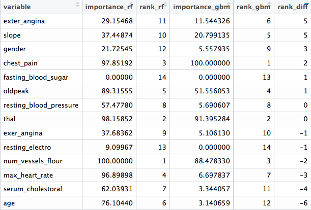
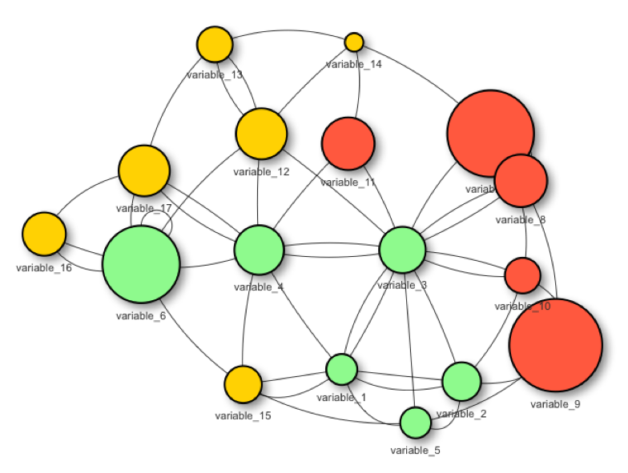
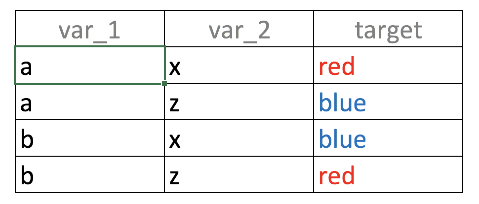
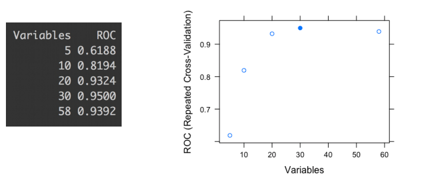
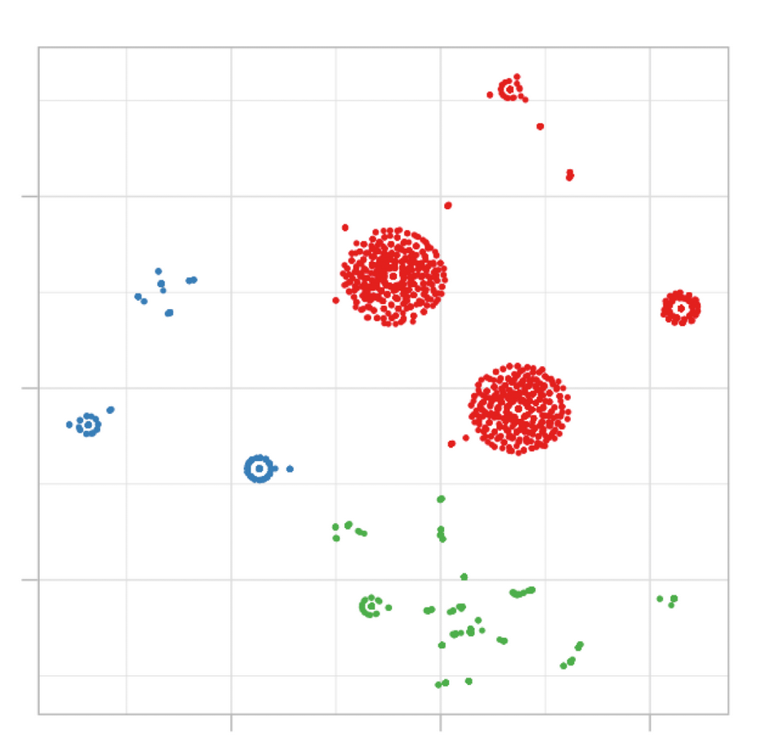

```{r include = FALSE}
if(!knitr:::is_html_output())
{
  options("width"=56)
  knitr::opts_chunk$set(tidy.opts=list(width.cutoff=56, indent = 2), tidy = TRUE)
  knitr::opts_chunk$set(fig.pos = 'H')

}
```

# Selecting Best Variables {#selecting_best_variables}

## General Aspects in Selecting Best Variables {#general_aspects_selecting_best_variables}

### What is this about?

This chapter covers the following topics:

* The best variables ranking from conventional machine learning algorithms, either predictive or clustering.
* The nature of selecting variables with and without predictive models.
* The effect of variables working in groups (intuition and information theory).
* Exploring the best variable subset in practice using R.

_Selecting the best variables is also known as feature selection, selecting the most important predictors, selecting the best predictors, among others._


```{r Millennium-Simulation-Project, echo=FALSE, out.width="200px",fig.cap="As above, so below", out.extra=""}

```

_Image: Is it a neural network? Nope. Dark matter, from the "The Millennium Simulation Project"._

<br>

## Intuition

Selecting the best variables is like doing a summary of a story, we want to focus on those few details that best describe what we're talking about. The balance threads between talking _too much_ about unnecessary details (overfitting) and talking _too little_ about the essence of the story (underfitting).

Another example can be the decision of buying a new laptop: _what are the features that we care about the most? Price, color and shipping method? Color and battery life? Or just price?_

From the **Information Theory** point of view -a key point in machine learning-, the data that we are working on has **entropy** (chaos). When we select variables, we are are reducing the entropy of our system by adding information.

<br>

## The "best" selection?

The chapter says "best", but we'd better mention a conceptual point, in general terms _there is no unique best variable selection._

To start from this perspective is important, since in the exploration of many algorithms that _rank_ the variables according to their predictive power, we can find different -and similar- results. That is:

* Algorithm 1 has chosen as the best variable `var_1`, followed by `var_5` and `var_14`.
* Algorithm 2 did this ranking: `var_1`, `var_5` and `var_3`.

Let's imagine, based on algorithm 1, the accuracy is 80%, while the accuracy based on algorithm 2 is 78%. Considering that every model has its inner variance, the result can be seen as the same.

This perspective can help us to reduce time in pursuing the perfect variable selection.

However going to the extremes, there will be a set of variables that will rank high across many algorithms, and the same goes for those with little predictive power. After several runs most reliable variables will emerge quickly, so:

**Conclusion**: If results are not good the focus should be on improving and checking the **data preparation** step. _The next section will exemplify it._

<br>

### Going deeper into variable ranking

It's quite common to find in literature and algorithms, that covers this topic an univariate analysis, which is a ranking of variables given a particular metric.

We're going to create two models: random forest and gradient boosting machine (GBM) using `caret` R package to cross-validate the data. Next, we'll compare the best variable ranking that every model returns.

```{r, eval=FALSE, warning=FALSE}
library(caret)
library(funModeling)
library(dplyr)

# Excluding all NA rows from the data, in this case, NAs are not the main issue to solve, so we'll skip the 6 cases which have NA (or missing values).
heart_disease=na.omit(heart_disease)

# Setting a 4-fold cross-validation
fitControl = trainControl(method = "cv",
                           number = 4,
                           classProbs = TRUE,
                           summaryFunction = twoClassSummary)

# Creating the random forest model, finding the best tuning parameter set
set.seed(999)
fit_rf = train(x=select(heart_disease, -has_heart_disease, -heart_disease_severity),
             y = heart_disease$has_heart_disease,
             method = "rf",
             trControl = fitControl,
             verbose = FALSE,
             metric = "ROC")

# Creating the gradient boosting machine model, finding the best tuning parameter set
fit_gbm = train(x=select(heart_disease, -has_heart_disease, -heart_disease_severity),
             y = heart_disease$has_heart_disease,
             method = "gbm",
             trControl = fitControl,
             verbose = FALSE,
             metric = "ROC")
```


Now we can proceed with the comparison.

The columns `importance_rf` and `importance_gbm` represent the importance measured by each algorithm. Based on each metric, there are `rank_rf` and `rank_gbm` which represent the importance order, finally `rank_diff` (`rank_rf` - `rank_gbm`) represents how different each algorithm rank the variables.


```{r, eval=FALSE}
# Here we manipulate to show a nice the table described before
var_imp_rf=data.frame(varImp(fit_rf, scale=T)["importance"]) %>%
  dplyr::mutate(variable=rownames(.)) %>% dplyr::rename(importance_rf=Overall) %>%
  dplyr::arrange(-importance_rf) %>%
  dplyr::mutate(rank_rf=seq(1:nrow(.)))

var_imp_gbm=as.data.frame(varImp(fit_gbm, scale=T)["importance"])  %>%
  dplyr::mutate(variable=rownames(.)) %>% dplyr::rename(importance_gbm=Overall) %>%
  dplyr::arrange(-importance_gbm) %>%
  dplyr::mutate(rank_gbm=seq(1:nrow(.)))                                                                                                                            
final_res=merge(var_imp_rf, var_imp_gbm, by="variable")

final_res$rank_diff=final_res$rank_rf-final_res$rank_gbm

# Printing the results!
final_res
```

```{r ranking-best-vars-comparison, echo=FALSE, fig.cap="Comparing different variable ranking", out.extra=""}

```

We can see that there are variables which are not important at all to both models (`fasting_blood_sugar`). There are others that maintain a position at the top of importance like `chest_pain` and `thal`.

Different predictive model implementations have their criteria to report what are the best features, according to that particular model. This ends up in different ranking across different algorithms. _More info about the inner importance metrics  can be found at the [caret documentation](https://topepo.github.io/caret/variable-importance.html)._

Even more, in tree based models like GBM and Random Forest there is a random component to picking up variables, and the importance is based on prior -and automatic- variable selection when building the trees. The importance of each variable depends on the others, not only on its isolated contribution: **Variables work in groups**. We'll back on this later on this chapter.

Although the ranking will vary from algorithm to algorithm, in general terms there is a correlation between all of these results as we mentioned before.

**Conclusion:** Every ranking list is not the _"final truth"_, it gives us orientation about where the information is.

<br>


## The nature of the selection

There are two main approaches when doing variable selection:

**Predictive model dependent**:

Like the ones we saw before, this is the most common. The model will rank variables according to one intrinsic measure of accuracy. In tree-based models, metrics such as information gain, Gini index, node impurity. More info at [@stackoverflow_entropy] and [@stats.stackexchange_gini].

**Not predictive model dependent**:

This is interesting since they are not as popular as the other ones, but they are proved to perform really well in areas related to genomic data. They need to find those _relevant_ genes (input variable) that are correlated with some disease, like cancer (target variable).

Data from this area is characterized by having a huge number of variables (in the order of thousands), which is much bigger than problems in other areas.

One algorithm to perform this is [mRMR](http://home.penglab.com/proj/mRMR), acronym for Minimum Redundancy Maximum Relevance Feature Selection. It has its own implementation in R in [mRMRe](https://cran.r-project.org/web/packages/mRMRe/vignettes/mRMRe.pdf) package.

Another not model-depandent algorithm is `var_rank_info`, a function provided by  [funModeling](https://cran.r-project.org/web/packages/funModeling/funModeling.pdf) package. It ranks the variables according to several **information theory** metrics. An example will be presented later on.

<br>

## Improving variables

Variables can increase their predictive power by treating them.

This book covers by now:

* [Improvement of categorical variables](#high_cardinality_predictive_modeling).
* Reducing the noise in numerical variables through binning in the chapter: [Discretizing numerical variables](#discretizing_numerical_variables).
* [How to deal with outliers in R](#how_to_deal_with_outliers_in_r).
* [Missing Data: Analysis, Handling, and Imputation of](#missing_data)


<br>

## Cleaning by domain knowledge

It's not related to algorithmic procedures, but to the area from which the data comes.

Imagine data coming from a survey. This survey has one year of history, and during the first three months there was no good process control. When inserting data users could type whatever they wanted. Variables during this period will probably be spurious.

It's easy to recognize it when during a given period of time, the variable comes empty, null or with extreme values.

We should then ask a question:

_Is this data reliable?_ Keep in mind the predictive model will learn _as a kid_, it will not judge the data, just learn from it. If data is spurious in a given period of time, then we may remove these input cases.

To go further on this point, we should do a deeper exploratory data analysis. Both numerically and graphically.

<br>

## Variables work in groups

```{r variables-work-in-groups, echo=FALSE, out.width="54%", fig.cap="Variables work in groups", out.extra=""}

```


When selecting the _best_ variables, the main aim is to get those variables which carry the most information regarding a target, outcome or dependent variable.

A predictive model will find its weights or parameters based on its 1 to 'N' input variables.

Variables usually don't work isolated when explaining an event. Quoting Aristotle:

> “The whole is greater than the sum of its parts.”

This is also true when selecting the _best_ features:

_Building a predictive model with two variables may reach a higher accuracy than the models built with only one variable._

For example: Building a model based on variable `var_1` could lead to an overall accuracy of 60%. On the other hand, building a model based on `var_2` could reach an accuracy of 72%. But when we combine these two `var_1` and `var_2` variables, we could achieve an accuracy above 80%.

<br>

### Example in R: Variables working in groups

```{r selecting-best-variables-5, echo=FALSE, out.width="54%", fig.cap="Aristotle (384 BC–322 BC)", out.extra=""}

```


The following code illustrates what Aristotle said _some_ years ago.

It creates 3 models based on different variable subsets:

* model 1 is based on `max_heart_rate` input variable
* model 2 is based on `chest_pain` input variable
* model 3 is based on `max_heart_rate` **and** `chest_pain` input variables

Each model returns the metric ROC, and the result contains the improvement of considering the two variables at the same time vs. taking each variable isolated.

```{r, eval=TRUE, message=FALSE, tidy=FALSE, warning=FALSE}
library(caret)
library(funModeling)
library(dplyr)

# setting cross-validation 4-fold
fitControl = 
  trainControl(method = "cv",
               number = 4,
               classProbs = TRUE,
               summaryFunction = twoClassSummary
               )

create_model<-function(input_variables) 
{
  # create gradient boosting machine model
  # based on input variables
  fit_model = train(x=select(heart_disease, 
                             one_of(input_variables)
                             ),
              y = heart_disease$has_heart_disease,
              method = "gbm",
              trControl = fitControl,
              verbose = FALSE,
              metric = "ROC")
 
  # returning the ROC as the performance metric
  max_roc_value=max(fit_model$results$ROC)
  return(max_roc_value)
}

roc_1=create_model("max_heart_rate")
roc_2=create_model("chest_pain")
roc_3=create_model(c("max_heart_rate", "chest_pain"))

avg_improvement=round(100*(((roc_3-roc_1)/roc_1)+
                             ((roc_3-roc_2)/roc_2))/2,
                      2)
avg_improvement_text=sprintf("Average improvement: %s%%", 
                             avg_improvement)

results = 
  sprintf("ROC model based on 'max_heart_rate': %s.;
  based on 'chest_pain': %s; and based on both: %s", 
  round(roc_1,2), 
  round(roc_2,2), 
  round(roc_3, 2)
  )

# printing the results!
cat(c(results, avg_improvement_text), sep="\n\n")
```

```{r, message=FALSE, echo=FALSE}
detach("package:caret")
```

<br>

### Tiny example (based on Information Theory)

Consider the following _big data_ table `r emo::ji("stuck_out_tongue_winking_eye")` 4 rows, 2 input variables (`var_1`, `var_2`) and one outcome (`target`):

```{r variables-work-in-groups-2, echo=FALSE, out.width="200px", fig.cap="Unity gives strength: Combining variables", out.extra=""}

```

If we build a predictive model based on `var_1` only, what it will _see_?, the value `a` is correlated with output `blue` and `red` in the same proportion (50%):

* If `var_1='a'` then likelihood of target='red' is 50% (row 1)
* If `var_1='b'` then likelihood of target='blue' is 50% (row 2)

_Same analysis goes for `var_2`_

When the same input is related to different outcomes it's defined as **noise**. The intuition is the same as one person telling us: _"Hey it's going to rain tomorrow!"_, and another one saying: _"For sure tomorrow it's not going to rain"_.
We'd think... _"OMG! do I need the umbrella or not `r emo::ji("scream")`?"_

Going back to the example, taking the two variables at the same time, the correspondence between the input and the output in unique: "If `var_1='a'` and `var_2='x'` then the likelihood of being `target='red'` is 100%". You can try other combinations.

**Summing-up:**

That was an example of **variables working in groups**, considering `var_1` and `var_2` at the same time increases the predictive power. 

Nonetheless, it's a deeper topic to cover, considering the last analysis; how about taking an `Id` column (every value is unique) to predict something? The correspondence between input-output will also be unique... but is it a useful model? There'll be more to come about information theory in this book.

<br>

### Conclusions 

* The proposed R example based on `heart_disease` data shows an average **improvement of 9%** when considering two variables at a time, not too bad. This percentage of improvement is the result of the **variables working in groups**.
* This effect appears if the variables contain information, such is the case of `max_heart_rate` and `chest_pain` (or `var_1` and `var_2`).
* Putting **noisy variables** next to good variables **will usually affect** overall performance.
* Also the **work in groups** effect is higher if the input variables **are not correlated between** them. This is difficult to optimize in practice. More on this on the next section...


<br>


### Rank best features using information theory {#select_features_var_rank_info}

As introduced at the beginning of the chapter, we can get variable importance without using a predictive model using information theory.

From version 1.6.6 the package `funModeling` introduces the function `var_rank_info`, which takes two arguments, the data and the target variable, because it follows:

```{r variable-ranking-using-information-theory, fig.width=6, fig.height=4.5, tidy=FALSE, fig.cap="Variable Importance (based on Gain Ratio)", out.extra=""}
variable_importance = 
  var_rank_info(heart_disease, "has_heart_disease")

# Printing results
variable_importance

# Plotting 
ggplot(variable_importance, 
       aes(x = reorder(var, gr), 
           y = gr, fill = var)
       ) + 
  geom_bar(stat = "identity") + 
  coord_flip() + 
  theme_bw() + 
  xlab("") + 
  ylab("Variable Importance 
       (based on Information Gain)"
       ) + 
  guides(fill = FALSE)
```

Is `heart_disease_severity` the feature that explains the target the most? 

No, this variable was used to generate the target, thus we must exclude it. It is a typical mistake when developing a predictive model to have either an input variable that was built in the same way as the target (as in this case) or adding variables from the future as explained in [Considerations involving time](#considerations-involving-time).

Going back to the result of `var_rank_info`, the resulting metrics come from information theory:

* `en`: entropy measured in bits
* `mi`: mutual information
* `ig`: information gain
* `gr`: gain ratio

We are not going to cover what is behind these metrics at this point as this will be covered exclusively in a future chapter, However, the `gain ratio` is the most important metric here, ranged from 0 to 1, with higher being better.

**Fuzzy boundaries**

We've just seen how to calculate importance based on information theory metrics. This topic is not exclusive to this chapter; this concept is also present in the [Exploratory Data Analysis - Correlation and Relationship](#correlation) section.

To _select best features_ is related to _̣exploratory data analysis_ and vice-versa.


<br>


## Correlation between input variables

The ideal scenario is to build a predictive model with only variables not correlated between them. In practice, it's complicated to keep such a scenario for all variables.

Usually there will be a set of variables that are not correlated between them, but also there will be others that have at least some correlation.

**In practice** a suitable solution would be to exclude those variables with a **remarkably high-level** of correlation.

Regarding how to measure correlation. Results can be highly different based on linear or non-linear procedures. More info at the [Correlation](#correlation)

_What is the problem with adding correlated variables?_

The problem is that we're adding complexity to the model: it's usually more time-consuming, harder to understand, less explainable, less accurate, etc. This is an effect we reviewed in [Don't predictive models handle high cardinality?](#high_cardinality_in_predictive_models_part_2). The general rule would be: Try to add the top N variables that are correlated with the output but not correlated between them. This leads us to the next section.


<br>

## Keep it simple

```{r fractals-nature, echo=FALSE, out.width="38%", fig.cap="Fractals in Nature", out.extra=""}
knitr::include_graphics("selecting_best_variables/fractals_nature.png")
```

> Nature operates in the shortest way possible. -Aristotle.

The principle of **Occam's razor**: Among competing hypotheses, the one with the fewest assumptions should be selected.

Re-interpreting this sentence for machine learning, those "hypotheses" can be seen as variables, so we've got:

**Among different predictive models, the one with fewest variables should be selected.** [@wiki:occam_razor]

Of course, there is also the trade-off of adding-substracting variables and the accuracy of the model.

A predictive model with a _high_ number of variables will tend to do **overfitting**. While on the other hand, a model with a _low_ number of variables will lead to doing **underfitting**.

The concept of _high_ and _low_ is **highly subjective** to the data that is being analyzed. In practice, we may have some accuracy metric, for example, the ROC value. i.e. we would see something like:


```{r variable-selection-in-r-2, echo=FALSE, fig.cap="ROC values for different variables subset", out.extra=""}

```


The last picture shows the ROC accuracy metric given different subsets of variables (5, 10, 20, 30 and 58). Each dot represents the ROC value given a certain number of variables used to build the model.

We can check that the highest ROC appears when the model is built with 30 variables. If we based the selection only on an automated process, we might be choosing a subset which tends to overfit the data. This report was produced by library `caret` in R ([@caret_feat_elimination] but is analogous to any software.

Take a closer look at the difference between the subset of 20 and the 30; there is only an improvement of **1.8%** -from 0.9324 to 0.95- choosing **10 more variables.** In other words: _Choosing 50% more variables will impact in less than 2% of improvement._

Even more, this 2% may be an error margin given the variance in the prediction that every predictive model has, as we seen in [Knowing the error](#knowing_the_error) chapter.


**Conclusion:**

In this case, and being consequent with Occam's Razor principle, the best solution is to build the model with the subset of 20 variables.

Explaining to others -and understanding- a model with 20 variables is easier than the similar one with 30.

<br>

## Variable selection in Clustering?

```{r variable-selection-in-clustering, echo=FALSE, out.width="54%", fig.cap="Example of cluster segmentation", out.extra=""}

```


This concept usually appears only in predictive modeling, i.e. having some variables to predict a target one. In clustering there is no target variable, we let the data speak, and the natural segments arise according to some distance metric.

However, **not every variable contributes in the same way to the dissimilarity in the cluster model**. Keeping it brief, if we have 3 clusters as output, and we measure the average of each variable, we expect to have these averages _quite_ dissimilar between them, right?

Having built 2 cluster models, in the first one the averages of the `age` variable is 24, 33 and 26 years; while on the second one we have: 23, 31 and 46. In the second model the variable `age` is having more variability, thus it is more relevant to the model.

This was just an example considering two models, but it's the same considering just one. Those variables with **more distance** across averages will tend to **define better** the cluster than the others.

Unlike predictive modeling, in clustering _less important_ variables shouldn't be removed, those variables aren't important in that particular model, but they could be if we build another one with other parameters. The cluster models' quality is highly subjective.

Finally, we could run, for example, a random forest model with the cluster as a target variable and in this way quickly collect the most important variables.

<br>

## Selecting the best variables in practice

### The short answer

Pick up the top _N_ variables from the algorithm you're using and then re-build the model with this subset. Not every predictive model retrieves variable rankings, but if it does, use the same model (for example gradient boosting machine) to get the ranking and to build the final model.

For those models like k-nearest neighbors which don't have a built-in select best features procedure, it's valid to use the selection of another algorithm. It will lead to better results than using all the variables.

<br>

### The long answer

* When possible, **validate** the list with someone who knows about the context, the business or the data source. Either for the top _N_ or the bottom _M_ variables. As regards those _bad_ variables, we may be missing something in the data munging that could be destroying their predictive power.
* Understand each variable, its meaning in context (business, medical, other).
* Do **exploratory data analysis** to see the distributions of the most important variables regarding a target variable, _does the selection make sense?_ If the target is binary then the function [Profiling target using cross_plot](#profiling_target_cross_plot) can be used.
* Does the average of any variable _significantly_ change over time? Check for abrupt changes in distributions.
* Suspect about high cardinality top-ranked variables (like postal code, let's say above +100 categories). More information at [High Cardinality Variable in Predictive Modeling](#high_cardinality_predictive_modeling). 
* When making the selection -as well as a predictive modeling-, try and use methods which contain some mechanism of re-sampling (like bootstrapping), and cross-validation. More information in the [knowing the error](#knowing_the_error) chapter. 
* Try other methods to find **groups of variables**, like the one mentioned before: mRMR.
* If the selection doesn't meet the needs, try creating new variables, you can check the **data preparation** chapter. Coming soon: Feature engineering chapter.

<br>

### Generate your own knowledge

It's difficult to generalize when the nature of the data is so different, from **genetics** in which there are thousands of variables and a few rows, to web-navigation when new data is coming all the time.

The same applies to the objective of the analysis. Is it to be used in a competition where precision is highly necessary? Perhaps the solution may include more correlated variables in comparison to an ad-hoc study in which the primary goal is a simple explanation.

There is no one-size-fits-all answer to face all possible challenges; you'll find powerful insights using your experience. It's just a matter of practice.

<br>

---

```{r, echo=FALSE}
knitr::include_graphics("introduction/spacer_bar.png")
```

---

<br>

## Target profiling 

### Using `cross_plot` (dataViz) {#profiling_target_cross_plot}

#### What is this about?

This plot intent to show in real scenarios if a variable is or not important, making a visual summary of it, _(by grouping numerical variables into bins/groups)_.

#### Example 1: Is gender correlated with heart disease?

```{r cross-plot-data-viz, results="hide", fig.height=4, fig.width=9.5, fig.cap="Using cross-plot to analyze and report variable importance", out.extra=""}
cross_plot(heart_disease, input="gender", target="has_heart_disease")
```

Last two plots have the same data source, showing the distribution of `has_heart_disease` regarding `gender`. The one on the left shows in percentage value, while the one on the right shows in absolute value.

##### How to extract conclusions from the plots? (Short version)

`Gender` variable seems to be a **good predictor**, since the likelihood of having heart disease is different given the female/male groups.  **it gives an order to the data**.

#### How to extract conclusions from the plots? (Long version)

**From 1st plot (%):**

1. The **likelihood** of having heart disease for males is 55.3%, while for females is: 25.8%.
2. The heart disease rate for males **doubles** the rate for females (55.3 vs. 25.8, respectively).

**From 2nd plot (count):**

1. There is a total of **97 females**:
    + 25 of them have heart disease (25/97=25.8%, which is the ratio of the 1st plot).
    + the remaining 72 have not heart disease (74.2%)

2. There is a total of **206 males**:
    + 114 of them have heart disease (55.3%)
    + the remaining 92 have not heart disease (44.7%)

3. Total cases: Summing the values of four bars: 25+72+114+92=**303**.

*Note: What would it happened if instead of having the rates of 25.8% vs. 55.3% (female vs. male), they had been more similar like 30.2% vs. 30.6%). In this case variable `gender` it would have been much less relevant, since it doesn't separate the `has_heart_disease` event.*

#### Example 2: Crossing with numerical variables

Numerical variables should be **binned** to plot them with a histogram, otherwise, the plot is not showing information, as it can be seen here:


##### Equal frequency binning

There is a function included in the package (inherited from Hmisc package): `equal_freq`, which returns the bins/buckets based on the **equal frequency criteria**. Which is *-or tries to-* have the same quantity of rows per bin.

For numerical variables, `cross_plot` has by default the `auto_binning=T`, which automatically calls the `equal_freq` function with `n_bins=10` (or the closest number).

```{r cross-plot-feature-engineering, results="hide",  message=FALSE,fig.height=4, fig.width=9.5, fig.cap="Numeric variable as input (automatic binning)", out.extra=""}
cross_plot(heart_disease, input="max_heart_rate", target="has_heart_disease")
```

#### Example 3: Manual binning

If you don't want the automatic binning, then set the `auto_binning=F` in `cross_plot` function.

For example, creating `oldpeak_2` based on equal frequency, with three buckets.

```{r variable-importance-c3, tidy=FALSE}
heart_disease$oldpeak_2 = 
  equal_freq(var=heart_disease$oldpeak, n_bins = 3)
summary(heart_disease$oldpeak_2)
```

Plotting the binned variable (`auto_binning = F`):
```{r selecting-best-variables-3, results="hide", fig.height=4, fig.width=9.5,fig.cap="Disabling automatic binning shows the original variable", out.extra=""}
cross_oldpeak_2=cross_plot(heart_disease, input="oldpeak_2", target="has_heart_disease", auto_binning = F)
```

##### **Conclusion**

This new plot based on `oldpeak_2` shows clearly how: the likelihood of **having heart disease increases** as **oldpeak_2 increases** as well. *Again, it gives an order to the data.*

#### Example 4: Noise reducing

Converting variable `max_heart_rate` into a one of 10 bins:

```{r variable-importance-c5, results="hide",fig.height=4, fig.width=9.9, tidy=FALSE,fig.cap="Plotting using custom binning", out.extra=""}
heart_disease$max_heart_rate_2 = 
  equal_freq(var=heart_disease$max_heart_rate, n_bins = 10)

cross_plot(heart_disease, 
           input="max_heart_rate_2", 
           target="has_heart_disease"
           )
```

At first glance, `max_heart_rate_2` shows a negative and linear relationship. However, there are some buckets which add noise to the relationship. For example, the bucket `(141, 146]` has a higher heart disease rate than the previous bucket, and it was expected to have a lower. *This could be noise in data.*

**Key note**: One way to reduce the **noise** (at the cost of **losing** some information), is to split with less bins:

```{r feature-engineering, results="hide", fig.height=4, fig.width=9.5, tidy=FALSE, fig.cap="Reducing the bins may help to better expose the relationship", out.extra=""}
heart_disease$max_heart_rate_3 = 
  equal_freq(var=heart_disease$max_heart_rate, n_bins = 5)

cross_plot(heart_disease, 
           input="max_heart_rate_3", 
           target="has_heart_disease"
           )
```

**Conclusion**: As it can be seen, now the relationship is much clean and clear. Bucket *'N'* has a higher rate than *'N+1'*, which implies a negative correlation.


**How about saving the cross_plot result into a folder?**

Just set the parameter `path_out` with the folder you want -It creates a new one if it doesn't exists-.

```{r several-cross-plot-c1, eval=FALSE, fig.cap="Easy plot exportation", out.extra=""}
cross_plot(heart_disease, input="max_heart_rate_3", target="has_heart_disease", path_out="my_plots")
```

It creates the folder `my_plots` into the working directory.

#### Example 5: `cross_plot` on multiple variables

Imagine you want to run cross_plot for several variables at the same time. To achieve this goal just define a vector containing the variable names.

If you want to analyze these 3 variables:
```{r several-cross-plot2-c, eval=FALSE}
vars_to_analyze=c("age", "oldpeak", "max_heart_rate")
```

```{r several-cross-plot-c3, eval=FALSE, fig.cap="Easy analysis for several variables at once", out.extra=""}
cross_plot(data=heart_disease, target="has_heart_disease", input=vars_to_analyze)
```


<br>

#### Exporting plots

`plotar` and `cross_plot` can handle from 1 to N input variables, and plots generated by them can be easily exported in high quality with parameter `path_out`.
```{r variable-importance-2c, results="hide", fig.height=2, fig.width=4, eval=FALSE}
plotar(data=heart_disease, input=c('max_heart_rate', 'resting_blood_pressure'),  target="has_heart_disease", plot_type = "boxplot", path_out = "my_awsome_folder")
```

<br>

-----

```{r, echo=FALSE}
knitr::include_graphics("introduction/spacer_bar.png")
```

---

<br>

### Using BoxPlots {#target-profiling-using-boxplots}

#### What is this about?

The use of Boxplots in importance variable analysis gives a quick view of how different the quartiles are among the various values in a binary target variable.

`````{r loading-lib, results="hide", message=FALSE}
# Loading funModeling !
library(funModeling)
data(heart_disease)
```

```{r variable-importance2b,  fig.height=3, fig.width=5, fig.cap="Profiling target using boxplot", out.extra=""}
plotar(data=heart_disease, input="age", target="has_heart_disease", plot_type = "boxplot")
```

_Rhomboid near the mean line represents the **median**._

<br>

```{r boxplot-analysis, echo=FALSE, out.width="85%", fig.cap="How to interpret a boxplot", out.extra=""}
knitr::include_graphics("selecting_best_variables/boxplot.png")
```


<br>

*When to use boxplots?*

When we need to analyze different percentiles across the classes to predict. Note this is a powerful technique since the bias produced due to outliers doesn't affect as much as it does to the mean.

<br>

#### Boxplot: Good vs. Bad variable

Using more than one variable as inputs is useful in order to compare boxplots quickly, and thus getting the best variables...

```{r variable-importance2e,  fig.height=3, fig.width=5, fig.cap="plotar function for multiple variables", out.extra=""}
plotar(data=heart_disease, input=c('max_heart_rate', 'resting_blood_pressure'),  target="has_heart_disease", plot_type = "boxplot")
```

We can conclude that `max_heart_rate` is a better predictor than `resting_blood_pressure`.

As a general rule, a variable will rank as **more important** if boxplots are **not aligned** horizontally.

_Statistical tests: percentiles are another used feature used by them in order to determine -for example- if means across groups are or not the same._

<br>

#### Exporting plots

`plotar` and `cross_plot` can handle from 1 to N input variables, and plots generated by them can be easily exported in high quality with parameter `path_out`.

```{r variable-importance_2d, eval=FALSE, fig.height=2, fig.width=5, eval=FALSE}
plotar(data=heart_disease, input=c('max_heart_rate', 'resting_blood_pressure'),  target="has_heart_disease", plot_type = "boxplot", path_out = "my_awsome_folder")
```

<br>

* **Keep in mind this when using Histograms and BoxPlots** They are nice to see when the variable:
    + Has a good spread -not concentrated on a bunch of _3, 4..6.._ different values, **and**
    + It has not extreme outliers... _(this point can be treated with `prep_outliers` function present in this package)_
   
<br>


### Using Density Histograms {#target-profiling-using-density-histograms}

#### What is this about?

Density histograms are quite standard in any book/resource when plotting distributions. To use them in selecting variables gives a quick view on how well certain variable separates the class.

```{r variable-importance1, results='hide',  fig.height=3, fig.width=5, fig.cap="Profiling target using density histograms", out.extra=""}
plotar(data=heart_disease, input="age", target="has_heart_disease", plot_type = "histdens")
```

_Note: The dashed-line represents variable mean._

**Density histograms** are helpful to visualize the general shape of a numeric distribution.

This *general shape* is calculated based on a technique called **Kernel Smoother**, its general idea is to reduce high/low peaks (noise) present in near points/bars by estimating the function that describes the points. Here some pictures to illustrate the concept: https://en.wikipedia.org/wiki/Kernel_smoother

<br>


#### What is the relationship with a statistical test?

Something similar is what a **statistical test** sees: they measured **how different** the curves are reflecting it in some statistics like the p-value using in the frequentist approach. It gives to the analyst reliable information to determine if the curves have -for example- the same mean.


#### Good vs. bad variable

```{r variable-importance2,  fig.height=2, fig.width=5, fig.cap="plotar function for multiple variables", out.extra=""}
plotar(data=heart_disease, input=c('resting_blood_pressure', 'max_heart_rate'),  target="has_heart_disease", plot_type = "histdens")
```

<br>

And the model will see the same... if the curves are quite overlapped, like it is in `resting_blood_pressure`, then it's **not a good predictor** as if they were **more spaced** -like `max_heart_rate`.

<br>


* **Key in mind this when using Histograms & BoxPlots** They are nice to see when the variable:
    + Has a good spread -not concentrated on a bunch of _3, 4..6.._ different values, **and**
    + It has not extreme outliers... _(this point can be treated with `prep_outliers` function present in this package)_
   
<br>


---

```{r, echo=FALSE}
knitr::include_graphics("introduction/spacer_bar.png")
```

---

