```{r include = FALSE}
if(!knitr:::is_html_output())
{
  options("width"=56)
  knitr::opts_chunk$set(tidy.opts=list(width.cutoff=56, indent = 2), tidy = TRUE)
  knitr::opts_chunk$set(fig.pos = 'H')
}
```


# Assesing Model Performance {#model-performance}

It covers **methodological aspects of the error** in predictive models, how to measure it through **cross-validation** data and its similitude with **bootstrapping** technique. And how these strategies are used internally by some predictive models such us _random forest_ or _gradient boosting machines_.

There is also a chapter about how to validate models when time is involved, which is similar to classical train/test validation.

<br>


## Knowing the Error {#knowing_the_error}

**Methodological Aspects on Model Validation**

```{r Error-in-predictive-models, echo=FALSE, out.width="30%"}

```


<br>

### What's this about?

Once we've built a predictive model, how sure we are about its quality? Did it capture general patterns _-information-_ (excluding the _-noise-_)?

<br>

#### What sort of data?

It has other approach rather than the one covered on [Out-of-Time Validation](#out-of-time_validation). This approach could be used even when there is not possible to filter cases by date, for example having a data's snapshot at a certain point of time, when no new information will be generated.

For example some health data research from a reduced amount of people, a survey, or some data available on the internet for practicing purposes. It's either expensive, not practical, unethical or even impossible to add new cases. The `heart_disease` data coming in `funModeling` package is such an example.

<br>

### Reducing unexpected behavior

When a model is trained, it just sees a part of reality. It's a sample from a population that cannot be entirely seen.

There are lots of ways to validate a model (Accuracy / ROC curves / Lift / Gain / etc). Any of these metrics are **attached to variance**, which implies **getting different values**. If we remove some cases and then fit a new model, we'll see a _slightly_ different value.

Imagine we build a model and achieve an accuracy of `81`, now remove 10% of the cases, and then fit a new one, the accuracy now is: `78.4`. **What is the real accuracy?** The one obtained with 100% of data or the other based on 90%? For example, if the model will run live in a production environment, it will see **other cases** and the accuracy point will move to a new one.

_So what is the real value? The one to report?_ **Re-sampling** and **cross-validation** techniques will average -based on different sampling and testing criteria- in order to retrieve an approximation to the most trusted value.

<br>

**But why remove cases?**

There is no sense in removing cases like that, but it gets an idea of how sensible the accuracy metric is, remember we're working with a sample from an *_unknown population_*.

If we'd have a fully deterministic model, a model that contains 100% of all cases we are studying, and predictions were 100% accurate in all cases, we wouldn't need all of this.

As far as we always analyze samples, we just need to getting closer to the _real and unknown truthness_ of data through repetition, re-sampling, cross-validation, and so on...


<br>

### Let's illustrate this with Cross-Validation (CV)

```{r Cross-Validation, echo=FALSE, out.width="80%", fig.cap="k-fold cross validation", out.extra=''}
knitr::include_graphics("model_performance/k-fold_cross_validation.png")
```


_Image credit: Sebastian Raschka_ Ref. [@evaluate_model]

<br>

#### CV short summary

* Splits the data into random groups, let's say `10`, equally sized. These groups are commonly called `folds`, represented by the `'k'` letter.
* Take `9` folds, build a model, and then apply the model to the remaining fold (the one which was left out). This will return the accuracy metric we want: accuracy, ROC, Kappa, etc. We're using accuracy in this example.
* Repeat this `k` times (`10` in our example). So we'll get `10` different accuracies. The final result will be the average of all of them.

This average will be the one to evaluate if a model is good or not, and also to include it in a report.

<br>

#### Practical example

There 150 rows in the `iris` data frame, using [caret package](http://topepo.github.io/caret/index.html) to build a `random forest` with `caret` using `cross-validation` will end up in the -internal- construction of 10 random forest, each one based on 135 rows (9/10 * 150), and reporting an accuracy based on remaining 15 (1/10 * 150) cases. This procedure is repeated 10 times.

This part of the output:

```{r caret-cross-validation-output, echo=FALSE, out.width="86%", fig.cap="caret cross validation output", out.extra=''}
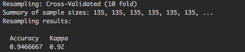
```


`Summary of sample sizes: 135, 135, 135, 135, 135, 135, ... `, each 135 represents a training sample, 10 in total but the output is truncated.

Rather a single number -the average-, we can see a distribution:

```{r Accuracy-predictive-models, echo=FALSE, out.width="50%", fig.cap="Visual analysis of the accuracy distribution", out.extra=''}
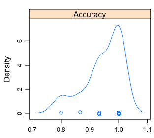
```

```{r Accuracy-predictive-models-2, echo=FALSE, out.width="70%", fig.cap="Accuracy distribution", out.extra=''}
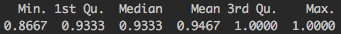
```


* The min/max accuracy will be between `~0.8` and `~1`.
* The mean is the one reported by `caret`.
* 50% of times it will be ranged between `~0.93 and ~1`.

Recommended lecture by Rob Hyndman, creator of `forecast` package: _Why every statistician should know about cross-validation?_ [@why_cross_validation]

<br>

### But what is Error?

The sum of **Bias**, **Variance** and the **_unexplained error_** -inner noise- in data, or the one that the model will never be able to reduce.

These three elements represent the error reported.

#### What is the nature of Bias and Variance?

When the model doesn't work well, there may be several causes:

* **Model too complicated**: Let's say we have lots of input variables, which is related to **high variance**. The model will overfit on training data, having a poor accuracy on unseen data due to its particularization.
* **Model too simple**: On the other hand, the model may not be capturing all the information from the data due to its simplicity. This is related to **high bias**.
* **Not enough input data**: Data forms shapes in an n-dimensional space (where `n` is all the input+target variables). If there are not enough points, this shape is not developed well enough.

More info here in _"In Machine Learning, What is Better: More Data or better Algorithms"_ [@more_data_or_better_algorithms].

```{r bias-variance, echo=FALSE, out.width="75%", fig.cap="Bias vs. variance tradeoff", out.extra=''}
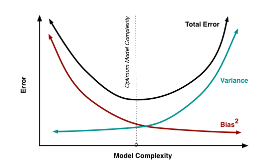
```

_Image credit: Scott Fortmann-Roe_  [@bias_variance_tradeoff]. It also contains an intutitive way of understanding error through bias and variance through a animation.

<br>

#### Complexity vs Accuracy Tradeoff

```{r accuracy-machine-learning, echo=FALSE, out.width="100px"}

```

Bias and variance are related in the sense that if one goes down the other goes up, so it's a **tradeoff** between them. A practical example of this is on 
Akaike Information Criterion (AIC) model quality measure. 

**AIC** is used as a heuristic to pick the best **time series model** in the `auto.arima` function inside `forecast` package in `R` [@arima_modeling_in_r]. It chooses the model with the lowest AIC.

The lower, the better: The accuracy in prediction will lower the value, while the number of parameters will increase it.

<br>

#### Bootstrapping vs Cross-Validation

* **Bootstrapping** is mostly used when estimating a parameter.
* **Cross-Validation** is the choice when choosing among different predictive models.

Note: For a deeper coverage about bias and variance, please go to [@bias_variance_tradeoff] and [@more_data_or_better_algorithms] at the bottom of the page.

### Any advice on practice?

It depends on the data, but it's common to find examples such as `10 fold CV`, plus repetition: `10 fold CV, repeated 5 times`. Other times we find: `5 fold CV, repeated 3 times`.

And using the average of the desired metric. It's also recommended to use the `ROC` for being less biased to unbalanced target variables.

Since these validation techniques are **time consuming**, consider choosing a model which will run fast, allowing model tunning, testing different configurations, trying different variables in a "short" amount of time. [Random Forest](https://en.wikipedia.org/wiki/Random_forest) are an excellent option which gives **fast** and **accurate** results. More on Random Forest overall performance on [@do_we_need_hundred_models].

Another good option is **gradient boosting machines**, it has more parameters to tune than random forest, but at least in R it's implementation works fast.

#### Going back to bias and variance

* Random Forest focuses on decreasing bias, while...
* Gradient boosting machine focuses on minimizing variance. More info in _"Gradient boosting machine vs random forest"_ [@gbm_vs_random_forest].

<br>


### Don't forget: Data Preparation

Tweaking input data by transforming and cleaning it, will impact on model quality. Sometimes more than optimizing the model through its parameters.

Expand this point with the [Data Preparation](#data_preparation) chapter.


### Final thoughts

* Validating the models through re-sampling / cross-validation helps us to estimate the "real" error present in the data. If the model runs in the future, that will be the expected error to have.
* Another advantage is **model tuning**, avoiding the overfitting in selecting best parameters for certain model, [Example in caret](https://topepo.github.io/caret/model-training-and-tuning.html). The equivalent in **Python** is included in [Scikit Learn](http://scikit-learn.org/stable/modules/cross_validation.html).
* The best test is the one made by you, suited to your data and needs. Try different models and analyze the tradeoff between time consumption and any accuracy metric.

> These re-sampling techniques could be among the powerful tools behind the sites like stackoverflow.com or collaborative open-source software. To have many opinions to produce a less-biased solution.

But each opinion has to be reliable, imagine asking for a medical diagnostic to different doctors.


<br>

### Further reading
 
* Tutorial: [Cross validation for predictive analytics using R](http://www.milanor.net/blog/cross-validation-for-predictive-analytics-using-r)
* Tutorial by Max Kahn (caret's creator): [Comparing Different Species of Cross-Validation](http://appliedpredictivemodeling.com/blog/2014/11/27/vpuig01pqbklmi72b8lcl3ij5hj2qm)
* The cross-validation approach can also be applied to time dependant models, check the other chapter: [Out-of-time Validation](#out-of-time_validation).

<br>

---

```{r, echo=FALSE} 
 
```

---

<br>


## Out-of-Time Validation {#out-of-time_validation}

```{r error-in-machine-learning, echo=FALSE, out.width="100px"}

```


### What's this about?

Once we've built a predictive model, how sure we are it captured general patterns and not just the data it has seen (overfitting)?.

Will it perform well when it is on production / running live? What is the expected error?


<br>

### What sort of data?

If it's generated over time and -let's say- every day we have new cases like _"page visits on a website"_, or _"new patients arriving at a medical center"_, one strong validation is the **Out-Of-Time** approach.

<br>

### Out-Of-Time Validation Example

**How to?**

Imagine we are building the model on **Jan-01**, then to build the model we use all the data **before Oct-31**. Between these two dates, there are 2 months.

When predicting a **binary/two class variable** (or multi-class), it's quite straightforward: with the model we've built -with data <= **Oct-31**- we score the data on that exact day, and then we measure how the users/patients/persons/cases evolved during those two months.


Since the output of a binary model should be a number indicating the likelihood for each case to belong to a particular class ([Scoring Data](#scoring_data) chapter), we test what the **model "_said_" on Oct-31 against what it actually happened on "Jan-01"**.

<br>

Following **validation workflow** may be helpful when building a predictive model involving time.

```{r model-performance-workflow, echo=FALSE, out.width="100%", fig.cap="A validation workflow for time dependant problems", out.extra=''}
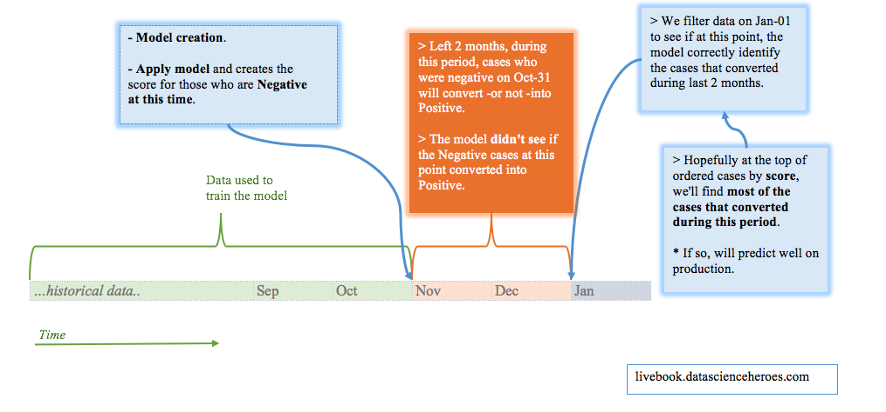
```


_[Enlarge image.](http://datascienceheroes.com/img/blog/model_validation_workflow.png)_

<br>

### Using Gain and Lift Analysis

This analysis explained in another chapter ([Gain &  Lift](#gain_and_lift)) and it can be used following the out-of-time validation.

Keeping only with those cases that were `negative` on `Oct-31`, we get the `score` returned by the model on that date, and the `target` variable is the value that those cases had on `Jan-1`.

### How about a numerical target variable?

Now the common sense and business need is more present. A numerical outcome can take any value, it can increase or decrease through time, so we may have to consider these two scenarios to help us thinking what we consider success. This is the case of linear regression.

**Example scenario**: We measure some web app usage (like the homebanking), the standard thing is as the days pass, the users use it more.

Examples:

* Predicting the concentration of a certain substance in the blood.
* Predicting page visits.
* Time series analysis.


We also have in these cases the difference between: **"what was expected" vs. "what it is"**.

This difference can take any number. This is the error or residuals.

```{r gain-lift-analysis-in-r, echo=FALSE, out.width="100%", fig.cap="Prediction and error analysis", out.extra=''}
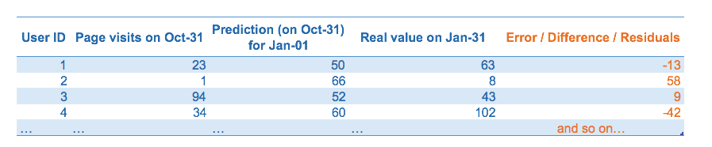
```


If the model is good, this error should be **white noise**, more info in _"Time series analysis and regression"_ section inside [@white_noise]. It follows a normal curve when mainly there are some logical properties:

* The error should be **around 0** -_the model must tend its error to 0_-.
* The standard deviation from this error **must be finite** -to avoid unpredictable outliers-.
* There has to be no correlation between the errors.
* **Normal distribution**: expect the majority of errors around 0, having the biggest ones in a **smaller proportion** as the error increases -likelihood of finding bigger errors decreases exponentially-.

```{r error-curve-in-r, echo=FALSE, out.width="60%", fig.cap="A nice error curve (normal distribution)", out.extra=''}
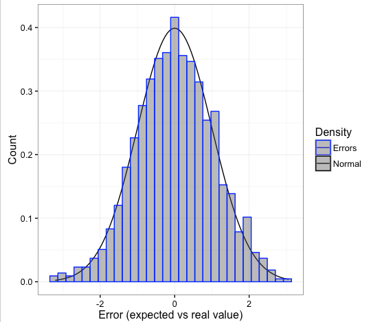
```


<br>


### Final thoughts

* **Out-of-Time Validation** is a powerful validation tool to simulate the running of the model on production with data that may **not need to depend on sampling**.

* The **error analysis** is a big chapter in data science. Time to go to next chapter which will try to cover key-concepts on this: [Knowing the error](#knowing_the_error).

<br>

---

```{r, echo=FALSE} 
 
```

---

<br>


## Gain and Lift Analysis {#gain_and_lift}

### What is this about?

Both metrics are extremely useful to validate the predictive model (binary outcome) quality. More info about [scoring data](#scoring_data)

Make sure we have the latest `funModeling` version (>= 1.3).

```{r lib-loading, results="hide", message=FALSE}
# Loading funModeling
library(funModeling)
```

```{r model-performance-gain-curve, fig.width=12, fig.height=3, fig.cap="Gain and lift curves", out.extra=''}
# Create a GLM model
fit_glm=glm(has_heart_disease ~ age + oldpeak, data=heart_disease, family = binomial)

# Get the scores/probabilities for each row
heart_disease$score=predict(fit_glm, newdata=heart_disease, type='response')

# Plot the gain and lift curve
gain_lift(data=heart_disease, score='score', target='has_heart_disease')
```

### How to interpret it?

First, each case is ordered according to the likelihood of being the less representative class, aka, score value.

Then `Gain` column accumulates the positive class, for each 10% of rows - `Population` column.

So for the first row, it can be read as:

_"The first 10 percent of the population, ordered by score, collects 20.86% of total positive cases"_

For example, if we are sending emails based on this model, and we have a budget to reach only **20%** of our users, how many responses we should expect to get?  **Answer: 35.97%**

<br>

### What about not using a model?

If we **don't use a model**, and we select randomly 20%, how many users do we have to reach? Well, 20%. That is the meaning of the **dashed line**, which starts at 0% and ends at 100%. Hopefully, with the predictive model we'll beat the randomness.


The **Lift** column represents the ratio, between the `Gain` and the _gain by chance_. Taking as an example the Population=20%, the model is **1.8 times better** than randomness.

<br>

#### Using the cut point `r emo::ji("scissors")`

What value of the score reaches 30% of the population? 
Answer: `0.56`

The cut point allows us to segment the data.


<br>

#### Comparing models

In a good model, the gain will reach the 100% "at the beginning" of the population, representing that it separates the classes.

When comparing models, a quick metric is to see if the gain at the beginning of the population (10-30%) is higher.  

As a result, the model with a higher gain at the beginning will have captured more information from data.

Let's illustrate it...


```{r predictive-model-comparison, echo=FALSE, out.width="100%", fig.cap="Comparing the gain and lift curves for two models", out.extra=''}
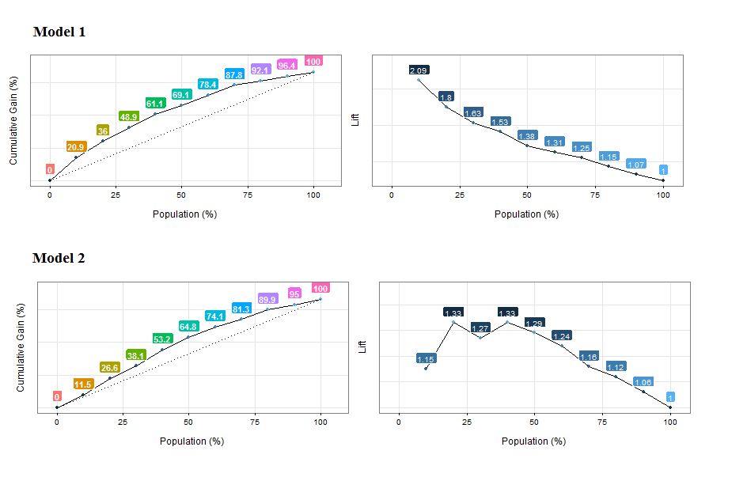
```

_[Enlarge image.](http://datascienceheroes.com/img/blog/model_comparison.png)_

<br>


**Cumulative Gain Analysis**: Model 1 reaches the ~20% of positive cases around the 10% of the population, while model 2 reaches a similar proportion approaching the 20% of the population. _Model 1 is better._

**Lift analysis**: Same as before, but also it is suspicious that not every lift number follow a decreasing pattern. Maybe the model is not ordering the first percentiles of the population.
 Same ordering concepts as seen in [Profiling target using cross_plot](#profiling_target_cross_plot) chapter.
 
 
<br>

---

```{r, echo=FALSE}
 
```

---

<br>
 
## Scoring Data {#scoring_data}

### The intuition behind

Events can occur, or not... although we don't have _tomorrow's newspaper_ `r emo::ji("newspaper")`, we can make a good guess about how is it going to be.

```{r error-curve, echo=FALSE, out.width="170px"}

```


The future is undoubtedly attached to *uncertainty*, and this uncertainty can be estimated.

<br>

#### And there are differents targets...

For now, this book will cover the classical: `Yes`/`No` target -also known as binary or multiclass prediction.

So, this estimation is the _value of truth_ of an event to happen, therefore a probabilistic value between 0 and 1.

#### Two-label vs. multi-label outcome

Please note this chapter is written for a binary outcome (two-label outcome), but **multi-label** target can be seen as a general approach of a binary class.

For example, having a target with 4 different values, there can be 4 models that predict the likelihood of belonging to particular class, or not. And then a higher model which takes the results of those 4 models and predict the final class.


<br>

#### Say what? `r emo::ji("hushed")`

Some examples:
- Is this client going to buy this product?
- Is this patient going to get better?
- Is certain event going to happen in the next few weeks? 

The answers to these last questions are True or False, but **the essence is to have a score**, or a number indicating the likelihood of a certain event to happen.

<br>

#### But we need more control...

Many machine learning resources show the simplified version -which is good to start- getting the final class as an output. Let's say:

Simplified approach:

* Question: _Is this person going to have a heart disease?_ 
* Answer: "No"

But there is something else before the "Yes/No" answer, and this is the score:

* Question: _What is the likelihood for this person of having heart disease?_
* Answer: "25%"

<br>

So first we get the score, and then according to our needs we set the **cut point**. And this is **really** important.


### Let see an example

```{r scoring-1, echo=FALSE, out.width="100%", fig.cap="Simple dataset example", out.extra='' }
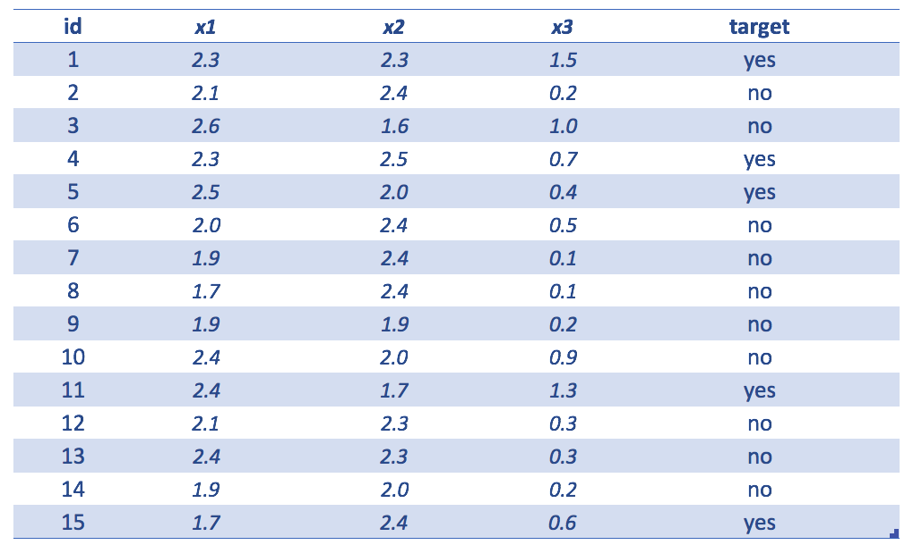
```

Example table showing the following

* `id`=identity
* `x1`,`x2` and `x3` input variables
* `target`=variable to predict


```{r scoring-machine-learning, echo=FALSE, out.width="50%", fig.cap="Getting the score (predictive model output)", out.extra=''}
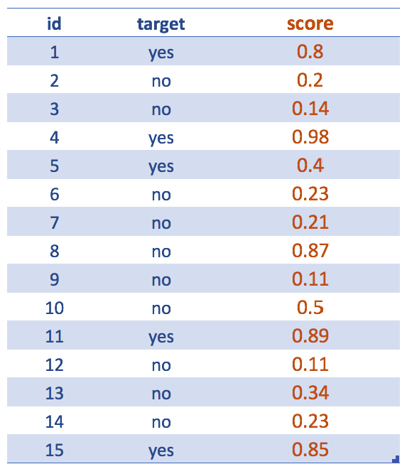
```


Forgetting about input variables... After the creation of the predictive model, like a random forest, we are interested in the **scores**. Even though our final goal is to deliver a `yes`/`no` predicted variable.


For example, the following 2 sentences express the same: _The likelihood of being `yes` is `0.8`_ <=> _The probability of being `no` is `0.2`_

Maybe it is understood, but the score usually refers to the less representative class: `yes`.

--- 

`r emo::ji("raised_hand")` **R Syntax** -_skip it if you don't want to see code_-

Following sentence will return the score:

`score = predict(randomForestModel, data, type = "prob")[, 2]`

Please note for other models this syntax may vary a little, but the concept **will remain the same**. Even for other languages.

Where `prob` indicates we want the probabilities (or scores). 

The `predict` function + `type="prob"` parameter returns a matrix of 15 rows and 2 columns: the 1st indicates the likelihood of being `no` while the 2nd one shows the same for class `yes`.

Since target variable can be `no` or `yes`, the `[, 2]` return the likelihood of being -in this case- `yes` (which is the complement of the `no` likelihood).

--- 

<br>

### It's all about the cut point `r emo::ji("straight_ruler")`


```{r scoring-machine-learning-9, echo=FALSE, out.width="50%", fig.cap="Cases ordered by highest score", out.extra=''}
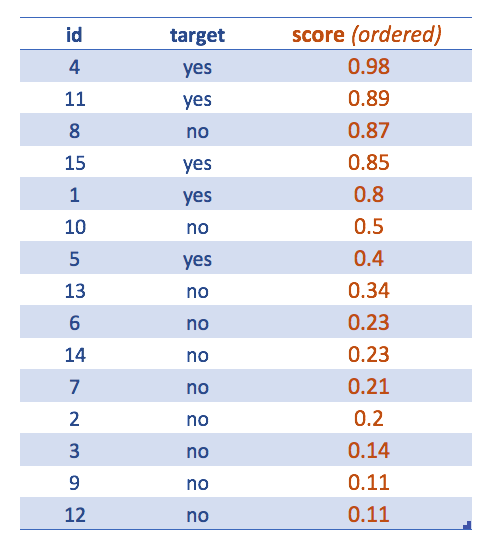
```

Now the table is ordered by descending score.

This is meant to see how to extract the final class having by default the cut point in `0.5`. Tweaking the cut point will lead to a better classification.

> Accuracy metrics or the confusion matrix are always attached to a certain cut point value.

<br>

After assigning the cut point, we can see the classification results getting the famous: 

* `r emo::ji("white_check_mark")` **True Positive** (TP): It's _true_, that the classification is _positive_, or, "the model hit correctly the positive (`yes`) class".
* `r emo::ji("white_check_mark")` **True Negative** (TN): Same as before, but with negative class (`no`).
* `r emo::ji("x")` **False Positive** (FP): It's _false_, that the classification is _positive_, or, "the model missed, it predicted `yes` but the result was `no`
* `r emo::ji("x")` **False Negative** (FN): Same as before, but with negative class, "the model predicted negative, but it was positive", or, "the model predicted `no`, but the class was `yes`"


```{r scoring-machine-learning-2, echo=FALSE, out.width="100%", fig.cap="Assigning the predicted label (cutoff=0.5)", out.extra='' }
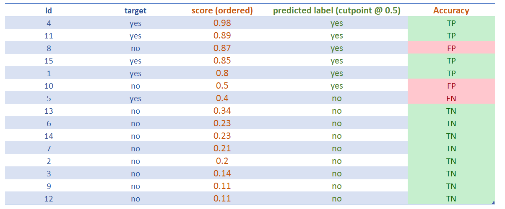
```


<br>

### The best and the worst scenario

Just like Zen does, the analysis of the extremes will help to find the middle point.

`r emo::ji("thumbsup")` The best scenario is when **TP** and **TN** rates are 100%. That means the model correctly predicts all the `yes` and all the `no`; _(as a result, **FP** and **FN** rates are 0%)_.

But wait `r emo::ji("raised_hand")` ! If we find a perfect classification, probably it's because of overfitting!

`r emo::ji("thumbsdown")` The worst scenario -the opposite to last example- is when **FP** and **FN** rates are 100%. Not even randomness can achieve such an awful scenario. 

_Why?_ If the classes are balanced, 50/50, flipping a coin will assert around half of the results. This is the common baseline to test if the model is better than randomness.

<br>

In the example provided, class distribution is 5 for `yes`, and 10 for `no`; so: 33,3% (5/15) is `yes`. 

<br>

---

### Comparing classifiers

#### Comparing classification results

`r emo::ji("question")` **Trivia**: Is a model which correcltly predict this 33.3% (TP rate=100%) a good one?

_Answer_: It depends on how many 'yes', the model predicted. 

<br>
A classifier that always predicts `yes`, will have a TP of 100%, but is absolutely useless since lots of `yes` will be actually `no`. As a matter of fact, FP rate will be high.


#### Comparing ordering label based on score 

A classifier must be trustful, and this is what **ROC** curves measures when plotting the TP vs FP rates. The higher the proportion of TP over FP, the higher the Area Under Roc Curve (AUC) is.

The intuition behind ROC curve is to get an **sanity measure** regarding the **score**: how well it orders the label. Ideally, all the positive labels must be at the top, and the negative ones at the bottom. 


<br>

```{r scoring-machine-learning-3, echo=FALSE, out.width="100%", fig.cap="Comparing two predictive model scores", out.extra=''}
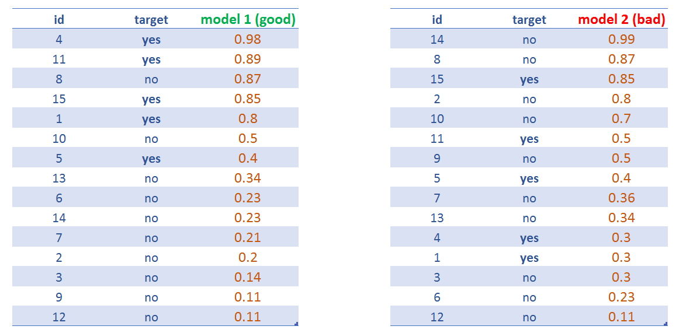
```

<br>

`model 1` will have a higher AUC than `model 2`.

Wikipedia has an extensive and good article on this: https://en.wikipedia.org/wiki/Receiver_operating_characteristic

There is the comparission of 4 models, given a cutpoint of 0.5:

```{r roc-curve-machine-learning, echo=FALSE, out.width="100%", fig.cap="Comparing four predictive models", out.extra=''}
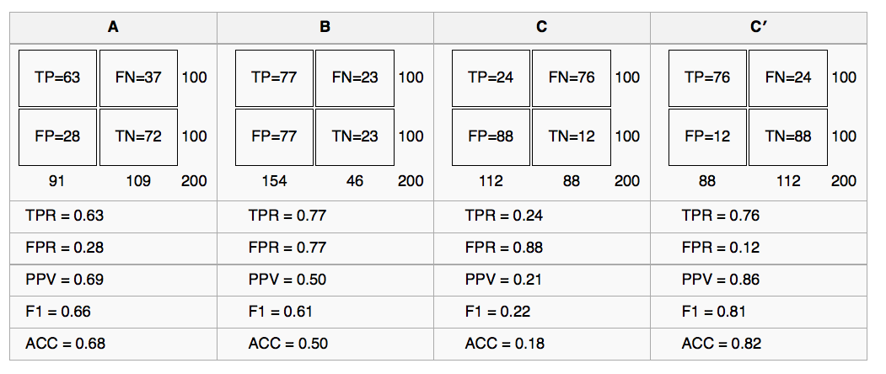
```


<br>

---

### Hands on R!

We'll be analyzing three scenarios based on different cut-points.

```{r, eval=FALSE}

# install.packages("rpivotTable") 
# rpivotTable: it creates a pivot table dinamically, it also supports plots, more info at: https://github.com/smartinsightsfromdata/rpivotTable

library(rpivotTable)

## reading the data
data=read.delim(file="https://goo.gl/ac5AkG", sep="\t", header = T, stringsAsFactors=F)

```

#### Scenario 1: cut point @ `0.5`

Classical confusion matrix, indicating how many cases fall in the intersection of real vs predicted value:

```{r, eval=FALSE}
data$predicted_target=ifelse(data$score>=0.5, "yes", "no")

rpivotTable(data = data, rows = "predicted_target", cols="target", aggregatorName = "Count", rendererName = "Table", width="100%", height="400px")

```


```{r Scoring-machine-learning-5, echo=FALSE, out.width="85%", fig.cap="Confusion matrix (metric: count)", out.extra=''}
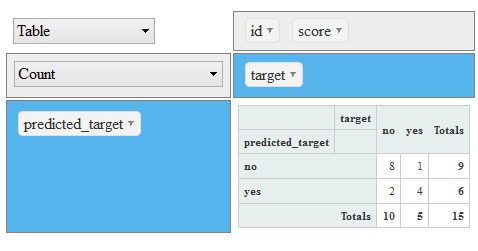
```


Another view, now each column sums **100%**. Good to answer the following questions: 


```{r, eval=FALSE, fig.cap="Confusion matrix (metric: percentage per column)", out.extra=''}
rpivotTable(data = data, rows = "predicted_target", cols="target", aggregatorName = "Count as Fraction of Columns", rendererName = "Table", width="100%", height="400px")

```


```{r Scoring-machine-learning-6, echo=FALSE, out.width="85%", fig.cap="Confusion matrix  (cutpoint at 0.5)", out.extra=''}
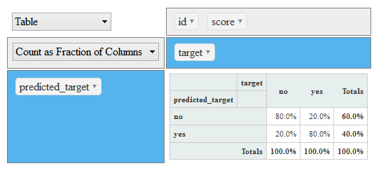
```

* _What is the percentage of real `yes` values captured by the model? Answer: 80%_ Also known as **Precision** (PPV)
* _What is the percentage of `yes` thrown by the model? 40%._ 

So, from the last two sentences: 

**The model throws 4 out of 10 predictions as `yes`, and from this segment -the `yes`- it hits 80%.**

<br>

Another view: The model correctly hits 3 cases for each 10 `yes` predictions _(0.4/0.8=3.2, or 3, rounding down)_.

Note: The last way of analysis can be found when building an association rules (market basket analysis), and a decision tree model.

<br>

#### Scenario 2: cut point @ `0.4`

Time to change the cut point to `0.4`, so the amount of `yes` will be higher:

```{r, eval=FALSE}
data$predicted_target=ifelse(data$score>=0.4, "yes", "no")

rpivotTable(data = data, rows = "predicted_target", cols="target", aggregatorName = "Count as Fraction of Columns", rendererName = "Table", width="100%", height="400px")

```

```{r Scoring-machine-learning-7, echo=FALSE, out.width="85%", fig.cap="Confusion matrix (cutpoint at 0.4)", out.extra=''}
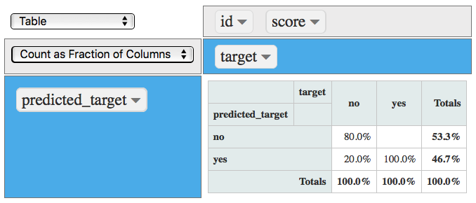
```


Now the model captures `100%` of `yes` (TP), so the total amount of `yes` produced by the model increased to `46.7%`, but at no cost since the *TN and FP remained the same* :thumbsup:. 

<br>

#### Scenario 3: cut point @ `0.8`

Want to decrease the FP rate? Set the cut point to a higher value, for example: `0.8`, which will cause the `yes` produced by the model decreases:

```{r, eval=FALSE}
data$predicted_target=ifelse(data$score>=0.8, "yes", "no")

rpivotTable(data = data, rows = "predicted_target", cols="target", aggregatorName = "Count as Fraction of Columns", rendererName = "Table", width="100%", height="400px")

```

```{r scoring-machine-learning-8, echo=FALSE, out.width="85%", fig.cap="Confusion matrix (cutpoint at 0.8)", out.extra=''}
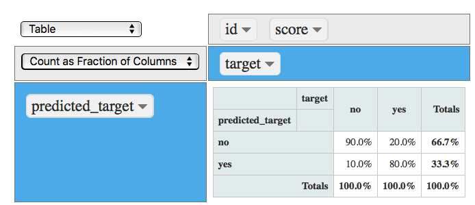
```


<br>

Now the FP rate decreased to `10%` (from `20%`), and the model still captures the `80%` of TP which is the same rate as the one obtained with a cut point of `0.5` :thumbsup:.

**Decreasing the cut point to `0.8` improved the model at no cost.**

<br>

### Conclusions

* This chapter has focused on the essence of predicting a binary variable: To produce a score or likelihood number which **orders** the target variable.

* A predictive model maps the input with the output.

* There is not a unique and best **cut point value**, it relies on the project needs, and is constrained by the rate of `False Positive` and `False Negative` we can accept. 

This book addresses general aspects on model performance in [Knowing the error](#knowing_the_error).

---

```{r, echo=FALSE}
 
```

---
