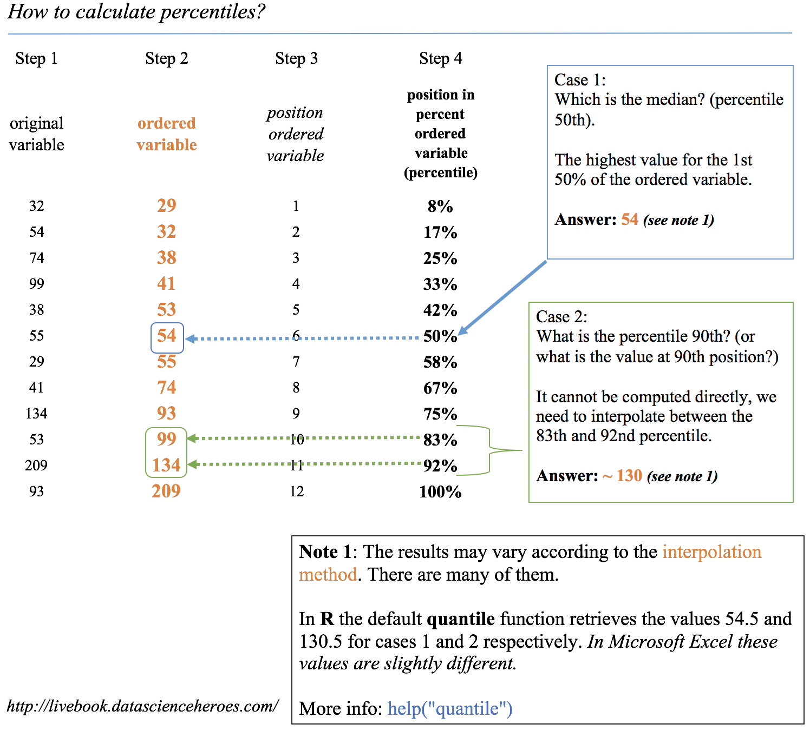
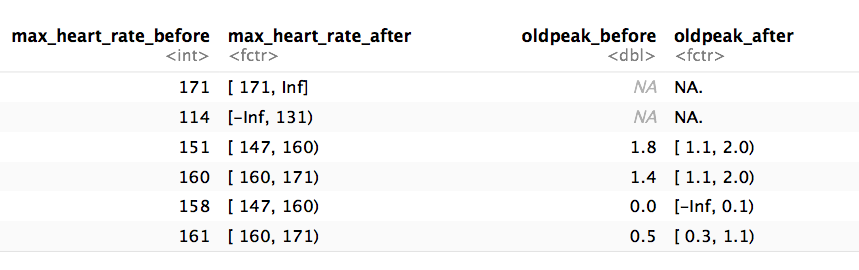

```{r include = FALSE}
if(!knitr:::is_html_output())
{
  options("width"=56)
  knitr::opts_chunk$set(tidy.opts=list(width.cutoff=56, indent = 2), tidy = TRUE)
  knitr::opts_chunk$set(fig.pos = 'H')
}
```

# APPENDIX {#appendix}

Complementary reading.


## The magic of percentiles {#appendix-percentiles}

Percentile is such a crucial concept in data analysis that we are going to cover it extensively in this book. It considers each observation with respect to others. An isolated number may not be meaningful, but when it is compared with others the distribution concept appears.

Percentiles are used in profiling as well as evaluating the performance of a predictive model.

<br>

```{r how-to-calculate-percentiles, echo=FALSE, out.width="100%", fig.cap="How to calculate percentiles", out.extra=''}

```


<br>

**The dataset, an advice before continue:**

This contains many indicators regarding world development. Regardless the profiling example, the idea is to provide a ready-to-use table for sociologists, researchers, etc. interested in analyzing this kind of data.

The original data source is: <a href="http://databank.worldbank.org/data/reports.aspx?source=2&Topic=11#" target="blank">http://databank.worldbank.org</a>. There you will find a data dictionary that explains all the variables.

In this section we'll be using a table which is already prepared for analysis. The complete step-by-step data preparation is in [Profiling](#profiling) chapter.

Any indicator meaning can be checked in data.worldbank.org. For example, if we want to know what `EN.POP.SLUM.UR.ZS` means, then we type: http://data.worldbank.org/indicator/EN.POP.SLUM.UR.ZS


<br>

### How to calculate percentiles

There are several methods to get the percentile. Based on interpolations, the easiest way is to order the variable ascendantly, selecting the percentile we want (for example, 75%), and then observing _what is the maximum value if we want to choose the 75% of the ordered population_.

Now we are going to use the technique of keeping a small sample so that we can have maximum control over _what is going on_ behind the calculus.

We retain the random 10 countries and print the vector of `rural_poverty_headcount` which is the variable we are going to use.

```{r, tidy=FALSE, warning=FALSE, message=FALSE}
library(dplyr)

data_world_wide =
  read.delim(file="https://goo.gl/NNYhCW", 
             header = T
             )

```

```{r}
data_sample=filter(data_world_wide, Country.Name %in% c("Kazakhstan", "Zambia", "Mauritania", "Malaysia", "Sao Tome and Principe", "Colombia", "Haiti", "Fiji", "Sierra Leone", "Morocco")) %>% arrange(rural_poverty_headcount)

select(data_sample, Country.Name, rural_poverty_headcount)
```

Please note that the vector is ordered only for didactic purposes. _As we said in the Profiling chapter, our eyes like order._ 

Now we apply the `quantile` function on `rural_poverty_headcount` variable (the percentage of the rural population living below the national poverty lines): 

```{r}
quantile(data_sample$rural_poverty_headcount)
```

**Analysis**

* **Percentile 50%**: 50% of the countries (five of them) have a `rural_poverty_headcount` below `51.7` We can check this in the last table: these countries are: Fiji, Colombia, Morocco, Kazakhstan, and Malaysia.
* **Percentile 25%**: 25% of the countries are below 20.87. Here we can see an interpolation because 25% represents ~2.5 countries. If we use this value to filter the countries, then we'll get three countries: Morocco, Kazakhstan, and Malaysia.

More information about the different types of quantiles and their interpolations: `help("quantile")`.

#### Getting semantical descriptions

From the last example we can state that: 

* _"Half of the countries have as much as 51.7% of rural poverty"_
* _"Three-quarters of the countries have a maximum of 64.4% regarding its rural poverty"_ (based on the countries ordered ascendantly).

We can also think of **using the opposite**: 

* _"A quarter of the countries that exhibit the highest rural poverty values have a percentage of at least 64.4%."_


### Calculating custom quantiles 

Typically, we want to calculate certain quantiles. The example variable will be the `gini_index`

**What is the Gini index?**
  
It is a measure of income or wealth inequality.

* A Gini coefficient of **zero** expresses **perfect equality** where all values are the same (for example, where everyone has the same income). 
* A Gini coefficient of **1** (or 100%) expresses **maximal inequality** among values (e.g., for a large number of people, where only one person has all the income or consumption while all others have none, the Gini coefficient will be very nearly one).

Source: https://en.wikipedia.org/wiki/Gini_coefficient

**Example in R**:

If we want to get the 20, 40, 60, and 80th quantiles of the Gini index variable, we use again the `quantile` function. 

The `na.rm=TRUE` parameter is necessary if we have empty values like in this case:

```{r, warning=FALSE}
# We also can get multiple quantiles at once
p_custom=quantile(data_world_wide$gini_index, probs = c(0.2, 0.4, 0.6, 0.8), na.rm=TRUE)
p_custom
```


### Indicating where most of the values are

In descriptive statistics, we want to describe the population in general terms. We can speak about ranges using two percentiles. Let's take the percentiles 10 and 90th to describe 80% of the population.


_The poverty ranges from 0.075% to 54.4% in 80% of the countries_. (80% because we did 90th–10th, focusing on the middle of the population.)

If we consider the 80% as the majority of the population, then we could say: _"Normally (or in general terms), poverty goes from 0.07% to 54.4%"_. This is a semantical description.

We looked at 80% of the population, which seems a good number to describe where most of the cases are. We also could have used the 90% range (percentile 95th - 0.5th). 

#### Is percentile related to quartile?

**Quartile** is a formal name for the 25, 50, and 75th percentiles (quarters or 'Q'). If we look at the 50% of the population, we need to subtract the 3rd quartile (or 75th percentile) from the 1st quartile (25th percentile) to get where 50% of data are concentrated, also known as the **inter-quartile range** or IQR.


Percentile vs. quantile vs. quartile

```
0 quartile = 0 quantile = 0 percentile
1 quartile = 0.25 quantile = 25 percentile
2 quartile = .5 quantile = 50 percentile (median)
3 quartile = .75 quantile = 75 percentile
4 quartile = 1 quantile = 100 percentile
```

Credits: [@perc_quan_quar].

### Visualizing quantiles

Plotting a histogram alongisde the places where each percentile is can help us understand the concept:

```{r, profiling-numerical-variable, warning=FALSE, message=FALSE, fig.height=3.5, fig.width=5, tidy=FALSE, fig.cap="Visualizing quantiles", out.extra=''}
quantiles_var = 
  quantile(data_world_wide$poverty_headcount_1.9, 
           c(0.25, 0.5, 0.75), 
           na.rm = T
           )

df_p = data.frame(value=quantiles_var, 
                quantile=c("25th", "50th", "75th")
                )

library(ggplot2)
ggplot(data_world_wide, aes(poverty_headcount_1.9)) + 
  geom_histogram() +
  geom_vline(data=df_p, 
             aes(xintercept=value, 
                 colour = quantile),
             show.legend = TRUE, 
             linetype="dashed"
             ) + 
  theme_light()

```

If we sum all the gray bars before the 25th percentile, then it will be around the height of the gray bars sum after the 75th percentile. 

In the last plot, the IQR appears between the first and the last dashed lines and contains 50% of the population.

### Rank and top/bottom '_X%_' concepts

The ranking concept is the same as the one seen in competitions. It allows us to answer _what is the country with the highest rate in variable pop_living_slums?_

We'll use the `dense_rank` function from the `ggplot2` package. It assigns the position (rank) to each country, but we need them in reverse order; that is, we assign the `rank = 1` to the highest value.

Now the variable will be: _Population living in slums is the proportion of the urban population living in slum households. A slum household is defined as a group of individuals living under the same roof and lacking one or more of the following conditions: access to improved water, access to improved sanitation, sufficient living area, and durability of housing._ 

The question to answer: _What are the top six countries with the highest rates of people living in slums?_

```{r, tidy=FALSE}
# Creating rank variable 
data_world_wide$rank_pop_living_slums = 
  dense_rank(-data_world_wide$pop_living_slums) 
```

```{r}
# Ordering data by rank
data_world_wide=arrange(data_world_wide, rank_pop_living_slums)

# Printing the first six results
select(data_world_wide, Country.Name, rank_pop_living_slums) %>% head(.) 
```

We can also ask: _In which position is Ecuador?_

```{r}
filter(data_world_wide, Country.Name=="Ecuador") %>% select(rank_pop_living_slums)
```


##### Top and bottom 'X%' concepts

Other questions that we may be interested in answering: _What is the value for which I get the top 10% of lowest values?_

The 10th percentile is the answer:

```{r}
quantile(data_world_wide$pop_living_slums, probs=.1, na.rm = T)
```

Working on the opposite: _What is the value for which I get the bottom 10% of highest values?_

The 90th percentile is the answer, we can filter all the cases above this value:

```{r}
quantile(data_world_wide$pop_living_slums, 
         probs=.9, 
         na.rm = T
         ) 
```


### Percentile in scoring data

There are two chapters that use this concept: 

* [Data Scoring](#data_scoring)
* [Gain and Lift Analysis](#gain_and_lift)

The basic idea is to develop a predictive model that predicts a binary variable (`yes`/`no`). Suppose we need to score new cases, for example, to use in a marketing campaign. The question to answer is:

_What is the score value to suggest to sales people in order to capture 50% of potential new sales?_ The answer comes from a combination of percentile analysis on the scoring value plus the cumulative analysis of the current target.

```{r gain-lift-curve, echo=FALSE, out.width="80%", fig.cap="Gain and lift curves (model performance)", out.extra=''}
knitr::include_graphics("model_performance/gain_curve.png")
```

<br>

#### Case study: distribution of wealth

The distribution of wealth is similar to the Gini index and is focused on inequality. It measures owner assets (which is different from income), making the comparison across countries more even to what people can acquire according to the place where they live. 
For a better definition, please go to the _Wikipedia_ article and _Global Wealth Report 2013_. Refs. [@distr_wealth] and [@global_wealth] respectively.

Quoting _Wikipedia_ (Ref. [@distr_wealth]):

> half of the world's wealth belongs to the top 1% of the population;

> the top 10% of adults hold 85% while the bottom 90% hold the remaining 15% of the world's total wealth; and

> the top 30% of adults hold 97% of the total wealth.

Just as we did before, from the third sentence we can state that: _"3% of total wealth is distributed to 70% of adults."_

The metrics `top 10%` and `top 30%` are the quantiles `0.1` and `0.3.` Wealth is the numeric variable.

<br>

  
---

```{r, echo=FALSE}
knitr::include_graphics("introduction/spacer_bar.png") 
```

---

<br>

## `funModeling` quick-start

This package contains a set of functions related to exploratory data analysis, data preparation, and model performance. It is used by people coming from business, research, and teaching (professors and students).

`funModeling` is intimately related to this book, in the sense that most of its functionality is used to explain different topics addressed by the book.

### Opening the black-box 

Some functions have in-line comments so the user can open the black-box and learn how it was developed, or to tune or improve any of them. 

All the functions are well documented, explaining all the parameters with the help of many short examples. R documentation can be accessed by: `help("name_of_the_function")`.


**Important changes from latest version 1.6.7**, (relevant only if you were using previous versions):

From the latest version, 1.6.7 (Jan 21-2018), the parameters `str_input`, `str_target` and `str_score` will be renamed to `input`, `target` and `score` respectively. The functionality remains the same. If you were using these parameters names on production, they will be still working until next release. this means that for now, you can use for example `str_input` or `input`.

The other importat change was in `discretize_get_bins`, which is detailed later in this document.

<br>

#### About this quick-start

This quick-start is focused only on the functions. All explanations around them, and the how and when to use them, can be accessed by following the "_**Read more here.**_" links below each section, which redirect you to the book.

Below there are most of the `funModeling` functions divided by category.

### Exploratory data analysis

#### `df_status`: Dataset health status

Use case: analyze the zeros, missing values (`NA`), infinity, data type, and number of unique values for a given dataset.

```{r, message=FALSE, warning=FALSE}
library(funModeling)

df_status(heart_disease)
```

[`r emo::ji("mag_right")` [**Read more here.**](#dataset-health-status)]

<br>


#### `plot_num`: Plotting distributions for numerical variables

Plots only numeric variables.

```{r, fig.height=3, fig.width=5, fig.cap="plot num: visualizing numerical variables", out.extra=''}
plot_num(heart_disease)
```

Notes:

* `bins`: Sets the number of bins (10 by default).
* `path_out` indicates the path directory; if it has a value, then the plot is exported in jpeg. To save in current directory path must be dot: "."

[`r emo::ji("mag_right")` [**Read more here.**](#plotting-numerical-variable)]


<br>

#### `profiling_num`: Calculating several statistics for numerical variables

Retrieves several statistics for numerical variables.

```{r}
profiling_num(heart_disease)
```

Note: 

* `plot_num` and `profiling_num` automatically exclude non-numeric variables

[`r emo::ji("mag_right")` [**Read more here.**](#numerical-profiling-in-r)]

<br>

#### `freq`: Getting frequency distributions for categoric variables 

```{r distribution-categorical-variable, message=FALSE, fig.height=3, fig.width=5, warning=FALSE, fig.cap="freq: visualizing categorical variables", out.extra=''}
library(dplyr)

# Select only two variables for this example
heart_disease_2=heart_disease %>% select(chest_pain, thal)

# Frequency distribution
freq(heart_disease_2)
```


Notes: 

* `freq` only processes `factor` and `character`, excluding non-categorical variables. 
* It returns the distribution table as a data frame.
* If `input` is empty, then it runs for all categorical variables.
* `path_out` indicates the path directory; if it has a value, then the plot is exported in jpeg. To save in current directory path must be dot: "."
* `na.rm` indicates if `NA` values should be excluded (`FALSE` by default).

[`r emo::ji("mag_right")` [**Read more here.**](#profiling-categorical-variables)]


<br>

### Correlations 

#### `correlation_table`: Calculates R statistic

Retrieves R metric (or Pearson coefficient) for all numeric variables, skipping the categoric ones. 

```{r}
correlation_table(heart_disease, "has_heart_disease")
```

Notes: 

* Only numeric variables are analyzed. Target variable must be numeric.
* If target is categorical, then it will be converted to numeric.

[`r emo::ji("mag_right")` [**Read more here.**](#linear-correlation)]


<br>

#### `var_rank_info`: Correlation based on information theory

Calculates correlation based on several information theory metrics between all variables in a data frame and a target variable.

```{r}
var_rank_info(heart_disease, "has_heart_disease")
```

Note: It analyzes numerical and categorical variables. It is also used with the numeric discretization method as before, just as `discretize_df`.


[`r emo::ji("mag_right")` [**Read more here.**](#select_features_var_rank_info)]


<br>

#### `cross_plot`: Distribution plot between input and target variable

Retrieves the relative and absolute distribution between an input and target variable. 
Useful to explain and report if a variable is important or not.

```{r profiling-variable-predictive-modeling, fig.height=4, fig.width=8, results=FALSE,fig.cap="cross plot: visualizing input vs. target variable", out.extra='',message=FALSE}
cross_plot(data=heart_disease, input=c("age", "oldpeak"), target="has_heart_disease")
```

Notes: 

* `auto_binning`: `TRUE` by default, shows the numerical variable as categorical.
* `path_out` indicates the path directory; if it has a value, then the plot is exported in jpeg.
* `input` can be numeric or categoric, and `target` must be a binary (two-class) variable.
* If `input` is empty, then it runs for all variables.

[`r emo::ji("mag_right")` [**Read more here.**](#profiling_target_cross_plot)]

<br>

#### `plotar`: Boxplot and density histogram between input and target variables

Useful to explain and report if a variable is important or not. 

**Boxplot:**

```{r boxplot-analysis, fig.height=2, fig.width=4, fig.cap="plotar (1): visualizing boxplot", out.extra=''}
plotar(data=heart_disease, input = c("age", "oldpeak"), target="has_heart_disease", plot_type="boxplot")
```

[`r emo::ji("mag_right")` [**Read more here.**](#target-profiling-using-boxplots)]

<br>

**Density histograms:**

```{r density-histogram, fig.height=2, fig.width=4,fig.cap="plotar (2): visualizing density histogram", out.extra=''}
plotar(data=mtcars, input = "gear", target="cyl", plot_type="histdens")
```

[`r emo::ji("mag_right")` [**Read more here.**](#target-profiling-using-density-histograms)]

Notes:

* `path_out` indicates the path directory; if it has a value, then the plot is exported in jpeg.
* If `input` is empty, then it runs for all numeric variables (skipping the categorical ones).
* `input` must be numeric and target must be categoric.
* `target` can be multi-class (not only binary).

<br>

#### `categ_analysis`: Quantitative analysis for binary outcome

Profile a binary target based on a categorical input variable, the representativeness (`perc_rows`) and the accuracy (`perc_target`) for each value of the input variable; for example, the rate of flu infection per country.

```{r}
df_ca=categ_analysis(data = data_country, input = "country", target = "has_flu")

head(df_ca)
```
    
Note: 

* `input` variable must be categorical.
* `target` variable must be binary (two-value).

This function is used to analyze data when we need to reduce variable cardinality in predictive modeling.

[`r emo::ji("mag_right")` [**Read more here.**](#high_cardinality_predictive_modeling)]


### Data preparation

#### Data discretization

##### `discretize_get_bins` + `discretize_df`: Convert numeric variables to categoric

We need two functions: `discretize_get_bins`, which returns the thresholds for each variable, and then `discretize_df`, which takes the result from the first function and converts the desired variables. The binning criterion is equal frequency.

Example converting only two variables from a dataset.

```{r}
# Step 1: Getting the thresholds for the desired variables: "max_heart_rate" and "oldpeak"
d_bins=discretize_get_bins(data=heart_disease, input=c("max_heart_rate", "oldpeak"), n_bins=5)
```

```{r, tidy=FALSE}
# Step 2: Applying the threshold to get the final 
# processed data frame
heart_disease_discretized = 
  discretize_df(data=heart_disease, 
                data_bins=d_bins, 
                stringsAsFactors=T
                )
```

The following image illustrates the result. Please note that the variable name remains the same.

```{r data-discretization, echo=FALSE, out.width="80%", fig.cap="Results of the automatic discretization process", out.extra=''}

```


Notes: 

* This two-step procedure is thought to be used in production with new data.
* Min and max values for each bin will be `-Inf` and `Inf`, respectively.
* A fix in the latest `funModeling` release (1.6.7) may change the output in certain scenarios. Please check the results if you were using version 1.6.6. More info about this change [here](https://s3.amazonaws.com/datascienceheroes.com/img/blog/changes_discretize_df.png).

[`r emo::ji("mag_right")` [**Read more here.**](#data-discretization)]


<br>

#### `convert_df_to_categoric`: Convert every column in a data frame to character variables

Binning, or discretization criterion for any numerical variable is equal frequency. Factor variables are directly converted to character variables.

```{r, results=FALSE, message=FALSE}
iris_char=convert_df_to_categoric(data = iris, n_bins = 5)

# checking first rows
head(iris_char)
```


#### `equal_freq`: Convert numeric variable to categoric

Converts numeric vector into a factor using the equal frequency criterion.

```{r}
new_age=equal_freq(heart_disease$age, n_bins = 5)

# checking results
Hmisc::describe(new_age)
```

[`r emo::ji("mag_right")` [**Read more here.**](#equal-frequency-binning)]

Notes:

* Unlike `discretize_get_bins`, this function doesn't insert `-Inf` and `Inf` as the min and max value respectively.

<br>

#### `range01`: Scales variable into the 0 to 1 range 

Convert a numeric vector into a scale from 0 to 1 with 0 as the minimum and 1 as the maximum.

```{r}
age_scaled=range01(heart_disease$oldpeak)

# checking results
summary(age_scaled)
```

<br>

### Outliers data preparation

#### `hampel_outlier` and  `tukey_outlier`: Gets outliers threshold

Both functions retrieve a two-value vector that indicates the thresholds for which the values are considered as outliers.
The functions `tukey_outlier` and `hampel_outlier` are used internally in `prep_outliers`.


**Using Tukey's method:**

```{r}
tukey_outlier(heart_disease$resting_blood_pressure)
```

[`r emo::ji("mag_right")` [**Read more here.**](#detecting-outliers-using-tukey-method)]

<br>

**Using Hampel's method:**

```{r}
hampel_outlier(heart_disease$resting_blood_pressure)
```

[`r emo::ji("mag_right")` [**Read more here.**](#detecting-outliers-using-hampel-method)]


<br>

#### `prep_outliers`: Prepare outliers in a data frame

Takes a data frame and returns the same data frame plus the transformations specified in the `input` parameter. It also works with a single vector.

Example considering two variables as input:

```{r}
# Get threshold according to Hampel's method
hampel_outlier(heart_disease$max_heart_rate)

# Apply function to stop outliers at the threshold values
data_prep=prep_outliers(data = heart_disease, input = c('max_heart_rate','resting_blood_pressure'), method = "hampel", type='stop')

```

Checking the before and after for variable `max_heart_rate`:

```{r, echo=FALSE}
# Checking max and min value for 'max_heart_rate' before the transformation
sprintf("Before transformation -> Min: %s; Max: %s", min(heart_disease$max_heart_rate), max(heart_disease$max_heart_rate))

# Apply function to stop outliers at the threshold values
data_prep=prep_outliers(data = heart_disease, input = c('max_heart_rate','resting_blood_pressure'), method = "hampel", type='stop')

# Checking the results, the maximum value is now 174.5 (the minimum remains the same)
# Checking max and min value for 'max_heart_rate' before the transformation
sprintf("After transformation -> Min: %s; Max: %s", min(data_prep$max_heart_rate), max(data_prep$max_heart_rate))

```

The min value changed from 71 to 86.23, while the max value remains the same at 202.

Notes:

* `method` can be: `bottom_top`, `tukey` or `hampel`.
* `type` can be: `stop` or `set_na`. If `stop` all values flagged as outliers will be set to the threshold. If `set_na`, then the flagged values will set to `NA`.

[`r emo::ji("mag_right")` [**Read more here.**](#how_to_deal_with_outliers_in_r)]


<br>

### Predictive model performance

#### `gain_lift`: Gain and lift performance curve

After computing the scores or probabilities for the class we want to predict, we pass it to the `gain_lift` function, which returns a data frame with performance metrics.

```{r predictive-model-performance, fig.height=3, fig.width=7, fig.cap="gain lift: visualizing predictive model performance", out.extra=''}
# Create machine learning model and get its scores for positive case 
fit_glm=glm(has_heart_disease ~ age + oldpeak, data=heart_disease, family = binomial)
heart_disease$score=predict(fit_glm, newdata=heart_disease, type='response')

# Calculate performance metrics
gain_lift(data=heart_disease, score='score', target='has_heart_disease')

```

[`r emo::ji("mag_right")` [**Read more here.**](#gain_and_lift)]

<br>


---

```{r, echo=FALSE}
knitr::include_graphics("introduction/spacer_bar.png")
```

---


