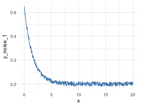
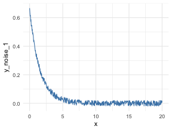

# Data Science Live Book


A book to learn data science, data analysis and machine learning, suitable for all ages!

## Introduction

This book covers common aspects in predictive modeling:

+  A. **Data Preparation** / **Data Profiling**
+  B. **Selecting best variables (dataviz)**
+  C. **Assessing model performance**
+  D. **Miscellaneous**

And it is heavly based on the `funModeling` package. Please install before starting:

`install.packages("funModeling")`


As you can see, model creation is not included, while _almost_ everything else does. 

Model creation consumes around **10%** of almost any predictive modeling project; `funModeling` will try to cover remaining 90%. 

It´s not only the function itself, but the explanation of how to interpret results. This brings a deeper understanding of **what is being done**, boosting the freedom to use that knowledge in other situations andor using languages.


## `funModeling` quick start


```r
## Loading funModeling !
suppressMessages(library(funModeling))

# loading data frame
data(heart_disease)
```

### Part A: Data Preparation / Profiling

When a new data set arrives...:


```r
df_status(heart_disease)
```

```
##                  variable q_zeros p_zeros q_na p_na q_inf p_inf    type
## 1                     age       0    0.00    0 0.00     0     0 integer
## 2                  gender       0    0.00    0 0.00     0     0  factor
## 3              chest_pain       0    0.00    0 0.00     0     0  factor
## 4  resting_blood_pressure       0    0.00    0 0.00     0     0 integer
## 5       serum_cholestoral       0    0.00    0 0.00     0     0 integer
## 6     fasting_blood_sugar     258   85.15    0 0.00     0     0  factor
## 7         resting_electro     151   49.83    0 0.00     0     0  factor
## 8          max_heart_rate       0    0.00    0 0.00     0     0 integer
## 9             exer_angina     204   67.33    0 0.00     0     0 integer
## 10                oldpeak      99   32.67    0 0.00     0     0 numeric
## 11                  slope       0    0.00    0 0.00     0     0 integer
## 12      num_vessels_flour     176   58.09    4 1.32     0     0 integer
## 13                   thal       0    0.00    2 0.66     0     0  factor
## 14 heart_disease_severity     164   54.13    0 0.00     0     0 integer
## 15           exter_angina     204   67.33    0 0.00     0     0  factor
## 16      has_heart_disease       0    0.00    0 0.00     0     0  factor
##    unique
## 1      41
## 2       2
## 3       4
## 4      50
## 5     152
## 6       2
## 7       3
## 8      91
## 9       2
## 10     40
## 11      3
## 12      4
## 13      3
## 14      5
## 15      2
## 16      2
```

And if there are some outliers... top or bottom values can be removed using:

```r
data_2=prep_outliers(data = heart_disease,  type='set_na', top_percent  = 0.01)
```


##### Full info at: 


### Part B: Selecting best variables (dataviz)

**Overview:** `cross_plot` discretizes input variable automatically exposing thei relationship against a target variable.


```r
cross_plot(data=heart_disease, str_input="age", str_target="has_heart_disease")
```

```
## [1] "Plotting transformed variable 'age' with 'equal_freq', (too many values). Disable with 'auto_binning=FALSE'"
```




```r
plotar(data=heart_disease, str_input="age", str_target="has_heart_disease", plot_type="histdens")
```



`plotar` and `cross_plot` can plot all numerical variables at once, as well as export each graph to a high quality _png image_.

##### Full info at: 

### Part C: Assessing model performance

Full info at: 

### Part D: Miscellaneous

##### Full info at: 


