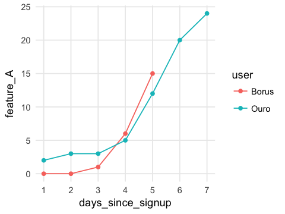
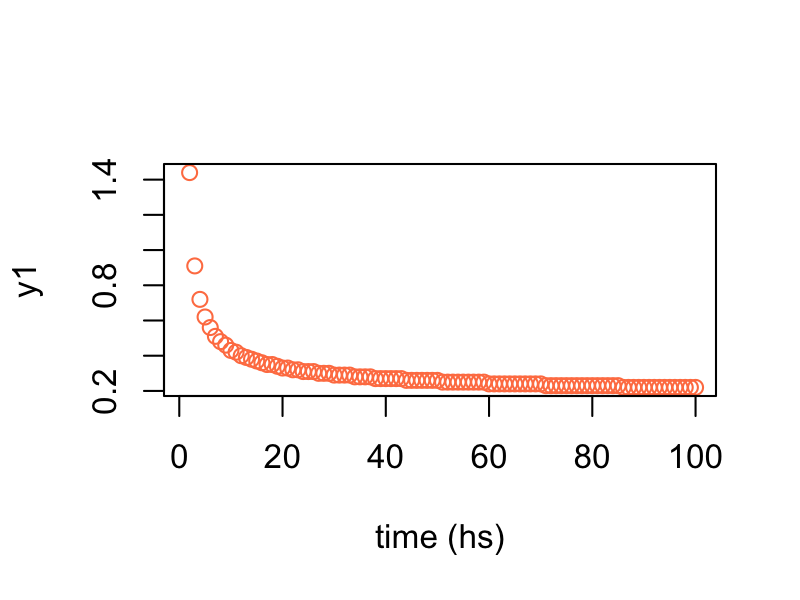
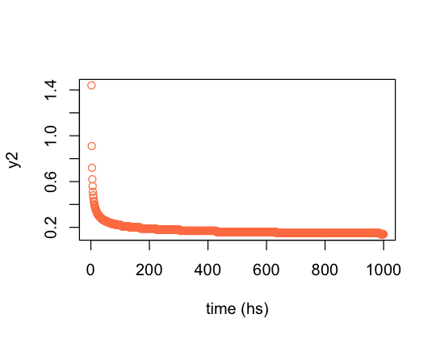
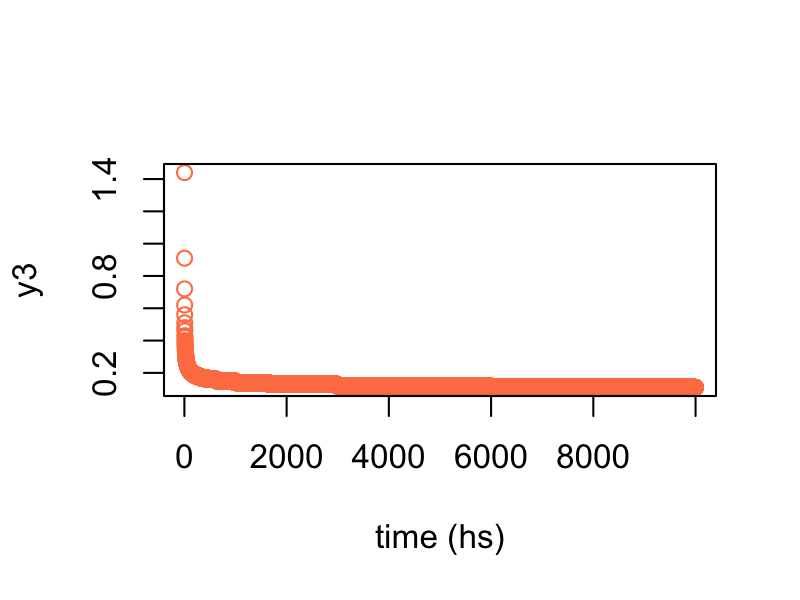

Considerations involving time
===

### What is this about?

In practice, 90% of the time is spent in data preparation.


### Don't use information from the future

 

Common mistake when starting a new predictive model project, for example:

Imagine we need to build a predictive model to know what users are likely to adquire full subscription in a web application, and this software has a ficticious feature called it `feature_A`:


```
##    user_id feature_A full_subscription
## 1        1       yes               yes
## 2        2       yes               yes
## 3        3       yes               yes
## 4        4        no                no
## 5        5       yes               yes
## 6        6        no                no
## 7        7        no                no
## 8        8        no                no
## 9        9        no                no
## 10      10        no                no
```


We build the predictive model, we got a perfect accuracy, and an inspection throws the following: _"100% of users that have full subscription, uses Feature A"_. Some predictive algorithms report variable importance, thus `feature_A` will be at the top.

**The problem is:** `feature_A` is only availble **after the user goes for full subcription**. Therefore it cannot be used.

**The key message is**: Don't trust in perfect variables, nor perfect models. 

<br>

### Play fair with data, let it to develop their behavior

Like in nature, things have a minimun and maximun time to start showing certain behavior. This time oscilates from 0 to infinite. In practice it's recommended to study what is the best period to analyze, in other words, we may exclude all the behavior before and after this observation period. To stablish cuts to data it's not so straight forward since it may be kind of subjective.

Imagine we've got a **numerical variable** which increases as time moves. We may need to define an **observation time window** to filter the data and feed the predictive model. 

* Setting the **minimun** time: How much time is it need to start seeing the behavior? 
* Setting the **maximun** time: How much time is it needed to see the end of the behavior? 

Eassiest solution is: setting minimun since begin, and the maximun as the whole history.


**Case study:** 

Two people, `Ouro` and `Borus`, are users of a web application which has certain functionalty called `feature_A`, and we need to build a predictive model which forecast based on `feature_A` usage  -measured in 'clicks", if the person is going to adcquire `full_subscription`.

The current data says: Borus has `full_subscription`, while Ouro doesn't. 




User `Borus` starts using `feature_A` from day 3, and after 5 days she has more use -15 vs 12 clicks- on this feature than `Ouro` who started using it from day 0. 

If `Borus` adcquiere `full subscription` and `Ouro` doesn't, _what would the model will learn?_ 

When modeling with full history -`days_since_signup = all`-, the higher the `days_since_signup` the higher the likelihood, since `Borus` has the highest number.

However, if we keep only with the user history corresponding to their first 5 days since signup, the conclussion is the opposite. 

_Why to keep first 5 days of history?_

The behavior in this kick-off period may be more relevant -in terms of prediction accuracy- than analyzing the whole history. It depends on each case as we said before. 


<br> 

### Fighting the inifinite


The number of examples in this topic is vast. Let's keep the esence of this chapter in **how data changes across time**. Sometimes it's straitforward, as a variable reaching its minimum (or max) after a fixed time length. This case is easily achievable.

On the other hand, it requiers the human being to fight the infinity.

Consider the following example. _How much hours are needed to reach the 0 value?_

How about 100 hours?



Hmmm let's check the minimum value.


```
## [1] "Min value after 100 hours: 0.22"
```

It's close to zero, but _what if we wait 1000 hours?_



```
## [1] "Min value after 1,000 hours: 0.14"
```

Hurra! We are approaching it! From `0.21` to `0.14` But what if we wait 10 times more? (10,000 hours)



```
## [1] "Min value after 10,000 hours: 0.11"
```

_Still no zero! How much time do I need?!_ 😱

As you may notice, it will probably reach the zero value in the inifinty... We are in the presence of an <a href="https://en.wikipedia.org/wiki/Asymptote" target="blank">Asymptote</a>.

_What do we have to do?_

<br>

#### Befriend the infinite

This answer may come from by working together the data scientist and domain experts. 

In this case a zero can be considered the same as the value which have the 95% of population. In statistics terms it the `0.95` <a href="https://en.wikipedia.org/wiki/Percentile" target="blank">**percentile**</a>. _By the way, this is a key topic in exploratory data analysis._

One way to **deal with outliers** is applying this cutting percentile criteria, as we saw in <a href="http://livebook.datascienceheroes.com/data_preparation/outliers_treatment.html" target="blank">treating outliers chapter</a>.

<br>

#### Examples in other areas

It's really common to find these kind of variables in many data sets or projects.

**In medicine**, the <a href="https://en.wikipedia.org/wiki/Survival_analysis" target="blank">survival analysis projects</a>, the doctors usually define a threshold of, for example, 3 years to consider that one patient _survive_ the treatment.

**In marketing projects**, if an user decreases its activity under a certain threshold, let's say:
* 10-clicks in company's web page during last month
* Not opening an email after 1-week
* If she (or he) don't buy after 30-days

Can be defined as a churned or lost opportunity customer.

**In customer support**, an issue can be marked as solved after the person don't complain during 1-week.

But this also happens in _"real life"_, like the case when we write a data science book suitable for all ages, how much time is it requiered to end it? An infinite amount? Probably not 😄.


<br>

### Final thoughts

Defining a time frame to create a training and validation set **is not a free-lunch** when the data is dynamic, as long as deciding how to handle variables that change over time. That's why the **Exploratory Data Analysis** is important in order to get in touch with the data we're analyzing. 

Many topics are inter-conected, such is the case of _letting the data to develop their behavior_, with the model perfomance <a href="http://livebook.datascienceheroes.com/model_performance/out_of_time_validation.html" target="blank">out-of-time validation</a>. 

The key concept here: **how to handle time in predictive modeling**. It's a good time to ask: _How would it be possible to handle this time issues with automatic systems?_ 

Human knowledge is crucial in these contexts to define thresholds based on the experience, intuition and some calculations.

<br>


