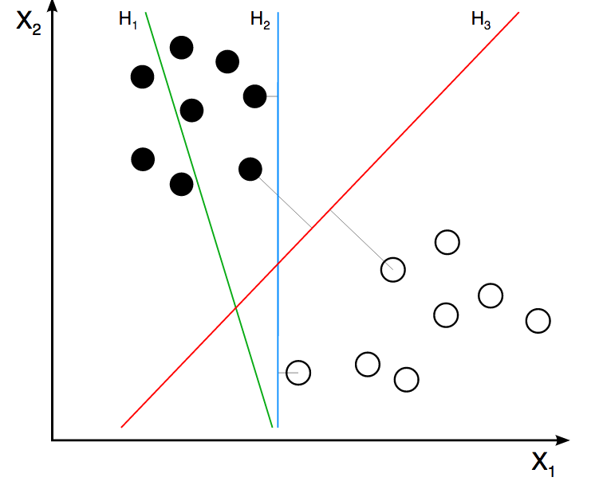

```{r ,results="hide", echo=FALSE}
library(knitr)
knitr::opts_chunk$set(out.width="600px", dpi=200)
knitr::opts_knit$set(base.dir = "data_preparation")
``` 

Handling Data Types
===

### What is this about?

One of the first things when we start a data project, is, to assign the correct data type for each variable. Although it seems straightforward, some algorithms work with certain data types. Here we'll try to cover these conversions explaining with examples the implications in each case.


<br>

**What are we going to review in this chapter?**

* Detecting the correct data type
* How to convert from categorical to numerical?
* How to convert from numerical to categorical? Discretization methods.
* Both from theoretical and practical aspects (examples in R).
* How a predictive model looks at numerical variables.

<br>


### The universe of data types

There are two main data types, **numerical** or **categorical**. Other names for categorical are: string and nominal.

A sub set of categorical is the ordinal, or as it is named in R, an **ordered** factor. At least in R, this type is only relevant when plotting categories in a certain order. An example in R:

```{r}
# Creating an ordinal, or ordered factor
var_factor=factor(c("3_high", "2_mid", "1_low"))
var_ordered=factor(var_factor, ordered = T)
var_ordered
```

Don't pay much attention to this data type, usually numerical and categorical are the most needed.

<br>

#### Binary variable, numerical or categorical?

This book suggests using binary variables as numeric when `0` is `FALSE`, and `1` is `TRUE`. This way makes easier to profile data. 

<br>

### Data types per algorithm

Some algorithms work:

* Only with categorical data
* Only with numerical data
* With both types

Add to last points, that not every predictive model handle *missing value*. 

The **Data Science Live Book** tries to cover all of these situations and more 😀.

<br>

### Converting categorical variables into numerical 

In R using `caret` package the task this straightforward, converting every categorical variable into a flag one, also known as a _dummy_ variable. After the conversion original categorical

If the original categorical variable has 2 possible values, it will result in 30 new columns holding the value `0` or `1`, when `1` represents the presence of that category in the row.

If we use package `caret` from R, this conversion only takes two lines of code:

```{r, message=FALSE}
library(caret) # contains dummyVars function
library(dplyr) # data munging library
library(funModeling) # df_status function
  
## Checking categorical variables
status=df_status(heart_disease, print_results = F)
filter(status,  type %in% c("factor", "character")) %>% select(variable)

## It converts all categorical variables (factor and character) into numerical
## skipping the original so the data is ready to use
dmy = dummyVars(" ~ .", data = heart_disease)
heart_disease_2 = data.frame(predict(dmy, newdata = heart_disease))

# Checking the new numerical data set:
colnames(heart_disease_2)
```

Original data `heart_disease` has been converted into `heart_disease_2` with no categorical variables. There are only numerical and dummy. Note every new variable has a _dot_ following by the _value_.

If we check the before and after for the 7th patient (row) in variable `chest_pain` which can take the values `1`, `2`, `3` or `4`:

```{r, message=FALSE}
# before
as.numeric(heart_disease[7, "chest_pain"])

# after
heart_disease_2[7, c("chest_pain.1", "chest_pain.2", "chest_pain.3", "chest_pain.4")]
```

Having kept and transformed only numeric variables, excluding the nominal ones, the data `heart_disease_2` is ready to be used.

<br>


### Is it categorical or numerical? Think about it

Consider `chest_pain` variable, which can take values `1`, `2`, `3` or `4`. Is this variable categorical or numerical?

If the values are ordered, it can be considered as numerical since it exhibits a **order**, i.e. 1 is less than 2, 2 is less than 3, and 3 is less than 4. 

If we create a decision tree model, we may find rules like: "`If chest_pain > 2.5 then...`". Does it make sense? The algorithm splits the variable by a value that is not present, `2.5`, but the interpretation is "if `chest_pain is equal or higher than 3`.

<br>

#### Thinking as an algorithm

Consider two numerical input variables and a target binary variable. The algorithm will _see_ both input variables as dots in a rectangle, considering that are infinite values between each number. 

For example, a **Supported Vector Machine** (SVM) will create _several_ vectors in order to separate the target variable class. It will **find regions** based on these vectors. How would it be possible to find these regions based on categorical variables? It isn't possible, that's why SVM only supports numerical variables. Same case as artificial neural networks.



_Image credit: ZackWeinberg._

The last image shows three lines, representing three different decision boundaries or regions.

For a quick introduction to this SVM concept, please go to this short video <a href=" https://www.youtube.com/watch?v=1NxnPkZM9bc" target="blank">SVM Demo</a>

However, if the model is a tree-based, like decision trees, random forest or gradient boosting machine, they handle both types since their search space can be regions (same as SVM), and categories. Like the rule "`if postal_code is AX441AG and age > 55 then...`".

Going back to the heart disease example, the variable `chest_pain` exhibits order. We should take advantage of it, if we convert this variable into one categorical, *we are losing information*, this is an important point when handling data types.

<br>

#### Is the solution to treat all as categorical?

No... A numerical variable carries more information than a nominal one because of its order. In categorical variables, the values cannot be compared. Let's say it's not possible to make a rule like `If postal code is higher than "AX2004-P"`.

The values of a nominal variable can be compared if we have another variable to use as a reference (usually an outcome to predict).  

I.e., postal code "AX2004-P" is _higher_ than "MA3942-H" because there are more people interested in attending to photography lessons.

Also there is the **high cardinallity** issue in categorical variable, for example a `postal code` variable containinig hundreds of different values. This book addressed it in both chapters: handling high categorical variable for <a href="http://livebook.datascienceheroes.com/data_preparation/high_cardinality_descriptive_stats.html" target="blank">descriptive statistics</a> and when we do <a href="http://livebook.datascienceheroes.com/data_preparation/high_cardinality_predictive_modeling.html" target="blank">predictive modelling</a>.

Anyway, you can do the _free test_ of converting all variables into categorical and see what happen. Comparing the results vs. keeping the numerical. Remember to use some good error measure for the test like Kappa or ROC statistic, and to cross-validate the results.

<br>

#### Be aware when converting categorical into numerical

Imagine we have a categorical variable, and we need to convert into one numerical. Same case as before, but trying a different **transformation**: assigning a different number to each category.

We have to be careful when doing such transformation because we are **introducing order** to the variable. 

Considering the following data example, having 4-rows. The first two variables are `visits` and `postal_code` this play either as two input variables or `visits` as input and `postal_code` as output.

The following code will show the `visits` depending on `postal_code` transformed according to two criteria:

* `transformation_1`: Assign a sequence number based on the given order.
* `transformation_2`: Assign a number based on the amount of `visits`.

````{r ,handling_data_types, warning=FALSE, fig.width=9, fig.height=3, out.width="600px", message=FALSE}
 creating data -toy- sample 
df_pc=data.frame(visits=c(10, 59, 27, 33), postal_code=c("AA1", "BA5", "CG3", "HJ1"), transformation_1=c(1,2,3,4), transformation_2=c(1, 4, 2, 3 ))

# printing table
knitr::kable(df_pc)

library(gridExtra)

# transformation 1
plot_1=ggplot(df_pc, aes(x=transformation_1, y=visits, label=postal_code)) +  geom_point(aes(color=postal_code), size=4)+ geom_smooth(method=loess, group=1, se=FALSE, color="lightblue", linetype="dashed") + theme_minimal()  + theme(legend.position="none") + geom_label(aes(fill = factor(postal_code)), colour = "white", fontface = "bold")
  

# transformation 2
plot_2=ggplot(df_pc, aes(x=transformation_2, y=visits, label=postal_code)) +  geom_point(aes(color=postal_code), size=4)+ geom_smooth(method=lm, group=1, se=FALSE, color="lightblue", linetype="dashed") + theme_minimal()  + theme(legend.position="none") + geom_label(aes(fill = factor(postal_code)), colour = "white", fontface = "bold")
  
# arranging plots side by side
grid.arrange(plot_1, plot_2, ncol=2)
```

For sure, nobody does a predictive model with only 4 rows, but the intention of this example is to show how the relationship changes from non-linear (`transformation_1`) to another linear (`transformation_2`).  Making the things easier to the predictive model, as well as explaining the relationship.

This effect is the same when we handle millions of rows and the number of variables scale to hundreds. Learning from small data is a right approach in these cases.


<br>

### Discretizing numerical variable 

Or, converting it into one categorical by split it into bins. For a fancy definition, we can quote Wikipedia: _Discretization concerns the process of transferring continuous functions, models, and equations into discrete counterparts._ 

Bins is also known as buckets or segments. Let's continue with the examples.

#### About the data 

It contains information regarding the percentage of childer being stunted. The ideal value is zero.

> The indicator reflects the share of children younger than 5 who suffer from stunting, Children with stunted growth are at greater risk for illness and death.

Data source:<a href="https://ourworldindata.org/hunger-and-undernourishment/#undernourishment-of-children" target="blank">ourworldindata.org, hunger and undernourishment</a>. 

First of all, we have to do a quick **data prepration**. Each row represents a country-year pair, so we have to get the most recent indicator per country. 

```{r equal_range_discretization_a}
data_stunting=read.csv(file = "https://raw.githubusercontent.com/pablo14/data-science-live-book/master/data_preparation/share-of-children-younger-than-5-who-suffer-from-stunting.csv", header = T, stringsAsFactors = F)

## ranaming the metric
data_stunting=rename(data_stunting, share_stunted_child=WHO....Share.of.stunted.children.under.5.)

## doing the grouping mentioned before
data_stunting_grouped = group_by(data_stunting, Entity) %>% filter(Year == max(Year)) %>% summarise(share_stunted_child=max(share_stunted_child))

```

The most standard binning criteria are:

<br>


#### Equal range

This is common to find in histograms and looking its distribution, but it's highly susceptible to outliers. To create, for example, 4 bins it takes the min and the max value and divides by 4. 


```{r, equal_range_discretization, fig.width=4, fig.height=3}
# funModeling contains equal_freq (discretization)
library(funModeling)

# ggplot2 it provides 'cut_interval' function used to split the variable based on equal range criteria
library(ggplot2) 

## Creating equal range variable, add `dig.lab=9` parameter to deactivate scientific notation, same goes to `cut` function.
data_stunting_grouped$share_stunted_child_eq_range=cut_interval(data_stunting_grouped$share_stunted_child, n = 4)

## describe function from Hmiscpackage is extremely useful to profile data
describe(data_stunting_grouped$share_stunted_child_eq_range)

# Plotting the variable
p2=ggplot(data_stunting_grouped, aes(share_stunted_child_eq_range)) + geom_bar(fill="#009E73") + theme_bw()
p2
```

The `describe` output tell us that there are 4 categories in the variable and between parenthesis/square bracket the total number of cases per category in both absolute and relative values. For example, the category `(15.8,30.3]` contains all the cases that have `share_stunted_child` from `15.8` (not inclusive) to `30.3` (inclusive). 
It appears `45` times and represents `29%` of total cases.

<br>

#### Equal frecuency

It tries to put the same number of observations per group. Its criteria are based on percentiles.

`funModeling` package includes the `equal_freq` function to create bins based on this criteria:

```{r equal_frequency_discretization, fig.width=4, fig.height=3}

data_stunting_grouped$share_stunted_child_eq_freq=equal_freq(var = data_stunting_grouped$share_stunted_child, n_bins = 4)

## profiling varialble 
describe(data_stunting_grouped$share_stunted_child_eq_freq)

p3=ggplot(data_stunting_grouped, aes(share_stunted_child_eq_freq)) + geom_bar(fill="#CC79A7") + theme_bw()
p3
```

In this case, we selected 4 bins so that each bin will contain approximately 25% of share.

<br>

#### Custom bins

If we already have the points for which we want the segments, let's: 0-2, 1 and 89-100 then we can use `cut` function.

```{r discretization_custom_bins, fig.width=4, fig.height=3}
# parameter dig.lab "disable" scientific notation 
data_stunting_grouped$share_stunted_child_custom=cut(data_stunting_grouped$share_stunted_child, breaks = c(0, 2, 9.4, 29, 100))

describe(data_stunting_grouped$share_stunted_child_custom)

p4=ggplot(data_stunting_grouped, aes(share_stunted_child_custom)) + geom_bar(fill="#0072B2") + theme_bw()
p4
```

It's a good practice to assign the minimum and maximum using a function. In this case the variable is a percentage, so we know beforehand its scale from 0 to 100, but _what would it happen if we don't know the range?_

The function will return `NA` for those values below or obove the cut points. One solution is to get variable min and max:


```{r}
# obtaining the min and max 
min_value=min(data_stunting_grouped$share_stunted_child)
max_value=max(data_stunting_grouped$share_stunted_child)

# `include.lowest=T` is necesary to include the min value, othwerwise it will be assigned as NA.
data_stunting_grouped$share_stunted_child_custom_2=cut(data_stunting_grouped$share_stunted_child, breaks = c(min_value, 2, 9.4, 29, max_value), include.lowest = T)

describe(data_stunting_grouped$share_stunted_child_custom_2)
```

<br>

### Discretization with new data

All of these transformations are made given a training data set, which are based on the variable distributions. Such is the case of equal frequency and equal range discretization. _But what would it happen if new data arrives?_

If a new min or max value appears, it will affect the bins range in **equal range** method.
If any new value arrives, it will move the points based on percentiles as we saw in **equal frequency** method.

Here an example, imagine that in the proposed example we add 4 more cases with values `88`, `2`, `7` and `3`:

```{r}
## Simulating that 4 new values arrive
updated_data=c(data_stunting_grouped$share_stunted_child, 88, 2, 7, 3)

## discretization by equal frequency
updated_data_eq_freq=equal_freq(updated_data,4)

## results in...
describe(updated_data_eq_freq)
```

Now we compare with the bins we created before:

```{r}
describe(data_stunting_grouped$share_stunted_child_eq_freq)
```


**All the bins changed!** Since these are new categories, the predictive model will fail in handle them because there are all new values.

The solution is to save the cut points when we do data preparation, and then when we run the model on production, we use the custom bin discretization, so we force to put every new case in the proper category. This way the predictive model will always see the same.


<br>

### Final thoughts

As we can see, there is not a free-lunch in discretization nor data preparation. How do you think that a _automatic or intelligent system_, will handle all of these situations without human intervention or analysis? 

For sure, we can delegate to automatic processes some tasks, yet the human being is indispensable to monitor and adjust the model.

To considering a variable categorical or numerical, the two most used data types may vary according to the data and the selected algorithm. Some of them only support one data type.

The conversion introduces bias to the analysis. Similar case when we deal with missing values (<a href="http://livebook.datascienceheroes.com/data_preparation/treating_missing_data.html" target="blank">Handling and Imputation of Missing Data</a> chapter).

When we work with categorical variables, we can change their distribution by re-arranging the categories according to a target variable, so we'd better expose their relationship. Converting from a non-linear relationship to one. 

<br> 

### Bonus track

Let's go back to the discretization variable section, and plot all the transformations we've saw so far:

```{r discretization_methods, fig.width=9, fig.height=4, out.width="600px"}
grid.arrange(p2, p3, p4, ncol=3)
```

The input data is always the same. However, all of these methods **exhibits different perspectives of the same _thing_**.

Some perspectives are more suitable than others for certain situations; such is the case of **equal frequency** is for **predictive modeling**.

Although this case is only considering one variable, the reasoning is the same if we have several variables at once, an `N-dimensional` space.

When we build predictive models, we describe the same bunch of points in different ways. Like it would be when people give an opinion regarding some object.
