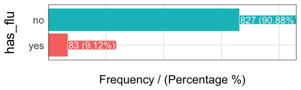
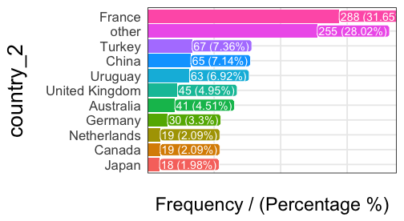

# High Cardinality Variable in Descriptive Stats
  
## What is this about?
  
A **high cardinality** variable is one in which it can take _many_ different values. For example country. 

This chapter will cover cardinality reduction based on Pareto rule, using the `freq` function which gives a quick view about where the most of values are concentrated and variable distribution.

<br> 

## High Cardinality in Descriptive Statistics

The following example contains a survey of 910 cases, with 3 columns: `person`, `country` and `has_flu`, which indicates having such illness in the last month.


```r
library(funModeling) 
```

`data_country` data comes inside `funModeling` package (please update to release 1.6).

Quick `data_country` profiling (first 10 rows)


```r
# plotting first 10 rows
head(data_country, 10)
```

```
##     person     country has_flu
## 478    478      France      no
## 990    990      Brazil      no
## 606    606      France      no
## 575    575 Philippines      no
## 806    806      France      no
## 232    232      France      no
## 422    422      Poland      no
## 347    347     Romania      no
## 858    858     Finland      no
## 704    704      France      no
```

```r
# exploring data, displaying only first 10 rows
head(freq(data_country, "country"), 10)
```


```
##           country frequency percentage cumulative_perc
## 1          France       288       31.6              32
## 2          Turkey        67        7.4              39
## 3           China        65        7.1              46
## 4         Uruguay        63        6.9              53
## 5  United Kingdom        45        5.0              58
## 6       Australia        41        4.5              63
## 7         Germany        30        3.3              66
## 8          Canada        19        2.1              68
## 9     Netherlands        19        2.1              70
## 10          Japan        18        2.0              72
```


```r
# exploring data
freq(data_country, "has_flu")
```



```
##   has_flu frequency percentage cumulative_perc
## 1      no       827       90.9              91
## 2     yes        83        9.1             100
```

<br>

The last table shows there are **70 different countries**, and ~9% of people who had flu -`has_flu="yes"`.

But many of them have almost no participation in the data. This is the _long tail_, so one technique to reduce cardinality is to keep those categories that are present the a high percentahge of data share, for example 70, 80 or 90%, the Pareto principle.


```r
# 'freq' function, from 'funModeling' package, retrieves the cumulative_percentage that will help to do the cut. 
country_freq=freq(data_country, 'country', plot = F)

# Since 'country_freq' is an ordered table by frequency, let's inspect the first 10 rows with the most share.
country_freq[1:10,]
```

```
##           country frequency percentage cumulative_perc
## 1          France       288       31.6              32
## 2          Turkey        67        7.4              39
## 3           China        65        7.1              46
## 4         Uruguay        63        6.9              53
## 5  United Kingdom        45        5.0              58
## 6       Australia        41        4.5              63
## 7         Germany        30        3.3              66
## 8          Canada        19        2.1              68
## 9     Netherlands        19        2.1              70
## 10          Japan        18        2.0              72
```

<br>

So 10 countries represent more the 70% of cases. We can assign the category `other` to the remaining cases and plot:


```r
data_country$country_2=ifelse(data_country$country %in% country_freq[1:10,'country'], data_country$country, 'other')
freq(data_country, 'country_2')
```



```
##         country_2 frequency percentage cumulative_perc
## 1          France       288       31.6              32
## 2           other       255       28.0              60
## 3          Turkey        67        7.4              67
## 4           China        65        7.1              74
## 5         Uruguay        63        6.9              81
## 6  United Kingdom        45        5.0              86
## 7       Australia        41        4.5              91
## 8         Germany        30        3.3              94
## 9          Canada        19        2.1              96
## 10    Netherlands        19        2.1              98
## 11          Japan        18        2.0             100
```

<br> 

## Final comments

Low representative categories are sometimes errors in data, such as having: `Egypt`, `Eggypt.`, and may give some evidence in bad habbits collecting data and/or possible errors when collecting from the source.

There is no general rule to shrink data, it depends on each case.

<br>

**Next recommended chapter: <a href="http://livebook.datascienceheroes.com/data_preparation/high_cardinality_descriptive_stats.html">High Cardinality Variable in Predictive Modeling</a>**


