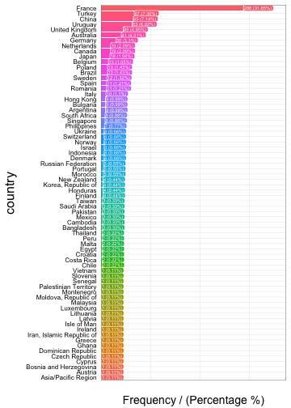
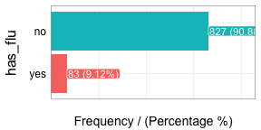
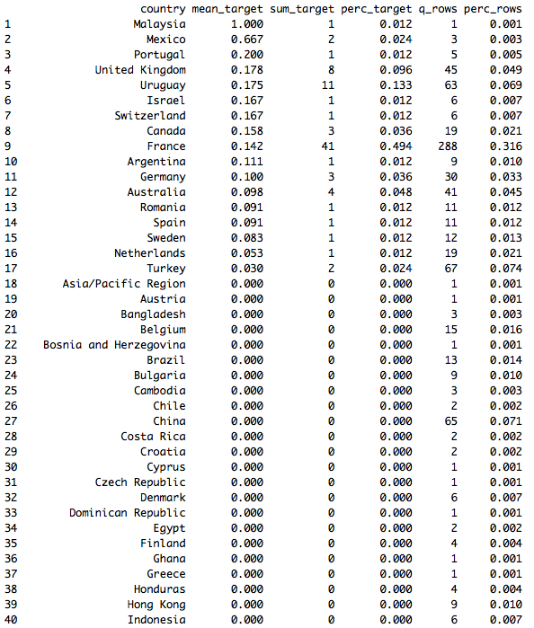

High Cardinality Variable in Predictive Modeling
===


### What is this about?

As we've seen in the other chapter (<a href="http://livebook.datascienceheroes.com/data_preparation/high_cardinality_descriptive_stats.html" target="blank">Reducing categories in descriptive stats</a>) we keep the categories with the major representativeness. But how about having another variable to predict with it? That is, to predict `has_flu` based on `country`.

Using the last method may destroy the information of the variable, thus it **loses predictive power**. In this chapter we'll go further in the method described before, using an automatic grouping function -`auto_grouping`- surfing through the structure of the variable, giving some ideas about how to optimize a categorical variable, but more importantly: encouraging the reader to perform her-his own optimizations.

Other literature name this re-grouping as cardinality reduction or **encoding**.

<br>

**What are we going to review in this chapter?**

* Concept of representativeness of data (sample size).
* Sample size having a target or outcome variable.
* From R: Present a method to help reducing cardinality and profiling categoric variable.
* A practical before-and-after example reducing cardinality and insights extraction.
* How different models such as random forest or a gradient boosting machine deals with categorical variables.

<br>

### But is it necessary to re-group the variable?

It depends on the case, but the quick answer is yes. In this chapter we will see one case in which this data preparation increases overall accuracy (measuring by the Area Under Roc Curve).

There is a tradeoff between the **representation of the data** (how many rows each category has), and how is each category related to the outcome variable. E.g.: some countries are more related to persons with flu than others.


```r
# Loading funModeling >=1.6 which contains functions to deal with this. 
library(funModeling)
library(dplyr)
```

Profiling `data_country`, which comes inside `funModeling` package (please update to release 1.6).

Quick `data_country` profiling (first 10 rows)


```r
# plotting first 10 rows
head(data_country, 10)
```

```
##     person     country has_flu
## 478    478      France      no
## 990    990      Brazil      no
## 606    606      France      no
## 575    575 Philippines      no
## 806    806      France      no
## 232    232      France      no
## 422    422      Poland      no
## 347    347     Romania      no
## 858    858     Finland      no
## 704    704      France      no
```

```r
# exploring data, displaying only first 10 rows
head(freq(data_country, "country"), 10)
```



```
##           country frequency percentage cumulative_perc
## 1          France       288      31.65           31.65
## 2          Turkey        67       7.36           39.01
## 3           China        65       7.14           46.15
## 4         Uruguay        63       6.92           53.07
## 5  United Kingdom        45       4.95           58.02
## 6       Australia        41       4.51           62.53
## 7         Germany        30       3.30           65.83
## 8          Canada        19       2.09           67.92
## 9     Netherlands        19       2.09           70.01
## 10          Japan        18       1.98           71.99
```


```r
# exploring data
freq(data_country, "has_flu")
```



```
##   has_flu frequency percentage cumulative_perc
## 1      no       827      90.88           90.88
## 2     yes        83       9.12          100.00
```


<br>

### The case :mag_right:

The predictive model will try to map certain values with certain outcomes, in our case the target variable is binary.

We'll compute a complete profiling of `country` regarding the target variable `has_flu` based on `categ_analysis`. 

Each row represent an unique category of `input` variable, and each row an attribute that defines each category in terms of representativeness and likelihood. 


```r
## `categ_analysis` is available in "funModeling" >= v1.6, please install it before using it.
country_profiling=categ_analysis(data=data_country, input="country", target = "has_flu")

## Printing first 40 rows (countries) out of 70.
head(country_profiling, 40)
```



<br>

* Note 1: _The first column automatically adjusts its name based on `input` variable_
* Note 2: _`has_flu` variable has values `yes` and `no`, `categ_analysis` assigns internally the number **1** to the less representative class, `yes` in this case, in order to calculate the mean, sum and percentage._

These are the metrics returned by `categ_analysis`:

* `country`: name of each category in `input` variable.
* `mean_target`: `sum_target/q_rows`, average number of `has_flu="yes"` for that category. This is the likelihood.
* `sum_target`: quantity of `has_flu="yes"` values are in each category.
* `perc_target`: the same as `sum_target` but in percentage,  `sum_target of each category / total sum_target`. This column sums `1.00`.
* `q_rows`: quantity of rows that, regardless of the `has_flu` variable, fell in that category. It's the distribution of `input`. This column sums the total rows analyzed.
* `perc_rows`: related to `q_rows` it represents the share or percentage of each category. This column sums `1.00`

<br>

#### What conclusions can we draw from this?

Reading example based on 1st row, `France`:

* 41 people have flu (`sum_target=41`). These 41 people represent almost 50% of total people having flu (`perc_target=0.494`).
* Likelihood of having flu in France is 14.2% (`mean_target=0.142`)
* Total rows from France=288 -out of 910-. This is the `q_rows` variable; `perc_rows` is the same number but in percentage.

Regardless of the filter by country, we've got:

* Column `sum_target` sums the total people with flu present in data.
* Column `perc_target` sums `1.00` -or 100%
* Column `q_rows` sums total rows present in `data_country` data frame.
* Column `perc_rows` sums `1.00` -or 100%.

<br>

---


### Analysis for Predictive Modeling 🔮

When developing predictive models, we may be interested in those values which increases the likelihood of certain event. In our case:

**What are the countries which maximizes the likelihood of finding people with flu?**

Easy, take `country_profiling` in a descending order by `mean_target`:


```r
# Ordering country_profiling by mean_target and then take the first 6 countries
arrange(country_profiling, -mean_target) %>%  head(.)
```

```
##          country mean_target sum_target perc_target q_rows perc_rows
## 1       Malaysia       1.000          1       0.012      1     0.001
## 2         Mexico       0.667          2       0.024      3     0.003
## 3       Portugal       0.200          1       0.012      5     0.005
## 4 United Kingdom       0.178          8       0.096     45     0.049
## 5        Uruguay       0.175         11       0.133     63     0.069
## 6         Israel       0.167          1       0.012      6     0.007
```

<br>

Great! We've got `Malasyia` as the country with the highest likelihood to have flu! 100% of people there have flu (`mean_has_flu=1.000`).

But our common sense advises us that _perhaps_ something is wrong...

How many rows does Malasya have? Answer: 1. -column: `q_rows=1`
How many positive cases does Malasya have? Answer: 1 -column: `sum_target=1`

Since the sample cannot be increased thus see if this proportion keeps high, it will contribute to **overfit** and bias the predictive model.

How about `Mexico`? 2 out of 3 have flu... it seems still low. However `Uruguay` has 17.3% of likelihood -11 out of 63 cases- and these 63 cases represents almost 7% of total population (`perc_row=0.069`), well this ratio seems more credible.

Next there are some ideas to treat this:

--

#### Case 1: Reducing by re-categorizing less representative values

Keep all cases with at least certain percentage of representation in data. Let's say to rename those countries which have less than 1% of presence in data to `others`.


```r
country_profiling=categ_analysis(data=data_country, input="country", target = "has_flu")

countries_high_rep=filter(country_profiling, perc_rows>0.01) %>% .$country

## If not in countries_high_rep then assign `other` category
data_country$country_new=ifelse(data_country$country %in% countries_high_rep, data_country$country, "other")
```

Checking again the likelihood:


```r
country_profiling_new=categ_analysis(data=data_country, input="country_new", target = "has_flu")
country_profiling_new
```

```
##       country_new mean_target sum_target perc_target q_rows perc_rows
## 1  United Kingdom       0.178          8       0.096     45     0.049
## 2         Uruguay       0.175         11       0.133     63     0.069
## 3          Canada       0.158          3       0.036     19     0.021
## 4          France       0.142         41       0.494    288     0.316
## 5         Germany       0.100          3       0.036     30     0.033
## 6       Australia       0.098          4       0.048     41     0.045
## 7         Romania       0.091          1       0.012     11     0.012
## 8           Spain       0.091          1       0.012     11     0.012
## 9          Sweden       0.083          1       0.012     12     0.013
## 10    Netherlands       0.053          1       0.012     19     0.021
## 11          other       0.041          7       0.084    170     0.187
## 12         Turkey       0.030          2       0.024     67     0.074
## 13        Belgium       0.000          0       0.000     15     0.016
## 14         Brazil       0.000          0       0.000     13     0.014
## 15          China       0.000          0       0.000     65     0.071
## 16          Italy       0.000          0       0.000     10     0.011
## 17          Japan       0.000          0       0.000     18     0.020
## 18         Poland       0.000          0       0.000     13     0.014
```

We've reduced the quantity of countries drastically -**74% less**- only by shrinking the less representative at 1%. Obtaining 18 out of 70 countries.

Likelihood of target variable has been stabilised a little more in `other` category. Now when the predictive model _sees_ `Malasya`  it will **not assign 100% of likelihood, but 4.1%** (`mean_has_flu=0.041`).

**Advice about this last method:**

Watch out about applying this technique blindly. Sometimes in a **highly unbalanced** target prediction -e.g. **anomaly detection**- the abnormal behavior is present in less than 1% of cases.


```r
# replicating the data
d_abnormal=data_country

# simulating abnormal behavior with some countries
d_abnormal$abnormal=ifelse(d_abnormal$country %in% c("Brazil", "Chile"), 'yes', 'no')

# categorical analysis
ab_analysis=categ_analysis(d_abnormal, input = "country", target = "abnormal")

## displaying only first 6 elements
head(ab_analysis)
```

```
##               country mean_target sum_target perc_target q_rows perc_rows
## 1              Brazil           1         13       0.867     13     0.014
## 2               Chile           1          2       0.133      2     0.002
## 3           Argentina           0          0       0.000      9     0.010
## 4 Asia/Pacific Region           0          0       0.000      1     0.001
## 5           Australia           0          0       0.000     41     0.045
## 6             Austria           0          0       0.000      1     0.001
```

```r
#
freq(d_abnormal, "abnormal", plot = F)
```

```
##   abnormal frequency percentage cumulative_perc
## 1       no       895      98.35           98.35
## 2      yes        15       1.65          100.00
```

_How many abnormal values are there?_

Only 15, and they represent 1.65% of total values.

Checking the table returned by `categ_analysis`, we can see that this _abnormal behavior_ occurs **only**  in categories with a really low participation: `Brazil` which is present in only 1.4% of cases, and `Chile` with 0.2%.

Creating a category `other` based on the distribution is not a good idea here.

**Conclusion:**

Despite the fact this is a prepared example, there are some data preparations techniques that can be really useful in terms of accuracy but they need some supervision. This supervision can be helped by algorithms.

<br>

#### Case 2: Reducing by automatic grouping

This procedure uses the `kmeans` clustering technique and the table returned by `categ_analysis` in order to create groups -clusters- which contain categories which exhibit similar behavior in terms of:

* `sum_target`
* `mean_target`
* `perc_rows`

The combination of all of them will lead to find groups considering likelihood and representativeness.


**Hands on R:**

We define the `n_groups` parameter, it's the number of desired groups. The number is relative to the data and the number of total categories. But a general number would be between 3 and 10.

Function `auto_grouping` comes in `funModeling` >=1.6. Please note that the `target` parameter only supports for now binary variables.

_Note: the `seed` parameter is optional, but assigning a number will retrieve always the same results._


```r
## Reducing the cardinality
country_groups=auto_grouping(data = data_country, input = "country", target="has_flu", n_groups=8, seed = 999)
country_groups$df_equivalence
```

```
##                      country country_rec
## 1                  Argentina     group_1
## 2                  Australia     group_1
## 3                    Germany     group_1
## 4                Netherlands     group_1
## 5                    Romania     group_1
## 6                      Spain     group_1
## 7                     Sweden     group_1
## 8                      China     group_2
## 9                     Turkey     group_2
## 10                    France     group_3
## 11            United Kingdom     group_4
## 12                   Uruguay     group_4
## 13                  Malaysia     group_5
## 14                    Mexico     group_5
## 15       Asia/Pacific Region     group_6
## 16                   Austria     group_6
## 17                Bangladesh     group_6
## 18    Bosnia and Herzegovina     group_6
## 19                  Cambodia     group_6
## 20                     Chile     group_6
## 21                Costa Rica     group_6
## 22                   Croatia     group_6
## 23                    Cyprus     group_6
## 24            Czech Republic     group_6
## 25        Dominican Republic     group_6
## 26                     Egypt     group_6
## 27                   Finland     group_6
## 28                     Ghana     group_6
## 29                    Greece     group_6
## 30                  Honduras     group_6
## 31 Iran, Islamic Republic of     group_6
## 32                   Ireland     group_6
## 33               Isle of Man     group_6
## 34        Korea, Republic of     group_6
## 35                    Latvia     group_6
## 36                 Lithuania     group_6
## 37                Luxembourg     group_6
## 38                     Malta     group_6
## 39      Moldova, Republic of     group_6
## 40                Montenegro     group_6
## 41                   Morocco     group_6
## 42               New Zealand     group_6
## 43                  Pakistan     group_6
## 44     Palestinian Territory     group_6
## 45                      Peru     group_6
## 46        Russian Federation     group_6
## 47              Saudi Arabia     group_6
## 48                   Senegal     group_6
## 49                  Slovenia     group_6
## 50                    Taiwan     group_6
## 51                  Thailand     group_6
## 52                   Vietnam     group_6
## 53                    Canada     group_7
## 54                    Israel     group_7
## 55                  Portugal     group_7
## 56               Switzerland     group_7
## 57                   Belgium     group_8
## 58                    Brazil     group_8
## 59                  Bulgaria     group_8
## 60                   Denmark     group_8
## 61                 Hong Kong     group_8
## 62                 Indonesia     group_8
## 63                     Italy     group_8
## 64                     Japan     group_8
## 65                    Norway     group_8
## 66               Philippines     group_8
## 67                    Poland     group_8
## 68                 Singapore     group_8
## 69              South Africa     group_8
## 70                   Ukraine     group_8
```

`auto_grouping` returns a list containing 3 objects:

* 1. `df_equivalence`: data frame which contains a table to map old to new values.
* 2. `fit_cluster`: k-means model used to reduce the cardinality (values are scaled).
* 3. `recateg_results`: data frame containing the profiling of each group (egarding target variable., first column adjusts its name to the input variable in this case we've got: `country_rec`. Each group correspond to one or many categories of the input variable (as seen in `df_equivalence`).
TLet's explore how the new groups behave, this is what te predictive model will _see_ 


```r
country_groups$recateg_results
```

```
##   country_rec mean_target sum_target perc_target q_rows perc_rows
## 1     group_5       0.750          3       0.036      4     0.004
## 2     group_4       0.176         19       0.229    108     0.119
## 3     group_7       0.167          6       0.072     36     0.040
## 4     group_3       0.142         41       0.494    288     0.316
## 5     group_1       0.090         12       0.145    133     0.146
## 6     group_2       0.015          2       0.024    132     0.145
## 7     group_6       0.000          0       0.000     75     0.082
## 8     group_8       0.000          0       0.000    134     0.147
```

Last table is ordered by mean_target, so we can quickly see groups maximizing and minimizing the likelihood.

_We'll leave `group_5` to the end._

* `group_3` is the most common, it is present in 31.6% of cases and mean_target (likelihood) is 14.2%.
* Excluding `group_5` for now, `group_4` has the highest likelihood, while `group_8` has the lowest. Both have good representativeness: 11.9 and 14.7 of all input rows.
* `group_6` and `group_8` are pretty similar, they can be one group since likelihood is 0 in both cases.

**What about `group_5`?**

We see that is the group with the most likelihood, 75% `has_flu`. This is a cluster of outliers, here are the categories with low-representativeness and high likelihood. `Malasia` and `Mexico` are there.

If we are more cautelous about false positives, we can consider that this group doesn't have enough information and assign it to `group_8`, so it will have no influence in increasing the likelihood of predicting flu (`mean_target=0`). Or, we can assign to an average group like `group_3`.


```r
data_country=data_country %>% inner_join(country_groups$df_equivalence)
```
Now we do the additional transformations replacing:
`group_5` by `group_3`; and `group_6` by `group_8`.


```r
data_country$country_rec=ifelse(data_country$country_rec == "group_5", "group_3", data_country$country_rec)
data_country$country_rec=ifelse(data_country$country_rec == "group_6", "group_8", data_country$country_rec)
```

Checking the final grouping (`country_rec` variable):

```r
categ_analysis(data=data_country, input="country_rec", target = "has_flu")
```

```
##   country_rec mean_target sum_target perc_target q_rows perc_rows
## 1     group_4       0.176         19       0.229    108     0.119
## 2     group_7       0.167          6       0.072     36     0.040
## 3     group_3       0.151         44       0.530    292     0.321
## 4     group_1       0.090         12       0.145    133     0.146
## 5     group_2       0.015          2       0.024    132     0.145
## 6     group_8       0.000          0       0.000    209     0.230
```

Now each group seems to have a good sample size, and values `mean_target` shows a decreasing pattern where each doesn't appear to be so high and is well distributed in the `0.176` to `0` range. [1]

<br>

 
### Handling new categories when the predictive model is on production

Let's imagine a new country appears, `new_country_hello_world`, predictive models will fail since they were trained with fixed values. One technique is to assign a group which has `mean_target=0`.

It's similar to the case in last example. But the difference lies in `group_5` would fit better in a mid-likelihood group than a complete new value.

After some time we should re-build the model with all new values, otherwise we would be penalizing `new_country_hello_world` if it has a good likelihood.

In short words:

_A new category appears? >>> Send to the least meaningful group. After a while, re-analyze its impact._

<br>

---

### Don't predictive models handle high cardinality? Part 1

We're going trough this by building two predictive models: Gradient Boosting Machine -quite robust across many different data inputs.

The first model doesn't have treated data, and the second one has been treated by the function in `funModeling` package.

We're measuring the precision based on ROC area, ranged from 0.5 to 1, the higher the number the better the model is. We are going to use cross-validation to be more _sure_ about the value. The importance of cross-validate results is treated in <a href="http://livebook.datascienceheroes.com/model_performance/knowing_the_error.html" target="blank">Knowing the error</a> chapter.


```r
## Building the first model, without reducing cardinality.
library(caret)
fitControl <- trainControl(method = "cv",
                           number = 4,
                           classProbs = TRUE,
                           summaryFunction = twoClassSummary)


fit_gbm_1 <- train(has_flu ~ country,
                   data = data_country,
                   method = "gbm",
                   trControl = fitControl,
                   verbose = FALSE,
                   metric = "ROC")
```


```r
roc=round(mean(fit_gbm_1$results$ROC),2)
sprintf("Area under ROC curve is: %s", roc)
```

```
## [1] "Area under ROC curve is: 0.65"
```

Now we do the same model with the same parameters, but with the data preparation we did before.

<br>
  


```r
new_roc=round(mean(fit_gbm_2$results$ROC),2)
sprintf("New ROC value is: %s", new_roc);
```

```
## [1] "New ROC value is: 0.72"
```

Then we can calculate the percentage of improvement over first roc value:
  

```r
sprintf("Improvement: ~ %s%%", round(100*(new_roc-roc)/roc,2));
```

```
## [1] "Improvement: ~ 10.77%"
```

Not bad, isn't it?

**A short comment about last test:**

We've used one of the most robust models, **gradient boosting machine**, and we've increased the performance. If we try other model, for example <a href="https://en.wikipedia.org/wiki/Logistic_regression" target="blank">logistic regression</a>, which is more sensible to dirty data, we'll get a higher difference between reducing and not reducing cardinality. This can be checked deleting `verbose=FALSE` parameter and changing `method=glm` (`glm` implies logistic regression).

In _further reading_ there is a benchmark of different treatments for categorical variables and how each one increases or decreases the accuracy.

<br>

### Don't predictive models handle high cardinality? Part 2

Let's review how some models deal with this:

**Decision Trees**: Tend to select variables with high cardinality at the top, thus giving more importance above others, based on the information gain. In practise, it is an evidence of overfitting. This model would be good to see the difference between reducing or not a high cardinality variable.

**Random Forest** -at least in R implementation- handles only categorical variables with at most 52 different categories. It's highly probable that this limitation is to avoid overfitting. This point in conjunction to the nature of the algorithm -create lots of trees- reduces the effect of a single decision tree when choosing a high cardinality variable.

**Gradient Boosting Machine** and **Logistic Regression** converts internally categorical variables into flag or dummy variables. In the example we saw about countries, it implies the -internal- creation of 70 flag variables. Checking the model we created before:


```r
# Checking the first model...
fit_gbm_1$finalModel
```

```
## A gradient boosted model with bernoulli loss function.
## 100 iterations were performed.
## There were 69 predictors of which 8 had non-zero influence.
```

That is: 69 input variables are representing the countries but in flag columns. 14 variables were not relevant to make the prediction.

This opens a new chapter which is going to be covered in this book :) : **Feature engineering** or **selecting best variables**. It is a high recommended practise to first select those variables which carries the most information, and then create the predictive model.

**Conclusion: reducing the cardinality will reduce the quantity of variables in these models.**

<br>

---

### Numerical or multi-nominal target variable

The book covered only the target as a binary variable, it is planned in a future to cover numerical and multi-value target.

However if you read up to here you may explore on your own having the same idea in mind. In numerical variables, for example forecasting `page visits` on a web site, there will be certain categories of an input variable which will be more related with a high value on visits, while there are others than are more correlated with low values.

The same goes for multi-nominal output variable, there will be some categories more related to certain values. For example predicting the epidemic degree: `high`, `mid` or `low` based on the city. There will be some cities more correlated with a high epidemic level than others.

<br>

### What we've got as an "extra-gift" from the grouping?

Knowing how categories fell into groups give us information that -in some cases- is good to report. Each category between the group will share similar behavior -in terms of representativeness and prediction power-.

If `Argentine` and `Chile` are in `group_1`, then they are the same, and this is how the model will _see_ it.

<br>

### Representativeness or sample size

This concept is on the analysis of any categorical variable, but it's a very common topic in data science and statistics: <a href="https://en.wikipedia.org/wiki/Sample_size_determination" target="blank">**sample size**</a>. How much data is it needed to see the pattern _well developed?_.

In a categorical variable: How many cases of category "`X`" do we need to trust in the correlation between "`X`" value and a target value? This is what we've analyzed.

In general terms: the more difficult the event to predict, the more cases we need...

Further in this book we'll cover this topic from other points of view linking back to this page.

<br>

### Final toughts

* We saw two cases to reduce cardinality, the first one doesn't care about the target variable, which can be dangerous in a predictive model, while the second does, creating a new variable based the affinity of each input category.

* Key concept: **representativeness** of each category regarding itself, and regarding to the event to predict.

* What was mentioned at the beginning respect to **destroying the information in the input variable**, implies that the resultant grouping have the same rates across groups (in a binary variable input). [1]

* _Should we always reduce the cardinality?_ It depends, two tests on a simple data are not enough to extrapolate to all cases. Hopefully it will be a good kick-off to the reader to start doing her-his own optimizations.

<br> 


**Further reading:**

* [1] It can be studied with the <a href="http://livebook.datascienceheroes.com/selecting_best_variables/cross_plot.html" target="blank">`cross_plot`</a> function.


* Following link contains many different accuracy results based on different treatments for categorical variable: <a href="http://www.kdnuggets.com/2015/12/beyond-one-hot-exploration-categorical-variables.html">Beyond One-Hot: an exploration of categorical variables</a>.


