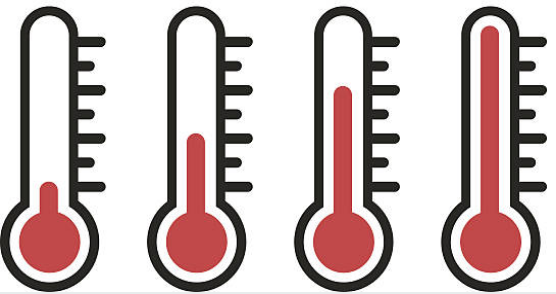
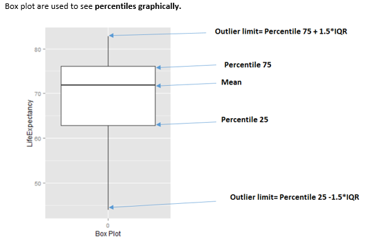

```{r ,results="hide", echo=FALSE}
library(knitr)
knitr::opts_chunk$set(out.width="400px", dpi=150, fig.width = 4, fig.height = 3)
knitr::opts_knit$set(base.dir = "data_preparation")
``` 

# Treatment of outliers

## What is this about?

The concept of extreme values, much like other topics in machine learning, is not a concept exclusive to this area. What it is an outlier today may not be tomorrow. The boundaries between normal and abnormal behavior are fuzzy; on the other hand, to stand in the extremes is easy.

<br>

**What are we going to review in this chapter?**

* What is an outlier? Philosophical and practical approaches
* Outliers by dimensionality and data type (numerical or categorical)
* How to detect outliers in R (bottom/top X%, Tukey and Hampel)
* Outliers preparation for profiling in R
* Outliers preparation for predictive modeling in R


<br>

---

## The intuition behind outliers

For example, consider the following distribution:
  
```{r dealing_with_outliers}
## Loading ggplot2 to visualize the distribution
library(ggplot2)

## Creating a sample dataset
set.seed(31415)
df_1=data.frame(var=round(10000*rbeta(1000,0.15,2.5)))

## Plotting
ggplot(df_1, aes(var, fill=var)) + geom_histogram(bins=20) + theme_light()
```

The variable is skewed to the left, showing some outlier points on the right. We want to _deal with them_
(`r emo::ji("sunglasses")`). So, the question arises: _Where to set the thresholds of extreme?_ Based on intuition, it can be at the highest 1%, or we can analyze the mean change after removing the top 1%.

Both cases could be right. In fact, taking another number as the threshold (i.e., 2% or 0.1%), may be right too. Let's visualize them:

```{r dealing_with_outliers_4}
## Calculating the percentiles for the top 3% and top 1%
percentile_var=quantile(df_1$var, c(0.98, 0.99, 0.999), na.rm = T)
df_p=data.frame(value=percentile_var, percentile=c("a_98th", "b_99th", "c_99.9th"))

## Plotting the same distribution plus the percentiles
ggplot(df_1, aes(var)) + geom_histogram(bins=20) + geom_vline(data=df_p, aes(xintercept=value,  colour = percentile), show.legend = TRUE, linetype="dashed") + theme_light()
```

To understand more about percentiles, please go to the <a href="http://livebook.datascienceheroes.com/exploratory_data_analysis/annex_1_profiling_percentiles.html" target="blank">Annex 1: The magic of percentiles</a> chapter.

For now, we'll keep with the top 1% (99th percentile), as the threshold to flag all the points after it as outliers.
  
```{r dealing_with_outliers_2, fig.height=3, fig.width=4, echo=FALSE}

## Plotting the same distribution plus the percentiles
ggplot(df_1, aes(var)) + geom_histogram(bins=20) +
  geom_rect(aes(xmin = df_p$value[2], xmax = Inf, ymin = -Inf, ymax = Inf), fill = "pink", alpha = 0.01)+
  geom_vline(data=df_p, 
             aes(xintercept=value[2], 
                 colour = percentile[2]),
             show.legend = F, linetype="dashed") + theme_light() 
```


One interesting conceptual element arises here: when we define **abnormal** (or an anomaly), the **normal concept emerges as its opposite**.

This “normal” behavior is shown as the green area:


```{r dealing_with_outliers_3, fig.height=3, fig.width=4, echo=FALSE,tidy=TRUE}
## Plotting the same distribution plus the percentiles
ggplot(df_1, aes(var)) + geom_histogram(bins=20) +
  geom_rect(aes(xmin = -Inf, xmax = df_p$value[2], ymin = -Inf, ymax = Inf), fill = "lightgreen", alpha = 0.01)+
  geom_vline(data=df_p, 
             aes(xintercept=value[2], 
                 colour = percentile[2]),
             show.legend = F, linetype="dashed") + theme_light() 
```


The hard thing to do is to determine where the normal and abnormal separate. There are several approaches to deal with this. We are going to review a few of them.

<br>

---

### Where is the boundary between hot and cold weather? 

Let's make this section more philosophical. Some good mathematicians were also philosophers such as the case of <a href="https://en.wikipedia.org/wiki/Pythagoras">Pythagoras</a> and <a href="https://en.wikipedia.org/wiki/Isaac_Newton" target="blank">Isaac Newton</a>.

Where can we put the threshold to indicate where the hot weather begins or, conversely, where does the cold weather end?



Near the Equator, probably a temperature around 10°C (50°F) is an extremely low value; however, in Antarctica, it's a beach day! 
`r emo::ji("snowman")` `r emo::ji("beach_umbrella")`

`r emo::ji("japanese_goblin")`: _"Oh! But that is taking an extreme example with two different locations!"_

No problem! Like a fractal, let's zoom into any city, the boundary when one starts (and the other ends) will not have one unique value to state the following: _"Ok, the hot weather starts at 25.5°C (78°F)."_ 

It's relative.

However, it's quite easy to stand in the extremes, where the uncertainty decreases to almost zero, for example, when we consider a temperature of 60°C (140°F).

`r emo::ji("thinking")`: _"Ok. But how are these concepts related to machine learning?"_

We're exposing here the relativity that exists when considering a label (hot/cold) as a numeric variable (temperature). This can be considered for any other numeric, such as income and the labels “normal” and “abnormal.”

To understand **extreme values** is one of the first tasks in **exploratory data analysis**. Then we can see what the normal values are. This is covered in the <a href="http://livebook.datascienceheroes.com/exploratory_data_analysis/profiling.html" target="blank">**Profiling**</a> chapter.

There are several methods to flag values as outliers. Just as we might analyze the temperature, this flag is _relative_ and all the methods can be right. The quickest method may be to treat the top and bottom X% as outliers. 

More robust methods consider the distribution variables by using quantiles (Tukey's method) or the spread of the values through standard deviation (Hampel's method).

The definition of these boundaries is one of the most common tasks in machine learning. _Why? When?_ Let's point out two examples:

* Example 1: When we develop a predictive model which returns a probabilty for calling or not certain client, we need to set the score threshold to assign the final label: "yes call!"/"no call". More info about it in <a href="http://livebook.datascienceheroes.com/scoring/scoring.html" tareget="blank">Scoring</a> chapter.

* Example 2: Another example is when we need to discretize a numerical variable because we need it as categorical. The boundaries in each bin/segment will affect the overall result. More info about it in <a href="http://livebook.datascienceheroes.com/data_preparation/data_types.html" tareget="blank">Data Types</a> chapter, section _Discretizing numerical variables_. 

`r emo::ji("pushpin")` Going back to the original issue (_where does the cold weather end?_), not all the questions need to have an answer: some of them just help us simply to think.

<br>

---

## The impact of outliers

### Model building

Some models, such as random forest and gradient-boosting machines, tend to deal better with outliers; however, “noise” may affect the results anyway. The impact of outliers in these models is lower than others, such as linear regressions, logistic regressions, kmeans, and decision trees.

One aspect that contributes to the decrease in impact is that both models create _many_ sub-models. If any of the models takes one outlier as information, then other sub-models probably won't; thus, the error is canceled. The balance yields in the plurality of voices.


### Communicating results `r emo::ji("earth_africa")` `r emo::ji("mega")`

If we need to report the variables used in the model, we'll end up removing outliers not to see a histogram with only one bar and/or show a biased mean. 

It's better to show a nonbiased number than justifying that the model _will handle_ extreme values.

### Types of outliers by data type


* **Numerical** `r emo::ji("straight_ruler")`: Like the one we saw before:

```{r numerical_outliers_1, echo=FALSE}

## Plotting the same distribution plus the percentiles
ggplot(df_1, aes(var)) + geom_histogram(bins=20) +
  geom_rect(aes(xmin = df_p$value[2], xmax = Inf, ymin = -Inf, ymax = Inf), fill = "pink", alpha = 0.01)+
  geom_vline(data=df_p, 
             aes(xintercept=value[2], 
                 colour = percentile[2]),
             show.legend = F, linetype="dashed") + theme_light() 
```


* **Categorical** `r emo::ji("bar_chart")`: Having a variable in which the dispersion of categories is quite high (high cardinality): for example, postal code. More about dealing with outliers in categorical variables in the <a href="http://livebook.datascienceheroes.com/data_preparation/high_cardinality_descriptive_stats.html" target="blank">High Cardinality Variable in Descriptive Stats</a> chapter.

```{r categorical_outliers_1, echo=FALSE, message=FALSE}
library(funModeling)
library(dplyr)
data_country_sample=filter(data_country, country %in% c("France", "China", "Uruguay", "Peru", "Vietnam"))

freq(data_country_sample$country)
```

`Peru` and `Vietnam` are the outlier countries in this example as their share in the data is less than 1%.

<br>

---

### Types of outliers by dimensionality

So far, we have observed one-dimensional univariate outliers. We also can consider two or more variables at a time.

For instance, we have the following dataset, `df_hello_world`, with two variables: `v1` and `v2`. Doing the same analysis as before:

```{r outlier_analysis_2_in_r, echo=FALSE}
## Creating the dataset
v1=c(rep("Argentina",50), rep("Uruguay",50), rep("Uruguay",30), "Argentina", "Argentina", "Argentina", "Argentina")
v2=c(rep("cat_A",50), rep("cat_B",50), rep("cat_A",30), "cat_B", "cat_A", "cat_A", "cat_A")
df_hello_world=data.frame(v1, v2)
```

```{r outlier_analysis_in_r, echo=FALSE}
freq(df_hello_world)
```

No outlier so far, right?

Now we build a contingency table that tells us the distribution of both variables against each other:

```{r outlier_analysis, echo=FALSE}
## First, it is needed to create the table object and then calculate the percentage per cell
tbl_hello_world=table(df_hello_world)

## Print the results in percentage per cell
round(100*prop.table(tbl_hello_world), 2)
```

Oh `r emo::ji("scream")`! The combination of `Argentina` and `cat_B` is _really low_ (0.75%) in comparison with the other values (less than 1%), whereas the other intersections are above 22%.

<br>

### Some thoughts...

The last examples show  the _potential_ of extreme values or outliers and are presented as considerations we must make with a new dataset.

We mention **1%** as a possible threshold to flag a value as an outlier. This value could be 0.5% or 3%, depending on the case.

In addition, the presence of this kind of outlier may not pose a problem.

<br>

---

## How to deal with outliers in R

The `prep_outliers` function present in the funModeling package can help us in this task. It can handle from one to 'N' variables at a time (by specifying the `str_input` parameter).

The core is as follows:

* It supports three different methods (`method` parameter) to consider a value as an outlier: bottom_top, Tukey, and Hampel.
* It works in two modes (`type` parameter) by setting an `NA` value or by _stopping the variable_ at a particular value. 
Besides the explanation below, `prep_outliers` is a well-documented type: `help("prep_outliers")`.

<br>

### Step 1: How to detect outliers `r emo::ji("mag_right")`

The following methods are implemented in the `prep_outliers` function. They retrieve different results so the user can select the one that best fits her or his needs.

#### Bottom and top values method

This considers outliers based on the bottom and top X% values, based on the percentile. The values are commonly 0.5%, 1%, 1.5%, 3%, among others.

Setting the parameter `top_percent` in `0.01` will treat all values in the top 1%.

The same logic applies for the lowest values: setting the parameter `bottom_percent` to `0.01` will flag as outliers the lowest 1% of all values.

The internal function used is `quantile`; if we want to flag bottom and top 1%, we type:

```{r}
quantile(heart_disease$age, probs = c(0.01, 0.99), na.rm = T)
```
All values for those aged less than 35 or more than 71 years will be considered outliers.

For more information about percentiles, check the chapter: <a href="http://livebook.datascienceheroes.com/exploratory_data_analysis/annex_1_profiling_percentiles.html" target="blank">The magic of percentiles</a>.

<br>

#### Tukey's method

This method flags outliers considering the quartiles values, Q1, Q2, and Q3, where Q1 is equivalent to the percentile 25th, Q2 equals to percentile 50th (also known as the median), and Q3 is the percentile 75th.

The IQR (Inter-quartile range) comes from Q3 − Q1.

The formula:
* The bottom threshold is: Q1 − 3*IQR. All below are considered as outliers.
* The top threshold is: Q1 + 3*IQR. All above are considered as outliers.

The value 3 is to consider the "extreme" boundary detection. This method comes from the box plot, where the multiplier is 1.5 (not 3). This causes a lot more values to be flagged as shown in the next image.



The internal function used in `prep_outliers` to calculate the Tukey's boundary can be accessed:

```{r}
tukey_outlier(heart_disease$age)
```

It returns a two-value vector; thus, we have the bottom and the top thresholds: all below nine and all above 100 will be considered as outliers.

A subtle visual and step-by-step example can be found in Ref. [1]. 

<br>

#### Hampel's method

The formula:
* The bottom threshold is: `median_value − 3*mad_value`. All below are considered as outliers.
* The top threshold is: `median_value + 3*mad_value`. All above are considered as outliers.


The internal function used in `prep_outliers` to calculate the Hampel's boundary can be accessed:

```{r}
hampel_outlier(heart_disease$age)
```

It returns a two-value vector; thus, we have the bottom and the top thresholds. All below 29.31 and all above 82.68 will be considered as outliers.

It has one parameter named `k_mad_value`, and its default value is `3`.
The value `k_mad_value` can be changed, but not in the `prep_outliers` function by now. 

The higher the `k_mad_value`, the higher the threshold boundaries will be.

```{r}
hampel_outlier(heart_disease$age, k_mad_value = 6) 
```
  
<br>

---
  
## Step 2: What to do with the outliers? `r emo::ji("hammer_and_wrench")`

We've already detected which points are the outliers. Therefore, the question now is: _What to do with them?_ `r emo::ji("thinking")`

There are two scenarios:

* Scenario 1: Prepare outliers for data profiling
* Scenario 2: Prepare outliers for predictive modeling

There is a third scenario in which we don't do anything with the spotted outliers. We just let them be.

We propose the function `prep_outliers` from the `funModeling` package to give a hand on this task.

Regardless the function itself, the important point here is the underlying concept and the possibility of developing an improved method.

The `prep_outliers` function covers these two scenarios through the parameter `type`:

* `type = "set_na"`, for scenario 1
* `type = "stop"`, for scenario 2

### Scenario 1: Prepare outliers for data profiling

**The initial analysis:**

In this case, all outliers are converted into `NA`, thus applying most of the characteristic functions (max, min, mean, etc.) will return a **less-biased indicator** value. Remember to set the `na.rm=TRUE` parameter in those functions. Otherwise, the result will be `NA`.


For example, let's consider the following variable (the one we saw at the beginning with some outliers):

```{r}
## To understand all of these metrics, please go to the Profiling Data chapter: http://livebook.datascienceheroes.com/exploratory_data_analysis/profiling.html
profiling_num(df_1$var)
```

Here we can see several indicators that give us some clues. The `std_dev` is really high compared with the `mean`, and it is reflected on the `variation_coef`. In addition, the kurtosis is high (16) and the `p_99` is almost twice the `p_95` value (5767 vs. 3382).


_This last task of looking at some numbers and visualize the variable distribution is like imaging a picture by what another person tells us: we convert the voice (which is a signal) into an image in our brain._ `r emo::ji("speaking_head")` `r emo::ji("roll_eyes")` ... => `r emo::ji("mountain_snow")` 

<br>

#### Using `prep_outliers` for data profiling

We need to set `type="set_na"`. This implies that every point flagged as an outlier will be converted into `NA`.

We will use the three methods: Tukey, Hampel, and the bottom/top X%.

**Using Tukey's method**:

```{r}
df_1$var_tukey=prep_outliers(df_1$var, type = "set_na", method = "tukey")
```

Now, we check how many `NA` values are there before (the original variable) and after the transformation based on Tukey.

```{r}
# before
df_status(df_1$var, print_results = F) %>% select(variable, q_na, p_na)

# after
df_status(df_1$var_tukey, print_results = F) %>% select(variable, q_na, p_na)
```

Before the transformation, there were 0 `NA` values, whereas afterwards 120 values (around 12%) are spotted as outliers according to the Tukey's test and replaced by `NA`.

We can compare the before and after:

```{r}
profiling_num(df_1, print_results = F) %>% select(variable, mean, std_dev, variation_coef, kurtosis, range_98)
```

The mean decreased by almost the third part while all the other metrics decreased as well.

**Hampel's method**:

Let's see what happens with Hampel's method (`method="hampel"`):

```{r}
df_1$var_hampel=prep_outliers(df_1$var, type = "set_na", method="hampel")
```

Checking...

```{r}
df_status(df_1, print_results = F) %>% select(variable, q_na, p_na)
```

This last method is much more severe in spotting outliers, identifying 36% of values as outliers. This is probably because the variable is _quite_ skewed to the left.

More info can be found at Ref. [2]. 

<br>

**Bottom and top X% method**

Finally, we can try the easiest method: to remove the top 2%. 

```{r}
df_1$var_top2=prep_outliers(df_1$var, type = "set_na", method="bottom_top", top_percent = 0.02)
```

Please note that the 2% value was arbitrarily chosen. Other values, like 3% or 0.5%, can be tried as well.

Time to compare all the methods!

<br> 

#### Putting it all together

We'll pick a few indicators to make the quantitative comparison.

```{r}
df_status(df_1, print_results = F) %>% select(variable, q_na, p_na)
prof_num=profiling_num(df_1, print_results = F) %>% select(variable, mean, std_dev, variation_coef, kurtosis, range_98)
prof_num
```


**Plotting**

```{r, comparing_outliers_methods, warning=FALSE, message=FALSE}
# First we need to convert the dataset into wide format
df_1_m=reshape2::melt(df_1) 
plotar(df_1_m,  str_target= "variable", str_input = "value", plot_type = "boxplot")
```

<br>


When selecting the bottom/top X%, we will always have some values matching that condition, whereas with other methods this may not be the case.


#### Conclusions for dealing with outliers in data profiling  

The idea is to modify the outliers as least as possible (for example, if we were interested only in describing the general behavior).

To accomplish this task, for example when creating an ad hoc report, we can use the mean. We could choose the top 2% method because it only affects 2% of all values and causes the mean to be lowered drastically: from 548 to 432, or **21% less**.

> "To modify or not to modify the dataset, that is the question". William Shakespeare being a Data Scientist.

The Hampel method modified the mean too much, from 548 to 17! That is based on the _standard_ value considered with this method, which is 3-MAD (kind of robust standard deviation).

Please note that this demonstration doesn't mean that neither Hampel nor Tukey are a bad choice. In fact, they are more robust because the threshold can be higher than the current value; indeed, no value is treated as an outlier.

On the other extreme, we can consider, for example, the `age` variable from `heart_disease` data. Let's analyze its outliers:

```{r}
# Getting outliers threshold
tukey_outlier(heart_disease$age)

# Getting min and max values
min(heart_disease$age)
max(heart_disease$age)
```

* The bottom threshold is 9, and the minimum value is 29. 
* The top threshold is 100, and the minimum value is 77.

Ergo: the `age` variable has not outliers.

If we were to have used the bottom/top method, then the input percentages would have been detected as outliers.

All the examples so far have been taking one variable at a time; however, `prep_outliers` can handle several at the same time using the parameter `str_input` as we will see in next section. All that we have seen up to here will be equivalent, except for what we do once we detect the outlier, i.e., the imputation method. 

<br>
  
### Scenario 2: Prepare outliers for predictive modeling

The previous case results in spotted outliers being converted to `NA` values. This is a huge problem if we are building a machine learning model as many of them don't work with `NA` values. More about dealing with missing data at <a href="livebook.datascienceheroes.com/data_preparation/treating_missing_data.html" target="blank">Analysis, Handling, and Imputation of Missing Data</a>.

To deal with outliers in order to use a predictive model, we can adjust the parameter `type='stop'` so all values flagged as outliers will be converted to the threshold value.

**Some things to keep in mind:**
  
Try to think of variable treatment (and creation) as if you're explaining to the model. By stopping variables at a certain value, 1% for example, we are telling to the model: _Hey model, please consider all extreme values as if they are in the 99% percentile as this value is already high enough. Thanks._

Some predictive models are more **noise tolerant** than others. We can help them by treating some of the outlier values. In practice, to pre-process data by treating outliers tends to produce more accurate results in the presence of unseen data.

<br>

### Imputing outliers for predictive modeling

First, we create a dataset with some outliers. Now the example has two variables.

```{r outliers_treatment1,  fig.height=3, fig.width=4}
# Creating data frame with outliers
options(scipen=999) # deactivating scientific notation
set.seed(10) # setting the seed to have a reproducible example
df_2=data.frame(var1=rchisq(1000,df = 1), var2=rnorm(1000)) # creating the variables
df_2=rbind(df_2, 135, rep(400, 30), 245, 300, 303, 200) # forcing outliers
```

Dealing with outliers in both variables (`var1` and `var2`) using Tukey's method:

```{r outliers_treatment_3,  fig.height=3, fig.width=4}
df_2_tukey=prep_outliers(data = df_2, str_input = c("var1", "var2"), type='stop', method = "tukey")
```

Checking some metrics before and after the imputation:

```{r outliers_treatment_4,  fig.height=3, fig.width=4}
profiling_num(df_2, print_results = F) %>% select(variable, mean, std_dev, variation_coef)
profiling_num(df_2_tukey, print_results = F) %>% select(variable, mean, std_dev, variation_coef)
```

Tukey worked perfectly this time, exposing a more accurate mean in both variables: 1 for `var1` and 0 for `var2`.

Note that this time there is no one `NA` value. What the function did this time was **"to stop the variable"** at the threshold values. Now, the minimum and maximum values will be the same as the ones reported by Tukey's method.   

Checking the threshold for `var1`:

```{r}
tukey_outlier(df_2$var1)
```

Now checking the min/max before the transformation:

```{r}
# before:
min(df_2$var1)
max(df_2$var1)
```

and after the transformation...

```{r}
# after
min(df_2_tukey$var1)
max(df_2_tukey$var1)
```

The min remains the same (0.0000031), but the maximum was set to the Tukey's value of ~5.3. 

The top five highest values before the pre-partition were: 
```{r}
# before
tail(df_2$var1[order(df_2$var1)], 5)
```

but after...
```{r}
# after:
tail(df_2_tukey$var1[order(df_2_tukey$var1)], 5)
```

And checking there is no one `NA`:

```{r}
df_status(df_2_tukey, print_results = F) %>% select(variable, q_na, p_na)
```

Pretty clear, right?

<br>

Now let's replicate the example we did in the last section with only one variable in order to compare all three methods.

```{r outliers_treatment3,  fig.height=3, fig.width=4}
df_2$tukey_var2=prep_outliers(data=df_2$var2, type='stop', method = "tukey")
df_2$hampel_var2=prep_outliers(data=df_2$var2, type='stop', method = "hampel")
df_2$bot_top_var2=prep_outliers(data=df_2$var2, type='stop', method = "bottom_top", bottom_percent=0.01, top_percent = 0.01)
```

<br>

#### Putting it all together

```{r}
# excluding var1
df_2_b=select(df_2, -var1)

# profiling
profiling_num(df_2_b, print_results = F) %>% select(variable, mean, std_dev, variation_coef, kurtosis, range_98)
```

All three methods show very similar results with these data.

**Plotting**


```{r, outliers_method_comparison, warning=FALSE, message=FALSE}
# First we need to convert the dataset into wide format
df_2_m=reshape2::melt(df_2_b) %>% filter(value<100) 
plotar(df_2_m,  str_target= "variable", str_input = "value", plot_type = "boxplot")
```

_Important_: The two points above the value 100 ( only for `var1`) were excluded, otherwise it was impossible to appreciate the difference between the methods.

<br>

---

## Final thoughts

We've covered the outliers issue from both philosophical and technical perspectives, thereby inviting the reader to improve her/his critical thinking skills when defining the boundaries (thresholds). It is easy to stand in the extremes, but a tough task to find the balance. 

In technical terms, we covered three methods to spot outliers whose bases are different: 

* **Top/Bottom X%**: This will always detect points as outliers as there is always a bottom and top X%.
* **Tukey**: Based on the classical boxplot, which uses the quartiles.
* **Hampel**: Quite restrictive if default parameter is not changed. It's based on the median and MAD values (similar to standard deviation, but less sensitive to outliers).

After we've got the outliers, the next step is to decide what to do with them. It would be the case that the treatment is not necessary at all. In really small datasets, they can be seen at first glance.

The rule of: _**"Only modify what is necessary"**_, (which can also apply to the _human being_–_nature_ relationship), tells us not to treat or exclude all the extreme outliers blindly. **With every action we took, we introduced some bias**. That's why it's so important to know the implications of every method. Whether it is a good decision or not is dependent on the nature of the data under analysis.

In **predictive modeling**, those who have any type of internal resampling technique, or create _several tiny models_ to get a final prediction, are more stable to extreme values. More on resampling and error in the <a href="http://livebook.datascienceheroes.com/model_performance/knowing_the_error.html" target="blank">Knowing the error</a> chapter.

In some cases when the predictive model is **running on production**, it's recommended to report or to consider the preparation of any new extreme value, i.e., a value that was not present during the model building. More on this topic, but with a categorical variable, can be found at <a href="http://livebook.datascienceheroes.com/data_preparation/high_cardinality_predictive_modeling.html" target="blank">High Cardinality Variable in Predictive Modeling</a>, section: _Handling new categories when the predictive model is on production_.

**One nice test** for the reader to do is to pick up a dataset, treat the outliers, and then compare some performance metrics like Kappa, ROC, Accuracy, etc.; **did the data preparation improve any of them?** Or, in reporting, to see how much the mean changes. Even if we plot some variable, does the plot now tell us anything?. In this way, the reader will create new knowledge based on her/his experience `r emo::ji("wink")`.

<br>

## References

* [1] http://datapigtechnologies.com/blog/index.php/highlighting-outliers-in-your-data-with-the-tukey-method/
* [2] http://exploringdatablog.blogspot.com.ar/2013/02/finding-outliers-in-numerical-data.html


