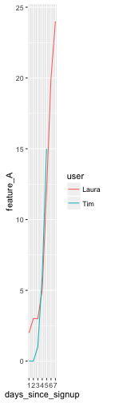

Analysis, Handling and Imputation of Missing Data
===

### What is this about?

The analysis of missing values is the estimation of emptiness itself. An obstacle to overcome to reach our goal, like creating a predictive model, a cluster analysis, a report, and so on.

In this chapter, we cover from the concept of an empty value to the treatment of it. We will do a lot of analysis over the different approaches and the interpretation of the different results. 

Hopefully, after studying the whole chapter, the reader will understand key concepts of dealing with missing values, going further in the pursuit of finding better approaches than the ones purposed here.

<br>

**What are we going to review in this chapter?**

* What is the concept of an empty value?
* When to exclude rows or columns.
* Analysis and profiling of missing values.
* Transforming and imputing numeric and categorical variables.
* Imputing values: from easy to more complex approaches.

All of this from a practical approach in R. The code intends to be generic enough to apply to your projects 🙂.

<br>

### When the empty value represents information

Empty values are also known as `NULL` in databases, `NA` in R or just the empty string in Spreadsheet programs. It can also be represented by some number like: "`0`", "`-1`" or "`-999`". 

For example, imagine a travel agency which joins two tables, one of persons and another of countries. The result shows the number of travels per person: 


```
##    person South_Africa Brazil Costa_Rica
## 1  Fotero            1      5          5
## 2   Herno           NA     NA         NA
## 3 Mamarul           34     40         NA
```

E.g., person `Mamarul` traveled `34` times to `South_Africa`.

_What does `NA` (or NULL) value represent there?_

In this case `NA` should be replaced by `0`. Indicating zero travels in that person-country intersection. After the conversion, the table is ready to be used:

**Example: Reeplace all NA values by 0**


```r
# making a copy..
df_travel_2=df_travel
  
# Replacing all NA values with 0
df_travel_2[is.na(df_travel_2)]=0
df_travel_2
```

```
##    person South_Africa Brazil Costa_Rica
## 1  Fotero            1      5          5
## 2   Herno            0      0          0
## 3 Mamarul           34     40          0
```

The last example transforms **all** `NA` values into `0`. However in other scenarios, this transformation may not apply to all columns.

**Example: Reeplace NA values by 0 only in certain columns**

This is probably the most common scenario, to replace NA by some value -zero in this case-, only to some columns. We define a vector containing all the variables to replace, and then we call `mutate_at` function from `dplyr` package.


```r
# Replacing NA values with 0 only in selected columns.
vars_to_reeplace=c("Brazil", "Costa_Rica")

df_travel_3=df_travel %>% mutate_at(.cols=vars_to_reeplace, .funs = funs(ifelse(is.na(.), 0, .)))

df_travel_3
```

```
##    person South_Africa Brazil Costa_Rica
## 1  Fotero            1      5          5
## 2   Herno           NA      0          0
## 3 Mamarul           34     40          0
```
  
Keep at hand the last function; it's very common to face the situation of applying a specified function to a subset of variables, returning the transformed and the non-transformed variables in the same data set.

Let's go to a more complex example.

<br>

### When the empty value, is an empty value

Another time the empty value is correct. We need to treat them to use the table. Many predictive models don't handle input tables with missing values.

Perhaps they start measuring certain variable _after_ a period of time, so we have data from this point on and `NA` before. 

Another times there are random cases, like a machine which fails in collecting the data, or a user who forgot to complete some field in a form, among others.

One important question arises: _What to do?!_😱

The following recommendations are just that, recommendations. You can try different approaches discovering the best strategy to the data you are analyzing. There is no "one-size-fits-all".

<br>

### Excluding the entire row

If at least one column has an `NA` value, then exclude the row.

A fast and easy method, right? It's recommended when the number of rows is _low_. But how low is low? That's up to you. 10 cases in 1000 of rows _may not_ have a huge impact. Unless those 10 cases are related to an anomaly event to predict, in this instance, it represents information. We pointed out this issue in <a href="http://livebook.datascienceheroes.com/data_preparation/high_cardinality_predictive_modeling.html#case-1-reducing-by-re-categorizing-less-representative-values" target="blank">case 1: reducing by re-categorizing less representative values.</a>

<br>

**Example in R:**

Let's inspect the `heart_disease` data set, with the `df_status` function, which one of its primary objectives is to help us in these kind of decisions. 


```r
library(dplyr)
library(funModeling)
df_status(heart_disease, print_results = F) %>% select(variable, q_na, p_na) %>% arrange(-q_na)
```

```
##                  variable q_na p_na
## 1       num_vessels_flour    4 1.32
## 2                    thal    2 0.66
## 3                     age    0 0.00
## 4                  gender    0 0.00
## 5              chest_pain    0 0.00
## 6  resting_blood_pressure    0 0.00
## 7       serum_cholestoral    0 0.00
## 8     fasting_blood_sugar    0 0.00
## 9         resting_electro    0 0.00
## 10         max_heart_rate    0 0.00
## 11            exer_angina    0 0.00
## 12                oldpeak    0 0.00
## 13                  slope    0 0.00
## 14 heart_disease_severity    0 0.00
## 15           exter_angina    0 0.00
## 16      has_heart_disease    0 0.00
```

`q_na` indicates the quantity of `NA` values, and `p_na` is the percentage. Full info about `df_status` can be found in <a href="http://livebook.datascienceheroes.com/data_preparation/profiling.html" target="blank">Profiling chapter</a>

Two of the variables have 4 and 2 rows with `NA` values, let's exclude these rows:


```r
# na.omit returns the same data frame having excluded all rows containing at least 1 NA value
heart_disease_clean=na.omit(heart_disease)
nrow(heart_disease) # number of rows before exclusion
```

```
## [1] 303
```

```r
nrow(heart_disease_clean) # number of rows after exclusion
```

```
## [1] 297
```

After the exclusion, 6 rows out of 303 were eliminated. This approach seems suitable for this data set.

But, there are other scenarios in which almost all cases are empty values. The exclusion will delete the entire data!

<br>

### Excluding the column

Similar to the last case, but excluding the column. If we apply the same reasoning, if the deletion is about a _few_ columns, and the remaining ones provide a reliable final result, it may be ok. 

**Example in R:**

These exclusions are easily handled with the `df_status` function. The following code will keep all variable names for which the percentage of `NA` values are higher than `0`.


```r
## Getting variable names with NA values
vars_to_exclude=df_status(heart_disease, print_results = F) %>% filter(p_na > 0) %>% .$variable

## Checking variables to exclude
vars_to_exclude
```

```
## [1] "num_vessels_flour" "thal"
```

```r
## Excluding variables from original data set
heart_disease_clean_2=select(heart_disease, -one_of(vars_to_exclude))
```

<br>


### Treating empty values in categorical variables

We cover different perspectives to convert as well as treat empty values in nominal variables.

The data of the following example is `web_navigation_data` which contains standard information regarding how users come to particular web page. It contains: `source_page` (the page the visitor comes from), `landing_page` (first page visited) and `country`.


```r
# Reading example data, pay attention to the na.strings parameter.
web_navigation_data=read.delim(file="https://raw.githubusercontent.com/pablo14/data-science-live-book/master/data_preparation/web_navigation_data.txt", sep="\t", header = T, stringsAsFactors=F, na.strings="")
```


**Profiling the data: **


```r
stat_nav_data=df_status(web_navigation_data)
```

```
##       variable q_zeros p_zeros q_na  p_na q_inf p_inf      type unique
## 1  source_page       0       0   50 51.55     0     0 character      5
## 2 landing_page       0       0    5  5.15     0     0 character      5
## 3      country       0       0    3  3.09     0     0 character     18
```

The three variables have empty (`NA`) values. Almost half of the values in `source_page` are missing, while the other two variables have 5% and 3% of `NA`s.

#### Case A: Convert the empty value into string

In categorical or nominal variables, the quickest treatment is to convert the empty value into the string `"unknown"`. So the machine learning model will handle the "empty" values as another category. Think about it like rules: `If variable_X="unknown" then outcome="yes"`.

Next, we propose two methods intended to cover common scenarios.

**Example in R:**


```r
## Method 1: Converting just one variable and create a new variable:
web_navigation_data_1=web_navigation_data # making a copy

# creating a new variable
web_navigation_data_1$source_page_2=ifelse(is.na(web_navigation_data$source_page), "unknown_source", web_navigation_data$source_page)

## Method 2: It's a typical situation to only apply a function to specific variables and then return the original data frame
# First we define the conversion function
convert_categ<-function(x) 
{
  # If 'NA' then put 'unknown', othwewise return the same value
  ifelse(is.na(x), "unknown", x)                                                                 
}                                 

# We obtain the variables to process, imagine we want to convert all variables with less than 6% of NA values:
vars_to_process=filter(stat_nav_data, p_na<6) 

# create the new data frame, with the transformed variables
#  Adding a minus in front of one_of(vars_to_process$variable) will apply the function to all columns except to the defined ones
web_navigation_data_2=web_navigation_data %>% mutate_each(funs(convert_categ), one_of(vars_to_process$variable))
```
Checking the results:


```r
df_status(web_navigation_data_2)
```

```
##       variable q_zeros p_zeros q_na  p_na q_inf p_inf      type unique
## 1  source_page       0       0   50 51.55     0     0 character      5
## 2 landing_page       0       0    0  0.00     0     0 character      6
## 3      country       0       0    0  0.00     0     0 character     19
```

<br>

#### Case B: Assign the most frequent category

TODO: add example

The intuition behind this method is _to add more of the same, so it does not affect_. But sometimes it does. It will not have the same impact if the most common value appears 90% of the time, than if it does 10%. It depends on the distribution.

This technique is more suitable in a predictive model that is running on production, and a new value in categorical variables. If the predictive model is robust, like **random forest** is, it will throw the message: `New factor levels not present in the training data.`, where `factor level` equals to "new category value". 

This book covered this point in <a href="http://livebook.datascienceheroes.com/data_preparation/high_cardinality_predictive_modeling.html"
 target="blank">High Cardinality Variable in Predictive Modeling</a>.

As you can see the situation is not the same if we are building a predictive model to go live or doing an ad-hoc report.


<br>

#### Case C: Exclude some columns and transform others

The easy case is if the column contains, let's say, 50% of NA cases, making it highly likely not to be reliable. 

In the case we saw before, `source_page` have more than half of the values empty. We could exclude this variable and transform -as we did- the remaining two.

The example is prepared to be generic:


```r
# Setting the threshold
threshold_to_exclude=50 # 50 reprents 50%
vars_to_exclude=filter(stat_nav_data, p_na>=threshold_to_exclude) 
vars_to_keep=filter(stat_nav_data, p_na<threshold_to_exclude) 

# Finally...
vars_to_exclude$variable
```

```
## [1] "source_page"
```

```r
vars_to_keep$variable
```

```
## [1] "landing_page" "country"
```

```r
# Next line will exclude variables above the threshold, and it will transform the remaining ones
web_navigation_data_3=select(web_navigation_data, -one_of(vars_to_exclude$variable)) %>% mutate_each(funs(convert_categ), one_of(vars_to_keep$variable))

# Checking, there is no NA values and the variable above NA threshold disappeared
df_status(web_navigation_data_3)
```

```
##       variable q_zeros p_zeros q_na p_na q_inf p_inf      type unique
## 1 landing_page       0       0    0    0     0     0 character      6
## 2      country       0       0    0    0     0     0 character     19
```

<br>  

#### Summing-up 

But how about if it contains 40% of NA values? It depends on what the objective is, and the data. 

The important point here is "to save" the variable so we can use it. Finding many variables with missing values is common. Maybe those _incomplete variables_ carries useful predictive information when they have a value, so we need to treat them and then build the predictive model. 

But, we need to minimize the bias we are introducing, because the missing value is a value that "is not there".

* When doing a report the suggest is to replace with the string "empty".
* When doing a predictive model that is running live is to assign the most repetitive category. 

<br>

### Is there any pattern in missing values?

First load the example movie data. And do a quick a  quick profile.


```r
# Lock5Data contains many data frames to practice
library(Lock5Data)

# loading data
data("HollywoodMovies2011")

# profiling
df_status(HollywoodMovies2011)
```

```
##             variable q_zeros p_zeros q_na  p_na q_inf p_inf    type unique
## 1              Movie       0    0.00    0  0.00     0     0  factor    136
## 2         LeadStudio       0    0.00    0  0.00     0     0  factor     34
## 3     RottenTomatoes       0    0.00    2  1.47     0     0 integer     75
## 4      AudienceScore       0    0.00    1  0.74     0     0 integer     60
## 5              Story       0    0.00    0  0.00     0     0  factor     22
## 6              Genre       0    0.00    0  0.00     0     0  factor      9
## 7   TheatersOpenWeek       0    0.00   16 11.76     0     0 integer    118
## 8  BOAverageOpenWeek       0    0.00   16 11.76     0     0 integer    120
## 9      DomesticGross       0    0.00    2  1.47     0     0 numeric    130
## 10      ForeignGross       0    0.00   15 11.03     0     0 numeric    121
## 11        WorldGross       0    0.00    2  1.47     0     0 numeric    134
## 12            Budget       0    0.00    2  1.47     0     0 numeric     60
## 13     Profitability       1    0.74    2  1.47     0     0 numeric    134
## 14    OpeningWeekend       1    0.74    3  2.21     0     0 numeric    130
```

Let's take a look at the values present in `p_na` column, there is a pattern in the missing values, 4 variables have `1.47`% of NA values, and another 4 have around `11.7`%. In this case are not able to check the data source, but it is a good idea to check if those cases have a common issue.

<br> 

### Treating missing values in numerical variables

We've already approached this point in the beginning of the chapter by converting all `NA` values into `0`.

One solution is to replace the empty by the mean, median or other criteria. But we have to be aware of the change in the distribution.

If the see that the variable seems to be correlated when it's not empty (same as categorical), another method is to create bins, also known as buckets or segments, converting it into categorical.


#### Method 1: Converting into categorical

The function `equal_freq` splits the variable into the desiere bins:


```
##   TheatersOpenWeek_2 frequency percentage cumulative_perc
## 1        [   3,2408)        24         20              20
## 2        [2408,2904)        24         20              40
## 3        [2904,3114)        24         20              60
## 4        [3114,3507)        24         20              80
## 5        [3507,4375]        24         20             100
```

As we can see, `TheatersOpenWeek_2` contains 5 buckets of 24 cases each where each one represents 20% of total cases. But the NA values are still there.

Finally, we have to convert the `NA` into the string `empty`.



```
##   TheatersOpenWeek_2 frequency percentage cumulative_perc
## 1        [   3,2408)        24      17.65           17.65
## 2        [2408,2904)        24      17.65           35.30
## 3        [2904,3114)        24      17.65           52.95
## 4        [3114,3507)        24      17.65           70.60
## 5        [3507,4375]        24      17.65           88.25
## 6              empty        16      11.76          100.00
```

And that's it; the variable is ready to be used. 

**Custom cuts**:
If we want to use custom bucket sizes, not the ones provided by equal frequency, we can do the following:


```r
options(scipen=999) # disabling scientific notation in current R session

# Creating custom buckets, with limits in 1000, 2300 and a max of 4100. Values above 4100 will be assigned as NA.

HollywoodMovies2011$TheatersOpenWeek_3=cut(HollywoodMovies2011$TheatersOpenWeek, breaks = c(0, 1000, 2300, 4100), include.lowest = T, dig.lab = 10)

freq(HollywoodMovies2011, "TheatersOpenWeek_3", plot = F)
```

```
##   TheatersOpenWeek_3 frequency percentage cumulative_perc
## 1        (2300,4100]        94      80.34           80.34
## 2        (1000,2300]        14      11.97           92.31
## 3           [0,1000]         9       7.69          100.00
```


It should be noted that **equal frequency binning**, it tends to be more robust than the equal distance which splits the variable taking the min and max and separating regardless how many cases fall into each bin. 

The equal frequency puts the outliers values in the first or last bin as appropriate. Normal values can range from 3 to 20 buckets. A higher number of buckets tend to be noisier. More info about check the <a href="http://livebook.datascienceheroes.com/selecting_best_variables/cross_plot.html" target="blank">`cross_plot`</a> chapter function.

<br>

#### Method 2: Filling the NA with some value

Same as categorical, we can replace by a number such as the mean, the median. 

In this case, we'll replace by the average, and plot the before and after side by side.


```r
# Filling all NA values with the mean of the variable
HollywoodMovies2011$TheatersOpenWeek_mean=ifelse(is.na(HollywoodMovies2011$TheatersOpenWeek), mean(HollywoodMovies2011$TheatersOpenWeek, na.rm = T), HollywoodMovies2011$TheatersOpenWeek)

# Plotting original variable
p1=ggplot(HollywoodMovies2011, aes(x=TheatersOpenWeek)) + geom_histogram(colour="black", fill="white") + ylim(0, 30)
 
# Plotting transformed variable
p2=ggplot(HollywoodMovies2011, aes(x=TheatersOpenWeek_mean)) + geom_histogram(colour="black", fill="white") + ylim(0, 30)

# Putting the plots side by side 
library(gridExtra)
grid.arrange(p1, p2, ncol=2)
```


We can see a peak around the `2828` product of the transformation. This introduces a bias around this point. If we are predicting some event, it would be safer not to have some special event around this value. 

For example, if we are predicting a binary event, and the least representative event is correlated with having a mean of `3000` in `TheatersOpenWeek`, then the odds of having a higher **False Positive rate** may be higher.  Again the link to the <a href="http://livebook.datascienceheroes.com/data_preparation/high_cardinality_predictive_modeling.html"
 target="blank">High Cardinality Variable in Predictive Modeling</a> chapter.

An extra comment regarding the last visualization, it was important to set the y-axis maximum to 30 to make the plots comparable.

As you can see, there is an inter-relationship between all concepts.

<br>
  
#### Picking up the right value to fill 

The last example replaced the NA with the mean, but how about other value? It depends on the distribution of the variable.

The variable we used, `TheatersOpenWeek` _seems normally distributed_, that's why we used the `mean`. But if the variable is more skewed, probably another metric would be more suitable. For example the `median`, which is less sensitive to outliers. 

<br>

### Advanced imputation methods

Now we are going to do a quick review of more sophisticated imputation methods, in which we create a predictive model, with all it implies.

<br>

#### Method 1: Using MICE approach

MICE stands for "Multivariate Imputation by Chained Equations", also known as Fully Conditional Specification. This book covers a minimal aspect of it since its popularity.

It is a whole framework to analyze and deal with missing values. It considers the interaction among **all variables** at the same time, (multivariate) not just one, and bases its functionality on a **iterative** process which uses different predictive models to fill each variable. 

Internally it fills variable `A`, based on `B` and `C`. Then it fills `B` based on `A` and `C` (`A` previously predicted). And the iteration continues... The name "chained equations" comes from the fact that we can specify the algorithm per variable to impute the cases.

It creates `M` replications of the original data with no missing values. _But why create `M` replications?_ 

In each replication, the decision of what value insert in the _empty slot_ is based on a distribution. 

Many `mice` demonstrations focus on validating the imputation and using the predictive models that support the package, which is only a few. This is great if we don't want to use other predictive models (random forest, gradient boosting machine, etc.), nor a cross-validation technique (`caret` for example). 

`mice` puts the final result by calling a `pool()` function which averages the parameters (or betas) of the `M` predictive models providing facilities for measuring the variance due to missing values. 

Yes, one model per each generated data frame. Sounds like <a href="https://en.wikipedia.org/wiki/Bootstrap_aggregating" target="blank">bagging</a>, isn't it? But we don't have this possibility with the mentioned models. 

`mice` has many functions to help us the process and validate the filling results. But to keep it very simple, we'll cover just a little part of it. Following example will focus on extracting a **data frame with no missing values ready to be used** with other program or predictive model. 

**Example in R:**

It will impute data for `nhanes` data frame coming in <a href="https://cran.r-project.org/web/packages/mice/mice.pdf" target="blank">`mice` package</a>. Let's check it:


```r
# install.packages("mice")
library(mice)
df_status(nhanes)
```

```
##   variable q_zeros p_zeros q_na p_na q_inf p_inf    type unique
## 1      age       0       0    0    0     0     0 numeric      3
## 2      bmi       0       0    9   36     0     0 numeric     16
## 3      hyp       0       0    8   32     0     0 numeric      2
## 4      chl       0       0   10   40     0     0 numeric     13
```

Three variables have missing values. Let's fill it:


```r
# Default imputation, it creates 5 complete data sets
imp_data=mice(nhanes, m = 5, printFlag = FALSE)

# Get a final data set containing the 5 imputed data frames, total rows=nrow(nhanes)*5
data_all=complete(imp_data, "long")

# data_all contains the same columns as nhanes plus 2 more: '.id' and '.imp'
# .id=row number, from 1 to 25
# .imp=imputation data frame id, 1 to 5 ('m' parameter)
```

Original data, `nhanes`, has 25 rows, `data_all` contains 125 rows, which is the result of creating 5 (`m=5`) complete data frames of 25 rows each. 

Time to check the results:


```r
densityplot(imp_data)
```


Each red line shows the distribution of each imputed data frame, and the blue one contains the original distribution. The idea behind it is, if they look similar, then the imputation followed the original distribution. 

For example, `chl` contains one imputed data frame -thus only one red line- containing two peaks around two values much higher than the original one.  

The drawbacks are it is a slow process, and it may require some tuning to work. For example: `mice_hollywood=mice(HollywoodMovies2011, m=5)` will fail after some time processing it, and it is a small data frame.

<a href="https://datascienceplus.com/handling-missing-data-with-mice-package-a-simple-approach/" target="blank"></a>
 
Original `mice` paper: <a href="https://www.jstatsoft.org/article/view/v045i03" target="blank">Multivariate Imputation by Chained Equations in R.</a>

<br>

#### Method 2: Using random forest (missForest)

The <a href="https://cran.r-project.org/web/packages/missForest/missForest.pdf" target="target">`missForest` package</a> yields in running several random forest to complete each missing value in an iterative process, handling both categorical and numerical variables at the same time.

Regardless the missing value imputation, random forest model have one of the most reliable performances across many kinds of data, as a matter of is a good call to use them for this task.

In next example we will complete the `HollywoodMovies2011` data we were working before. It contains `NA` values in both variables, numerical and categorical.


```r
library(missForest)

# copying the data
df_holly=HollywoodMovies2011

# We will introduce more 15% more of NA values in TheatersOpenWeek_3 to produce a better example. Function 'prodNA' in missForest will help us.
set.seed(31415) # to get always the same number of NA values...
df_holly$TheatersOpenWeek_3=prodNA(select(df_holly, TheatersOpenWeek_3), 0.15)[,1]

# missForest failed if it has any character variable, so we convert the only character into factor:
df_holly$TheatersOpenWeek_2=as.factor(df_holly$TheatersOpenWeek_2)

# excluding the Id column
df_holly=select(df_holly, -Movie)

# Now the magic! Imputing the data frame. xmis parameter=the data with missing values
imputation_res=missForest(xmis = df_holly)
```

```
##   missForest iteration 1 in progress...done!
##   missForest iteration 2 in progress...done!
##   missForest iteration 3 in progress...done!
```

```r
# Final imputed data frame
df_imputed=imputation_res$ximp
```

Now it's time to compare the distribution of some of the imputed variables. Hopefully, they will look similar at a visual analysis. 


```r
# Creating another imputation based on na.rougfix from random forest pacakge
df_rough=na.roughfix(df_holly)

# Compare distributions before-after imputation
df_holly$imputation="original"
df_rough$imputation="na.roughfix"
df_imputed$imputation="missForest"

# Putting the two data frames in only one, but split by is_imputed variable
df_all=rbind(df_holly, df_imputed, df_rough)

# converting to factor for using in a plot
df_all$imputation=factor(df_all$imputation, levels=unique(df_all$imputation))

# Plotting
ggplot(df_all, aes(TheatersOpenWeek, colour=imputation)) + geom_density() + theme_minimal() + scale_colour_brewer(palette="Set2")
```


* The green curve shows the distribution after the imputation based on `missForest` package.
* The orange shows the imputation method we talked at the beginning, it replaces all `NA` by the median, it is done by `na.roughfix` coming in `randomForest` package.
* The blue one shows the distribution without any imputation (of course, `NA` values are not displayed). 

**Analysis:**

Replace by the median tends to concentrate -as we expected- all the values around 3000. On the other side, the imputation given by `missForest` package does a **more natural distribution** since it doesn't concentrate around a single value. That's why the peak around 3000 is lower than the original one.

The orange and blue look pretty similar!

If we want to analyze from the analytical point of view, and don't play to be an art critic staring at a painting, we may run a statistical test comparing, for example, the means or the variance.
 
<br>


```r
# an ugly hack to plot NA as a category...
levels(df_all$TheatersOpenWeek_3)=c(levels(df_all$TheatersOpenWeek_3), "NA")
df_all$TheatersOpenWeek_3[is.na(df_all$TheatersOpenWeek_3)]="NA"

# now the plot!
ggplot(df_all, aes(x = TheatersOpenWeek_3, fill = TheatersOpenWeek_3)) +
    geom_bar(na.rm=T) + facet_wrap(~imputation)  + geom_text(stat='count',aes(label=..count..),vjust=-1) + ylim(0, 125) + scale_fill_brewer(palette="Set2") + theme_minimal() + theme(axis.text.x=element_text(angle = 45, hjust = 0.7))
```


<br>


**Analysis:**

The original variable contains 31 `NA` values which were replaced, by using the mode (most frequent value) in `na.roughfix`, and with smoother and more reasonable criteria using `missForest`.

`missForest` added 2 rows in category `"[0, 1000]"`, 1 in `"(1000,2300]"` and 32 in the `(2300,4100]`. While `na.roughfix` added 35 only to `(2300,4100]`.


<br>

### Conclusions

After covering everything, we could ask, what is the best strategy? Well, it depends on how much we need to go in the project handling missing values.

SA quick review ofthe strategies: 

A) Excluding the rows and columns with missing values. Only applicable if there are _a few_ rows (or columns) with missing values, **and** if the remaining data is enough to achieve the project goal. However, when we exclude rows with missing values, and we build a predictive model that will run on production, when a **new case arrives** and contains missing value comes, we must assign a value to process it. 

B) The strategies of **converting** numerical variables into categorical, and then creating the "`empty`" value (also applicable to categorical variables), is the quickest option, and we are introducing the missing value to the model so that it will consider the uncertainty. 

C) The **imputation methods** like the ones we covered with `mice` and `missForest` are considerably more complex. With these methods, we introduce a **controlled-bias**, so we don't have to exclude any rows nor columns the variables from the analysis nor the predictive model.

Regardless the method, it's quite important to analyze the impact of teachdecision. It has a lot of try-and-error ans well asexploratory data analysis, dleading up to the discover ofthe bmost suitablemethod for your data and project.
 
<br>

