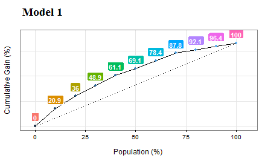

```{r ,results="hide", echo=FALSE}
library(knitr)
knitr::opts_chunk$set(out.width="400px", dpi=120)
knitr::opts_knit$set(base.dir = "exploratory_data_analysis")
```

# Annex 1: The magic of percentiles 

Percentile is such a crucial concept in data analysis that we are going to cover it extensively in this book. It considers each observation with respect to others. An isolated number may not be meaningful, but when it is compared with others the distribution concept appears.

Percentiles are used in profiling as well as evaluating the performance of a predictive model.

## How to calculate percentiles

There are several methods to get the percentile. Based on interpolations, the easiest way is to order the variable ascendantly, selecting the percentile we want (for example, 75%), and then observing _what is the maximum value if we want to choose the 75% of the ordered population_.

Now we are going to use the technique of keeping a small sample so that we can have maximum control over _what is going on_ behind the calculus.

We retain the random 10 countries and print the vector of `rural_poverty_headcount` which is the variable we are going to use.

```{r}
data_sample=filter(data_world_wide, Country.Name %in% c("Kazakhstan", "Zambia", "Mauritania", "Malaysia", "Sao Tome and Principe", "Colombia", "Haiti", "Fiji", "Sierra Leone", "Morocco")) %>% arrange(rural_poverty_headcount)

select(data_sample, Country.Name, rural_poverty_headcount)
```

Please note that the vector is ordered only for didactic purposes. _Remeber from the last section? Our eyes like order._ 

Now we apply  the `quantile` function on the variable `rural_poverty_headcount` (the percentage of the rural population living below the national poverty lines): 

```{r}
quantile(data_sample$rural_poverty_headcount)
```

**Analysis**

* **Percentile 50%**: 50% of the countries (five of them) have a `rural_poverty_headcount` below `51.7` We can check this in the last table: these countries are: Fiji, Colombia, Morocco, Kazakhstan, and Malaysia.
* **Percentile 25%**: 25% of the countries are below 20.87. Here we can see an interpolation because 25% represents ~2.5 countries. If we use this value to filter the countries, then we'll get three countries: Morocco, Kazakhstan, and Malaysia.

More information about the different types of quantiles and their interpolations: `help("quantile")`.

#### Getting semantical descriptions

From the last example we can state that: 

* _"Half of the countries have as much as 51.7% of rural poverty"_
* _"Three-quarters of the countries have a maximum of 64.4% regarding its rural poverty"_ (based on the countries ordered ascendantly).

We can also think of **using the opposite**: 

* _"A quarter of the countries that exhibit the highest rural poverty values have a percentage of at least 64.4%."_


## Calculating custom quantiles 

Typically, we want to calculate certain quantiles. The example variable will be the `gini_index`

**What is the Gini index?**
It is a measure of income or wealth inequality.
* A Gini coefficient of **zero** expresses **perfect equality** where all values are the same (for example, where everyone has the same income). 
* A Gini coefficient of **1** (or 100%) expresses **maximal inequality** among values (e.g., for a large number of people, where only one person has all the income or consumption while all others have none, the Gini coefficient will be very nearly one).

Source: https://en.wikipedia.org/wiki/Gini_coefficient

**Example in R**:

If we want to get the 20, 40, 60, and 80th quantiles of the Gini index variable, we use again the `quantile` function. 

The `na.rm=TRUE` parameter is necessary if we have empty values like in this case:

```{r, warning=FALSE}
## We also can get multiple quantiles at once
p_custom=quantile(data_world_wide$gini_index, probs = c(0.2, 0.4, 0.6, 0.8), na.rm=TRUE)
p_custom
```


## Indicating where most of the values are

In descriptive statistics, we want to describe the population in general terms. We can speak about ranges using two percentiles. Let's take the percentiles 10 and 90th to describe 80% of the population.


_The poverty ranges from 0.075% to 54.4% in 80% of the countries_. (80% because we did 90th–10th, focusing on the middle of the population.)

If we consider the 80% as the majority of the population, then we could say: _"Normally (or in general terms), poverty goes from 0.07% to 54.4%"_. This is a semantical description.

We looked at 80% of the population, which seems a good number to describe where most of the cases are. We also could have used the 90% range (percentile 95th - 0.5th). 

#### Is percentile related to quartile?

**Quartile** is a formal name for the 25, 50, and 75th percentiles (quarters or 'Q'). If we look at the 50% of the population, we need to subtract the 3rd quartile (or 75th percentile) from the 1st quartile (25th percentile) to get where 50% of data are concentrated, also known as the **inter-quartile range** or IQR.


Percentile vs. quantile vs. quartile

```
0 quartile = 0 quantile = 0 percentile
1 quartile = 0.25 quantile = 25 percentile
2 quartile = .5 quantile = 50 percentile (median)
3 quartile = .75 quantile = 75 percentile
4 quartile = 1 quantile = 100 percentile
```

Credits Ref. [1].

## Visualizing quantiles

Plotting a histogram alongisde the places where each percentile is can help us understand the concept:

```{r, profiling_numerical_variable, warning=FALSE, message=FALSE}
quantiles_var=quantile(data_world_wide$poverty_headcount_1.9, c(0.25, 0.5, 0.75), na.rm = T)

df_p=data.frame(value=quantiles_var, quantile=c("25th", "50th", "75th"))

library(ggplot2)
ggplot(data_world_wide, aes(poverty_headcount_1.9)) + geom_histogram() +
  geom_vline(data=df_p, 
             aes(xintercept=value, 
                 colour = quantile),
             show.legend = TRUE, linetype="dashed") + theme_light()

```

If we sum all the gray bars before the 25th percentile, then it will be around the height of the gray bars sum after the 75th percentile. 

In the last plot, the IQR appears between the first and the last dashed lines and contains 50% of the population.

## Rank and top/bottom '_X%_' concepts

The ranking concept is the same as the one seen in competitions. It allows us to answer _what is the country with the highest rate in ?_

We'll use the `dense_rank` function from the `ggplot2` package. It assigns the position (rank) to each country, but we need them in reverse order; that is, we assign the `rank = 1` to the highest value.

Now the variable will be: _Population living in slums is the proportion of the urban population living in slum households. A slum household is defined as a group of individuals living under the same roof and lacking one or more of the following conditions: access to improved water, access to improved sanitation, sufficient living area, and durability of housing._ 

The question to answer: _What are the top six countries with the highest rates of people living in slums?_

```{r}
library(dplyr)

## Creating rank variable 
data_world_wide$rank_pop_living_slums=dense_rank(-data_world_wide$pop_living_slums) 

# Ordering data by rank
data_world_wide=arrange(data_world_wide, rank_pop_living_slums)

# Printing the first six results
select(data_world_wide, Country.Name, rank_pop_living_slums) %>% head(.) 
```

We can also ask: _In which position is Ecuador?_

```{r}
filter(data_world_wide, Country.Name=="Ecuador") %>% select(rank_pop_living_slums)
```


#### Top and bottom 'X%' concepts

Other questions that we may be interested in answered: _What is the value for which I get the top 10% of lowest values?_

The 10th percentile is the answer:

```{r}
quantile(data_world_wide$pop_living_slums, probs=.1, na.rm = T)
```

Working on the opposite: _What is the value for which I get the bottom 10% of highest values?_

The 90th percentile is the answer, `quantile(data_world_wide$pop_living_slums, probs=.9, na.rm = T)`. We can filter all the cases above this value.

## Percentile in scoring data

There are two chapters that use this concept: 

* <a href="http://livebook.datascienceheroes.com/scoring/scoring.html" target="blank">Data Scoring</a>.
* <a href="http://livebook.datascienceheroes.com/model_performance/gain_lift.html" target="blank">Gain and Lift Analysis</a>.

The basic idea is to develop a predictive model that predicts a binary variable (`yes`/`no`). Suppose we need to score new cases, for example, to use in a marketing campaign. The question to answer is:

_What is the score value to suggest to sales people in order to capture 50% of potential new sales?_ The answer comes from a combination of percentile analysis on the scoring value plus the cumulative analysis of the current target.




<br>

#### Case study: distribution of wealth

The distribution of wealth is similar to the Gini index and is focused on inequality. It measures owner assets (which is different from income), making the comparison across countries more even to what people can acquire according to the place where they live. 
For a better definition, please go to the _Wikipedia_ article and _Global Wealth Report 2013_. Refs. [2] and [3] respectevely.

Quoting _Wikipedia_ (Ref. [2]):

> half of the world's wealth belongs to the top 1% of the population;

> the top 10% of adults hold 85% while the bottom 90% hold the remaining 15% of the world's total wealth; and

> the top 30% of adults hold 97% of the total wealth.

Just as we did before, from the third sentence we can state that: _"3% of total wealth is distributed to 70% of adults."_

The metrics `top 10%` and `top 30%` are the quantiles `0.1` and `0.3.` Wealth is the numeric variable.

<br>


## References


* [1] stats.stackexchange.com,  (2015, Jun 13), _Percentile vs quantile vs quartile_, Retrieved from <a href="https://stats.stackexchange.com/questions/156778/percentile-vs-quantile-vs-quartile" target="blank">https://stats.stackexchange.com/questions/156778/percentile-vs-quantile-vs-quartile</a>.

* [2] Wikipedia, (2017, May 15), _Distribution of wealth_, Retrieved from <a href="https://en.wikipedia.org/wiki/Distribution_of_wealth" target="blank">https://en.wikipedia.org/wiki/Distribution_of_wealth</a>.

* [3] Credit Suisse, (2013, Oct), _Global Wealth Report 2013_, <a href="https://publications.credit-suisse.com/tasks/render/file/?fileID=BCDB1364-A105-0560-1332EC9100FF5C83" target="blank">https://publications.credit-suisse.com/tasks/render/file/?fileID=BCDB1364-A105-0560-1332EC9100FF5C83</a>.


