# Correlation and Relationship


## What is this about?

This chapter contains both methodological and practical aspects of measuring correlation in variables. We will see that _correlation_ word can be translated into "**functional relationship**".

In methodological you will find the Anscombe Quartet, a set of four plots with dissimilar spatial distribution, but sharing the same correlation measure. We'll go one step ahead re-calculating their relationship though a more robust metric (MIC).

We will mention **Information Theory** several times, although by now it's not going to be covered at the mathematical level, it's planned to. Many algorithms are based on it, even deep learning.

Understanding these concepts in low dimension (two variables) and small data (a bunch of rows) allow us to better understand high dimensional data. Nonetheless, some real cases are only _small_ data.

From the practical point of view, you'll be able to replicate the analysis with your own data, profiling and exposing their relationships in fancy plots.

<br>


Let's starting loading all needed libraries.


```r
## Loading needed libraries
library(funModeling) ## contains heart_disease data
library(minerva) ## contains MIC statistic
library(ggplot2)
library(dplyr)
library(reshape2) 
library(gridExtra) ## allow us to plot two plots in a row
options(scipen=999) # disable cientific notation
```
<br>

## Linear correlation

Perhaps the most standard correlation measure for numeric variables is the `R statistic` (or Pearson coefficient) which goes from `1` _positive correlation_ to `-1` _negative correlation_. A value around `0` implies no correlation.

Consider the following example, which calculates R measure based on a target variable (for example to do feature engineering). Function `correlation_table` retrieves R  metric for all numeric variables skipping the categorical/nominal ones.


```r
correlation_table(data=heart_disease, str_target="has_heart_disease")
```

```
##                 Variable has_heart_disease
## 1      has_heart_disease              1.00
## 2 heart_disease_severity              0.83
## 3      num_vessels_flour              0.46
## 4                oldpeak              0.42
## 5                  slope              0.34
## 6                    age              0.23
## 7 resting_blood_pressure              0.15
## 8      serum_cholestoral              0.08
## 9         max_heart_rate             -0.42
```
Variable `heart_disease_severity` is the most important -numerical- variable, the higher its value the higher the chances of having a heart disease (positive correlation). Just the opposite to `max_heart_rate`, which has a negative correlation.

Squaring this number returns the `R-squared` statistic (aka `R2`), which goes from `0` _no correlation_ to `1` _high correlation_. 

R statistic is highly influenced by **outliers** and **non-linear** relationships.

<br>

### Correlation on Anscombe's Quartet

Take a look at the **Anscombe's quartet**, quoting <a href="https://en.wikipedia.org/wiki/Anscombe%27s_quartet" target="blank">Wikipedia</a>:

> They were constructed in 1973 by the statistician Francis Anscombe to demonstrate both the importance of graphing data before analyzing it and the effect of outliers on statistical properties. 

1973 and still valid, fantastic.

These four relationships are different, but all of them have the same R2: `0.816`.

Following example calculates the R2 and plot every pair.


```r
## Reading anscombe quartet data
anscombe_data=read.delim(file="https://raw.githubusercontent.com/pablo14/data-science-live-book/master/exploratory_data_analysis/anscombe_quartet.txt", header = T)

## calculating the correlation (R squared, or R2) for every pair, every value is the same: 0.86.
cor_1=cor(anscombe_data$x1, anscombe_data$y1)
cor_2=cor(anscombe_data$x2, anscombe_data$y2)
cor_3=cor(anscombe_data$x3, anscombe_data$y3)
cor_4=cor(anscombe_data$x4, anscombe_data$y4)

## defining the function
plot_anscombe <- function(x, y, value, type)
{
  # 'anscombe_data' is a global variable, this is a bad programming practice :D
  p=ggplot(anscombe_data, aes_string(x,y))  + geom_smooth(method='lm', fill=NA) + geom_point(aes(colour=factor(1), fill = factor(1)), shape=21, size = 2) + ylim(2, 13)+ xlim(4, 19) + theme_minimal() + theme(legend.position="none") +  annotate("text", x = 12, y =4.5, label = sprintf("%s: %s", type, round(value,2)))  
  
  return(p)
}

## plotting in a 2x2 grid
grid.arrange(plot_anscombe("x1", "y1", cor_1, "R2"), plot_anscombe("x2", "y2", cor_2, "R2"), plot_anscombe("x3", "y3", cor_3, "R2"), plot_anscombe("x4", "y4", cor_4, "R2"), ncol=2, nrow=2)
```

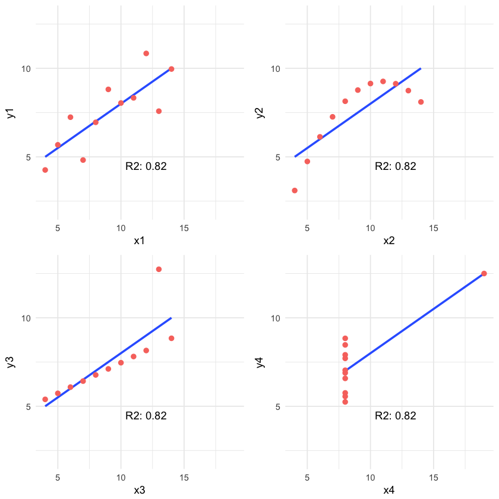

4-different plots, having the same `mean` for every `x` and `y` variable (9 and 7.501 respectively), and the same degree of correlation. You can check all the measures by typing `summary(anscombe_data)`. 

This is why is so important to plot relationships when analyzing correlations.

We'll back on this data later. It can be improved! First, we'll introduce some concepts of information theory.

<br>

## Correlation based on Information Theory

This relationships can be measure better with <a href="https://en.wikipedia.org/wiki/Information_theory">Information Theory</a> conepts. One of the many algortihms to measure correlation based on this is: **MINE**, acronym for: Maximal Information-based nonparametric exploration.

The implementation in R can be found in <a href="https://cran.r-project.org/web/packages/minerva/index.html">minerva</a> package. It's also available in other languages like Python.

<br>

### An example in R: A perfect relationship

Let's plot a non-linear relationship, directly based on a function (negative exponential), and print the MIC value.


```r
x=seq(0, 20, length.out=500)
df_exp=data.frame(x=x, y=dexp(x, rate=0.65))
ggplot(df_exp, aes(x=x, y=y)) + geom_line(color='steelblue') + theme_minimal()
```


```r
# position [1,2] contains the correlation of both variables, excluding the correlation measure of each variable against itself.

# Calculating linear correlation
res_cor_R2=cor(df_exp)[1,2]^2
sprintf("R2: %s", round(res_cor_R2,2))
```

```
## [1] "R2: 0.39"
```

```r
# now computing the MIC metric
res_mine=mine(df_exp)
sprintf("MIC: %s", res_mine$MIC[1,2])
```

```
## [1] "MIC: 1"
```

**MIC** value goes from 0 to 1. Being 0 implies no correlation and 1 highest correlation. The interpretation is the same as the R-squared.

<br>

### Results analysis 

The `MIC=1` indicates there is a perfect correlation between the two variables. If we were doing **feature engineering** this variable should be included.

Further than a simple correlation, what the MIC says is: "Hey these two variables show a functional relationship". 

In machine learning terms (and oversimplifying): "variable `y` is dependant of variable `x` and a function -that we don't know which one- can be found model the relationship."

This is tricky because that relationship was effectively created based on a function, an exponential one.

But let's continue with other examples...

<br>

## Adding noise

Noise is an undesired signal adding to the original one. In machine learning noise helps the model to get confused. Concretely: two identical input cases -for example customers- have different outcomes -one buy and the other doesn't-.

Now we are going to add some noise creating the `y_noise_1` variable.


```r
df_exp$y_noise_1=jitter(df_exp$y, factor = 1000, amount = NULL)
ggplot(df_exp, aes(x=x, y=y_noise_1)) + geom_line(color='steelblue') + theme_minimal()
```

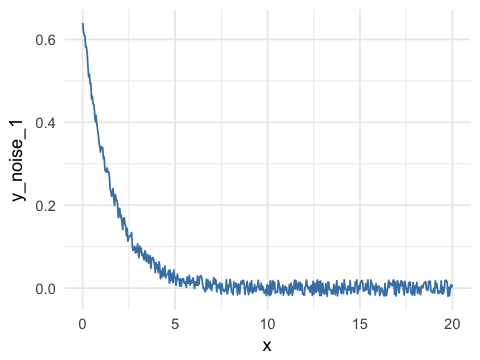

Calculating the correlation and MIC again, printing in both cases the entire matrix, which shows the correlation/MIC metric of each input variable against all the others including themselves.


```r
## calculating R squared
res_R2=cor(df_exp)^2
res_R2
```

```
##              x    y y_noise_1
## x         1.00 0.39      0.39
## y         0.39 1.00      0.99
## y_noise_1 0.39 0.99      1.00
```

```r
## Calculating mine
res_mine_2=mine(df_exp)

## Printing MIC 
res_mine_2$MIC
```

```
##              x    y y_noise_1
## x         1.00 1.00      0.73
## y         1.00 1.00      0.73
## y_noise_1 0.73 0.73      1.00
```

Adding noise to the data decreases the MIC value from 1 to 0.7226365 (-27%), and this is great!

R2 also decreased but just a little bit, from 0.3899148 to 0.3866319 (-0.8%). 

**Conclusion:** MIC reflects a noisy relationship much better than R2, and it's helpful to find correlated associations. 

**About the last example:** Generate data based on a function is only for teaching purposes. But the concept of noise in variables is quite common in _almost_ **every data set**, no matter its source. You don't have to do anything to add noise to variables, it's already there.
Machine learning models deal with this noise, by approaching to the _real_ shape of data.

It's quite useful to use the MIC measure to get a sense of the information present in a relationship between two variables.

<br>

## Measuring non-linearity (MIC-R2)

`mine` function returns several metrics, we checked only **MIC**, but due to the nature of the algorithm (you can check the original paper at ref. [1]), it computes more interesting indicators. Check them all by inspecting `res_mine_2` object.

One of them is `MICR2`, used as a measure of **non-linearity**. It is calculated by doing the: MIC - R2. Since R2 measures the linearity, a high `MICR2` would indicate a non-linear relationship.

We can check it by calculating the MICR2 manually, following two matrix returns the same result:


```r
# MIC r2: non-linearity metric
round(res_mine_2$MICR2, 3)
# calculating MIC r2 manually
round(res_mine_2$MIC-res_R2, 3)
```

Non-linear relationships are harder to build a model, even more using a linear algorithm like decision trees or linear regression. 

Imagine we need to explain the relationship to another person, we'll need "more words" to do it. It's easier to say: _"A increases as B increases and the ratio is always 3x"_ (if A=1 then B=3, linear). 

In comparison to: _"A increases as B increases, but A is almost 0 until B reaches the value 10, then A raises to 300; and when B reaches 15, A goes to 1000."_


```r
## creating data example
df_example=data.frame(x=df_exp$x, y_exp=df_exp$y, y_linear=3*df_exp$x+2)

## getting mine metrics
res_mine_3=mine(df_example)

## generating labels to print the results
results_linear=sprintf("MIC: %s \n MIC-R2 (non-linearity): %s", res_mine_3$MIC[1,3],round(res_mine_3$MICR2[1,3],2))

results_exp=sprintf("MIC: %s \n MIC-R2 (non-linearity): %s", res_mine_3$MIC[1,2],round(res_mine_3$MICR2[1,2],4))

## Plotting results 
## Creating plot exponential variable
p_exp=ggplot(df_example, aes(x=x, y=y_exp)) + geom_line(color='steelblue') + annotate("text", x = 11, y =0.4, label = results_exp) + theme_minimal()

## Creating plot linear variable
p_linear=ggplot(df_example, aes(x=x, y=y_linear)) + geom_line(color='steelblue') + annotate("text", x = 8, y = 55, label = results_linear) + theme_minimal()
grid.arrange(p_exp,p_linear,ncol=2)
```

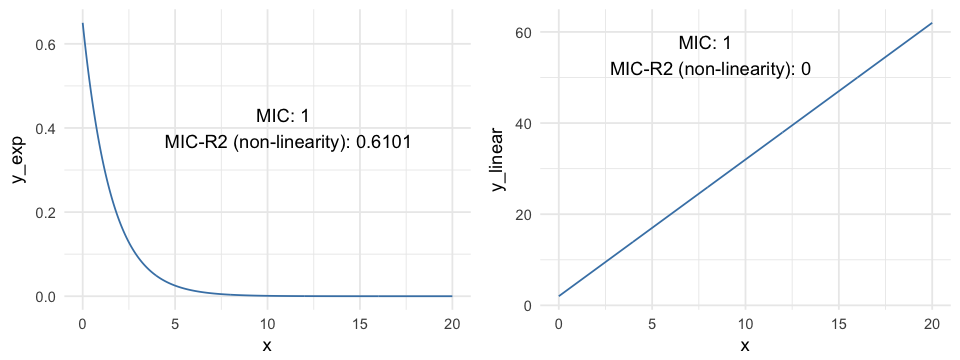

<br>

Both plots show a perfect correlation (or relationship), holding an MIC=1.
Regarding non-linearity, MICR2 behaves as expected, in `y_exp`=0.6101, and in `y_linear`=0. 

This point is important since the **MIC behaves like R2 does in linear relationships**, plus it adapts quite well to **non-linear** relationships as we saw before, retrieving a particular score metric (`MICR2`) to profile the relationship. 

<br>

## Measuring information on Anscombe Quartet

Remember the example we review at the beginning? Every pair of Anscombe Quartet returns a **R2 of 0.86**. But based on its plots it was clearly that not every pair exhibits neither a good correlation nor a similar distribution of `x` and `y`.

But what happen if we measure the relationship with a metric based on Information Theory? Yes, MIC again.


```r
## calculating the MIC for every pair
mic_1=mine(anscombe_data$x1, anscombe_data$y1, alpha=0.8)$MIC
mic_2=mine(anscombe_data$x2, anscombe_data$y2, alpha=0.8)$MIC
mic_3=mine(anscombe_data$x3, anscombe_data$y3, alpha=0.8)$MIC
mic_4=mine(anscombe_data$x4, anscombe_data$y4, alpha=0.8)$MIC

## plotting MIC in a 2x2 grid
grid.arrange(plot_anscombe("x1", "y1", mic_1, "MIC"), plot_anscombe("x2", "y2", mic_2,"MIC"), plot_anscombe("x3", "y3", mic_3,"MIC"), plot_anscombe("x4", "y4", mic_4,"MIC"), ncol=2, nrow=2)
```

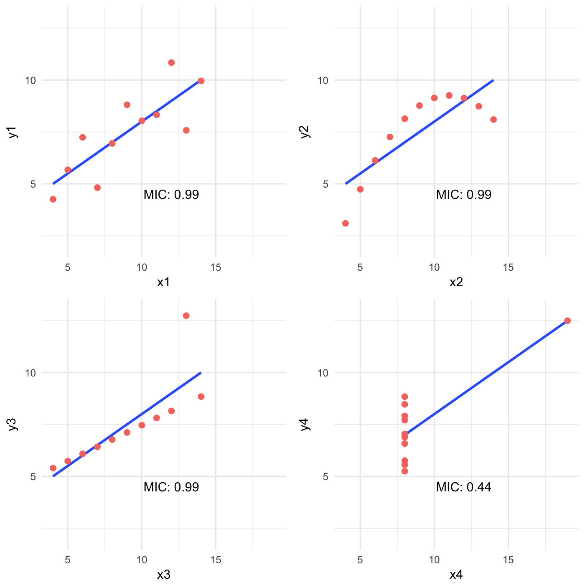

As you may notice we increased the `alpha` value to 0.8, this is a good practice -according to the documentation- when we analyzed small samples. The default value is 0.6 and its maximum 1.

In this case, MIC value spotted the most spurious relationship in the pair `x4 - y4`. Probably due to a few cases per plot (11 rows) the MIC was the same for all the others pairs. Having more cases will show different MIC values.

But when combining the MIC with **MIC-R2** (non-linearity measurement) new insights appears:


```r
## Calculating the MIC for every pair, note the "MIC-R2" object has the hyphen when the input are two vectors, unlike when it takes a data frame which is "MICR2".
mic_r2_1=mine(anscombe_data$x1, anscombe_data$y1, alpha = 0.8)$`MIC-R2`
mic_r2_2=mine(anscombe_data$x2, anscombe_data$y2, alpha = 0.8)$`MIC-R2`
mic_r2_3=mine(anscombe_data$x3, anscombe_data$y3, alpha = 0.8)$`MIC-R2`
mic_r2_4=mine(anscombe_data$x4, anscombe_data$y4, alpha = 0.8)$`MIC-R2`

## Ordering according mic_r2
df_mic_r2=data.frame(pair=c(1,2,3,4), mic_r2=c(mic_r2_1,mic_r2_2,mic_r2_3,mic_r2_4)) %>% arrange(-mic_r2)
df_mic_r2
```

```
##   pair mic_r2
## 1    2   0.33
## 2    3   0.33
## 3    1   0.33
## 4    4  -0.23
```


Ordering decreasingly by its **non-linearity** the results are consisent with the plots: 2 > 3 > 1 > 4.
Something strange for pair 4, a negative number. This is because MIC is lower than the R2. A relationship that worth to be plotted.

<br>

## Measuring non-monotonicity: MAS measure

MINE can also help us to profile time series regarding its non-monotonicity with **MAS** (maximum asymmetry score).

A monotonic series is such it never changes its tendency, it always goes up or down. More on this on ref [3].

Following example simulates two-time series, one not-monotonic `y_1` and the other monotonic `y_2`.


```r
# creating sample data (simulating time series)
time_x=sort(runif(n=1000, min=0, max=1))
y_1=4*(time_x-0.5)^2
y_2=4*(time_x-0.5)^3

# Calculating MAS for both series
mas_y1=round(mine(time_x,y_1)$MAS,2)
mas_y2=mine(time_x,y_2)$MAS

## Putting all together
df_mono=data.frame(time_x=time_x, y_1=y_1, y_2=y_2)

## Plotting
p_y_1=ggplot(df_mono, aes(x=time_x, y=y_1)) + geom_line(color='steelblue') + theme_minimal()  + annotate("text", x = 0.45, y =0.75, label = sprintf("MAS=%s (goes down \n and up => not-monotonic)", mas_y1))

p_y_2=ggplot(df_mono, aes(x=time_x, y=y_2)) + geom_line(color='steelblue') + theme_minimal() + annotate("text", x = 0.43, y =0.35, label = sprintf("MAS=%s (goes up => monotonic)", mas_y2))

grid.arrange(p_y_1,p_y_2,ncol=2)
```

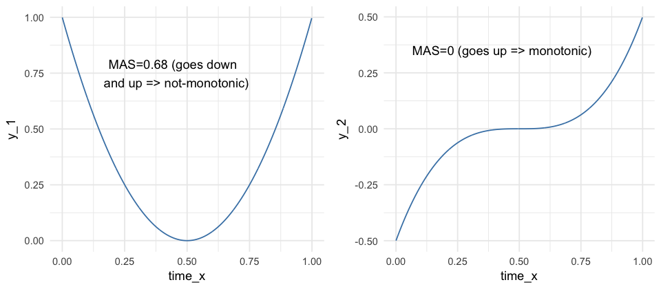

<br>

### A more real example: Time Series

Consider the following case which contains three-time series: `y1`, `y2` and `y3`. They can be profiled concerning its non-monotonicity or overall growth trend.


```r
## reading data
df_time_series=read.delim(file="https://raw.githubusercontent.com/pablo14/data-science-live-book/master/exploratory_data_analysis/df_time.txt")

## converting to long format so they can be plotted
df_time_series_long=melt(df_time_series, id="time")

## Plotting
plot_time_series=ggplot(data=df_time_series_long,
       aes(x=time, y=value, colour=variable)) +
       geom_line() + theme_minimal()  + scale_color_brewer(palette="Set2")

plot_time_series
```

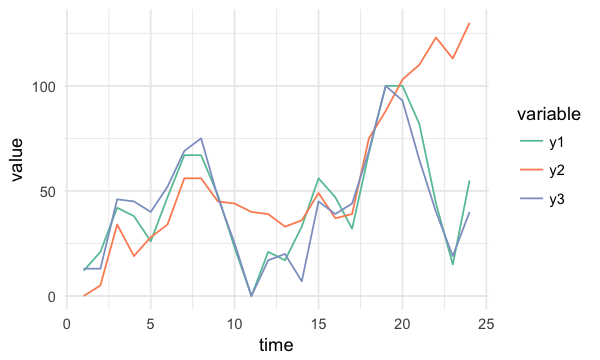


```r
# Calculating and printing MAS values for time series data
mine_ts=mine(df_time_series)
mine_ts$MAS 
```

```
##      time    y1    y2    y3
## time 0.00 0.120 0.105 0.191
## y1   0.12 0.000 0.068 0.081
## y2   0.11 0.068 0.000 0.057
## y3   0.19 0.081 0.057 0.000
```

<br>

We need to look at `time` column, so we've got the MAS value of each series regarding the time.
`y2` is the most not-monotonic series, and it can be confirmed by looking at it. It seems to be always up.

**MAS summary:**

* MAS ~ 0 indicates monotonic function
* MAS ~ 1 indicates non-monotonic function (_always_ up or down)


<br>

## Correlation between time series

MIC metric can also measure the **correlation in time series**, it is not a general purpose tool but can be helpful to compare different series quickly.

This section is based on the same data we used in MAS example.


```r
## printing again the 3-time series
plot_time_series
```

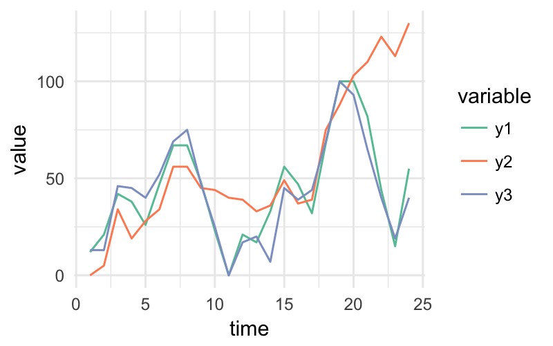

```r
# Printing MIC values
mine_ts$MIC
```

```
##      time   y1   y2   y3
## time 1.00 0.38 0.69 0.34
## y1   0.38 1.00 0.62 0.71
## y2   0.69 0.62 1.00 0.52
## y3   0.34 0.71 0.52 1.00
```
<br>

Now we need to look at `y1` column. According to MIC measure, we can confirm the same that it's shown in last plot: 

`y1` is more similar to `y3` (MIC=0.709) than what is `y2` (MIC=0.61). 

<br>

### Going further: Dynamic Time Wrapping

MIC will not be helpful for more complex esenarios having time series which vary in speed, you would use <a href="https://en.wikipedia.org/wiki/Dynamic_time_warping" target="blank">dynamic time wrapping</a> technique (**DTW**).

Let's use an image to catch up the concept visually:


_Image source: Ref [4]._

The last image shows two different approaches to compare time series, and the **euclidean** is more similar to MIC measure. While DTW can track similarities occurring at different times.

A nice implementation in **R**: <a href="http://dtw.r-forge.r-project.org/">dtw package</a>.

Finding correlations between time series is another way of performing **time series clustering**.

<br>

## Correlation on categorical variables

MINE -and many other algorithms- only work with numerical data. We need to do a **data preparation** trick, converting every categorical variable into flag (or dummy variable).

If the original categorical variable has 30 possible values, it will result in 30 new columns holding the value `0` or `1`, when `1` represents the presence of that category in the row.

If we use package `caret` from R, this conversion only takes two lines of code:


```r
library(caret)

## selecting just a few variables
heart_disease_2=select(heart_disease, max_heart_rate, oldpeak, thal, chest_pain,exer_angina, has_heart_disease)

## this conversion from categorical to a numeric is merely to have a cleaner plot
heart_disease_2$has_heart_disease=ifelse(heart_disease_2$has_heart_disease=="yes", 1, 0)

## it converts all categorical variables (factor and character for R) into numerical variables
## skipping the original so the data is ready to use
dmy = dummyVars(" ~ .", data = heart_disease_2)
heart_disease_3 = data.frame(predict(dmy, newdata = heart_disease_2))

# Important: If you recieve this message `Error: Missing values present in input variable 'x'. Consider using use = 'pairwise.complete.obs'.` is because data has missing values.
## Please don't omit NA without an impact analysis first, in this case it is not important. 
heart_disease_4=na.omit(heart_disease_3)
  
## compute the mic!
mine_res_hd=mine(heart_disease_4)
```

Printing a sample...


```r
mine_res_hd$MIC[1:5,1:5]
```

```
##                max_heart_rate oldpeak thal.3 thal.6 thal.7
## max_heart_rate           1.00    0.24  0.244  0.120  0.184
## oldpeak                  0.24    1.00  0.175  0.111  0.157
## thal.3                   0.24    0.18  0.992  0.073  0.710
## thal.6                   0.12    0.11  0.073  0.327  0.044
## thal.7                   0.18    0.16  0.710  0.044  0.964
```

Where column `thal.3` takes a value of 1 when `thal=3`.

<br>

### Printing some fancy plots! 

We'll use `corrplot` package in R which can plot a `cor` object (classical correlation matrix), or any other matrix. We will plot **MIC** matrix in this case, but any other can be used as well, for example, **MAS** or another metric that returns an squared matrix of correlations.

The two plots are based on the same data but display the correlation in different ways. 


```r
library(corrplot) ## library wto plot that matrix
library(RColorBrewer) # to use the color pallete brewer.pal

# hack to visualize the maximum value of the scale excluding the diagonal (variable against itself)
diag(mine_res_hd$MIC)=0

## Correlation plot with circles. 
corrplot(mine_res_hd$MIC, method="circle",col=brewer.pal(n=10, name="PuOr"),
         type="lower", # only display upper diagonal
         tl.col="red", tl.cex = 0.9, tl.srt=90, #label color, size and rotation
         diag=FALSE, # dont print diagonal (var against itself)
         is.corr = F # accept a any matrix, mic in this case (not a correlation element),
        
)
```

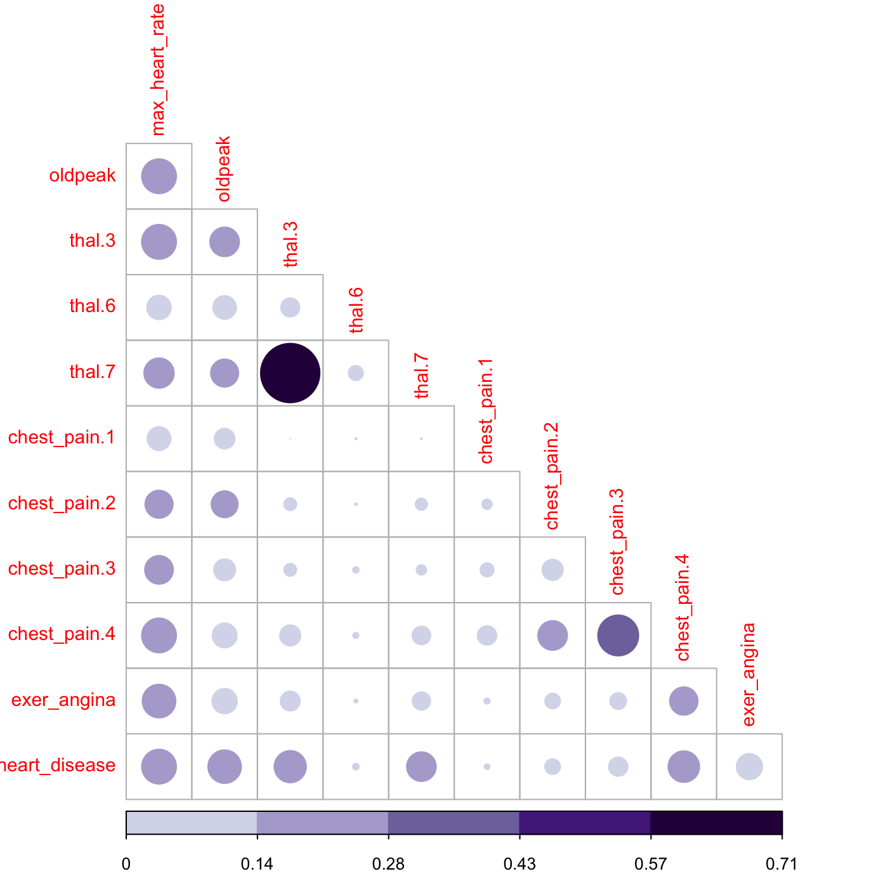

```r
## Correlation plot with color and correlation MIC
corrplot(mine_res_hd$MIC, method="color",
         type="lower", number.cex=0.8,
         addCoef.col = "black", # Add coefficient of correlation
         tl.col="red", tl.srt=90, tl.cex = 0.9,
         diag=FALSE, is.corr = F 
)
```

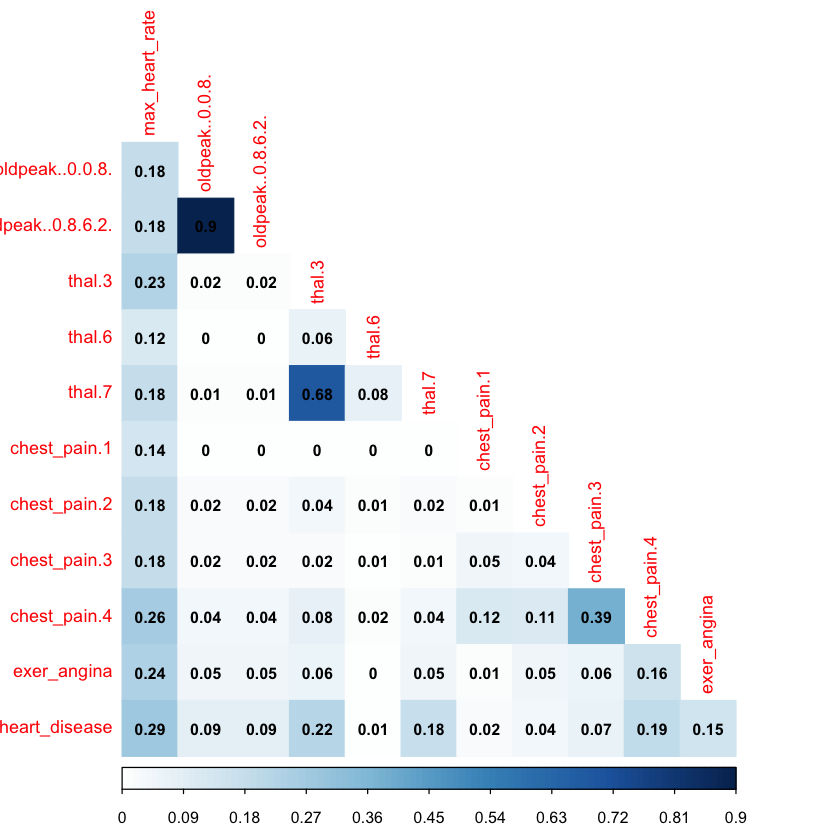

Just change the first parameter -`mine_res_hd$MIC`- to the matrix you want and reuse with your data. 

<br>

### A comment about this kind of plots

They are useful only when the number of variables are not big. Or if you perform a variable selection first, keeping in mind that every variable should be numerical. 

If there is some categorical variable in the selection you can convert it into numerical first and inspect the relationship between the variables, thus sneak peak how certain values in categorical variables are more related to certain outcomes, like in this case.

<br>

### How about some insights from the plots?

Since the variable to predict is `has_heart_disease`, it appears something interesting, to have a heart disease is more correlated to `thal=3` than to value `thal=6`.

Same analysis for variable `chest_pain`, a value of 4 is more dangerous than a value of 1.

And we can check it with other plot:


```r
cross_plot(heart_disease, str_input = "chest_pain", str_target = "has_heart_disease", plot_type = "percentual")
```

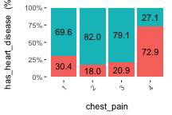

The likelihood of having a heart disease is 72.9% if the patient has `chest_pain=4`. More than 2x more likely if she/(he) has `chest_pain=1` (72.9 vs 30.4%).

<br>

**Some thoughts...**

The data is the same, but the approach to browse it is different. The same goes when we are creating a predictive model, the input data in the _N-dimensional_ space can be approached through different models like support vector machine, a random forest, etc. 

Like a photographer shooting from different angles, or different cameras. The object is always the same, but the perspective gives different information.

Combining raw tables plus different plots gives us a more real and complementary object perspective.

<br>

## Feature engineering based on information theory

There is a complete chapter treating <a href="http://livebook.datascienceheroes.com/selecting_best_variables/introduction.html" target="blank">**Feature Engineering**</a>. So in this section, we cover a quick overview. 

Based on MIC measure, mine function can receive the index of the column to predict (or to get all the correlations against only one variable).


```r
## Getting the index of the variable to predict: has_heart_disease
target="has_heart_disease"
index_target=grep(target, colnames(heart_disease_4))

## master takes the index column number to calculate all the correlations
mic_predictive=mine(heart_disease_4, master = index_target)$MIC

## creating the data frame containing the results, ordering descently by its correlation and excluding the correlation of target vs itself
df_predictive=data.frame(variable=rownames(mic_predictive), mic=mic_predictive[,1], stringsAsFactors = F) %>% arrange(-mic) %>% filter(variable!=target)

# creating a colorful plot showing importance variable  based on MIC measure
ggplot(df_predictive, aes(x=reorder(variable, mic),y=mic, fill=variable)) + geom_bar(stat='identity') + coord_flip() + theme_bw() + xlab("") + ylab("Variable Importance (based on MIC)") + guides(fill=FALSE)
```

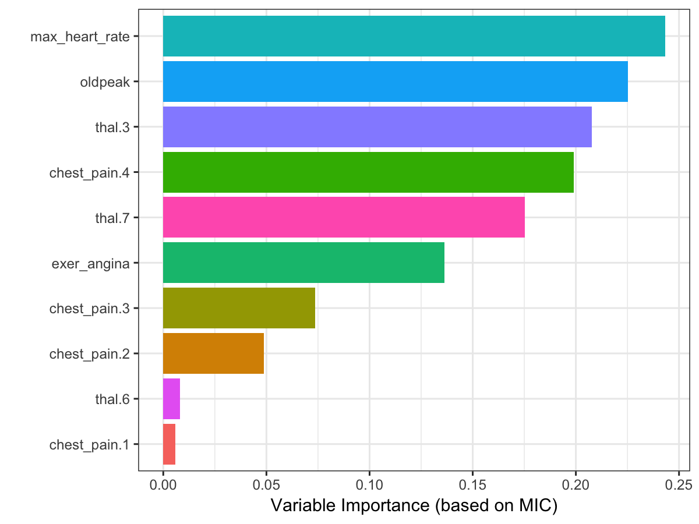

Although it is recommended to run correlations among all variables in order to exclude correlated input features.

<br>

### Practice advice for using `mine` 

If it lasts too much time to finish, consider taking a sample.
If the amount of data is too little, consider setting a higher number in `alpha` parameter, 0.6 is its default.
Also, it can be run in parallel, just setting `n.cores=3` in case you have 4 cores. A general good practice when running parallel processes, the extra core will be used by the operating system.

<br>


## But just MINE covers this?

No. We used only MINE suite, but there are other algortihms related to <a href="http://www.scholarpedia.org/article/Mutual_information" target="blank">mutual information</a>. 
In R some of the packages are: <a href="https://cran.r-project.org/web/packages/entropy/entropy.pdf" target="blank">entropy</a> and <a href="https://artax.karlin.mff.cuni.cz/r-help/library/infotheo/html/mutinformation.html" target="blank">infotheo</a>.

In **Python** mutual information can be calculated through scikit-learn, <a href="stackoverflow.com/questions/20491028/optimal-way-to-compute-pairwise-mutual-information-using-numpy" target="blank">here an example</a>.

The concept transcends the tool.

<br>

### Another correlation example (mutual information)

This time we'll use `infotheo` package, we need first to do a **data preparation** step, applying a `discretize` function (or binning) function present in the package. It converts every numerical variable into categorical based on equal frequency criteria. 

Next code will create the correlation matrix as we seen before, but based on the mutual information index. 


```r
library(infotheo)
## discretizing every variable
heart_disease_4_disc=discretize(heart_disease_4) 

## calculating "correlation" based on mutual information
heart_info=mutinformation(heart_disease_4_disc, method= "emp")

# hack to visualize the maximum value of the scale excluding the diagonal (var against itself)
diag(heart_info)=0

## Correlation plot with color and correlation Mutual Information from Infotheo package. This line only retrieves the plot of the right. 
corrplot(heart_info, method="color",type="lower", number.cex=0.6,addCoef.col = "black", tl.col="red", tl.srt=90, tl.cex = 0.9, diag=FALSE, is.corr = F)
```


Correlation score based on mutual information ranks relationships pretty similar to MIC, doesn’t it?

<br>

## Information Measures: A general perspective

Further than correlation, MIC or other information metric measure if there is a _functional relationship_. 

A high MIC value indicates that the relationship between the two variables can be explained by a function. Is
our job to find that function or predictive model.

This analysis is extended to n-variables, this book introduces another algorithm in the selecting best variables chapter. 

Some predictive models perform better than other, but if the relationship is absolutely noisy no matter how advance the algorithm is, it will end up in bad results. 

<br>

More to come on **Information Theory**. By now you check these didactical lectures: 

* 7-min introductory video https://www.youtube.com/watch?v=2s3aJfRr9gE 
* http://alex.smola.org/teaching/cmu2013-10-701x/slides/R8-information_theory.pdf
* http://www.scholarpedia.org/article/Mutual_information

<br>

## Conclussions

Anscombe's quartet taught us the good practice of getting the _raw statistic_ together with a plot.

We could see how **noise** can affect the relationship between two variables, and this phenomenon always appears in data. Noise in data confuses the predictive model. 

Noise is related to error, and it can be studied with measures based on information theory such as 
**mutual information** and **maximal information coefficient**, which go one further step than typical R squared. 

These methods are applicable in **feature engineering** as a method which does not rely on a predictive model to rank most important variables. Also applicable to cluster time series.

Next recommended chapter: <a href="http://livebook.datascienceheroes.com/selecting_best_variables/introduction.html" target="blank">Selecting best variables.</a>

<br>

### References

* [1] Original MINE paper: <a href="http://www.uvm.edu/~cdanfort/csc-reading-group/reshef-correlation-science-2011.pdf" target="blank">Detecting Novel Associations in Large Data Sets</a>.
* [2] Some uses and explanations of MINE measurments in clinical data <a href="https://www.ncbi.nlm.nih.gov/pmc/articles/PMC3561932/" target="blank">Characterizing Non-Linear Dependencies in clinical data</a>
* [3] Wikipedia <a href="https://en.wikipedia.org/wiki/Monotonic_function" target="blank">Monotonic function</a>
* [4] Dynamic time wrapping <a href="https://izbicki.me/blog/converting-images-into-time-series-for-data-mining.html" target="blank">Converting images into time series for data mining</a>

