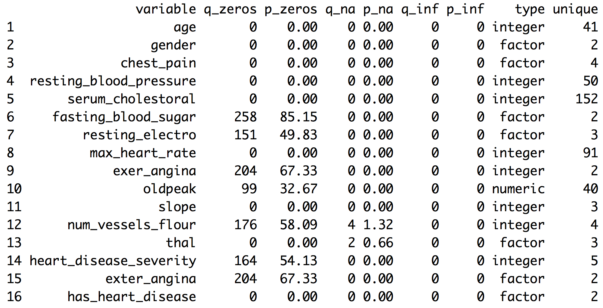
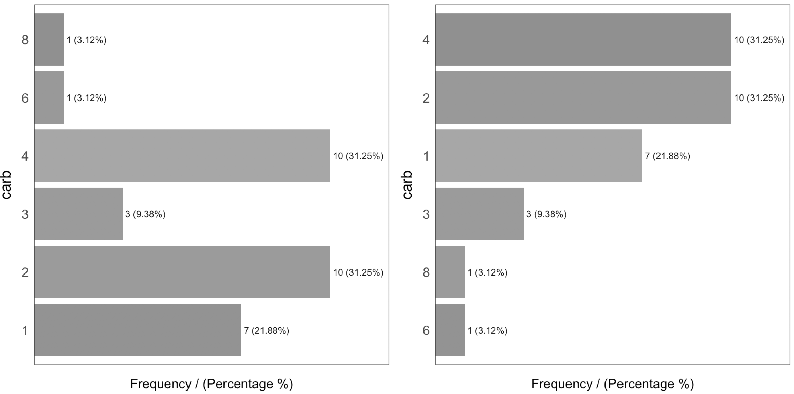
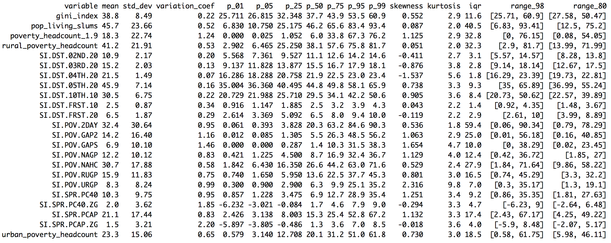

```{r ,results="hide", echo=FALSE}
library(knitr)
knitr::opts_chunk$set(out.width="600px", dpi=200)
knitr::opts_knit$set(base.dir = "exploratory_data_analysis")
```

# The voice of the numbers: Profiling Data


_Image credit:By Binette228 (Own work) [CC BY-SA 3.0, via Wikimedia Commons_

> The voice of the numbers: <a href="https://en.wikipedia.org/wiki/Eduardo_Galeano" target="blank">Eduardo Galeano</a>. Writer and novelist.

The data we explore could be like Egyptian hieroglyphs without a correct interpretation. Profiling is the very first step in a series of iterative stages in the pursuit of finding what the data want to tell us, if we are patient enough to listen. 

This chapter will cover, with a few functions, a complete data profiling. This should be the entry step in a data project, where we start by knowing the correct data types and exploring distributions in numerical and categorical variables.

It also focuses on the extraction of semantic conclusions, which is useful when writing a report for non-technical people. 

**What are we going to review in this chapter?**

* **Dataset health status**:  
  - Getting metrics like total rows, columns, data types, zeros, and missing values
  - How each of the previous items impacts on different analysis
  - How to quickly filter and operate on (and with) them, to clean the data
* **Univariate analysis in categorical variable**: 
  - Frequency, percentage, cumulative value, and colorful plots 
* **Univariate analysis with numerical variables**: 
  - Percentile, dispersion, standard deviation, mean, top and bottom values
  - Percentile vs. quantile vs. quartile
  - Kurtosis, skewness, inter-quartile range, variation coefficient
  - Plotting distributions 
  - Complete **case study** based on Data World, data preparation, and data analysis

<br>

Functions summary review in the chapter:

* `df_status(data)`: Profiling dataset structure
* `describe(data)`:  Numerical and categorical profiling (quantitative)
* `freq(data)`: Categorical profiling (quantitative and plot).
* `profiling_num(data)`: Profiling for numerical variables (quantitative)
* `plot_num(data)`: Profiling for numerical variables (plots)

Note: `describe` is in the `Hmisc` package while remaining functions are in `funModeling.`

<br>

## Dataset health status

The quantity of zeros, NA, Inf, unique values as well as the data type may lead to a good or bad model. Here's an approach to cover the very first step in data modeling. 

First, we load the `funModeling` and `dplyr` libraries.

```{r lib, results="hide", message=FALSE}
## Loading funModeling!
library(funModeling)
library(dplyr)
data(heart_disease)
```

### Checking missing values, zeros, data type, and unique values

Probably one of the first steps, when we get a new dataset to analyze, is to know if there are missing values (`NA` in **R**) and the data type.

The `df_status` function coming in `funModeling` can help us by showing these numbers in relative and percentage values. It also retrieves the infinite and zeros statistics.


```{r df_status, eval=FALSE}
## Profiling the data input
df_status(heart_disease)
```


* `q_zeros`: quantity of zeros (`p_zeros`: in percent)
* `q_inf`:  quantity of infinite values (`p_inf`: in percent)
* `q_na`:  quantity of NA (`p_na`: in percent)
* `type`: factor or numeric
* `unique`: quantity of unique values

### Why are these metrics important?

* **Zeros**: Variables with **lots of zeros** may not be useful for modeling and, in some cases, they may dramatically bias the model.
* **NA**: Several models automatically exclude rows with NA (**random forest** for example). As a result, the final model can be biased due to several missing rows because of only one variable. For example, if the data contains only one out of 100 variables with 90% of NAs, the model will be training with only 10% of the original rows.
* **Inf**: Infinite values may lead to an unexpected behavior in some functions in R.
* **Type**: Some variables are encoded as numbers, but they are codes or categories and the models **don't handle them** in the same way.
* **Unique**: Factor/categorical variables with a high number of different values (~30) tend to do overfitting if the categories have low cardinality (**decision trees,** for example).


<br>


### Filtering unwanted cases

The function `df_status` takes a data frame and returns a _status table_ that can help us quickly remove features (or variables) based on all the metrics described in the last section. For example:


**Removing variables with a _high number_ of zeros**

```{r profiling_data}
## Profiling the Data Input
my_data_status=df_status(heart_disease, print_results = F)

# Removing variables with 60% of zero values
vars_to_remove=filter(my_data_status, p_zeros > 60)  %>% .$variable
vars_to_remove

## Keeping all columns except the ones present in 'vars_to_remove' vector
heart_disease_2=select(heart_disease, -one_of(vars_to_remove))
```


**Ordering data by percentage of zeros**

```{r profiling_data_2}
arrange(my_data_status, -p_zeros) %>% select(variable, q_zeros, p_zeros)
```

<br>

The same reasoning applies when we want to remove (or keep) those variables above or below a certain threshold. Please check the missing values chapter to get more information about the implications when dealing with variables containing missing values.

<br>

### Going deep into these topics

Values returned by `df_status` are deeply covered in other chapters:

* **Missing values** (NA) treatment, analysis, and imputation are deeply covered in the <a href="http://livebook.datascienceheroes.com/data_preparation/treating_missing_data.html">Missing Data</a> chapter.
* **Data type**, its conversions and implications when handling different data types and more are covered in the <a href="http://livebook.datascienceheroes.com/data_preparation/data_types.html">Data Types</a> chapter.
* A high number of **unique values** is synonymous for  high-cardinality variables. This situation is studied in both chapters:
    + <a href="http://livebook.datascienceheroes.com/data_preparation/high_cardinality_descriptive_stats.html">High Cardinality Variable in Descriptive Stats</a>.
    + <a href="http://livebook.datascienceheroes.com/data_preparation/high_cardinality_predictive_modeling.html">High Cardinality Variable in Predictive Modeling</a>.

<br>

### Getting other common statistics: **total rows**, **total columns** and **column names**:

```{r}
# Total rows
nrow(heart_disease)

# Total columns
ncol(heart_disease)

# Column names
colnames(heart_disease)
```

<br>

---

## Profiling categorical variables

_Make sure you have the latest 'funModeling' version (>= 1.6)._

Frequency or distribution analysis is made simple by the `freq` function. This retrieves the distribution in a table and a plot (by default) and shows the distribution of absolute and relative numbers.

If you want the distribution for two variables: 

```{r profiling_categorical_variable,fig.height=3, fig.width=5}
freq(data=heart_disease, str_input = c('thal','chest_pain'))
```

As well as in the remaining `funModeling` functions, if `str_input` is missing, then it will run for all factor or character variables present in a given data frame:

```{r, eval=F}
freq(data=heart_disease)
```
 

If we only want to print the table excluding the plot, then we set the `plot` parameter to `FALSE`.
The `freq` example can also handle a **single variable** as an input. 
By _default_, `NA` values **are considered** in both the table and the plot. If it is needed to exclude the `NA` then set `na.rm = FALSE`.
Both examples in the following line: 

```{r, eval=F}
freq(data=heart_disease$thal, plot = FALSE, na.rm = FALSE)
```

If only one variable is provided, then `freq` returns the printed table; thus, it is easy to perform some calculations based on the variables it provides. 
* For example, to print the categories that represent most of the 80% of the share (based on `cumulative_perc < 80`). 
* To get the categories belonging to the **long tail**, i.e., filtering by `percentage < 1` by retrieving those categories appearing less than 1% of the time.

In addition, as with the other plot functions in the package, if there is a need to export plots, then add the `path_out` parameter, which will create the folder if it's not yet created.

```{r, eval=F}
freq(data=heart_disease, path_out='my_folder')
```

#### Analysis

The output is ordered by the `frequency` variable, which quickly analyzes the most frequent categories and how many shares they represent (`cummulative_perc` variable). In general terms, we as human beings like order. If the variables are not ordered, then our eyes start moving over all the bars to do the comparison and our brains place each bar in relation to the other bars.

Check the difference for the same data input, first without order and then with order:



Generally, there are just a few categories that appear most of the time. 

A more complete analysis is in <a href="http://livebook.datascienceheroes.com/data_preparation/high_cardinality_descriptive_stats.html">High Cardinality Variable in Descriptive Stats</a>.

<br>

### Introducing the `describe` function

This function comes in the `Hmisc` package and allows us to quickly profile a complete dataset for both numerical and categorical variables. In this case, we'll select only two variables and we will analyze the result.

```{r}
## Just keeping two variables to use in this example
heart_disease_3=select(heart_disease, thal, chest_pain)

## Profiling the data!
describe(heart_disease_3)
```

Where: 
* `n`: quantity of non-`NA` rows. In this case, it indicates there are `301` patients containing a number.
* `missing`: number of missing values. Summing this indicator to `n` gives us the total number of rows.
* `unique`: number of unique (or distinct) values.

The other information is pretty similar to the `freq` function and returns between parentheses the total number in relative and absolute values for each different category.

<br>

---

## Profiling numerical variables

This section is separated into two parts:

* Part 1: Introducing the “World Data” case study
* Part 2: Doing the numerical profiling in R

If you don’t wan't to know how the data preparation stage from Data World is calculated, then you can jump to "Part 2: Doing the numerical profiling in R", when the profiling started.

### Part 1: Introducing the World Data case study

This contains many indicators regarding world development. Regardless the profiling example, the idea is to provide a ready-to-use table for sociologists, researchers, etc. interested in analyzing this kind of data.

The original data source is: <a href="http://databank.worldbank.org/data/reports.aspx?source=2&Topic=11#" target="blank">http://databank.worldbank.org</a>. There you will find a data dictionary that explains all the variables.

First, we have to do some data wrangling. We are going to keep with the newest value per indicator.

```{r}
library(Hmisc)

# Loading data from the book repository without altering the format
data_world=read.csv(file = "https://raw.githubusercontent.com/pablo14/data-science-live-book/master/exploratory_data_analysis/World_Development_Indicators.csv", header = T, stringsAsFactors = F, na.strings = "..")

## Excluding missing values in Series.Code. The data downloaded from the web page contains four lines with "free-text" at the bottom of the file.
data_world=filter(data_world, Series.Code!="")

# The magical function that keeps the newest values for each metric. If you're not familiar with R, then skip it.
max_ix<-function(d) 
{
  ix=which(!is.na(d))
  res=ifelse(length(ix)==0, NA, d[max(ix)])
  return(res)
}

data_world$newest_value=apply(data_world[,5:ncol(data_world)], 1, FUN=max_ix)

## Printing the first three rows
head(data_world, 3)
```

The columns `Series.Name` and `Series.Code` are the indicators to be analyzed. 
`Country.Name` and `Country.Code` are the countries. Each row represents a unique combination of country and indicator. 
Remaining columns, `X1990..YR1990.` (year 1990),`X2000..YR2000.` (year 2000), `X2007..YR2007.` (year 2007), and so on indicate the metric value for that year, thus each column is a year. 

<br>


### Taking a data scientist decision

There are many `NAs` because some countries don't have the measure of the indicator in those years. At this point, we need to **take a decision** as a data scientist. Probably no the optimal if we don’t ask to an expert, e.g., a sociologist.

What to do with the `NA` values? In this case, we are going to to keep with the **newest value** for all the indicators. Perhaps this is not the best way to extract conclusions for a paper as we are going to compare some countries with information up to 2016 while other countries will be updated only to 2009. To compare all the indicators with the newest data is a valid approach for the first analysis.

Another solution could have been to keep with the newest value, but only if this number belongs to the last five years. This would reduce the number of countries to analyze. 

These questions are impossible to answer for an _artificial intelligence system_, yet the decision can change the results dramatically.

**The last transformation**

The next step will convert the last table from _long_ to _wide_ format. In other words, each row will represent a country and each column an indicator (thanks to the last transformation that has the _newest value_ for each combination of indicator-country).

The indicator names are unclear, so we will "translate" a few of them.

```{r}
## Get the list of indicator descriptions.
names=unique(select(data_world, Series.Name, Series.Code))
head(names, 5)

## Convert a few
df_conv_world=data.frame(new_name=c("urban_poverty_headcount", "rural_poverty_headcount", "gini_index", "pop_living_slums","poverty_headcount_1.9"), Series.Code=c("SI.POV.URHC", "SI.POV.RUHC","SI.POV.GINI","EN.POP.SLUM.UR.ZS","SI.POV.DDAY"), stringsAsFactors = F)

# adding the new indicator value
data_world_2=left_join(data_world, df_conv_world, by="Series.Code", all.x=T)
data_world_2=mutate(data_world_2, Series.Code_2=ifelse(!is.na(new_name), as.character(data_world_2$new_name), data_world_2$Series.Code))
```

Any indicator meaning can be checked in data.worldbank.org. For example, if we want to know what `EN.POP.SLUM.UR.ZS` means, then we type: http://data.worldbank.org/indicator/EN.POP.SLUM.UR.ZS


```{r}
# The package 'reshape2' contains both 'dcast' and 'melt' functions
library(reshape2)

data_world_wide=dcast(data_world_2, Country.Name  ~ Series.Code_2, value.var = "newest_value")
```

Note: To understand more about `long` and `wide` format using `reshape2` package, and how to convert from one to another, please go to <a target="http://seananderson.ca/2013/10/19/reshape.html" target="blank">here</a>.

Now we have the final table to analyze:

```{r}
## Printing the first three rows
head(data_world_wide, 3)
```


<br>

### Part 2: Doing the numerical profiling in R

We will see the following functions:
* `describe` from `Hmisc`
* `profiling_num` (full univariate analysis), and `plot_num` (hisotgrams) from `funModeling`


We'll pick up only two variables as an example:

```{r}
library(Hmisc) # contains the `describe` function

vars_to_profile=c("gini_index", "poverty_headcount_1.9")
data_subset=select(data_world_wide, one_of(vars_to_profile))

## Using the `describe` on a complete dataset. # It can be run with one variable; for example, describe(data_subset$poverty_headcount_1.9)

describe(data_subset)
```


Taking `poverty_headcount_1.9` (_Poverty headcount ratio at $1.90 a day is the percentage of the population living on less than $1.90 a day at 2011 international prices._), we can describe it as:

* `n`: quantity of non-`NA` rows. In this case, it indicates `116` countries that contain a number.
* `missing`: number of missing values. Summing this indicator to `n` gives us the total number of rows. Almost half of the countries have no data.
* `unique`: number of unique (or distinct) values.
* `Info`: an estimator of the amount of information present in the variable and not important at this point.
* `Mean`: the classical mean or average.
* Numbers: `.05`, `.10`, `.25`, `.50`, `.75`, `.90` and `.95 ` stand for the percentiles. These values are really useful since it helps us to describe the distribution. It will be deeply covered later on, i.e., `.05` is the 5th percentile.
* `lowest` and `highest`: the five lowest/highest values. Here, we can spot outliers and data errors. For example, if the variable represents a percentage, then it cannot contain negative values.

<br>

The next function is `profiling_num` which takes a data frame and retrieves a _big_ table, easy to get overwhelmed in a _sea of metrics_. This is similar to what we can see in the movie _The Matrix_.


The idea of the following table is to give to the user a **full set of metrics,**, for then, she or he can decide which ones to pick for the study.

Note: Every metric has a lot of statistical theory behind it. Here we'll be covering just a tiny and **oversimplified** approach to introduce the concepts. 


```{r, eval=FALSE}
library(funModeling)

## Full numerical profiling in one function automatically excludes non-numerical variables
profiling_num(data_world_wide)
```



Each indicator has _its raison d'être_:

* `variable`: variable name

* `mean`: the well-known mean or average

* `std_dev`: standard deviation, a measure of **dispersion** or **spread** around the mean value. A value around `0` means almost no variation (thus, it seems more like a constant); on the other side, it is harder to set what _high_ is, but we can tell that the higher the variation the greater the spread. 
_Chaos may look like infinite standard variation_. The unit is the same as the mean so that it can be compared.

* `variation_coef`: variation coefficient=`std_dev`/`mean`. Because the `std_dev` is an absolute number, it's good to have an indicator that puts it in a relative number, comparing the `std_dev` against the `mean` A value of `0.22` indicates the `std_dev` is 22% of the `mean` If it were close to `0` then the variable tends to be more centered around the mean. If we compare two classifiers, then we may prefer the one with less `std_dev` and `variation_coef` on its accuracy.

* `p_01`,    `p_05`,    `p_25`,    `p_50`,    `p_75`,    `p_95`,    `p_99`: **Percentiles** at 1%, 5%, 25%, and so on. Later on in this chapter is a complete review about percentiles.

For a full explanation about percentiles, please go to: <a href="http://livebook.datascienceheroes.com/exploratory_data_analysis/annex_1_profiling_percentiles.html" target="blank">Annex 1: The magic of percentiles</a>.

* `skewness`: is a measure of _asymmetry_. Close to **0** indicates that the distribution is _equally_ distributed (or symmetrical) around its mean. A **positive number** implies a long tail on the right, whereas a **negative number** means the opposite.
After this section, check the skewness in the plots. The variable `pop_living_slums` is close to 0 ("equally" distributed), `poverty_headcount_1.9` is positive (tail on the right), and `SI.DST.04TH.20` is negative (tail on the left). The further the skewness is from 0 the more likely the distribution is to have **outliers** 

* `kurtosis`: describes the distribution **tails**; keeping it simple, a higher number may indicate the presence of outliers (just as we'll see later for the variable `SI.POV.URGP` holding an outlier around the value `50`
For a complete skewness and kurtosis review, check Refs. [1] and [2].

* `iqr`:  the inter-quartile range is the result of looking at percentiles `0.25` and `0.75` and indicates, in the same variable unit, the dispersion length of 50% of the values. The higher the value the more sparse the variable.

* `range_98` and `range_80`: indicates the range where `98%` of the values are. It removes the bottom and top 1% (thus, the `98%` number). It is good to know the variable range without potential outliers. For example, `pop_living_slums` goes from `0` to `76.15` It's **more robust** than comparing the **min** and **max** values. 
The `range_80` is the same as the `range_98` but without the bottom and top `10%`

`iqr`, `range_98` and `range_80` are based on percentiles, which we'll be covering later in this chapter.

**Important**: All the metrics are calculated having removed the `NA` values. Otherwise, the table would be filled with NA`s.

<br>

#### Advice when using `profiling_num`

The idea of `profiling_num` is to provide to the data scientist with a full set of metrics, so they can select the most relevant. This can easily be done using the `select` function from the `dplyr` package. 

In addition, we have to set in `profiling_num` the parameter `print_results = FALSE`. This way we avoid the printing in the console.

For example, let's get with the `mean`,  `p_01`,  `p_99` and `range_80`:

```{r}
my_profiling_table=profiling_num(data_world_wide, print_results = FALSE) %>% select(variable, mean, p_01, p_99, range_80)

## Printing only the first three rows
head(my_profiling_table, 3)
```

Please note that `profiling_num` returns a table, so we can quickly filter cases given on the conditions we set.

<br> 

#### Profiling numerical variables by plotting

Another function in `funModeling` is `plot_num` which takes a dataset and plots the distribution of every numerical variable while automatically excluding the non-numerical ones:

```{r, profiling numerical variable with histograms}
plot_num(data_world_wide)
```

We can adjust the number of bars used in the plot by changing the `bins` parameter (default value is set to 10). For example: `plot_num(data_world_wide, bins = 20)`.


---

<br>

## Final thoughts
 
Many numbers have appeared here so far, _and even more in the percentile appendix_. The important point is for you to find the right approach to explore your data. This can come from other metrics or other criteria.

The functions `df_status`,  `describe`, `freq`, `profiling_num` and `plot_num` can be run at the beginning of a data project.

Regarding the **normal and abnormal behavior** on data, it's important to study both. To describe the dataset in general terms, we should exclude the extreme values: for example, with `range_98` variable. The mean should decrease after the exclusion.

These analyses are **univariate**; that is, they do not take into account other variables (**multivariate** analysis). This will be part of this book later on. Meanwhile, for the correlation between input (and output) variables, you can check the <a href="http://livebook.datascienceheroes.com/exploratory_data_analysis/correlation.html" target="blank">Correlation</a> chapter.


---

### References

* [1] Dr. Bill McNeese, (2016, Feb), _Are the Skewness and Kurtosis Useful Statistics?_ Retrieved from  
 https://www.spcforexcel.com/knowledge/basic-statistics/are-skewness-and-kurtosis-useful-statistics

* [2]  Engineering Statistics Handbook, (2013, Oct 30), _Measures of Skewness and Kurtosis_, Retrieved from http://www.itl.nist.gov/div898/handbook/eda/section3/eda35b.htm
