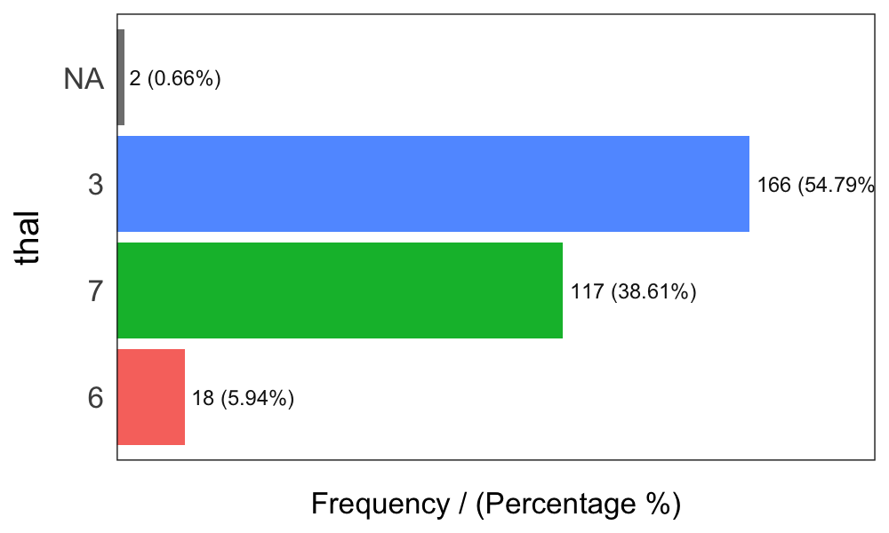
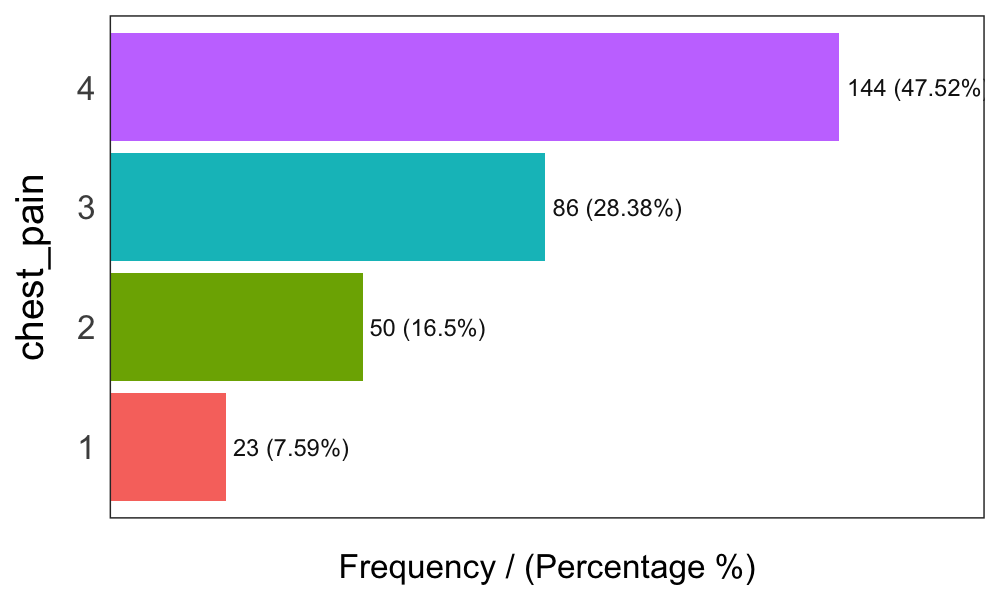

Profiling Data
====


### What is this about?

Quantity of zeros, NA, Inf, unique values; as well as the data type may lead to a good or bad model. Here's an approach to cover the very first step in data modeling. 


```r
## Loading funModeling !
library(funModeling)
library(dplyr)
data(heart_disease)
```

### Checking NA, zeros, data type and unique values


```r
my_data_status=df_status(heart_disease)
```

```
##                  variable q_zeros p_zeros q_na p_na q_inf p_inf    type
## 1                     age       0    0.00    0 0.00     0     0 integer
## 2                  gender       0    0.00    0 0.00     0     0  factor
## 3              chest_pain       0    0.00    0 0.00     0     0  factor
## 4  resting_blood_pressure       0    0.00    0 0.00     0     0 integer
## 5       serum_cholestoral       0    0.00    0 0.00     0     0 integer
## 6     fasting_blood_sugar     258   85.15    0 0.00     0     0  factor
## 7         resting_electro     151   49.83    0 0.00     0     0  factor
## 8          max_heart_rate       0    0.00    0 0.00     0     0 integer
## 9             exer_angina     204   67.33    0 0.00     0     0 integer
## 10                oldpeak      99   32.67    0 0.00     0     0 numeric
## 11                  slope       0    0.00    0 0.00     0     0 integer
## 12      num_vessels_flour     176   58.09    4 1.32     0     0 integer
## 13                   thal       0    0.00    2 0.66     0     0  factor
## 14 heart_disease_severity     164   54.13    0 0.00     0     0 integer
## 15           exter_angina     204   67.33    0 0.00     0     0  factor
## 16      has_heart_disease       0    0.00    0 0.00     0     0  factor
##    unique
## 1      41
## 2       2
## 3       4
## 4      50
## 5     152
## 6       2
## 7       3
## 8      91
## 9       2
## 10     40
## 11      3
## 12      4
## 13      3
## 14      5
## 15      2
## 16      2
```

* `q_zeros`: quantity of zeros (`p_zeros`: in percentage)
* `q_inf`:  quantity of infinite values (`p_inf`: in percentage)
* `q_na`:  quantity of NA (`p_na`: in percentage)
* `type`: factor or numeric
* `unique`: quantity of unique values

#### Why are these metrics important?

* **Zeros**: Variables with **lots of zeros** may be not useful for modeling, and in some cases it may dramatically bias the model.
* **NA**: Several models automatically exclude rows with NA (**random forest**, for example). As a result, the final model can be biased due to several missing rows because of only one variable. For example, if the data contains only one out of 100 variables with 90% of NAs, the model will be training with only 10% of original rows.
* **Inf**: Infinite values may lead to an unexpected behavior in some functions in R.
* **Type**: Some variables are encoded as numbers, but they are codes or categories, and the models **don't handle them** in the same way.
* **Unique**: Factor/categorical variables with a high number of different values (~30), tend to do overfitting if categories have low cardinality, (**decision trees**, for example).

<br>

#### Filtering unwanted cases

The function `df_status` takes a data frame and returns a the status table to quickly remove unwanted cases.


**Removing variables with high number of NA/zeros**


```r
# Removing variables with 60% of zero values
vars_to_remove=filter(my_data_status, p_zeros > 60)  %>% .$variable
vars_to_remove
```

```
## [1] "fasting_blood_sugar" "exer_angina"         "exter_angina"
```

```r
## Keeping all columns except vars_to_remove
heart_disease_2=select(heart_disease, -one_of(vars_to_remove))
```

**Ordering data by percentage of zeros**


```r
arrange(my_data_status, -p_zeros) %>% select(variable, q_zeros, p_zeros)
```

```
##                  variable q_zeros p_zeros
## 1     fasting_blood_sugar     258   85.15
## 2             exer_angina     204   67.33
## 3            exter_angina     204   67.33
## 4       num_vessels_flour     176   58.09
## 5  heart_disease_severity     164   54.13
## 6         resting_electro     151   49.83
## 7                 oldpeak      99   32.67
## 8                     age       0    0.00
## 9                  gender       0    0.00
## 10             chest_pain       0    0.00
## 11 resting_blood_pressure       0    0.00
## 12      serum_cholestoral       0    0.00
## 13         max_heart_rate       0    0.00
## 14                  slope       0    0.00
## 15                   thal       0    0.00
## 16      has_heart_disease       0    0.00
```

<br>


### Profiling categorical variable

_Make sure you have the latest funModeling version (>= 1.3)._

Frequency or distribution analysis is made simple by the `freq` function. It retrieves the distribution in a table and a plot (by default) which shows the distribution in absolute and relative numbers.

If you want the distribution for two variables: 


```r
freq(data=heart_disease, str_input = c('thal','chest_pain'))
```



```
##   thal frequency percentage cumulative_perc
## 1    3       166      55.15           55.15
## 2    7       117      38.87           94.02
## 3    6        18       5.98          100.00
```



```
##   chest_pain frequency percentage cumulative_perc
## 1          4       144      47.52           47.52
## 2          3        86      28.38           75.90
## 3          2        50      16.50           92.40
## 4          1        23       7.59          100.00
```

```
## [1] "Variables processed: thal, chest_pain"
```

As well as in the remaining `funModeling` functions, if `str_input` is missing it will run for all factor or character variables present in given data frame:


