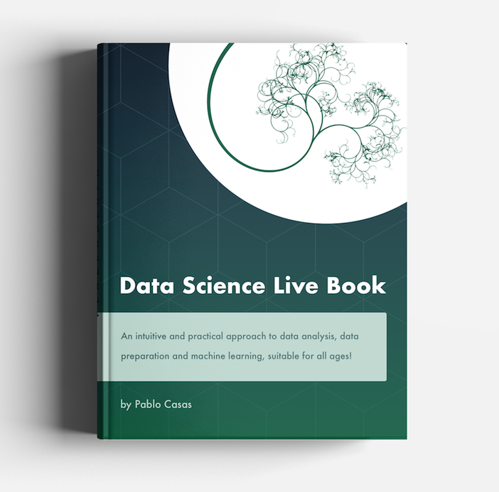

--- 
title: "Data Science Live Book"
author: "Pablo Casas"
date: "`r format(Sys.time(), '%B %Y')`"
site: bookdown::bookdown_site
output: bookdown::gitbook
classoption: oneside
bibliography: [packages.bib, book.bib]
biblio-style: apalike
link-citations: yes
favicon: "introduction/favicon.ico"
cover-image: "introduction/data_science_live_book_cover.png"
github-repo: pablo14/data-science-live-book
description: "An intuitive and practical approach to data analysis, data preparation and machine learning, suitable for all ages!"
linestretch: 1.15
linkcolor: NavyBlue
links-as-notes: true
---


---

```{r include = FALSE}
if(!knitr:::is_html_output())
{
  options("width"=56)
  knitr::opts_chunk$set(tidy.opts=list(width.cutoff=56, indent = 2), tidy = TRUE)
  knitr::opts_chunk$set(fig.pos = 'H')
}
```


# Preface {-}

```{r, echo=FALSE}
if (knitr:::is_html_output())
{
  
}
```

### Paperback & Kindle at Amazon {-}

This book is now available at Amazon. **[Check it out!](https://www.amazon.com/dp/9874269049)** `r emo::ji("green_book")` `r emo::ji("rocket")`.


_Link to the black & white version, also available on full-color. It can be shipped to over 100 countries._ `r emo::ji("earth_americas")`

<br>

### Why this book? {-}

The book will facilitate the understanding of common issues when data analysis and machine learning are done. 

Building a predictive model is as difficult as one line of `R` code: 

```{r, eval=FALSE, echo=TRUE}
my_fancy_model=randomForest(target ~ var_1 + var_2, my_complicated_data)
```

That's it. 

But, data has its dirtiness in practice. We need to sculp it, just like an artist does, to expose its information in order to find answers (and new questions).

There are many challenges to solve, some data sets requiere more _sculpting_ than others. Just to give an example, random forest does not accept empty values, so what to do then? Do we remove the rows in conflict? Or do we transform the empty values into other values? **What is the implication**, in any case, to _my_ data?

Despite the empty values issue, we have to face other situations such as the extreme values (outliers) that tend to bias not only the predictive model itself, but the interpretation of the final results. It's common to "try and guess" _how_ the predictive model considers each variable (ranking best variables), and what the values that increase (or decrease) the likelihood of some event to happening (profiling variables) are.

Deciding the **data type** of the variables may not be trivial. A categorical variable _could be_ numerical and viceversa, depending on the context, the data, and the algorithm itself (some of which only handle one data type). The conversion also has its own implications in _how the model sees the variables_.

It is a book about data preparation, data analysis and machine learning. Generally in literature, data preparation is not as popular as the creation of machine learning models.

<br>

### The journey towards learning {-}

The book has a highly practical approach, and tries to demonstrate what it states. For example, it says: _"Variables work in groups."_, and then you'll find a code that supports the idea.

Practically all chapters can be copy-pasted and be replicated by the reader to draw their own conclusions. Even more, whenever possible the code or script proposed (in R language) was thought generically, so it could be used in real scenarios, whether research or work.

The book's seed was the `funModeling` *R* library which started having a didactical documentation that quickly turned it into this book. Didactical because there is a difference between using a simple function that plots histograms to profile the target variable (`cross_plot`), and the explanation of how to get to semantical conclusions. The intention is to learn the inner concept, so you can _export that knowledge_ to other languages, such as Python, Julia, etc.

This book, as well as the development of a data project, is not linear. The chapters are related among them. For example, the **missing values** chapter can lead to the **cardinality reduction in categorical variables**. Or you can read the **data type** chapter and then change the way you deal with missing values.

You'll find references to other websites so you can expand your study, _this book is just another step in the learning journey_.

<br>

### Is this book for me? Will I understand it? {-}

If you already are in the Data Science field, probably you don't think so. You'll pick the code you need, copy-paste it if you like, and that's it.

But if you are starting a data science career, you'll face a common problem in education: _To have answers to the questions that have not been made._  

For sure you will get closer to the data science world. All the code is well commented so you don't even need to be a programmer. This is the challenge of this book, to try and be friendly when reading, using logic, common sense and intuition. 


### Programming language {-}

You could learn some `R` but it can be tough to learn directly from this book. If you want to learn R programming, there are other books or courses specialized in programming.

Time for next section.

<br>

### Will machines and artificial intelligence rule the world? `r emo::ji("scream")` {-}

Although it is true that computing power is being increased exponentially, the machines rebellion is far from happening today.

This book tries to expose common issues when creating and handling predictive models. Not a free lunch. There is also a relationship to _1-click solutions_ and voilà! The predictive system is running and deployed. All the data preparation, transformations, table joins, timing considerations, tuning, _etc_ is solved in one step. 

Perhaps it is. Indeed as time goes by, there are more robust techniques that help us automatize tasks in predictive modeling. But just in case, it'd be a good practice not to trust blindly in black-box solutions without knowing, for example, how the system _picks up the best variables_, _what the inner procedure to validate the model is_, _how it deals with extremes or rare values_, among other topics covered in this book.

If you are evaluating some machine learning platform, some issues stated in this book can help you to decide the best option. Trying to _unbox the black-box_.

It's tough to have a solution that suits all the cases. Human intervention **is crucial** in order to have a successful project. Rather than worry about machines, the point is _what the use of this technology will be_. Technology is _innocent_. It is the data scientist who sets the inputs and gives the model the needed target to learn. Patterns will emerge, and some of them could be harmful for many people. We have to be aware of the final objective, like in any other technologies. 


> The machine is made by man, and it is what man does with it.

(Original quote in Spanish: "La maquina la hace el hombre, y es lo que el hombre hace con ella.")

_By Jorge Drexler (musician, actor and doctor). Extracted from the song "Guitarra y vos"._

<br>

Maybe, could this be the difference between **machine learning** and **data science**? A machine that learns vs. a human being doing science with data? `r emo::ji("thinking")`

An open question.

<br>

### What do I need to start? {-}

In general terms, time and patience. Most of the concepts are independent from the language, but when a technical example is required it is done in **[R language](https://cloud.r-project.org)**, (`r R.version.string`). 

The book uses the following libraries, (between parenthesis it's the package version):

```{r, echo=FALSE}
used_packages=c("funModeling","dplyr", "Hmisc", "reshape2", "ggplot2", "caret", "minerva", "missForest", "gridExtra", "mice", "Lock5Data", "corrplot", "RColorBrewer", "infotheo")

str_p=""
for(i in 1:length(used_packages))
{
  sep=ifelse(i %in% c(1, 4, 7, 10, 13, 16), "", ", ")
  msj=ifelse((i %% 3) == 0, "%s (%s)\n", "%s (%s)")
  str_p=cat(paste(str_p, sprintf(msj, used_packages[i], packageVersion(used_packages[i])), sep=sep))
}
```

The package `funModeling` was the origin of this book; it started as a set of functions to help the data scientist in their _daily_ tasks. Now its documentation has evolved into this book `r emo::ji("heart")`!

Install any of these by doing: `install.packages("PACKAGE_NAME")`.

The recommended IDE is **[Rstudio](https://www.rstudio.com/products/rstudio/download/)**.

This book, both in pdf and web format, was created with Rstudio, using the incredible [Bookdown](https://bookdown.org/yihui/bookdown/).

It's all free and open-source, Bookdown, R, Rstudio and this book `r emo::ji("slightly_smiling_face")`

Hope you enjoy it!

<br>

### How can I contact you? `r emo::ji("envelope_with_arrow")` {-}

If you want to say _hello_, contribute by telling that some part is not well explained, suggest a new topic or share some good experience you had applying any concept explained here, you are welcome to drop me an email at: 

pcasas.biz (at) gmail.com. I'm constantly learning so it's nice to exchange knowledge and keep in touch with other colleagues.

* [Twitter](https://twitter.com/pabloc_ds)
* [Linkedin](https://www.linkedin.com/in/pcasas)
* [Github](https://github.com/pablo14)
* [Data Science Heroes Blog](http://blog.datascienceheroes.com)

Also, you can check the **Github** repositories for both, the book and `funModeling`, so you can report bugs, suggestions, new ideas, etc:

* [funModeling](https://github.com/pablo14/funModeling)
* [Data Science Live Book](https://github.com/pablo14/data-science-live-book)

<br>


### Acknowledgements {-}

Special thanks to my mentors in this data world, Miguel Spindiak and Marcelo Ferreyra.

Book technical reviewer: [Pablo Seibelt (aka The Sicarul)](https://www.linkedin.com/in/pabloseibelt) `r emo::ji("hammer_and_wrench")`. Thank you for your sincere and selfless help.

The art cover was made by: [Bárbara Muñoz](https://www.linkedin.com/in/barbaramercedes/)`r emo::ji("art")`.

This book is dedicated to _[The Nobodies](https://holywaters.wordpress.com/2011/12/08/los-nadiesthe-nobodies-by-eduardo-galeano)_, a short story written by Eduardo Galeano.

<br>

### Book's information {-}

First published at: [livebook.datascienceheroes.com](http://livebook.datascienceheroes.com).

Licensed under [Attribution-NonCommercial-ShareAlike 4.0 International](https://creativecommons.org/licenses/by-nc-sa/4.0/). 

```{r echo=FALSE, out.width='20%'}
knitr::include_graphics('introduction/by-nc-sa.png')
```

ISBN: 978-987-42-5911-0 (eBook version).

```{r echo=FALSE, out.width='20%'}
knitr::include_graphics('introduction/ISBN_number.jpg')
```

Copyright (c) 2018.

---

```{r, echo=FALSE}
knitr::include_graphics("introduction/spacer_bar.png") 
```

---


```{r include=FALSE}
options(warn=-1)
# automatically create a bib database for R packages
knitr::write_bib(c(
  .packages(), 'bookdown', 'knitr', 'rmarkdown'
), 'packages.bib')
```

