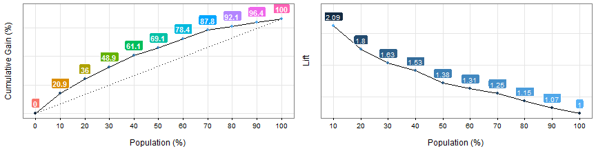

Gain and Lift Analysis
====

### What is this about?

Both metrics are extremely useful to validate the predictive model (binary outcome) quality. More info about scoring (here)[http://livebook.datascienceheroes.com/scoring/scoring.html]


Make sure you have the latest `funModeling` version (>= 1.3).


```r
## Loading funModeling
suppressMessages(library(funModeling)) 
data(heart_disease)
```


```r
fit_glm=glm(has_heart_disease ~ age + oldpeak, data=heart_disease, family = binomial)
heart_disease$score=predict(fit_glm, newdata=heart_disease, type='response')
gain_lift(data=heart_disease,str_score='score',str_target='has_heart_disease')
```



```
##    Population   Gain Lift Score.Point
## 1          10  20.86 2.09   0.8185793
## 2          20  35.97 1.80   0.6967124
## 3          30  48.92 1.63   0.5657817
## 4          40  61.15 1.53   0.4901940
## 5          50  69.06 1.38   0.4033640
## 6          60  78.42 1.31   0.3344170
## 7          70  87.77 1.25   0.2939878
## 8          80  92.09 1.15   0.2473671
## 9          90  96.40 1.07   0.1980453
## 10        100 100.00 1.00   0.1195511
```

### How to interpret it?

First, each case is ordered according to the likelihood of being the less representative class, aka, score value.

Then `Gain` column accumlates the postive class, for each 10% of rows - `Population` column.

So for first row, it can be read as:

_"The first 10 percent of the population, ordered by score, collects 20.86% of total positive cases"_

For example, if we are sending emails based on this model, and we have budget to reach only **20%** of our users, how many responses we should expect to get?  **Answer: 35.97%**

<br>

### What about not using a model?

If we **don't use a model**, and we select randomly 20%, how many users do we have to reach? Well, 20%. That is the meaning of the **dashed line**, which starts in 0% and ends in 100%. Hopefully with the predictive model we'll beat the randomness.


The **Lift** column represents the ratio, between the `Gain` and the _gain by chance_. Taking as an example the Population=20%, the model is **1.8 times better** than randomness :muscle:💪.

<br>

### Using the cut point :scissors:

What value of the score reaches 30% of population? 
Answer: `0.56`

The cut point allows us to segment the data.


<br>

### Comparing models

In a good model, the gain will reach the 100% "at the beginning" of the population, representing that it separates the classes.

When comparing models, a quick metric is to see if the gain at the beginning of the population (10-30%) is higher.  

As a result, the model with a higher gain at the begining will have captured more information from data :wink:.

_Let's ilustrate it..._

 

**Cumulative Gain Analysis**: Model 1 reaches the ~20% of positive cases around the 10% of population, while model 2 reaches a similar proportion approaching the 20% of population. _Model 1 is better._

**Lift analysis**: Same as before, but also it is susupicious hat not every lift number follow a decreasing pattern. May be the model is not ordering the first percentiles of population.
 Same ordering concepts as seen in <a href="http://livebook.datascienceheroes.com/selecting_best_variables/cross_plot.html">`cross_plot`</a>

