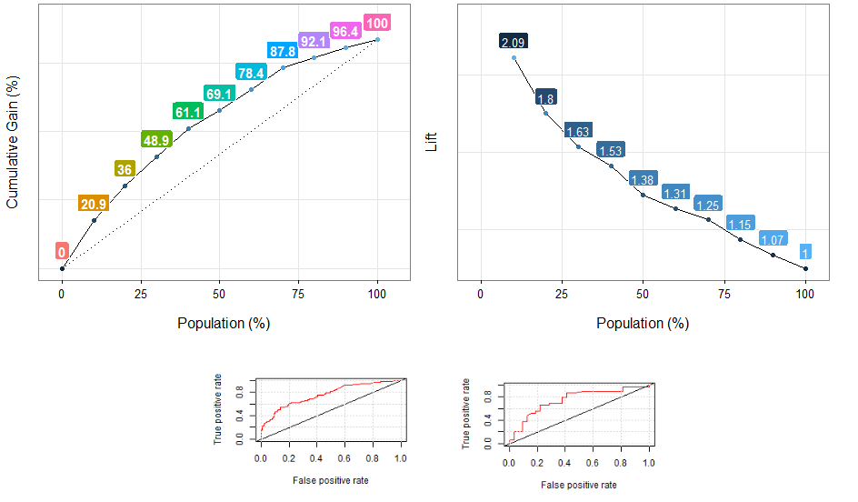

Introduction
===

### What is this about?


:raised_hand:**It's strongly recommended you have read the <a href="http://livebook.datascienceheroes.com/scoring/scoring.html">scoring chapter</a> first, it is the first step which ends with these validations.**

<br> 

This chapter will cover the validation of the model (binary outcome, or `yes`/`no` answer) through the **ROC curve**, and the **lift/gain analysis.** Both approaches gives light to the most important aspect in this kind of model: to be sure the model correctly orders the cases according to their propensity to belong to some class.

```{r ,results="hide", echo=FALSE}
library(knitr)
opts_knit$set(base.dir = "model_performance")
```

<br>
<br>
<br>


 


<br>
