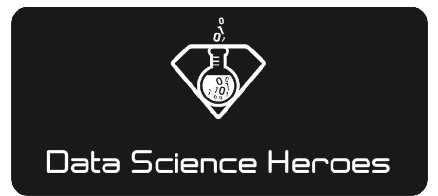
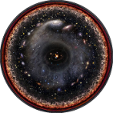

 <h1> Data Science Live Book</h1> 

 

 

<i><h3>A book to learn data science, data analysis and machine learning, suitable for all ages!</h3></i>

 

 

## _What does it cover?_

This book covers common aspects in predictive modeling:

+  A. **Data Preparation** / **Data Profiling**
+  B. **Selecting best variables (dataviz)**
+  C. **Assessing model performance**
+  D. **Miscellaneous**

_Creating & interpreting Predictive Models coming soon_

And it is heavly based on the `funModeling` package from the <a href="https://cloud.r-project.org">R language</a> . Please install before starting :) 

`install.packages("funModeling")`

* Model creation consumes around **10%** of almost any predictive modeling project; `funModeling` will try to cover remaining 90%. 
* It's not only the function itself, but the explanation of how to interpret results. This brings a deeper understanding of **what is being done**, boosting the freedom to use that knowledge in other situations regardless of the language.

 

-------

 

<a href="https://github.com/pablo14/data-science-live-book" target="blank">Book source code & bugs 

</a>

<a href="http://blog.datascienceheroes.com" target="blank">
DSH Blog
</a>

 and 

 

_This book is under <a href="https://creativecommons.org/licenses/by-nc-sa/4.0/" target="blank">Attribution-NonCommercial-ShareAlike 4.0 International</a> license._

 

