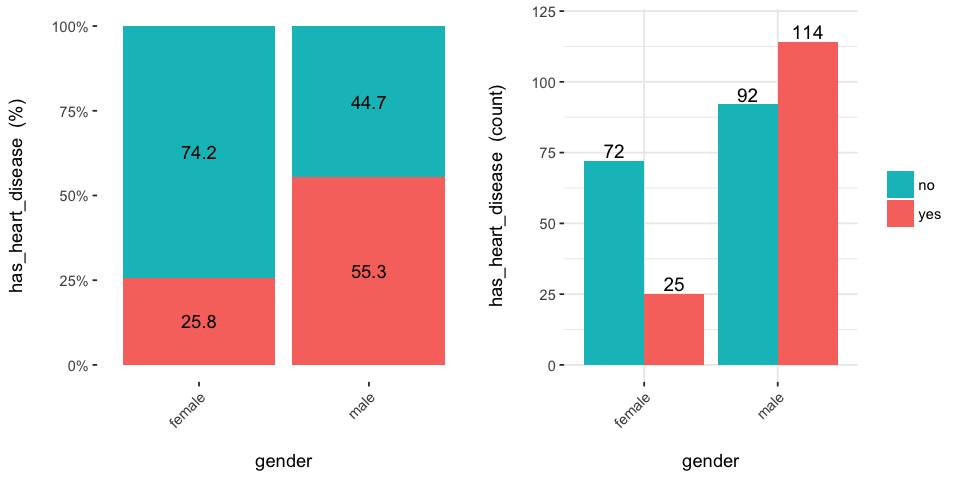
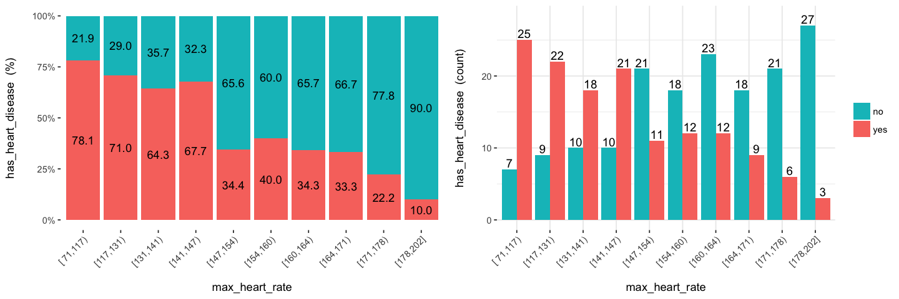
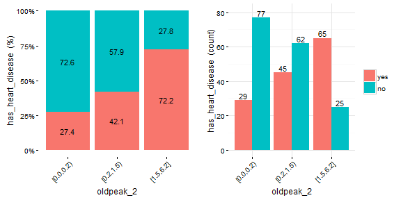
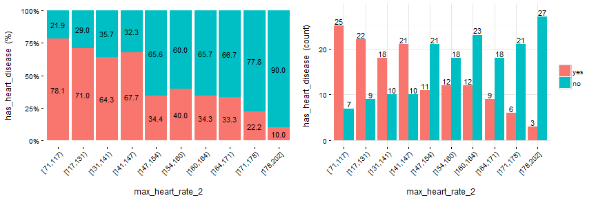
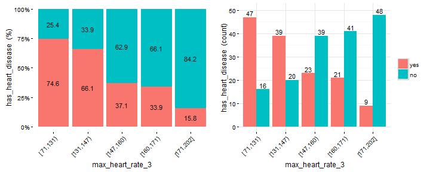

Target Profiling with `cross_plot` (dataViz)
===

### What is this about?

This plot intent to show in real scenarios if a variable is or not important, making a visual summary of it, _(by grouping numerical variables into bins/groups)_.


```r
## Loading funModeling !
suppressMessages(library(funModeling))
data(heart_disease)
```

### Example 1: Is gender correlated with heart disease?

```r
cross_gender=cross_plot(heart_disease, str_input="gender", str_target="has_heart_disease")
```



Last two plots have the same data source, showing the distribution of `has_heart_disease` in terms of `gender`. The one on the left shows in percentage value, while the one on the right shows in absolute value.

#### How to extract conclusions from the plots? (Short version)
`Gender` variable seems to be a **good predictor**, since the likelihood of having heart disease is different given the female/male groups.  **it gives an order to the data**.

#### How to extract conclusions from the plots? (Long version)
##### From 1st plot (%):

1. The **likelihood** of having heart disease for males is 55.3%, while for females is: 25.8%.
2. The heart disease rate for males **doubles** the rate for females (55.3 vs 25.8, respectively). 

##### From 2nd plot (count):

1. There are a total of **97 females**:
    + 25 of them have heart disease (25/97=25.8%, which is the ratio of 1st plot).
    + the remaining 72 have not heart disease (74.2%)

2. There are a total of **206 males**:
    + 114 of them have heart disease (55.3%)
    + the remaining 92 have not heart disease (44.7%)

3. Total cases: Summing the values of four bars: 25+72+114+92=**303**.

*Note: What would it happened if instead of having the rates of 25.8% vs. 55.3% (female vs male), they had been more similar like 30.2% vs. 30.6%). In this case variable `gender` it would have been much less relevant, since it doesn't separate the `has_heart_disease` event.*

### Example 2: Crossing with numerical variables
Numerical variables should be **binned** in order to plot them with an histogram, otherwise the plot is not showing information, as it can be seen here:


#### Equal frequency binning
There is a function included in the package (inherited from Hmisc package) : `equal_freq`, which returns the bins/buckets based on the **equal frequency criteria**. Which is *-or tries to-* have the same quantity of rows per bin.

For numerical variables, `cross_plot` has by default the `auto_binning=T`, which automatically calls the `equal_freq` function with `n_bins=10` (or the closest number).


```r
cross_plot(heart_disease, str_input="max_heart_rate", str_target="has_heart_disease")
```



### Example 3: Manual binning
If you don't want the automatic binning, then set the `auto_binning=F` in `cross_plot` function.

For example, creating `oldpeak_2` based on equal frequency, with 3 buckets.


```r
heart_disease$oldpeak_2=equal_freq(var=heart_disease$oldpeak, n_bins = 3)
summary(heart_disease$oldpeak_2)
```

```
## [0.0,0.2) [0.2,1.5) [1.5,6.2] 
##       106       107        90
```

Plotting the binned variable (`auto_binning = F`):

```r
cross_oldpeak_2=cross_plot(heart_disease, str_input="oldpeak_2", str_target="has_heart_disease", auto_binning = F)
```



#### **Conclusion**
This new plot based on `oldpeak_2` shows clearly how: the likelihood of **having heart disease increases** as **oldpeak_2 increases** as well. *Again, it gives an order to the data.*

### Example 4: Noise reducing
Converting variable `max_heart_rate` into a one of 10 bins:


```r
heart_disease$max_heart_rate_2=equal_freq(var=heart_disease$max_heart_rate, n_bins = 10)
cross_plot(heart_disease, str_input="max_heart_rate_2", str_target="has_heart_disease")
```



At a first glance, `max_heart_rate_2` shows a negative and linear relationship, however there are some buckets which add noise to the relationship. For example, the bucket `(141, 146]` has a higher heart disease rate than the previous bucket, and it was expected to have a lower. *This could be noise in data.* 

**Key note**: One way to reduce the **noise** (at the cost of **losing** some information), is to split with less bins:


```r
heart_disease$max_heart_rate_3=equal_freq(var=heart_disease$max_heart_rate, n_bins = 5)
cross_plot(heart_disease, str_input="max_heart_rate_3", str_target="has_heart_disease")
```



**Conclusion**: As it can be seen, now the relationship is much clean and clear. Bucket *'N'* has a higher rate than *'N+1'*, which implies a negative correlation.


**How about saving the cross_plot result into a folder?**
Just set the parameter `path_out` with the folder you want -It creates a new one if it doesn't exists-.

```r
cross_plot(heart_disease, str_input="max_heart_rate_3", str_target="has_heart_disease", path_out="my_plots")
```
It creates the folder `my_plots` into the working directory. 

### Example 4: `cross_plot` on multiple variables
Imagine you want to run cross_plot for several variables at the same time. To achieve this goal just define a vector containing the variable names.

If you want to analyze these 3 variables: 

```r
vars_to_analyze=c("age", "oldpeak", "max_heart_rate")
```


```r
cross_plot(data=heart_disease, str_target="has_heart_disease", str_input=vars_to_analyze)
```

<br>

### Exporting plots
`plotar` and `cross_plot` can handle from 1 to N input variables, and plots generated by them can be easily exported in high quality with parameter `path_out`.

```r
plotar(data=heart_disease, str=c('max_heart_rate', 'resting_blood_pressure'),  str_target="has_heart_disease", plot_type = "boxplot", path_out = "my_awsome_folder")
```

<br>
