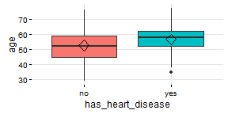
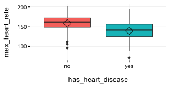

Profiling Target with BoxPlots
===

### What is this about?

The use of Boxplots in importance variable analysis gives a quick view on how different the quartiles are among the different values in a binary target variable.


```r
## Loading funModeling !
library(funModeling)
data(heart_disease)
```


```r
plotar(data=heart_disease, str_input="age", str_target="has_heart_disease", plot_type = "boxplot")
```



_Rhomboid near the mean line represents the **median**._

<br>


<br>

*When to use boxplots?*
When you need to analyze different percentiles across the classes to predict. Note this is a powerful technique since the bias produced due to outliers doesn't affect as much as it does to the mean.


### Boxplot: Good vs. Bad variable
plotar(data=heart_disease, str=c('max_heart_rate', 'resting_blood_pressure'),  str_target="has_heart_disease", plot_type = "boxplot")

`max_heart_rate` is clearly a better predictor than `resting_blood_pressure`.

As a general rule, a variable will rank as **more important** if boxplots are **not aligned** horizontally.

_Statistical tests: percentiles are another used feature used by them in order to determine -for example- if means across groups are or not the same._

### Exporting plots
`plotar` and `cross_plot` can handle from 1 to N input variables, and plots generated by them can be easily exported in high quality with parameter `path_out`.


```r
plotar(data=heart_disease, str=c('max_heart_rate', 'resting_blood_pressure'),  str_target="has_heart_disease", plot_type = "boxplot", path_out = "my_awsome_folder")
```



<br>

* **Key in mind this when using Histograms & BoxPlots** They are nice to see when the variable:
    + Has a good spread -not concentrated on a bunch of _3, 4..6.._ different values, **and**
    + It has not really extreme outliers... _(this point can be treated with `prep_outliers` function present in this package)_
	
<br>

