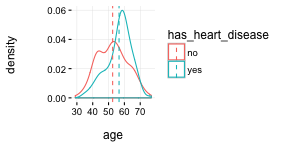
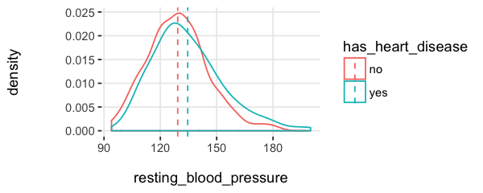
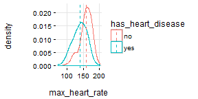

Target Profiling with Histograms
===


```r
## Loading funModeling !
suppressMessages(library(funModeling))
```


```r
plotar(data=heart_disease, str_input="age", str_target="has_heart_disease", plot_type = "histdens")
```



_Dashed-line represents variable mean._

**Density histograms** are nice to visualize the general shape of a numeric distribution.

This *general shape* is calculated based on a technique called **Kernel Smoother**, its general idea is to reduce high/low peaks (noise) present in near points/bars by estimating the function that describes the points. Here some pictures to illustrate the concept: https://en.wikipedia.org/wiki/Kernel_smoother

<br>


_Something similar is what an **statistical test** sees: they measured **how different** the curves are reflecting it in some statistics (like the p-value), in order to give to the analyst, a  reliable information to determine if the curves have -for example- the same mean._

<br>
<br>

### A.1) Hist. Dens.: Good vs. Bad variable


```r
plotar(data=heart_disease, str=c('resting_blood_pressure', 'max_heart_rate'),  str_target="has_heart_disease", plot_type = "histdens")
```


<br>
And the model will see the same... if the curves are quite overlapped, like it is in `resting_blood_pressure`, then it's **not a good predictor** as if they were **more spaced** -like `max_heart_rate`.

<br>
<br>

